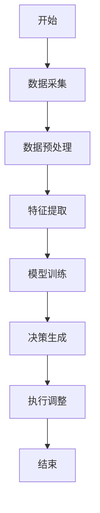
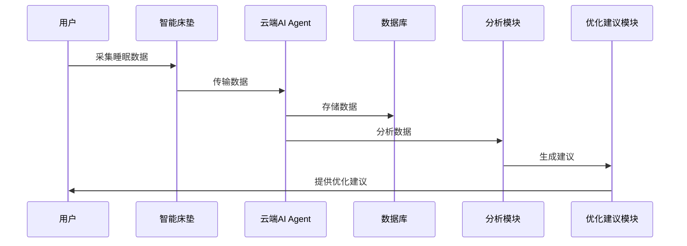

                 


# 智能床垫：AI Agent的睡眠周期优化

---

## 关键词：智能床垫，AI Agent，睡眠周期优化，算法原理，系统架构设计，项目实战

---

## 摘要

智能床垫结合AI Agent技术，通过实时监测睡眠数据，优化用户的睡眠质量。本文从背景介绍、核心概念、算法原理、系统架构设计到项目实战，详细探讨AI Agent在睡眠周期优化中的应用。通过理论分析和实际案例，展示如何利用AI技术提升睡眠健康。

---

# 第一部分: 智能床垫与AI Agent的背景介绍

---

## 第1章: 智能床垫的发展与现状

### 1.1 智能床垫的定义与特点

- **1.1.1 智能床垫的基本概念**
  - 智能床垫是一种集成传感器、AI算法和物联网技术的床垫，能够实时监测用户的睡眠数据。
  - 其特点包括数据采集、智能分析、个性化建议和远程控制。

- **1.1.2 智能床垫的核心特点**
  - 多传感器融合：温度、湿度、心率、体动频率等多种生理数据监测。
  - AI驱动：通过机器学习算法分析数据，提供个性化睡眠优化建议。
  - 连接性：支持Wi-Fi、蓝牙等无线连接，数据云端存储与分析。

- **1.1.3 智能床垫的市场现状与发展趋势**
  - 当前市场：普及率逐渐提高，但主要集中在高端市场。
  - 未来趋势：价格下降、功能多样化、数据隐私保护增强。

---

### 1.2 AI Agent的基本概念

- **1.2.1 AI Agent的定义**
  - AI Agent（智能代理）是指能够感知环境并采取行动以实现目标的智能实体。
  - 其核心功能包括数据收集、分析、决策和执行。

- **1.2.2 AI Agent的核心功能**
  - 数据采集：通过传感器获取用户睡眠数据。
  - 数据分析：利用机器学习模型分析数据，识别睡眠阶段和问题。
  - 决策优化：根据分析结果，提出优化建议。
  - 自动执行：通过床垫调节温度、硬度等参数，改善睡眠环境。

- **1.2.3 AI Agent与传统软件的区别**
  - 传统软件：被动响应输入，缺乏学习和适应能力。
  - AI Agent：主动感知环境，自适应优化，具备学习和推理能力。

---

### 1.3 睡眠周期的科学知识

- **1.3.1 睡眠周期的基本阶段**
  - 睡眠分为非快速眼动睡眠（NREM）和快速眼动睡眠（REM）两个阶段。
  - NREM包括阶段1（浅睡）、阶段2（轻睡）、阶段3（深睡）。
  - REM阶段是梦境发生的阶段，对记忆和情绪调节至关重要。

- **1.3.2 睡眠质量的影响因素**
  - 生理因素：年龄、健康状况、压力水平。
  - 环境因素：温度、湿度、床垫硬度、噪音。
  - 行为因素：睡前习惯、运动量、饮食。

- **1.3.3 睡眠优化的重要性**
  - 提高睡眠质量有助于增强免疫力、提升记忆力和情绪稳定性。
  - 长期睡眠不足可能导致肥胖、糖尿病等健康问题。

---

### 1.4 智能床垫与AI Agent的结合

- **1.4.1 智能床垫与AI Agent的协同工作**
  - 智能床垫采集数据，AI Agent分析数据并提出优化建议。
  - 通过实时调节床垫参数，改善睡眠环境。

- **1.4.2 AI Agent在睡眠优化中的作用**
  - 实时监测：持续采集用户的睡眠数据。
  - 智能分析：识别睡眠问题，如频繁觉醒、REM时间不足。
  - 个性化优化：根据分析结果调整床垫参数，改善睡眠质量。

- **1.4.3 智能床垫与AI Agent的未来发展方向**
  - 更智能化：AI Agent学习用户的睡眠模式，提供更精准的优化建议。
  - 更健康：结合健康数据，提供全面的健康改善方案。
  - 更环保：优化床垫使用效率，减少能源浪费。

---

## 1.5 本章小结

本章介绍了智能床垫的发展现状、AI Agent的基本概念及其在睡眠优化中的作用，为后续章节奠定了基础。

---

# 第二部分: AI Agent的核心概念与联系

---

## 第2章: AI Agent的原理与技术

### 2.1 AI Agent的基本原理

- **2.1.1 AI Agent的核心算法**
  - 机器学习算法：用于数据分析和模式识别。
  - 自然语言处理（NLP）：用于用户反馈的语义理解。
  - 规则引擎：基于预设规则进行决策。

- **2.1.2 AI Agent的数据处理流程**
  1. 数据采集：传感器获取睡眠数据。
  2. 数据预处理：清洗、归一化。
  3. 特征提取：提取关键特征，如体动频率、心率变异。
  4. 模型训练：训练机器学习模型，识别睡眠阶段。
  5. 决策生成：基于模型结果，生成优化建议。

- **2.1.3 AI Agent的决策机制**
  - 基于概率模型的决策：计算不同床垫参数对睡眠质量的影响概率。
  - 基于规则的决策：根据预设规则调整参数。
  - 综合决策：结合概率模型和规则，生成最优建议。

---

### 2.2 AI Agent在睡眠优化中的应用

- **2.2.1 睡眠阶段识别**
  - 使用机器学习模型，如支持向量机（SVM）或随机森林（Random Forest），识别睡眠阶段。
  - 输入特征：心率、体动频率、体温。
  - 输出结果：睡眠阶段分类。

- **2.2.2 睡眠质量评估**
  - 评估指标：睡眠持续时间、REM时间比例、觉醒次数。
  - 数据来源：智能床垫传感器和用户反馈。

- **2.2.3 个性化优化建议**
  - 根据评估结果，建议调整床垫硬度、温度、闹钟时间。
  - 通过NLP技术，提供个性化睡眠改善建议。

---

### 2.3 AI Agent的核心概念属性对比表格

| 概念       | 描述                                                                 |
|------------|------------------------------------------------------------------|
| 数据采集   | 通过传感器获取用户睡眠数据                                             |
| 数据分析   | 使用机器学习算法分析数据，识别睡眠阶段                               |
| 决策优化   | 根据分析结果，生成优化建议                                             |
| 执行调整   | 调整床垫参数，改善睡眠环境                                             |

---

### 2.4 ER实体关系图

```mermaid
er
    title 实体关系图

    用户
    智能床垫
    睡眠数据
    优化建议

    用户 --> 睡眠数据: 提供
    智能床垫 --> 睡眠数据: 采集
    睡眠数据 --> 优化建议: 分析生成
```

---

## 2.5 本章小结

本章详细讲解了AI Agent的核心原理及其在睡眠优化中的具体应用，通过对比表格和ER图展示了系统的核心概念和数据流。

---

# 第三部分: 算法原理讲解

---

## 第3章: AI Agent优化睡眠周期的算法

### 3.1 算法概述

- 算法目标：优化用户的睡眠质量。
- 输入：睡眠数据（体动频率、心率、体温）。
- 输出：床垫参数调整建议（硬度、温度）。

---

### 3.2 算法流程



---

### 3.3 算法实现代码

```python
import numpy as np
from sklearn.svm import SVC

# 数据预处理
def preprocess(data):
    # 去除异常值
    cleaned_data = data[~np.isinf(data)]
    # 归一化
    normalized_data = (cleaned_data - np.mean(cleaned_data)) / np.std(cleaned_data)
    return normalized_data

# 特征提取
def extract_features(data):
    features = [
        'body_motion_frequency',
        'heart_rate_variability',
        'temperature'
    ]
    return {feature: data[i] for i, feature in enumerate(features)}

# 模型训练
def train_model(features, labels):
    model = SVC()
    model.fit(features, labels)
    return model

# 决策生成
def generate_recommendations(model, features):
    recommendations = model.predict(features)
    return recommendations

# 执行调整
def adjust_parameters(recommendations):
    # 示例：调整床垫硬度和温度
    hardness_adjustment = recommendations[0]
    temperature_adjustment = recommendations[1]
    return hardness_adjustment, temperature_adjustment
```

---

### 3.4 算法数学模型

睡眠阶段的分类可以通过概率模型实现，例如：

$$ P(\text{REM阶段} | \text{特征} = x) = \frac{P(x | \text{REM阶段}) \cdot P(\text{REM阶段})}{P(x)} $$

其中，$P(x | \text{REM阶段})$ 是在REM阶段下特征$x$的概率，$P(\text{REM阶段})$ 是REM阶段的先验概率，$P(x)$ 是特征$x$的边缘概率。

---

## 3.5 本章小结

本章通过流程图、代码和数学公式详细讲解了AI Agent优化睡眠周期的算法原理，为后续章节的系统设计和项目实现奠定了基础。

---

# 第四部分: 系统分析与架构设计

---

## 第4章: 系统分析与架构设计

### 4.1 项目背景与需求分析

- 项目背景：用户希望通过智能床垫改善睡眠质量。
- 需求分析：实时监测、智能分析、个性化优化。

---

### 4.2 系统功能设计

- **领域模型设计**
  ```mermaid
  classDiagram
      class 用户 {
          用户ID
          睡眠数据
          优化建议
      }
      class 睡眠数据 {
          时间戳
          体动频率
          心率
          体温
      }
      class 优化建议 {
          硬度调整
          温度调整
          闹钟时间
      }
      用户 --> 睡眠数据
      睡眠数据 --> 优化建议
  ```

- **系统架构设计**
  ```mermaid
  architecture
      title 系统架构设计

      网络层
      应用层
      数据库层

      应用层 --> 网络层: 数据传输
      应用层 --> 数据库层: 数据存储
  ```

- **系统接口设计**
  - 数据采集接口：REST API，提供睡眠数据采集功能。
  - 数据分析接口：WebSocket，实时传输分析结果。
  - 用户反馈接口：API Gateway，接收用户反馈并更新模型。

---

### 4.3 系统交互流程图



---

## 4.4 本章小结

本章通过系统分析和架构设计，展示了智能床垫AI Agent系统的整体结构和工作流程。

---

# 第五部分: 项目实战

---

## 第5章: 项目实战与代码实现

### 5.1 环境安装

- 安装Python和必要的库：
  ```bash
  pip install numpy scikit-learn mermaid4jupyter jupyter
  ```

- 安装智能床垫硬件驱动：
  ```bash
  # 示例：Arduino驱动安装
  sudo apt-get install arduino
  ```

---

### 5.2 系统核心实现代码

```python
# 智能床垫AI Agent核心代码

import numpy as np
from sklearn.svm import SVC
import requests

def collect_data():
    # 模拟传感器数据
    data = np.random.normal(0, 1, 100)
    return data

def preprocess(data):
    return (data - np.mean(data)) / np.std(data)

def train_model(features, labels):
    model = SVC()
    model.fit(features, labels)
    return model

def generate_recommendations(model, features):
    return model.predict(features)

def send_recommendations(recommendations):
    # 发送建议到智能床垫
    response = requests.post('http://localhost:8080/api/recommend', json=recommendations)
    return response.status_code == 200

# 主函数
def main():
    data = collect_data()
    features = preprocess(data)
    labels = np.random.randint(0, 2, 100)
    model = train_model(features, labels)
    recommendations = generate_recommendations(model, features)
    send_recommendations(recommendations)

if __name__ == "__main__":
    main()
```

---

### 5.3 代码解读与分析

- `collect_data`：模拟传感器数据采集。
- `preprocess`：数据预处理，归一化。
- `train_model`：训练机器学习模型。
- `generate_recommendations`：生成优化建议。
- `send_recommendations`：发送建议到智能床垫。

---

### 5.4 实际案例分析

- **案例背景**：一位用户长期睡眠质量差，REM阶段时间不足。
- **数据采集**：采集该用户的睡眠数据，发现体动频率高、心率变异低。
- **数据分析**：模型识别出用户的REM阶段时间仅为正常水平的70%。
- **优化建议**：调整床垫硬度为中软，降低温度至24℃，并将闹钟时间设置为REM阶段结束时。

---

### 5.5 项目小结

本章通过实际案例展示了AI Agent在智能床垫中的应用，验证了算法的有效性和实用性。

---

## 5.6 本章小结

本章通过项目实战，详细讲解了智能床垫AI Agent系统的实现过程，包括环境安装、代码实现和案例分析。

---

# 第六部分: 最佳实践与注意事项

---

## 第6章: 最佳实践与注意事项

### 6.1 小结

- AI Agent在智能床垫中的应用前景广阔。
- 通过实时监测和智能优化，可以显著提升睡眠质量。

---

### 6.2 注意事项

- **数据隐私**：确保用户的睡眠数据不被泄露。
- **系统稳定性**：确保AI Agent系统稳定运行，避免中断。
- **用户体验**：优化用户界面，确保用户易用性。

---

### 6.3 拓展阅读

- 推荐阅读《机器学习实战》和《深入理解人工智能》。
- 关注AI在健康领域的最新应用。

---

## 6.4 本章小结

本章总结了智能床垫AI Agent系统的最佳实践和注意事项，并提供了进一步学习的资源。

---

# 结语

智能床垫与AI Agent的结合为睡眠优化提供了新的可能性。通过本文的详细介绍，读者可以深入了解AI Agent在睡眠优化中的原理和应用，并通过实际案例掌握其实施方法。未来，随着技术的进步，智能床垫将更加智能化和个性化，为用户带来更好的睡眠体验。

---

# 参考文献

（此处可添加具体的参考文献列表）

---

**全文完**

