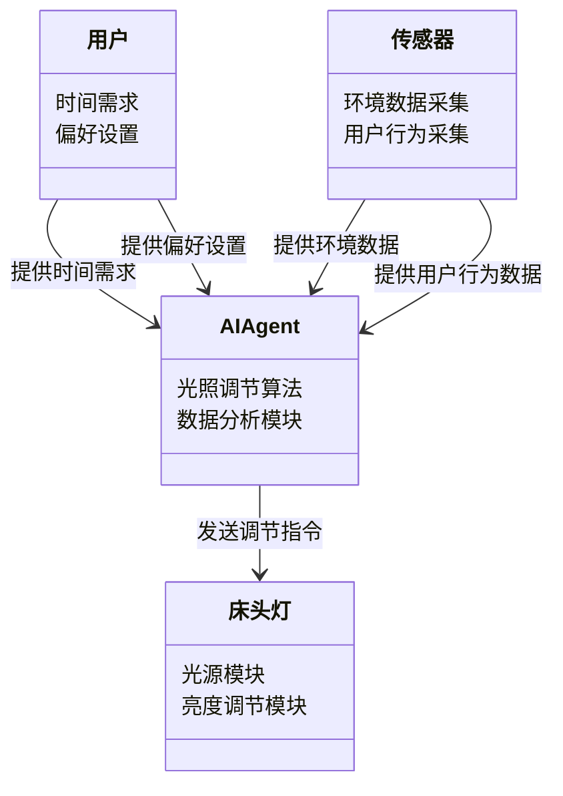
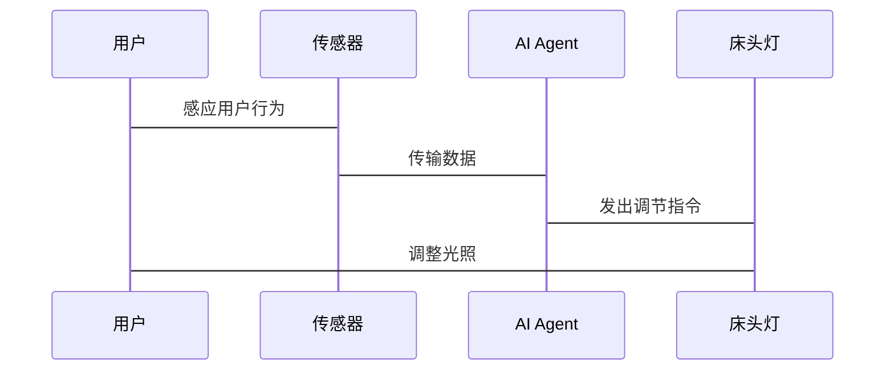

                 


# 智能床头灯：AI Agent的生理节律光照调节

> 关键词：智能床头灯，AI Agent，生理节律，光照调节，机器学习，系统架构

> 摘要：本文探讨了智能床头灯如何通过AI Agent技术实现生理节律的光照调节。通过分析AI Agent的核心原理、生理节律与光照调节的关系，结合系统架构设计和项目实战，展示了如何利用人工智能优化睡眠和生物钟管理，为用户带来更健康的生活方式。

---

## 第一部分：背景介绍与核心概念

### 第1章：生理节律与光照调节的背景

#### 1.1 生理节律的重要性
- **1.1.1 生理节律的定义与作用**  
  生理节律是指人体内一系列生理过程的周期性变化，如睡眠-觉醒周期、体温调节和激素分泌等。这些节律受生物钟调控，通常与光照、饮食和运动等因素密切相关。

- **1.1.2 光照对生理节律的影响**  
  光照是调节生物钟的主要外部因素。自然光照强度和颜色的变化直接影响人体的生理节律，例如日出时的蓝光促进觉醒，日落时的红光促进放松。

- **1.1.3 不同时间段的光照需求差异**  
  白天需要明亮的蓝光以保持清醒，黄昏时需要柔和的红光帮助放松，睡前则需要极低的光照强度以避免干扰褪黑素分泌。

#### 1.2 传统床头灯的不足
- **1.2.1 传统床头灯的功能局限性**  
  传统床头灯仅能提供固定亮度和颜色，无法根据用户需求动态调整。

- **1.2.2 无法适应人体生理节律的问题**  
  用户在不同时间的光照需求不同，传统床头灯无法智能调节。

- **1.2.3 用户需求与产品功能的脱节**  
  用户希望床头灯能根据作息时间自动调节，但传统产品无法实现。

#### 1.3 智能床头灯的优势
- **1.3.1 智能化光照调节的核心价值**  
  智能床头灯通过AI技术实现动态调节，满足用户的个性化需求。

- **1.3.2 AI Agent在智能床头灯中的作用**  
  AI Agent实时分析用户行为和环境数据，优化光照参数。

- **1.3.3 智能床头灯的市场前景与用户需求**  
  随着健康意识的提升，智能床头灯市场潜力巨大，用户需求日益增长。

### 第2章：AI Agent与生理节律调节的核心概念

#### 2.1 AI Agent的基本原理
- **2.1.1 AI Agent的定义与分类**  
  AI Agent是智能系统的核心，负责感知环境、分析数据并执行操作。根据智能水平分为简单反射型和复杂决策型。

- **2.1.2 AI Agent的核心功能与特点**  
  包括感知、推理、学习和执行功能，具备动态适应和自优化能力。

- **2.1.3 AI Agent在智能床头灯中的应用场景**  
  通过传感器收集数据，AI Agent分析并调节光照参数，提升用户体验。

#### 2.2 生理节律与光照调节的关系
- **2.2.1 生理节律的基本构成与影响因素**  
  生理节律由生物钟控制，光照、饮食和运动是主要影响因素。

- **2.2.2 光照对生物钟的影响机制**  
  光照通过视网膜中的光敏感细胞传递信号，调整生物钟。

- **2.2.3 不同场景下的光照需求分析**  
  工作时需明亮光照，休息时需柔和光照，睡前需极低光照。

#### 2.3 核心概念的联系与对比
- **2.3.1 AI Agent与传统床头灯的对比分析**  
  AI Agent使床头灯具备智能化调节能力，传统产品无法实现。

- **2.3.2 生理节律调节与光照强度的关系**  
  光照强度和颜色影响生物钟，AI Agent根据生理需求动态调整。

- **2.3.3 智能床头灯的系统架构与功能模块**  
  包括传感器采集、AI算法处理、用户交互和执行机构。

---

## 第二部分：核心概念与联系

### 第3章：核心概念的原理与属性特征

#### 3.1 AI Agent的原理分析
- **3.1.1 AI Agent的感知与决策机制**  
  AI Agent通过传感器收集数据，分析用户行为和环境信息，决定最佳光照参数。

- **3.1.2 基于机器学习的光照调节算法**  
  使用监督学习模型，训练AI Agent预测最佳光照方案。

- **3.1.3 AI Agent与用户交互的实现方式**  
  支持语音控制、手机App和手势识别等多种交互方式。

#### 3.2 生理节律调节的属性特征
- **3.2.1 不同时间段的光照需求特征**  
  清晨需要蓝光刺激觉醒，黄昏需要红光促进放松，睡前需要低强度黄光。

- **3.2.2 用户生理节律的个性化差异**  
  不同用户的作息时间、敏感度和健康状况不同，需要个性化调节。

- **3.2.3 光照强度与用户生理需求的数学关系**  
  光照强度与用户生理需求呈非线性关系，可通过回归模型预测。

#### 3.3 核心概念的联系与对比
- **3.3.1 AI Agent与传统床头灯的对比分析**  
  AI Agent使床头灯具备智能化调节能力，传统产品无法实现。

- **3.3.2 生理节律调节与光照强度的关系**  
  光照强度和颜色影响生物钟，AI Agent根据生理需求动态调整。

- **3.3.3 智能床头灯的系统架构与功能模块**  
  包括传感器采集、AI算法处理、用户交互和执行机构。

---

## 第四部分：系统分析与架构设计方案

### 第4章：系统架构与功能设计

#### 4.1 项目背景与目标
- **4.1.1 项目背景**  
  提高用户睡眠质量，优化生理节律管理。

- **4.1.2 项目目标**  
  开发智能床头灯，实现基于AI的生理节律光照调节。

#### 4.2 系统功能设计
- **4.2.1 领域模型设计**  
  使用Mermaid绘制类图，展示用户、AI Agent、床头灯和传感器之间的关系。



- **4.2.2 系统架构设计**  
  使用Mermaid绘制系统架构图，展示各组件的交互关系。


#### 4.3 系统接口设计
- **4.3.1 系统接口设计**  
  传感器接口、AI Agent接口和床头灯控制接口的设计。

- **4.3.2 系统交互流程图**  
  使用Mermaid绘制交互流程图，展示用户、传感器、AI Agent和床头灯的协作过程。



---

## 第五部分：项目实战

### 第5章：项目实战与分析

#### 5.1 环境安装与配置
- **5.1.1 安装Python与TensorFlow**  
  使用pip安装所需的Python库，如`numpy`、`scikit-learn`和`tensorflow`。

- **5.1.2 硬件设备准备**  
  需要光照传感器、微控制器和床头灯模块。

#### 5.2 核心代码实现
- **5.2.1 数据采集与预处理**  
  使用传感器采集光照、时间和用户行为数据，清洗数据并归一化处理。

- **5.2.2 光照调节模型训练**  
  使用机器学习算法训练AI Agent，实现基于生理需求的光照调节。

  ```python
  import numpy as np
  from sklearn.model_selection import train_test_split
  from tensorflow.keras import layers, models

  # 数据准备
  X = np.array([...])  # 特征数据
  y = np.array([...])  # 标签数据

  # 划分训练集和测试集
  X_train, X_test, y_train, y_test = train_test_split(X, y, test_size=0.2)

  # 构建模型
  model = models.Sequential()
  model.add(layers.Dense(64, activation='relu', input_dim=X.shape[1]))
  model.add(layers.Dense(1, activation='sigmoid'))
  model.compile(optimizer='adam', loss='binary_crossentropy', metrics=['accuracy'])

  # 训练模型
  model.fit(X_train, y_train, epochs=100, batch_size=32, validation_data=(X_test, y_test))
  ```

- **5.2.3 系统集成与测试**  
  将模型部署到床头灯系统，进行实际测试和优化。

#### 5.3 实际案例分析
- **5.3.1 典型用户场景分析**  
  例如，用户希望在早晨提供明亮的蓝光，晚上提供柔和的红光。

- **5.3.2 系统运行效果评估**  
  通过用户反馈和数据监测，评估系统的实际效果。

#### 5.4 项目小结
- **5.4.1 项目成果总结**  
  成功开发智能床头灯系统，实现基于生理节律的光照调节。

- **5.4.2 经验与教训**  
  算法优化和系统稳定性提升是关键。

---

## 第六部分：最佳实践与总结

### 第6章：最佳实践与总结

#### 6.1 最佳实践
- **6.1.1 技术实现上的建议**  
  使用更先进的AI算法和优化系统架构。

- **6.1.2 产品设计上的建议**  
  考虑用户体验，提供多种交互方式和个性化设置。

#### 6.2 小结与展望
- **6.2.1 小结**  
  智能床头灯通过AI Agent实现了生理节律的光照调节，提升了用户体验。

- **6.2.2 展望**  
  结合物联网和更多传感器，进一步优化系统功能。

---

## 第七部分：总结

### 结语
智能床头灯作为AI技术在健康领域的应用，展示了科技改善生活的巨大潜力。通过AI Agent的生理节律光照调节，用户可以更好地管理生物钟，提升睡眠质量。未来，随着技术的进步，智能床头灯将更加智能化和个性化，为用户带来更健康的生活方式。

--- 

关键词：智能床头灯，AI Agent，生理节律，光照调节，机器学习，系统架构

