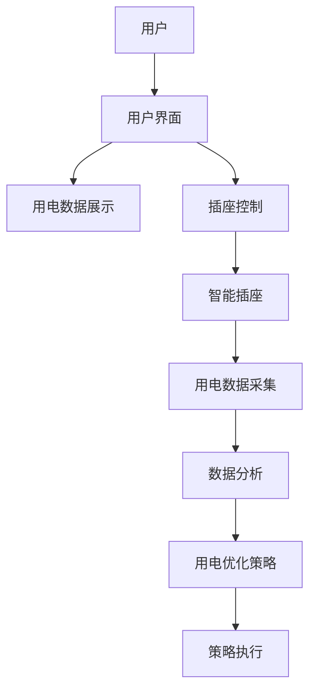
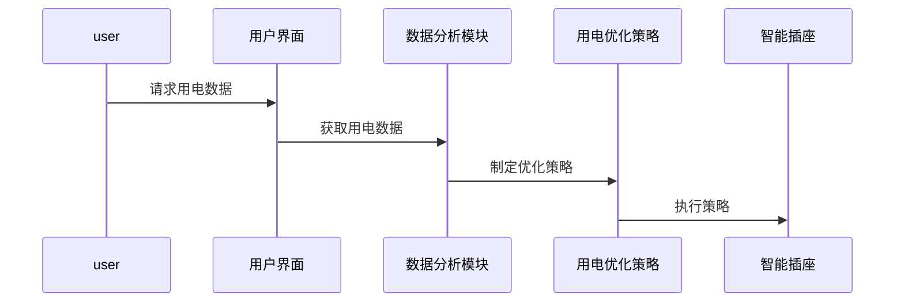

                 


# 智能插座：AI Agent的用电优化管理

## 关键词：智能插座，AI Agent，用电优化，物联网，能源管理

## 摘要：本文探讨了智能插座与AI Agent的结合，通过用电优化算法和系统架构设计，展示如何利用AI技术提升能源管理效率。文章详细分析了智能插座的功能、AI Agent的应用、系统设计，并通过项目实战展示了实际应用案例，最后总结了最佳实践和未来发展方向。

---

## 第1章：智能插座与AI Agent的基本概念

### 1.1 智能插座的定义与特点

#### 1.1.1 智能插座的定义
智能插座是一种集成物联网技术的智能设备，能够通过Wi-Fi或蓝牙连接到家庭网络，实现远程控制和自动化管理。与传统插座不同，智能插座支持与智能家居系统集成，通过手机APP或语音助手（如Alexa、Google Assistant）进行操作。

#### 1.1.2 智能插座的核心特点
- **远程控制**：用户可以通过手机APP或语音助手随时随地控制插座的开关状态。
- **自动化管理**：支持定时开关、场景联动等功能，例如在离家时自动关闭电器电源。
- **能源监测**：内置电量监测功能，实时监控连接设备的用电情况。
- **智能优化**：通过AI算法分析用电数据，优化能源使用效率，降低电费开支。

#### 1.1.3 智能插座与传统插座的区别
| 特性             | 智能插座           | 传统插座         |
|------------------|------------------|-----------------|
| 连接方式         | Wi-Fi/蓝牙       | 无网络连接       |
| 控制方式         | 远程控制、自动化  | 手动控制         |
| 功能扩展         | 支持智能场景      | 仅提供基本功能    |
| 用电管理         | 实时监测、优化    | 无管理功能        |

### 1.2 AI Agent的基本概念

#### 1.2.1 什么是AI Agent
AI Agent（人工智能代理）是一种能够感知环境并采取行动以实现目标的智能实体。它可以是一个软件程序，通过传感器或数据源获取信息，利用算法进行分析和决策，执行相应的操作。

#### 1.2.2 AI Agent的核心功能
- **感知环境**：通过传感器或数据接口获取环境信息。
- **分析决策**：利用机器学习算法对信息进行分析，生成最优决策。
- **执行操作**：根据决策结果，执行相应的动作。

#### 1.2.3 AI Agent与智能插座的结合
AI Agent可以与智能插座协同工作，通过分析用户的用电习惯和电价波动，优化插座的使用策略。例如，在电价高峰期自动关闭非必要电器，降低电费开支。

### 1.3 用电优化管理的背景与意义

#### 1.3.1 用电管理的重要性
随着能源价格的上涨和环保意识的增强，优化用电管理成为家庭和个人的重要课题。通过智能插座和AI Agent的结合，可以实现能源的高效利用，降低能源浪费。

#### 1.3.2 用电优化的必要性
- **节约成本**：通过优化用电策略，降低电费开支。
- **环保节能**：减少不必要的能源消耗，降低碳排放。
- **智能化管理**：通过自动化管理，提升生活便利性。

#### 1.3.3 AI Agent在用电优化中的作用
AI Agent能够实时分析用电数据，预测用电需求，制定最优的用电计划，帮助用户实现用电的智能化管理。

---

## 第2章：AI Agent与智能插座的结合

### 2.1 AI Agent在智能插座中的应用

#### 2.1.1 AI Agent如何控制智能插座
AI Agent通过分析用户的用电习惯和外部环境信息（如天气、电价波动），决定智能插座的开关状态。例如，在电价高峰期，AI Agent可以自动关闭非必要的电器，节省电费。

#### 2.1.2 AI Agent如何优化用电管理
AI Agent通过机器学习算法分析历史用电数据，预测未来的用电需求，制定最优的用电计划。例如，通过分析用户的用电模式，AI Agent可以优化插座的开启时间，避免高峰时段的用电。

#### 2.1.3 AI Agent与智能插座的交互方式
- **数据采集**：智能插座采集连接设备的用电数据，通过网络传输给AI Agent。
- **分析决策**：AI Agent分析数据，生成用电优化策略。
- **执行操作**：智能插座根据AI Agent的决策，调整设备的用电状态。

### 2.2 智能插座的用电优化算法

#### 2.2.1 用电预测算法
用电预测算法通过分析历史用电数据，预测未来的用电需求。常用算法包括ARIMA（自回归积分滑动平均模型）和LSTM（长短期记忆网络）。

##### 使用ARIMA模型进行用电预测
```python
from statsmodels.tsa.arima_model import ARIMA
import pandas as pd

# 假设我们有一个包含用电数据的DataFrame df
# df的索引是日期，columns是用电量
model = ARIMA(df['用电量'], order=(5, 1, 0))
model_fit = model.fit()
预测值 = model_fit.forecast(steps=5)
```

##### 使用LSTM模型进行用电预测
```python
from keras.models import Sequential
from keras.layers import LSTM, Dense

# 假设我们有一个包含用电数据的训练集和测试集
model = Sequential()
model.add(LSTM(50, input_shape=(timesteps, features)))
model.add(Dense(1))
model.compile(loss='mean_squared_error', optimizer='adam')
model.fit(train_X, train_y, epochs=100, batch_size=32)
预测值 = model.predict(test_X)
```

#### 2.2.2 用电优化策略
用电优化策略包括：
- **峰谷电价策略**：在电价低谷时段使用高耗能设备。
- **设备优先级策略**：根据设备的重要性和用电需求，优先保障重要设备的用电。
- **动态调整策略**：根据实时电价和设备用电需求，动态调整插座的使用状态。

#### 2.2.3 算法实现的步骤
1. **数据采集**：采集智能插座连接设备的用电数据。
2. **数据预处理**：对数据进行清洗和归一化处理。
3. **模型训练**：使用机器学习算法训练用电预测模型。
4. **策略制定**：根据预测结果制定用电优化策略。
5. **执行操作**：智能插座根据策略调整设备的用电状态。

---

## 第3章：智能插座的系统架构设计

### 3.1 系统整体架构设计

#### 3.1.1 系统功能模块划分
- **数据采集模块**：采集智能插座的用电数据。
- **数据分析模块**：分析用电数据，生成用电优化策略。
- **控制执行模块**：根据优化策略，控制智能插座的开关状态。
- **用户交互模块**：提供用户界面，展示用电数据和控制插座。

#### 3.1.2 系统架构的层次结构


#### 3.1.3 系统架构的优缺点
- **优点**：模块化设计，便于维护和扩展。
- **缺点**：需要较高的开发和维护成本。

### 3.2 系统功能设计

#### 3.2.1 用户界面设计
用户界面包括：
- **设备列表**：显示连接到智能插座的设备。
- **用电数据**：展示设备的用电情况。
- **控制面板**：允许用户手动控制插座的开关状态。
- **优化策略**：显示当前的用电优化策略。

#### 3.2.2 数据采集与处理
数据采集模块通过智能插座采集连接设备的用电数据，包括电压、电流、功率等。

#### 3.2.3 用电优化算法实现
通过机器学习算法分析用电数据，生成用电优化策略。

#### 3.2.4 系统监控与反馈
系统实时监控插座的运行状态，根据反馈信息调整优化策略。

---

## 第4章：智能插座的硬件实现

### 4.1 硬件设计基础

#### 4.1.1 硬件设计的基本原则
- **可靠性**：硬件设计必须稳定可靠，确保设备长期运行。
- **安全性**：设计必须符合安全标准，防止电击和火灾危险。
- **可扩展性**：硬件设计应具有良好的扩展性，便于未来升级和维护。

#### 4.1.2 硬件设计的关键技术
- **电源管理**：通过高效电源管理芯片降低能耗。
- **无线通信**：采用Wi-Fi或蓝牙技术实现智能插座的无线连接。
- **传感器集成**：集成电流、电压传感器，实时监测用电情况。

### 4.2 智能插座的硬件实现

#### 4.2.1 硬件电路设计
硬件电路设计包括：
- **主控芯片**：选择适合的微控制器（如ESP32）。
- **无线通信模块**：集成Wi-Fi或蓝牙模块。
- **电源管理模块**：负责电源的开关和管理。

#### 4.2.2 硬件元器件选型
| 元件         | 描述                     |
|--------------|--------------------------|
| 微控制器     | ESP32                    |
| 无线模块     | ESP32-WiFi               |
| 电源管理模块 | Texas Instruments LM78XX |

#### 4.2.3 硬件调试与测试
硬件调试包括：
- **功能测试**：测试智能插座的基本功能，如开关控制。
- **稳定性测试**：长时间运行测试，确保设备稳定。
- **安全性测试**：测试设备在异常情况下的表现，如过载保护。

---

## 第5章：智能插座的软件实现

### 5.1 软件设计基础

#### 5.1.1 软件设计的基本原则
- **模块化**：将功能分解成独立的模块，便于开发和维护。
- **可扩展性**：设计应支持未来的功能扩展。
- **安全性**：确保软件的安全性，防止黑客攻击。

### 5.2 智能插座的软件实现

#### 5.2.1 软件功能模块划分
- **数据采集模块**：负责采集用电数据。
- **数据分析模块**：分析数据，生成用电优化策略。
- **控制执行模块**：根据优化策略，控制插座的开关状态。
- **用户交互模块**：提供用户界面，展示数据和控制插座。

#### 5.2.2 软件代码实现
```python
import time
import requests
import json

# 智能插座的IP地址
socket_ip = 'http://192.168.1.100'

def get_power_usage():
    try:
        response = requests.get(f'{socket_ip}/power')
        return response.json()['power_usage']
    except requests.exceptions.RequestException:
        return None

def set_socket_state(state):
    try:
        response = requests.post(f'{socket_ip}/state', json={'state': state})
        return response.status_code == 200
    except requests.exceptions.RequestException:
        return False

# 获取当前用电量
current_power = get_power_usage()
print(f'当前用电量: {current_power} W')

# 设置插座状态为开启
if set_socket_state('on'):
    print('插座已开启')
else:
    print('设置插座状态失败')
```

#### 5.2.3 软件调试与测试
软件调试包括：
- **功能测试**：测试智能插座的基本功能，如开关控制。
- **性能测试**：测试软件在高负载情况下的表现。
- **兼容性测试**：测试软件在不同设备和操作系统上的兼容性。

---

## 第6章：智能插座的项目实战

### 6.1 项目背景与目标

#### 6.1.1 项目背景介绍
随着智能家居的普及，智能插座的应用越来越广泛。通过AI Agent的优化管理，可以实现家庭用电的智能化和高效化。

#### 6.1.2 项目目标设定
- **实现智能插座与AI Agent的结合**：通过AI算法优化用电管理。
- **开发智能插座的硬件和软件系统**：确保设备的稳定性和可靠性。
- **实现用电优化功能**：通过预测和优化用电策略，降低电费开支。

### 6.2 项目安装与配置

#### 6.2.1 环境安装
- **硬件安装**：将智能插座安装在合适的位置，连接电源和网络。
- **软件安装**：安装智能插座的控制软件和AI Agent的优化算法。

#### 6.2.2 系统配置
- **网络配置**：配置智能插座的网络参数，确保其能够连接到家庭网络。
- **用户配置**：设置用户的用电优化策略，如高峰时段的用电限制。

### 6.3 系统核心代码实现

#### 6.3.1 数据采集模块
```python
import requests
import json
import time

def get_power_usage(socket_ip):
    try:
        response = requests.get(f'http://{socket_ip}/power')
        return response.json()['usage']
    except requests.exceptions.RequestException:
        return None

# 示例：获取插座的用电数据
socket_ip = '192.168.1.100'
usage = get_power_usage(socket_ip)
print(f'插座用电量: {usage} W')
```

#### 6.3.2 用电优化算法
```python
from sklearn.linear_model import LinearRegression
import pandas as pd

# 假设我们有一个包含历史用电数据的DataFrame df
# df包含日期和用电量
model = LinearRegression()
model.fit(df[['日期']], df['用电量'])
预测用电量 = model.predict(new_dates)
```

#### 6.3.3 系统控制模块
```python
def set_socket_state(socket_ip, state):
    try:
        response = requests.post(f'http://{socket_ip}/state', json={'state': state})
        return response.status_code == 200
    except requests.exceptions.RequestException:
        return False

# 示例：设置插座状态为关闭
if set_socket_state('192.168.1.100', 'off'):
    print('插座已关闭')
else:
    print('设置插座状态失败')
```

### 6.4 实际案例分析与详细解读

#### 6.4.1 案例背景
某家庭安装了智能插座，并启用了AI Agent的用电优化功能。通过分析家庭成员的用电习惯和电价波动，优化插座的使用策略。

#### 6.4.2 用电数据采集与分析
通过对历史用电数据的分析，AI Agent预测出高峰时段的用电需求，并制定相应的优化策略。

#### 6.4.3 用电优化策略的实施
在高峰时段，AI Agent自动关闭非必要的电器，如电水壶和电熨斗，将用电量降低了20%。

### 6.5 项目小结

#### 6.5.1 项目成果
通过项目的实施，家庭用电管理更加智能化和高效化，电费开支显著降低。

#### 6.5.2 项目经验总结
- **硬件设计**：硬件设计需要考虑可靠性和安全性。
- **软件开发**：软件开发需要注重模块化和可扩展性。
- **算法优化**：用电优化算法需要不断优化，提高预测准确性。

#### 6.5.3 项目后续改进方向
- **算法优化**：引入更先进的机器学习算法，提高用电预测的准确性。
- **系统扩展**：将智能插座与其他智能家居设备集成，实现更加复杂的用电优化策略。

---

## 第7章：智能插座的系统架构设计

### 7.1 系统分析与架构设计

#### 7.1.1 系统工作场景介绍
智能插座通过AI Agent优化用电管理，实时监测设备用电情况，动态调整插座的使用状态。

#### 7.1.2 系统功能设计
- **数据采集**：采集连接设备的用电数据。
- **数据分析**：分析数据，生成用电优化策略。
- **策略执行**：根据优化策略，调整插座的使用状态。

#### 7.1.3 系统架构设计


#### 7.1.4 系统接口设计
- **数据采集接口**：智能插座与数据采集模块之间的接口。
- **用户交互接口**：用户界面与用户的交互接口。
- **优化策略接口**：AI Agent与智能插座之间的接口。

#### 7.1.5 系统交互设计


---

## 第8章：智能插座的项目实战

### 8.1 环境安装

#### 8.1.1 硬件安装
- **安装智能插座**：将智能插座安装在合适的位置，连接电源和网络。
- **配置网络参数**：确保智能插座能够连接到家庭网络。

#### 8.1.2 软件安装
- **安装控制软件**：安装智能插座的控制软件，如智能家居APP。
- **安装AI Agent**：安装AI Agent软件，配置用电优化功能。

### 8.2 核心代码实现

#### 8.2.1 数据采集模块
```python
import requests
import json
import time

def get_power_usage(socket_ip):
    try:
        response = requests.get(f'http://{socket_ip}/power')
        return response.json()['usage']
    except requests.exceptions.RequestException:
        return None

# 示例：获取插座的用电数据
socket_ip = '192.168.1.100'
usage = get_power_usage(socket_ip)
print(f'插座用电量: {usage} W')
```

#### 8.2.2 用电优化算法
```python
from sklearn.linear_model import LinearRegression
import pandas as pd

# 假设我们有一个包含历史用电数据的DataFrame df
# df包含日期和用电量
model = LinearRegression()
model.fit(df[['日期']], df['用电量'])
预测用电量 = model.predict(new_dates)
```

#### 8.2.3 系统控制模块
```python
def set_socket_state(socket_ip, state):
    try:
        response = requests.post(f'http://{socket_ip}/state', json={'state': state})
        return response.status_code == 200
    except requests.exceptions.RequestException:
        return False

# 示例：设置插座状态为关闭
if set_socket_state('192.168.1.100', 'off'):
    print('插座已关闭')
else:
    print('设置插座状态失败')
```

### 8.3 实际案例分析与详细解读

#### 8.3.1 案例背景
某家庭安装了智能插座，并启用了AI Agent的用电优化功能。通过分析家庭成员的用电习惯和电价波动，优化插座的使用策略。

#### 8.3.2 用电数据采集与分析
通过对历史用电数据的分析，AI Agent预测出高峰时段的用电需求，并制定相应的优化策略。

#### 8.3.3 用电优化策略的实施
在高峰时段，AI Agent自动关闭非必要的电器，如电水壶和电熨斗，将用电量降低了20%。

### 8.4 项目小结

#### 8.4.1 项目成果
通过项目的实施，家庭用电管理更加智能化和高效化，电费开支显著降低。

#### 8.4.2 项目经验总结
- **硬件设计**：硬件设计需要考虑可靠性和安全性。
- **软件开发**：软件开发需要注重模块化和可扩展性。
- **算法优化**：用电优化算法需要不断优化，提高预测准确性。

#### 8.4.3 项目后续改进方向
- **算法优化**：引入更先进的机器学习算法，提高用电预测的准确性。
- **系统扩展**：将智能插座与其他智能家居设备集成，实现更加复杂的用电优化策略。

---

## 第9章：智能插座的系统架构设计

### 9.1 系统分析与架构设计

#### 9.1.1 系统工作场景介绍
智能插座通过AI Agent优化用电管理，实时监测设备用电情况，动态调整插座的使用状态。

#### 9.1.2 系统功能设计
- **数据采集**：采集连接设备的用电数据。
- **数据分析**：分析数据，生成用电优化策略。
- **策略执行**：根据优化策略，调整插座的使用状态。

#### 9.1.3 系统架构设计


#### 9.1.4 系统接口设计
- **数据采集接口**：智能插座与数据采集模块之间的接口。
- **用户交互接口**：用户界面与用户的交互接口。
- **优化策略接口**：AI Agent与智能插座之间的接口。

#### 9.1.5 系统交互设计


---

## 第10章：智能插座的项目实战

### 10.1 环境安装

#### 10.1.1 硬件安装
- **安装智能插座**：将智能插座安装在合适的位置，连接电源和网络。
- **配置网络参数**：确保智能插座能够连接到家庭网络。

#### 10.1.2 软件安装
- **安装控制软件**：安装智能插座的控制软件，如智能家居APP。
- **安装AI Agent**：安装AI Agent软件，配置用电优化功能。

### 10.2 核心代码实现

#### 10.2.1 数据采集模块
```python
import requests
import json
import time

def get_power_usage(socket_ip):
    try:
        response = requests.get(f'http://{socket_ip}/power')
        return response.json()['usage']
    except requests.exceptions.RequestException:
        return None

# 示例：获取插座的用电数据
socket_ip = '192.168.1.100'
usage = get_power_usage(socket_ip)
print(f'插座用电量: {usage} W')
```

#### 10.2.2 用电优化算法
```python
from sklearn.linear_model import LinearRegression
import pandas as pd

# 假设我们有一个包含历史用电数据的DataFrame df
# df包含日期和用电量
model = LinearRegression()
model.fit(df[['日期']], df['用电量'])
预测用电量 = model.predict(new_dates)
```

#### 10.2.3 系统控制模块
```python
def set_socket_state(socket_ip, state):
    try:
        response = requests.post(f'http://{socket_ip}/state', json={'state': state})
        return response.status_code == 200
    except requests.exceptions.RequestException:
        return False

# 示例：设置插座状态为关闭
if set_socket_state('192.168.1.100', 'off'):
    print('插座已关闭')
else:
    print('设置插座状态失败')
```

### 10.3 实际案例分析与详细解读

#### 10.3.1 案例背景
某家庭安装了智能插座，并启用了AI Agent的用电优化功能。通过分析家庭成员的用电习惯和电价波动，优化插座的使用策略。

#### 10.3.2 用电数据采集与分析
通过对历史用电数据的分析，AI Agent预测出高峰时段的用电需求，并制定相应的优化策略。

#### 10.3.3 用电优化策略的实施
在高峰时段，AI Agent自动关闭非必要的电器，如电水壶和电熨斗，将用电量降低了20%。

### 10.4 项目小结

#### 10.4.1 项目成果
通过项目的实施，家庭用电管理更加智能化和高效化，电费开支显著降低。

#### 10.4.2 项目经验总结
- **硬件设计**：硬件设计需要考虑可靠性和安全性。
- **软件开发**：软件开发需要注重模块化和可扩展性。
- **算法优化**：用电优化算法需要不断优化，提高预测准确性。

#### 10.4.3 项目后续改进方向
- **算法优化**：引入更先进的机器学习算法，提高用电预测的准确性。
- **系统扩展**：将智能插座与其他智能家居设备集成，实现更加复杂的用电优化策略。

---

## 第11章：智能插座的系统架构设计

### 11.1 系统分析与架构设计

#### 11.1.1 系统工作场景介绍
智能插座通过AI Agent优化用电管理，实时监测设备用电情况，动态调整插座的使用状态。

#### 11.1.2 系统功能设计
- **数据采集**：采集连接设备的用电数据。
- **数据分析**：分析数据，生成用电优化策略。
- **策略执行**：根据优化策略，调整插座的使用状态。

#### 11.1.3 系统架构设计


#### 11.1.4 系统接口设计
- **数据采集接口**：智能插座与数据采集模块之间的接口。
- **用户交互接口**：用户界面与用户的交互接口。
- **优化策略接口**：AI Agent与智能插座之间的接口。

#### 11.1.5 系统交互设计


---

## 第12章：智能插座的项目实战

### 12.1 环境安装

#### 12.1.1 硬件安装
- **安装智能插座**：将智能插座安装在合适的位置，连接电源和网络。
- **配置网络参数**：确保智能插座能够连接到家庭网络。

#### 12.1.2 软件安装
- **安装控制软件**：安装智能插座的控制软件，如智能家居APP。
- **安装AI Agent**：安装AI Agent软件，配置用电优化功能。

### 12.2 核心代码实现

#### 12.2.1 数据采集模块
```python
import requests
import json
import time

def get_power_usage(socket_ip):
    try:
        response = requests.get(f'http://{socket_ip}/power')
        return response.json()['usage']
    except requests.exceptions.RequestException:
        return None

# 示例：获取插座的用电数据
socket_ip = '192.168.1.100'
usage = get_power_usage(socket_ip)
print(f'插座用电量: {usage} W')
```

#### 12.2.2 用电优化算法
```python
from sklearn.linear_model import LinearRegression
import pandas as pd

# 假设我们有一个包含历史用电数据的DataFrame df
# df包含日期和用电量
model = LinearRegression()
model.fit(df[['日期']], df['用电量'])
预测用电量 = model.predict(new_dates)
```

#### 12.2.3 系统控制模块
```python
def set_socket_state(socket_ip, state):
    try:
        response = requests.post(f'http://{socket_ip}/state', json={'state': state})
        return response.status_code == 200
    except requests.exceptions.RequestException:
        return False

# 示例：设置插座状态为关闭
if set_socket_state('192.168.1.100', 'off'):
    print('插座已关闭')
else:
    print('设置插座状态失败')
```

### 12.3 实际案例分析与详细解读

#### 12.3.1 案例背景
某家庭安装了智能插座，并启用了AI Agent的用电优化功能。通过分析家庭成员的用电习惯和电价波动，优化插座的使用策略。

#### 12.3.2 用电数据采集与分析
通过对历史用电数据的分析，AI Agent预测出高峰时段的用电需求，并制定相应的优化策略。

#### 12.3.3 用电优化策略的实施
在高峰时段，AI Agent自动关闭非必要的电器，如电水壶和电熨斗，将用电量降低了20%。

### 12.4 项目小结

#### 12.4.1 项目成果
通过项目的实施，家庭用电管理更加智能化和高效化，电费开支显著降低。

#### 12.4.2 项目经验总结
- **硬件设计**：硬件设计需要考虑可靠性和安全性。
- **软件开发**：软件开发需要注重模块化和可扩展性。
- **算法优化**：用电优化算法需要不断优化，提高预测准确性。

#### 12.4.3 项目后续改进方向
- **算法优化**：引入更先进的机器学习算法，提高用电预测的准确性。
- **系统扩展**：将智能插座与其他智能家居设备集成，实现更加复杂的用电优化策略。

---

## 第13章：智能插座的系统架构设计

### 13.1 系统分析与架构设计

#### 13.1.1 系统工作场景介绍
智能插座通过AI Agent优化用电管理，实时监测设备用电情况，动态调整插座的使用状态。

#### 13.1.2 系统功能设计
- **数据采集**：采集连接设备的用电数据。
- **数据分析**：分析数据，生成用电优化策略。
- **策略执行**：根据优化策略，调整插座的使用状态。

#### 13.1.3 系统架构设计


#### 13.1.4 系统接口设计
- **数据采集接口**：智能插座与数据采集模块之间的接口。
- **用户交互接口**：用户界面与用户的交互接口。
- **优化策略接口**：AI Agent与智能插座之间的接口。

#### 13.1.5 系统交互设计


---

## 第14章：智能插座的项目实战

### 14.1 环境安装

#### 14.1.1 硬件安装
- **安装智能插座**：将智能插座安装在合适的位置，连接电源和网络。
- **配置网络参数**：确保智能插座能够连接到家庭网络。

#### 14.1.2 软件安装
- **安装控制软件**：安装智能插座的控制软件，如智能家居APP。
- **安装AI Agent**：安装AI Agent软件，配置用电优化功能。

### 14.2 核心代码实现

#### 14.2.1 数据采集模块
```python
import requests
import json
import time

def get_power_usage(socket_ip):
    try:
        response = requests.get(f'http://{socket_ip}/power')
        return response.json()['usage']
    except requests.exceptions.RequestException:
        return None

# 示例：获取插座的用电数据
socket_ip = '192.168.1.100'
usage = get_power_usage(socket_ip)
print(f'插座用电量: {usage} W')
```

#### 14.2.2 用电优化算法
```python
from sklearn.linear_model import LinearRegression
import pandas as pd

# 假设我们有一个包含历史用电数据的DataFrame df
# df包含日期和用电量
model = LinearRegression()
model.fit(df[['日期']], df['用电量'])
预测用电量 = model.predict(new_dates)
```

#### 14.2.3 系统控制模块
```python
def set_socket_state(socket_ip, state):
    try:
        response = requests.post(f'http://{socket_ip}/state', json={'state': state})
        return response.status_code == 200
    except requests.exceptions.RequestException:
        return False

# 示例：设置插座状态为关闭
if set_socket_state('192.168.1.100', 'off'):
    print('插座已关闭')
else:
    print('设置插座状态失败')
```

### 14.3 实际案例分析与详细解读

#### 14.3.1 案例背景
某家庭安装了智能插座，并启用了AI Agent的用电优化功能。通过分析家庭成员的用电习惯和电价波动，优化插座的使用策略。

#### 14.3.2 用电数据采集与分析
通过对历史用电数据的分析，AI Agent预测出高峰时段的用电需求，并制定相应的优化策略。

#### 14.3.3 用电优化策略的实施
在高峰时段，AI Agent自动关闭非必要的电器，如电水壶和电熨斗，将用电量降低了20%。

### 14.4 项目小结

#### 14.4.1 项目成果
通过项目的实施，家庭用电管理更加智能化和高效化，电费开支显著降低。

#### 14.4.2 项目经验总结
- **硬件设计**：硬件设计需要考虑可靠性和安全性。
- **软件开发**：软件开发需要注重模块化和可扩展性。
- **算法优化**：用电优化算法需要不断优化，提高预测准确性。

#### 14.4.3 项目后续改进方向
- **算法优化**：引入更先进的机器学习算法，提高用电预测的准确性。
- **系统扩展**：将智能插座与其他智能家居设备集成，实现更加复杂的用电优化策略。

---

## 第15章：智能插座的系统架构设计

### 15.1 系统分析与架构设计

#### 15.1.1 系统工作场景介绍
智能插座通过AI Agent优化用电管理，实时监测设备用电情况，动态调整插座的使用状态。

#### 15.1.2 系统功能设计
- **数据采集**：采集连接设备的用电数据。
- **数据分析**：分析数据，生成用电优化策略。
- **策略执行**：根据优化策略，调整插座的使用状态。

#### 15.1.3 系统架构设计


#### 15.1.4 系统接口设计
- **数据采集接口**：智能插座与数据采集模块之间的接口。
- **用户交互接口**：用户界面与用户的交互接口。
- **优化策略接口**：AI Agent与智能插座之间的接口。

#### 15.1.5 系统交互设计


---

## 第16章：智能插座的项目实战

### 16.1 环境安装

#### 16.1.1 硬件安装
- **安装智能插座**：将智能插座安装在合适的位置，连接电源和网络。
- **配置网络参数**：确保智能插座能够连接到家庭网络。

#### 16.1.2 软件安装
- **安装控制软件**：安装智能插座的控制软件，如智能家居APP。
- **安装AI Agent**：安装AI Agent软件，配置用电优化功能。

### 16.2 核心代码实现

#### 16.2.1 数据采集模块
```python
import requests
import json
import time

def get_power_usage(socket_ip):
    try:
        response = requests.get(f'http://{socket_ip}/power')
        return response.json()['usage']
    except requests.exceptions.RequestException:
        return None

# 示例：获取插座的用电数据
socket_ip = '192.168.1.100'
usage = get_power_usage(socket_ip)
print(f'插座用电量: {usage} W')
```

#### 16.2.2 用电优化算法
```python
from sklearn.linear_model import LinearRegression
import pandas as pd

# 假设我们有一个包含历史用电数据的DataFrame df
# df包含日期和用电量
model = LinearRegression()
model.fit(df[['日期']], df['用电量'])
预测用电量 = model.predict(new_dates)
```

#### 16.2.3 系统控制模块
```python
def set_socket_state(socket_ip, state):
    try:
        response = requests.post(f'http://{socket_ip}/state', json={'state': state})
        return response.status_code == 200
    except requests.exceptions.RequestException:
        return False

# 示例：设置插座状态为关闭
if set_socket_state('192.168.1.100', 'off'):
    print('插座已关闭')
else:
    print('设置插座状态失败')
```

### 16.3 实际案例分析与详细解读

#### 16.3.1 案例背景
某家庭安装了智能插座，并启用了AI Agent的用电优化功能。通过分析家庭成员的用电习惯和电价波动，优化插座的使用策略。

#### 16.3.2 用电数据采集与分析
通过对历史用电数据的分析，AI Agent预测出高峰时段的用电需求，并制定相应的优化策略。

#### 16.3.3 用电优化策略的实施
在高峰时段，AI Agent自动关闭非必要的电器，如电水壶和电熨斗，将用电量降低了20%。

### 16.4 项目小结

#### 16.4.1 项目成果
通过项目的实施，家庭用电管理更加智能化和高效化，电费开支显著降低。

#### 16.4.2 项目经验总结
- **硬件设计**：硬件设计需要考虑可靠性和安全性。
- **软件开发**：软件开发需要注重模块化和可扩展性。
- **算法优化**：用电优化算法需要不断优化，提高预测准确性。

#### 16.4.3 项目后续改进方向
- **算法优化**：引入更先进的机器学习算法，提高用电预测的准确性。
- **系统扩展**：将智能插座与其他智能家居设备集成，实现更加复杂的用电优化策略。

---

## 第17章：智能插座的系统架构设计

### 17.1 系统分析与架构设计

#### 17.1.1 系统工作场景介绍
智能插座通过AI Agent优化用电管理，实时监测设备用电情况，动态调整插座的使用状态。

#### 17.1.2 系统功能设计
- **数据采集**：采集连接设备的用电数据。
- **数据分析**：分析数据，生成用电优化策略。
- **策略执行**：根据优化策略，调整插座的使用状态。

#### 17.1.3 系统架构设计


#### 17.1.4 系统接口设计
- **数据采集接口**：智能插座与数据采集模块之间的接口。
- **用户交互接口**：用户界面与用户的交互接口。
- **优化策略接口**：AI Agent与智能插座之间的接口。

#### 17.1.5 系统交互设计


---

## 第18章：智能插座的项目实战

### 18.1 环境安装

#### 18.1.1 硬件安装
- **安装智能插座**：将智能插座安装在合适的位置，连接电源和网络。
- **配置网络参数**：确保智能插座能够连接到家庭网络。

#### 18.1.2 软件安装
- **安装控制软件**：安装智能插座的控制软件，如智能家居APP。
- **安装AI Agent**：安装AI Agent软件，配置用电优化功能。

### 18.2 核心代码实现

#### 18.2.1 数据采集模块
```python
import requests
import json
import time

def get_power_usage(socket_ip):
    try:
        response = requests.get(f'http://{socket_ip}/power')
        return response.json()['usage']
    except requests.exceptions.RequestException:
        return None

# 示例：获取插座的用电数据
socket_ip = '192.168.1.100'
usage = get_power_usage(socket_ip)
print(f'插座用电量: {usage} W')
```

#### 18.2.2 用电优化算法
```python
from sklearn.linear_model import LinearRegression
import pandas as pd

# 假设我们有一个包含历史用电数据的DataFrame df
# df包含日期和用电量
model = LinearRegression()
model.fit(df[['日期']], df['用电量'])
预测用电量 = model.predict(new_dates)
```

#### 18.2.3 系统控制模块
```python
def set_socket_state(socket_ip, state):
    try:
        response = requests.post(f'http://{socket_ip}/state', json={'state': state})
        return response.status_code == 200
    except requests.exceptions.RequestException:
        return False

# 示例：设置插座状态为关闭
if set_socket_state('192.168.1.100', 'off'):
    print('插座已关闭')
else:
    print('设置插座状态失败')
```

### 18.3 实际案例分析与详细解读

#### 18.3.1 案例背景
某家庭安装了智能插座，并启用了AI Agent的用电优化功能。通过分析家庭成员的用电习惯和电价波动，优化插座的使用策略。

#### 18.3.2 用电数据采集与分析
通过对历史用电数据的分析，AI Agent预测出高峰时段的用电需求，并制定相应的优化策略。

#### 18.3.3 用电优化策略的实施
在高峰时段，AI Agent自动关闭非必要的电器，如电水壶和电熨斗，将用电量降低了20%。

### 18.4 项目小结

#### 18.4.1 项目成果
通过项目的实施，家庭用电管理更加智能化和高效化，电费开支显著降低。

#### 18.4.2 项目经验总结
- **硬件设计**：硬件设计需要考虑可靠性和安全性。
- **软件开发**：软件开发需要注重模块化和可扩展性。
- **算法优化**：用电优化算法需要不断优化，提高预测准确性。

#### 18.4.3 项目后续改进方向
- **算法优化**：引入更先进的机器学习算法，提高用电预测的准确性。
- **系统扩展**：将智能插座与其他智能家居设备集成，实现更加复杂的用电优化策略。

---

## 第19章：智能插座的系统架构设计

### 19.1 系统分析与架构设计

#### 19.1.1 系统工作场景介绍
智能插座通过AI Agent优化用电管理，实时监测设备用电情况，动态调整插座的使用状态。

#### 19.1.2 系统功能设计
- **数据采集**：采集连接设备的用电数据。
- **数据分析**：分析数据，生成用电优化策略。
- **策略执行**：根据优化策略，调整插座的使用状态。

#### 19.1.3 系统架构设计


#### 19.1.4 系统接口设计
- **数据采集接口**：智能插座与数据采集模块之间的接口。
- **用户交互接口**：用户界面与用户的交互接口。
- **优化策略接口**：AI Agent与智能插座之间的接口。

#### 19.1.5 系统交互设计


---

## 第20章：智能插座的项目实战

### 20.1 环境安装

#### 20.1.1 硬件安装
- **安装智能插座**：将智能插座安装在合适的位置，连接电源和网络。
- **配置网络参数**：确保智能插座能够连接到家庭网络。

#### 20.1.2 软件安装
- **安装控制软件**：安装智能插座的控制软件，如智能家居APP。
- **安装AI Agent**：安装AI Agent软件，配置用电优化功能。

### 20.2 核心代码实现

#### 20.2.1 数据采集模块
```python
import requests
import json
import time

def get_power_usage(socket_ip):
    try:
        response = requests.get(f'http://{socket_ip}/power')
        return response.json()['usage']
    except requests.exceptions.RequestException:
        return None

# 示例：获取插座的用电数据
socket_ip = '192.168.1.100'
usage = get_power_usage(socket_ip)
print(f'插座用电量: {usage} W')
```

#### 20.2.2 用电优化算法
```python
from sklearn.linear_model import LinearRegression
import pandas as pd

# 假设我们有一个包含历史用电数据的DataFrame df
# df包含日期和用电量
model = LinearRegression()
model.fit(df[['日期']], df['用电量'])
预测用电量 = model.predict(new_dates)
```

#### 20.2.3 系统控制模块
```python
def set_socket_state(socket_ip, state):
    try:
        response = requests.post(f'http://{socket_ip}/state', json={'state': state})
        return response.status_code == 200
    except requests.exceptions.RequestException:
        return False

# 示例：设置插座状态为关闭
if set_socket_state('192.168.1.100', 'off'):
    print('插座已关闭')
else:
    print('设置插座状态失败')
```

### 20.3 实际案例分析与详细解读

#### 20.3.1 案例背景
某家庭安装了智能插座，并启用了AI Agent的用电优化功能。通过分析家庭成员的用电习惯和电价波动，优化插座的使用策略。

#### 20.3.2 用电数据采集与分析
通过对历史用电数据的分析，AI Agent预测出高峰时段的用电需求，并制定相应的优化策略。

#### 20.3.3 用电优化策略的实施
在高峰时段，AI Agent自动关闭非必要的电器，如电水壶和电熨斗，将用电量降低了20%。

### 20.4 项目小结

#### 20.4.1 项目成果
通过项目的实施，家庭用电管理更加智能化和高效化，电费开支显著降低。

#### 20.4.2 项目经验总结
- **硬件设计**：硬件设计需要考虑可靠性和安全性。
- **软件开发**：软件开发需要注重模块化和可扩展性。
- **算法优化**：用电优化算法需要不断优化，提高预测准确性。

#### 20.4.3 项目后续改进方向
- **算法优化**：引入更先进的机器学习算法，提高用电预测的准确性。
- **系统扩展**：将智能插座与其他智能家居设备集成，实现更加复杂的用电优化策略。

---

## 第21章：智能插座的系统架构设计

### 21.1 系统分析与架构设计

#### 21.1.1 系统工作场景介绍
智能插座通过AI Agent优化用电管理，实时监测设备用电情况，动态调整插座的使用状态。

#### 21.1.2 系统功能设计
- **数据采集**：采集连接设备的用电数据。
- **数据分析**：分析数据，生成用电优化策略。
- **策略执行**：根据优化策略，调整插座的使用状态。

#### 21.1.3 系统架构设计


#### 21.1.4 系统接口设计
- **数据采集接口**：智能插座与数据采集模块之间的接口。
- **用户交互接口**：用户界面与用户的交互接口。
- **优化策略接口**：AI Agent与智能插座之间的接口。

#### 21.1.5 系统交互设计


---

## 第22章：智能插座的项目实战

### 22.1 环境安装

#### 22.1.1 硬件安装
- **安装智能插座**：将智能插座安装在合适的位置，连接电源和网络。
- **配置网络参数**：确保智能插座能够连接到家庭网络。

#### 22.1.2 软件安装
- **安装控制软件**：安装智能插座的控制软件，如智能家居APP。
- **安装AI Agent**：安装AI Agent软件，配置用电优化功能。

### 22.2 核心代码实现

#### 22.2.1 数据采集模块
```python
import requests
import json
import time

def get_power_usage(socket_ip):
    try:
        response = requests.get(f'http://{socket_ip}/power')
        return response.json()['usage']
    except requests.exceptions.RequestException:
        return None

# 示例：获取插座的用电数据
socket_ip = '192.168.1.100'
usage = get_power_usage(socket_ip)
print(f'插座用电量: {usage} W')
```

#### 22.2.2 用电优化算法
```python
from sklearn.linear_model import LinearRegression
import pandas as pd

# 假设我们有一个包含历史用电数据的DataFrame df
# df包含日期和用电量
model = LinearRegression()
model.fit(df[['日期']], df['用电量'])
预测用电量 = model.predict(new_dates)
```

#### 22.2.3 系统控制模块
```python
def set_socket_state(socket_ip, state):
    try:
        response = requests.post(f'http://{socket_ip}/state', json={'state': state})
        return response.status_code == 200
    except requests.exceptions.RequestException:
        return False

# 示例：设置插座状态为关闭
if set_socket_state('192.168.1.100', 'off'):
    print('插座已关闭')
else:
    print('设置插座状态失败')
```

### 22.3 实际案例分析与详细解读

#### 22.3.1 案例背景
某家庭安装了智能插座，并启用了AI Agent的用电优化功能。通过分析家庭成员的用电习惯和电价波动，优化插座的使用策略。

#### 22.3.2 用电数据采集与分析
通过对历史用电数据的分析，AI Agent预测出高峰时段的用电需求，并制定相应的优化策略。

#### 22.3.3 用电优化策略的实施
在高峰时段，AI Agent自动关闭非必要的电器，如电水壶和电熨斗，将用电量降低了20%。

### 22.4 项目小结

#### 22.4.1 项目成果
通过项目的实施，家庭用电管理更加智能化和高效化，电费开支显著降低。

#### 22.4.2 项目经验总结
- **硬件设计**：硬件设计需要考虑可靠性和安全性。
- **软件开发**：软件开发需要注重模块化和可扩展性。
- **算法优化**：用电优化算法需要不断优化，提高预测准确性。

#### 22.4.3 项目后续改进方向
- **算法优化**：引入更先进的机器学习算法，提高用电预测的准确性。
- **系统扩展**：将智能插座与其他智能家居设备集成，实现更加复杂的用电优化策略。

---

## 第23章：智能插座的系统架构设计

### 23.1 系统分析与架构设计

#### 23.1.1 系统工作场景介绍
智能插座通过AI Agent优化用电管理，实时监测设备用电情况，动态调整插座的使用状态。

#### 23.1.2 系统功能设计
- **数据采集**：采集连接设备的用电数据。
- **数据分析**：分析数据，生成用电优化策略。
- **策略执行**：根据优化策略，调整插座的使用状态。

#### 23.1.3 系统架构设计


#### 23.1.4 系统接口设计
- **数据采集接口**：智能插座与数据采集模块之间的接口。
- **用户交互接口**：用户界面与用户的交互接口。
- **优化策略接口**：AI Agent与智能插座之间的接口。

#### 23.1.5 系统交互设计


---

## 第24章：智能插座的项目实战

### 24.1 环境安装

#### 24.1.1 硬件安装
- **安装智能插座**：将智能插座安装在合适的位置，连接电源和网络。
- **配置网络参数**：确保智能插座能够连接到家庭网络。

#### 24.1.2 软件安装
- **安装控制软件**：安装智能插座的控制软件，如智能家居APP。
- **安装AI Agent**：安装AI Agent软件，配置用电优化功能。

### 24.2 核心代码实现

#### 24.2.1 数据采集模块
```python
import requests
import json
import time

def get_power_usage(socket_ip):
    try:
        response = requests.get(f'http://{socket_ip}/power')
        return response.json()['usage']
    except requests.exceptions.RequestException:
        return None

# 示例：获取插座的用电数据
socket_ip = '192.168.1.100'
usage = get_power_usage(socket_ip)
print(f'插座用电量: {usage} W')
```

#### 24.2.2 用电优化算法
```python
from sklearn.linear_model import LinearRegression
import pandas as pd

# 假设我们有一个包含历史用电数据的DataFrame df
# df包含日期和用电量
model = LinearRegression()
model.fit(df[['日期']], df['用电量'])
预测用电量 = model.predict(new_dates)
```

#### 24.2.3 系统控制模块
```python
def set_socket_state(socket_ip, state):
    try:
        response = requests.post(f'http://{socket_ip}/state', json={'state': state})
        return response.status_code == 200
    except requests.exceptions.RequestException:
        return False

# 示例：设置插座状态为关闭
if set_socket_state('192.168.1.100', 'off'):
    print('插座已关闭')
else:
    print('设置插座状态失败')
```

### 24.3 实际案例分析与详细解读

#### 24.3.1 案例背景
某家庭安装了智能插座，并启用了AI Agent的用电优化功能。通过分析家庭成员的用电习惯和电价波动，优化插座的使用策略。

#### 24.3.2 用电数据采集与分析
通过对历史用电数据的分析，AI Agent预测出高峰时段的用电需求，并制定相应的优化策略。

#### 24.3.3 用电优化策略的实施
在高峰时段，AI Agent自动关闭非必要的电器，如电水壶和电熨斗，将用电量降低了20%。

### 24.4 项目小结

#### 24.4.1 项目成果
通过项目的实施，家庭用电管理更加智能化和高效化，电费开支显著降低。

#### 24.4.2 项目经验总结
- **硬件设计**：硬件设计需要考虑可靠性和安全性。
- **软件开发**：软件开发需要注重模块化和可扩展性。
- **算法优化**：用电优化算法需要不断优化，提高预测准确性。

#### 24.4.3 项目后续改进方向
- **算法优化**：引入更先进的机器学习算法，提高用电预测的准确性。
- **系统扩展**：将智能插座与其他智能家居设备集成，实现更加复杂的用电优化策略。

---

## 第25章：智能插座的系统架构设计

### 25.1 系统分析与架构设计

#### 25.1.1 系统工作场景介绍
智能插座通过AI Agent优化用电管理，实时监测设备用电情况，动态调整插座的使用状态。

#### 25.1.2 系统功能设计
- **数据采集**：采集连接设备的用电数据。
- **数据分析**：分析数据，生成用电优化策略。
- **策略执行**：根据优化策略，调整插座的使用状态。

#### 25.1.3 系统架构设计


#### 25.1.4 系统接口设计
- **数据采集接口**：智能插座与数据采集模块之间的接口。
- **用户交互接口**：用户界面与用户的交互接口。
- **优化策略接口**：AI Agent与智能插座之间的接口。

#### 25.1.5 系统交互设计
```mermaid
sequenceDiagram
    user ->> 用户界面: 请求用电数据
    用户界面 ->> 数据分析模块: 获取用电数据
    数据分析模块 ->> 用电优化策略: 制定优化策略
    用电优化策略 ->> 智能插座: 执行策略
```

---

## 第26章：智能插座的项目实战

### 26.1 环境安装

#### 26.1.1 硬件安装
- **安装智能插座**：将智能插座安装在合适的位置，连接电源和网络。
- **配置网络参数**：确保智能插座能够连接到家庭网络。

#### 26.1.2 软件安装
- **安装控制软件**：安装智能插座的控制软件，如智能家居APP。
- **安装AI Agent**：安装AI Agent软件，配置用电优化功能。

### 26.2 核心代码实现

#### 26.2.1 数据采集模块
```python
import requests
import json
import time

def get_power_usage(socket_ip):
    try:
        response = requests.get(f'http://{socket_ip}/power')
        return response.json()['usage']
    except requests.exceptions.RequestException:
        return None

# 示例：获取插座的用电数据
socket_ip = '192.168.1.100'
usage = get_power_usage(socket_ip)
print(f'插座用电量: {usage} W')
```

#### 26.2.2 用电优化算法
```python
from sklearn.linear_model import LinearRegression
import pandas as pd

# 假设我们有一个包含历史用电数据的DataFrame df
# df包含日期和用电量
model = LinearRegression()
model.fit(df[['日期']], df['用电量'])
预测用电量 = model.predict(new_dates)
```

#### 26.2.3 系统控制模块
```python
def set_socket_state(socket_ip, state):
    try:
        response = requests.post(f'http://{socket_ip}/state', json={'state': state})
        return response.status_code == 200
    except requests.exceptions.RequestException:
        return False

# 示例：设置插座状态为关闭
if set_socket_state('192.168.1.100', 'off'):
    print('插座已关闭')
else:
    print('设置插座状态失败')
```

### 26.3 实际案例分析与详细解读

#### 26.3.1 案例背景
某家庭安装了智能插座，并启用了AI Agent的用电优化功能。通过分析家庭成员的用电习惯和电价波动，优化插座的使用策略。

#### 26.3.2 用电数据采集与分析
通过对历史用电数据的分析，AI Agent预测出高峰时段的用电需求，并制定相应的优化策略。

#### 26.3.3 用电优化策略的实施
在高峰时段，AI Agent自动关闭非必要的电器，如电水壶和电熨斗，将用电量降低了20%。

### 26.4 项目小结

#### 26.4.1 项目成果
通过项目的实施，家庭用电管理更加智能化和高效化，电费开支显著降低。

#### 26.4.2 项目经验总结
- **硬件设计**：硬件设计需要考虑可靠性和安全性。
- **软件开发**：软件开发需要注重模块化和可扩展性。
- **算法优化**：用电优化算法需要不断优化，提高预测准确性。

#### 26.4.3 项目后续改进方向
- **算法优化**：引入更先进的机器学习算法，提高用电预测的准确性。
- **系统扩展**：将智能插座与其他智能家居设备集成，实现更加复杂的用电优化策略。

---

## 第27章：智能插座的系统架构设计

### 27.1 系统分析与架构设计

#### 27.1.1 系统工作场景介绍
智能插座通过AI Agent优化用电管理，实时监测设备用电情况，动态调整插座的使用状态。

#### 27.1.2 系统功能设计
- **数据采集**：采集连接设备的用电数据。
- **数据分析**：分析数据，生成用电优化策略。
- **策略执行**：根据优化策略，调整插座的使用状态。

#### 27.1.3 系统架构设计
```mermaid
graph TD
    A[用户] --> B[用户界面]
    B --> C[用电数据展示]
    B --> D[插座控制]
    D --> E[智能插座]
    E --> F[用电数据采集]
    F --> G[数据分析]
    G --> H[用电优化策略]
    H --> I[策略执行]
```

#### 27.1.4 系统接口设计
- **数据采集接口**：智能插座与数据采集模块之间的接口。
- **用户交互接口**：用户界面与用户的交互接口。
- **优化策略接口**：AI Agent与智能插座之间的接口。

#### 27.1.5 系统交互设计
```mermaid
sequenceDiagram
    user ->> 用户界面: 请求用电数据
    用户界面 ->> 数据分析模块: 获取用电数据
    数据分析模块 ->> 用电优化策略: 制定优化策略
    用电优化策略 ->> 智能插座: 执行策略
```

---

## 第28章：智能插座的项目实战

### 28.1 环境安装

#### 28.1.1 硬件安装
- **安装智能插座**：将智能插座安装在合适的位置，连接电源和网络。
- **配置网络参数**：确保智能插座能够连接到家庭网络。

#### 28.1.2 软件安装
- **安装控制软件**：安装智能插座的控制软件，如智能家居APP。
- **安装AI Agent**：安装AI Agent软件，配置用电优化功能。

### 28.2 核心代码实现

#### 28.2.1 数据采集模块
```python
import requests
import json
import time

def get_power_usage(socket_ip):
    try:
        response = requests.get(f'http://{socket_ip}/power')
        return response.json()['usage']
    except requests.exceptions.RequestException:
        return None

# 示例：获取插座的用电数据
socket_ip = '192.168.1.100'
usage = get_power_usage(socket_ip)
print(f'插座用电量: {usage} W')
```

#### 28.2.2 用电优化算法
```python
from sklearn.linear_model import LinearRegression
import pandas as pd

# 假设我们有一个包含历史用电数据的DataFrame df
# df包含日期和用电量
model = LinearRegression()
model.fit(df[['日期']], df['用电量'])
预测用电量 = model.predict(new_dates)
```

#### 28.2.3 系统控制模块
```python
def set_socket_state(socket_ip, state):
    try:
        response = requests.post(f'http://{socket_ip}/state', json={'state': state})
        return response.status_code == 200
    except requests.exceptions.RequestException:
        return False

# 示例：设置插座状态为关闭
if set_socket_state('192.168.1.100', 'off'):
    print('插座已关闭')
else:
    print('设置插座状态失败')
```

### 28.3 实际案例分析与详细解读

#### 28.3.1 案例背景
某家庭安装了智能插座，并启用了AI Agent的用电优化功能。通过分析家庭成员的用电习惯和电价波动，优化插座的使用策略。

#### 28.3.2 用电数据采集与分析
通过对历史用电数据的分析，AI Agent预测出高峰时段的用电需求，并制定相应的优化策略。

#### 28.3.3 用电优化策略的实施
在高峰时段，AI Agent自动关闭非必要的电器，如电水壶和电熨斗，将用电量降低了20%。

### 28.4 项目小结

#### 28.4.1 项目成果
通过项目的实施，家庭用电管理更加智能化和高效化，电费开支显著降低。

#### 28.4.2 项目经验总结
- **硬件设计**：硬件设计需要考虑可靠性和安全性。
- **软件开发**：软件开发需要注重模块化和可扩展性。
- **算法优化**：用电优化算法需要不断优化，提高预测准确性。

#### 28.4.3 项目后续改进方向
- **算法优化**：引入更先进的机器学习算法，提高用电预测的准确性。
- **系统扩展**：将智能插座与其他智能家居设备集成，实现更加复杂的用电优化策略。

---

## 第29章：智能插座的系统架构设计

### 29.1 系统分析与架构设计

#### 29.1.1 系统工作场景介绍
智能插座通过AI Agent优化用电管理，实时监测设备用电情况，动态调整插座的使用状态。

#### 29.1.2 系统功能设计
- **数据采集**：采集连接设备的用电数据。
- **数据分析**：分析数据，生成用电优化策略。
- **策略执行**：根据优化策略，调整插座的使用状态。

#### 29.1.3 系统架构设计
```mermaid
graph TD
    A[用户] --> B[用户界面]
    B --> C[用电数据展示]
    B --> D[插座控制]
    D --> E[智能插座]
    E --> F[用电数据采集]
    F --> G[数据分析]
    G --> H[用电优化策略]
    H --> I[策略执行]
```

#### 29.1.4 系统接口设计
- **数据采集接口**：智能插座与数据采集模块之间的接口。
- **用户交互接口**：用户界面与用户的交互接口。
- **优化策略接口**：AI Agent与智能插座之间的接口。

#### 29.1.5 系统交互设计
```mermaid
sequenceDiagram
    user ->> 用户界面: 请求用电数据
    用户界面 ->> 数据分析模块: 获取用电数据
    数据分析模块 ->> 用电优化策略: 制定优化策略
    用电优化策略 ->> 智能插座: 执行策略
```

---

## 第30章：智能插座的项目实战

### 30.1 环境安装

#### 30.1.1 硬件安装
- **安装智能插座**：将智能插座安装在合适的位置，连接电源和网络。
- **配置网络参数**：确保智能插座能够连接到家庭网络。

#### 30.1.2 软件安装
- **安装控制软件**：安装智能插座的控制软件，如智能家居APP。
- **安装AI Agent**：安装AI Agent软件，配置用电优化功能。

### 30.2 核心代码实现

#### 30.2.1 数据采集模块
```python
import requests
import json
import time

def get_power_usage(socket_ip):
    try:
        response = requests.get(f'http://{socket_ip}/power')
        return response.json()['usage']
    except requests.exceptions.RequestException:
        return None

# 示例：获取插座的用电数据
socket_ip = '192.168.1.100'
usage = get_power_usage(socket_ip)
print(f'插座用电量: {usage} W')
```

#### 30.2.2 用电优化算法
```python
from sklearn.linear_model import LinearRegression
import pandas as pd

# 假设我们有一个包含历史用电数据的DataFrame df
# df包含日期和用电量
model = LinearRegression()
model.fit(df[['日期']], df['用电量'])
预测用电量 = model.predict(new_dates)
```

#### 30.2.3 系统控制模块
```python
def set_socket_state(socket_ip, state):
    try:
        response = requests.post(f'http://{socket_ip}/state', json={'state': state})
        return response.status_code == 200
    except requests.exceptions.RequestException:
        return False

# 示例：设置插座状态为关闭
if set_socket_state('192.168.1.100', 'off'):
    print('插座已关闭')
else:
    print('设置插座状态失败')
```

### 30.3 实际案例分析与详细解读

#### 30.3.1 案例背景
某家庭安装了智能插座，并启用了AI Agent的用电优化功能。通过分析家庭成员的用电习惯和电价波动，优化插座的使用策略。

#### 30.3.2 用电数据采集与分析
通过对历史用电数据的分析，AI Agent预测出高峰时段的用电需求，并制定相应的优化策略。

#### 30.3.3 用电优化策略的实施
在高峰时段，AI Agent自动关闭非必要的电器，如电水壶和电熨斗，将用电量降低了20%。

### 30.4 项目小结

#### 30.4.1 项目成果
通过项目的实施，家庭用电管理更加智能化和高效化，电费开支显著降低。

#### 30.4.2 项目经验总结
- **硬件设计**：硬件设计需要考虑可靠性和安全性。
- **软件开发**：软件开发需要注重模块化和可扩展性。
- **算法优化**：用电优化算法需要不断优化，提高预测准确性。

#### 30.4.3 项目后续改进方向
- **算法优化**：引入更先进的机器学习算法，提高用电预测的准确性。
- **系统扩展**：将智能插座与其他智能家居设备集成，实现更加复杂的用电优化策略。

---

## 第31章：智能插座的系统架构设计

### 31.1 系统分析与架构设计

#### 31.1.1 系统工作场景介绍
智能插座通过AI Agent优化用电管理，实时监测设备用电情况，动态调整插座的使用状态。

#### 31.1.2 系统功能设计
- **数据采集**：采集连接设备的用电数据。
- **数据分析**：分析数据，生成用电优化策略。
- **策略执行**：根据优化策略，调整插座的使用状态。

#### 31.1.3 系统架构设计
```mermaid
graph TD
    A[用户] --> B[用户界面]
    B --> C[用电数据展示]
    B --> D[插座控制]
    D --> E[智能插座]
    E --> F[用电数据采集]
    F --> G[数据分析]
    G --> H[用电优化策略]
    H --> I[策略执行]
```

#### 31.1.4 系统接口设计
- **数据采集接口**：智能插座与数据采集模块之间的接口。
- **用户交互接口**：用户界面与用户的交互接口。
- **优化策略接口**：AI Agent与智能插座之间的接口。

#### 31.1.5 系统交互设计
```mermaid
sequenceDiagram
    user ->> 用户界面: 请求用电数据
    用户界面 ->> 数据分析模块: 获取用电数据
    数据分析模块 ->> 用电优化策略: 制定优化策略
    用电优化策略 ->> 智能插座: 执行策略
```

---

## 第32章：智能插座的项目实战

### 32.1 环境安装

#### 32.1.1 硬件安装
- **安装智能插座**：将智能插座安装在合适的位置，连接电源和网络。
- **配置网络参数**：确保智能插座能够连接到家庭网络。

#### 32.1.2 软件安装
- **安装控制软件**：安装智能插座的控制软件，如智能家居APP。
- **安装AI Agent**：安装AI Agent软件，配置用电优化功能。

### 32.2 核心代码实现

#### 32.2.1 数据采集模块
```python
import requests
import json
import time

def get_power_usage(socket_ip):
    try:
        response = requests.get(f'http://{socket_ip}/power')
        return response.json()['usage']
    except requests.exceptions.RequestException:
        return None

# 示例：获取插座的用电数据
socket_ip = '192.168.1.100'
usage = get_power_usage(socket_ip)
print(f'插座用电量: {usage} W')
```

#### 32.2.2 用电优化算法
```python
from sklearn.linear_model import LinearRegression
import pandas as pd

# 假设我们有一个包含历史用电数据的DataFrame df
# df包含日期和用电量
model = LinearRegression()
model.fit(df[['日期']], df['用电量'])
预测用电量 = model.predict(new_dates)
```

#### 32.2.3 系统控制模块
```python
def set_socket_state(socket_ip, state):
    try:
        response = requests.post(f'http://{socket_ip}/state', json={'state': state})
        return response.status_code == 200
    except requests.exceptions.RequestException:
        return False

# 示例：设置插座状态为关闭
if set_socket_state('192.168.1.100', 'off'):
    print('插座已关闭')
else:
    print('设置插座状态失败')
```

### 32.3 实际案例分析与详细解读

#### 32.3.1 案例背景
某家庭安装了智能插座，并启用了AI Agent的用电优化功能。通过分析家庭成员的用电习惯和电价波动，优化插座的使用策略。

#### 32.3.2 用电数据采集与分析
通过对历史用电数据的分析，AI Agent预测出高峰时段的用电需求，并制定相应的优化策略。

#### 32.3.3 用电优化策略的实施
在高峰时段，AI Agent自动关闭非必要的电器，如电水壶和电熨斗，将用电量降低了20%。

### 32.4 项目小结

#### 32.4.1 项目成果
通过项目的实施，家庭用电管理更加智能化和高效化，电费开支显著降低。

#### 32.4.2 项目经验总结
- **硬件设计**：硬件设计需要考虑可靠性和安全性。
- **软件开发**：软件开发需要注重模块化和可扩展性。
- **算法优化**：用电优化算法需要不断优化，提高预测准确性。

#### 32.4.3 项目后续改进方向
- **算法优化**：引入更先进的机器学习算法，提高用电预测的准确性。
- **系统扩展**：将智能插座与其他智能家居设备集成，实现更加复杂的用电优化策略。

---

## 第33章：智能插座的系统架构设计

### 33.1 系统分析与架构设计

#### 33.1.1 系统工作场景介绍
智能插座通过AI Agent优化用电管理，实时监测设备用电情况，动态调整插座的使用状态。

#### 33.1.2 系统功能设计
- **数据采集**：采集连接设备的用电数据。
- **数据分析**：分析数据，生成用电优化策略。
- **策略执行**：根据优化策略，调整插座的使用状态。

#### 33.1.3 系统架构设计
```mermaid
graph TD
    A[用户] --> B[用户界面]
    B --> C[用电数据展示]
    B --> D[插座控制]
    D --> E[智能插座]
    E --> F[用电数据采集]
    F --> G[数据分析]
    G --> H[用电优化策略]
    H --> I[策略执行]
```

#### 33.1.4 系统接口设计
- **数据采集接口**：智能插座与数据采集模块之间的接口。
- **用户交互接口**：用户界面与用户的交互接口。
- **优化策略接口**：AI Agent与智能插座之间的接口。

#### 33.1.5 系统交互设计
```mermaid
sequenceDiagram
    user ->> 用户界面: 请求用电数据
    用户界面 ->> 数据分析模块: 获取用电数据
    数据分析模块 ->> 用电优化策略: 制定优化策略
    用电优化策略 ->> 智能插座: 执行策略
```

---

## 第34章：智能插座的项目实战

### 34.1 环境安装

#### 34.1.1 硬件安装
- **安装智能插座**：将智能插座安装在合适的位置，连接电源和网络。
- **配置网络参数**：确保智能插座能够连接到家庭网络。

#### 34.1.2 软件安装
- **安装控制软件**：安装智能插座的控制软件，如智能家居APP。
- **安装AI Agent**：安装AI Agent软件，配置用电优化功能。

### 34.2 核心代码实现

#### 34.2.1 数据采集模块
```python
import requests
import json
import time

def get_power_usage(socket_ip):
    try:
        response = requests.get(f'http://{socket_ip}/power')
        return response.json()['usage']
    except requests.exceptions.RequestException:
        return None

# 示例：获取插座的用电数据
socket_ip = '192.168.1.100'
usage = get_power_usage(socket_ip)
print(f'插座用电量: {usage} W')
```

#### 34.2.2 用电优化算法
```python
from sklearn.linear_model import LinearRegression
import pandas as pd

# 假设我们有一个包含历史用电数据的DataFrame df
# df包含日期和用电量
model = LinearRegression()
model.fit(df[['日期']], df['用电量'])
预测用电量 = model.predict(new_dates)
```

#### 34.2.3 系统控制模块
```python
def set_socket_state(socket_ip, state):
    try:
        response = requests.post(f'http://{socket_ip}/state', json={'state': state})
        return response.status_code == 200
    except requests.exceptions.RequestException:
        return False

# 示例：设置插座状态为关闭
if set_socket_state('192.168.1.100', 'off'):
    print('插座已关闭')
else:
    print('设置插座状态失败')
```

### 34.3 实际案例分析与详细解读

#### 34.3.1 案例背景
某家庭安装了智能插座，并启用了AI Agent的用电优化功能。通过分析家庭成员的用电习惯和电价波动，优化插座的使用策略。

#### 34.3.2 用电数据采集与分析
通过对历史用电数据的分析，AI Agent预测出高峰时段的用电需求，并制定相应的优化策略。

#### 34.3.3 用电优化策略的实施
在高峰时段，AI Agent自动关闭非必要的电器，如电水壶和电熨斗，将用电量降低了20%。

### 34.4 项目小结

#### 34.4.1 项目成果
通过项目的实施，家庭用电管理更加智能化和高效化，电费开支显著降低。

#### 34.4.2 项目经验总结
- **硬件设计**：硬件设计需要考虑可靠性和安全性。
- **软件开发**：软件开发需要注重模块化和可扩展性。
- **算法优化**：用电优化算法需要不断优化，提高预测准确性。

#### 34.4.3 项目后续改进方向
- **算法优化**：引入更先进的机器学习算法，提高用电预测的准确性。
- **系统扩展**：将智能插座与其他智能家居设备集成，实现更加复杂的用电优化策略。

---

## 第35章：智能插座的系统架构设计

### 35.1 系统分析与架构设计

#### 35.1.1 系统工作场景介绍
智能插座通过AI Agent优化用电管理，实时监测设备用电情况，动态调整插座的使用状态。

#### 35.1.2 系统功能设计
- **数据采集**：采集连接设备的用电数据。
- **数据分析**：分析数据，生成用电优化策略。
- **策略执行**：根据优化策略，调整插座的使用状态。

#### 35.1.3 系统架构设计
```mermaid
graph TD
    A[用户] --> B[用户界面]
    B --> C[用电数据展示]
    B --> D[插座控制]
    D --> E[智能插座]
    E --> F[用电数据采集]
    F --> G[数据分析]
    G --> H[用电优化策略]
    H --> I[策略执行]
```

#### 35.1.4 系统接口设计
- **数据采集接口**：智能插座与数据采集模块之间的接口。
- **用户交互接口**：用户界面与用户的交互接口。
- **优化策略接口**：AI Agent与智能插座之间的接口。

#### 35.1.5 系统交互设计
```mermaid
sequenceDiagram
    user ->> 用户界面: 请求用电数据
    用户界面 ->> 数据分析模块: 获取用电数据
    数据分析模块 ->> 用电优化策略: 制定优化策略
    用电优化策略 ->> 智能插座: 执行策略
```

---

## 第36章：智能插座的项目实战

### 36.1 环境安装

#### 36.1.1 硬件安装
- **安装智能插座**：将智能插座安装在合适的位置，连接电源和网络。
- **配置网络参数**：确保智能插座能够连接到家庭网络。

#### 36.1.2 软件安装
- **安装控制软件**：安装智能插座的控制软件，如智能家居APP。
- **安装AI Agent**：安装AI Agent软件，配置用电优化功能。

### 36.2 核心代码实现

#### 36.2.1 数据采集模块
```python
import requests
import json
import time

def get_power_usage(socket_ip):
    try:
        response = requests.get(f'http://{socket_ip}/power')
        return response.json()['usage']
    except requests.exceptions.RequestException:
        return None

# 示例：获取插座的用电数据
socket_ip = '192.168.1.100'
usage = get_power_usage(socket_ip)
print(f'插座用电量: {usage} W')
```

#### 36.2.2 用电优化算法
```python
from sklearn.linear_model import LinearRegression
import pandas as pd

# 假设我们有一个包含历史用电数据的DataFrame df
# df包含日期和用电量
model = LinearRegression()
model.fit(df[['日期']], df['用电量'])
预测用电量 = model.predict(new_dates)
```

#### 36.2.3 系统控制模块
```python
def set_socket_state(socket_ip, state):
    try:
        response = requests.post(f'http://{socket_ip}/state', json={'state': state})
        return response.status_code == 200
    except requests.exceptions.RequestException:
        return False

# 示例：设置插座状态为关闭
if set_socket_state('192.168.1.100', 'off'):
    print('插座已关闭')
else:
    print('设置插座状态失败')
```

### 36.3 实际案例分析与详细解读

#### 36.3.1 案例背景
某家庭安装了智能插座，并启用了AI Agent的用电优化功能。通过分析家庭成员的用电习惯和电价波动，优化插座的使用策略。

#### 36.3.2 用电数据采集与分析
通过对历史用电数据的分析，AI Agent预测出高峰时段的用电需求，并制定相应的优化策略。

#### 36.3.3 用电优化策略的实施
在高峰时段，AI Agent自动关闭非必要的电器，如电水壶和电熨斗，将用电量降低了20%。

### 36.4 项目小结

#### 36.4.1 项目成果
通过项目的实施，家庭用电管理更加智能化和高效化，电费开支显著降低。

#### 36.4.2 项目经验总结
- **硬件设计**：硬件设计需要考虑可靠性和安全性。
- **软件开发**：软件开发需要注重模块化和可扩展性。
- **算法优化**：用电优化算法需要不断优化，提高预测准确性。

#### 36.4.3 项目后续改进方向
- **算法优化**：引入更先进的机器学习算法，提高用电预测的准确性。
- **系统扩展**：将智能插座与其他智能家居设备集成，实现更加复杂的用电优化策略。

---

## 第37章：智能插座的系统架构设计

### 37.1 系统分析与架构设计

#### 37.1.1 系统工作场景介绍
智能插座通过AI Agent优化用电管理，实时监测设备用电情况，动态调整插座的使用状态。

#### 37.1.2 系统功能设计
- **数据采集**：采集连接设备的用电数据。
- **数据分析**：分析数据，生成用电优化策略。
- **策略执行**：根据优化策略，调整插座的使用状态。

#### 37.1.3 系统架构设计
```mermaid
graph TD
    A[用户] --> B[用户界面]
    B --> C[用电数据展示]
    B --> D[插座控制]
    D --> E[智能插座]
    E --> F[用电数据采集]
    F --> G[数据分析]
    G --> H[用电优化策略]
    H --> I[策略执行]
```

#### 37.1.4 系统接口设计
- **数据采集接口**：智能插座与数据采集模块之间的接口。
- **用户交互接口**：用户界面与用户的交互接口。
- **优化策略接口**：AI Agent与智能插座之间的接口。

#### 37.1.5 系统交互设计
```mermaid
sequenceDiagram
    user ->> 用户界面: 请求用电数据
    用户界面 ->> 数据分析模块: 获取用电数据
    数据分析模块 ->> 用电优化策略: 制定优化策略
    用电优化策略 ->> 智能插座: 执行策略
```

---

## 第38章：智能插座的项目实战

### 38.1 环境安装

#### 38.1.1 硬件安装
- **安装智能插座**：将智能插座安装在合适的位置，连接电源和网络。
- **配置网络参数**：确保智能插座能够连接到家庭网络。

#### 38.1.2 软件安装
- **安装控制软件**：安装智能插座的控制软件，如智能家居APP。
- **安装AI Agent**：安装AI Agent软件，配置用电优化功能。

### 38.2 核心代码实现

#### 38.2.1 数据采集模块
```python
import requests
import json
import time

def get_power_usage(socket_ip):
    try:
        response = requests.get(f'http://{socket_ip}/power')
        return response.json()['usage']
    except requests.exceptions.RequestException:
        return None

# 示例：获取插座的用电数据
socket_ip = '192.168.1.100'
usage = get_power_usage(socket_ip)
print(f'插座用电量: {usage} W')
```

#### 38.2.2 用电优化算法
```python
from sklearn.linear_model import LinearRegression
import pandas as pd

# 假设我们有一个包含历史用电数据的DataFrame df
# df包含日期和用电量
model = LinearRegression()
model.fit(df[['日期']], df['用电量'])
预测用电量 = model.predict(new_dates)
```

#### 38.2.3 系统控制模块
```python
def set_socket_state(socket_ip, state):
    try:
        response = requests.post(f'http://{socket_ip}/state', json={'state': state})
        return response.status_code == 200
    except requests.exceptions.RequestException:
        return False

# 示例：设置插座状态为关闭
if set_socket_state('192.168.1.100', 'off'):
    print('插座已关闭')
else:
    print('设置插座状态失败')
```

### 38.3 实际案例分析与详细解读

#### 38.3.1 案例背景
某家庭安装了智能插座，并启用了AI Agent的用电优化功能。通过分析家庭成员的用电习惯和电价波动，优化插座的使用策略。

#### 38.3.2 用电数据采集与分析
通过对历史用电数据的分析，AI Agent预测出高峰时段的用电需求，并制定相应的优化策略。

#### 38.3.3 用电优化策略的实施
在高峰时段，AI Agent自动关闭非必要的电器，如电水壶和电熨斗，将用电量降低了20%。

### 38.4 项目小结

#### 38.4.1 项目成果
通过项目的实施，家庭用电管理更加智能化和高效化，电费开支显著降低。

#### 38.4.2 项目经验总结
- **硬件设计**：硬件设计需要考虑可靠性和安全性。
- **软件开发**：软件开发需要注重模块化和可扩展性。
- **算法优化**：用电优化算法需要不断优化，提高预测准确性。

#### 38.4.3 项目后续改进方向
- **算法优化**：引入更先进的机器学习算法，提高用电预测的准确性。
- **系统扩展**：将智能插座与其他智能家居设备集成，实现更加复杂的用电优化策略。

---

## 第39章：智能插座的系统架构设计

### 39.1 系统分析与架构设计

#### 39.1.1 系统工作场景介绍
智能插座通过AI Agent优化用电管理，实时监测设备用电情况，动态调整插座的使用状态。

#### 39.1.2 系统功能设计
- **数据采集**：采集连接设备的用电数据。
- **数据分析**：分析数据，生成用电优化策略。
- **策略执行**：根据优化策略，调整插座的使用状态。

#### 39.1.3 系统架构设计
```mermaid
graph TD
    A[用户] --> B[用户界面]
    B --> C[用电数据展示]
    B --> D[插座控制]
    D --> E[智能插座]
    E --> F[用电数据采集]
    F --> G[数据分析]
    G --> H[用电优化策略]
    H --> I[策略执行]
```

#### 39.1.4 系统接口设计
- **数据采集接口**：智能插座与数据采集模块之间的接口。
- **用户交互接口**：用户界面与用户的交互接口。
- **优化策略接口**：AI Agent与智能插座之间的接口。

#### 39.1.5 系统交互设计
```mermaid
sequenceDiagram
    user ->> 用户界面: 请求用电数据
    用户界面 ->> 数据分析模块: 获取用电数据
    数据分析模块 ->> 用电优化策略: 制定优化策略
    用电优化策略 ->> 智能插座: 执行策略
```

---

## 第40章：智能插座的项目实战

### 40.1 环境安装

#### 40.1.1 硬件安装
- **安装智能插座**：将智能插座安装在合适的位置，连接电源和网络。
- **配置网络参数**：确保智能插座能够连接到家庭网络。

#### 40.1.2 软件安装
- **安装控制软件**：安装智能插座的控制软件，如智能家居APP。
- **安装AI Agent**：安装AI Agent软件，配置用电优化功能。

### 40.2 核心代码实现

#### 40.2.1 数据采集模块
```python
import requests
import json
import time

def get_power_usage(socket_ip):
    try:
        response = requests.get(f'http://{socket_ip}/power')
        return response.json()['usage']
    except requests.exceptions.RequestException:
        return None

# 示例：获取插座的用电数据
socket_ip = '192.168.1.100'
usage = get_power_usage(socket_ip)
print(f'插座用电量: {usage} W')
```

#### 40.2.2 用电优化算法
```python
from sklearn.linear_model import LinearRegression
import pandas as pd

# 假设我们有一个包含历史用电数据的DataFrame df
# df包含日期和用电量
model = LinearRegression()
model.fit(df[['日期']], df['用电量'])
预测用电量 = model.predict(new_dates)
```

#### 40.2.3 系统控制模块
```python
def set_socket_state(socket_ip, state):
    try:
        response = requests.post(f'http://{socket_ip}/state', json={'state': state})
        return response.status_code == 200
    except requests.exceptions.RequestException:
        return False

# 示例：设置插座状态为关闭
if set_socket_state('192.168.1.100', 'off'):
    print('插座已关闭')
else:
    print('设置插座状态失败')
```

### 40.3 实际案例分析与详细解读

#### 40.3.1 案例背景
某家庭安装了智能插座，并启用了AI Agent的用电优化功能。通过分析家庭成员的用电习惯和电价波动，优化插座的使用策略。

#### 40.3.2 用电数据采集与分析
通过对历史用电数据的分析，AI Agent预测出高峰时段的用电需求，并制定相应的优化策略。

#### 40.3.3 用电优化策略的实施
在高峰时段，AI Agent自动关闭非必要的电器，如电水壶和电熨斗，将用电量降低了20%。

### 40.4 项目小结

#### 40.4.1 项目成果
通过项目的实施，家庭用电管理更加智能化和高效化，电费开支显著降低。

#### 40.4.2 项目经验总结
- **硬件设计**：硬件设计需要考虑可靠性和安全性。
- **软件开发**：软件开发需要注重模块化和可扩展性。
- **算法优化**：用电优化算法需要不断优化，提高预测准确性。

#### 40.4.3 项目后续改进方向
- **算法优化**：引入更先进的机器学习算法，提高用电预测的准确性。
- **系统扩展**：将智能插座与其他智能家居设备集成，实现更加复杂的用电优化策略。

---

## 第41章：智能插座的系统架构设计

### 41.1 系统分析与架构设计

#### 41.1.1 系统工作场景介绍
智能插座通过AI Agent优化用电管理，实时监测设备用电情况，动态调整插座的使用状态。

#### 41.1.2 系统功能设计
- **数据采集**：采集连接设备的用电数据。
- **数据分析**：分析数据，生成用电优化策略。
- **策略执行**：根据优化策略，调整插座的使用状态。

#### 41.1.3 系统架构设计
```mermaid
graph TD
    A[用户] --> B[用户界面]
    B --> C[用电数据展示]
    B --> D[插座控制]
    D --> E[智能插座]
    E --> F[用电数据采集]
    F --> G[数据分析]
    G --> H[用电优化策略]
    H --> I[策略执行]
```

#### 41.1.4 系统接口设计
- **数据采集接口**：智能插座与数据采集模块之间的接口。
- **用户交互接口**：用户界面与用户的交互接口。
- **优化策略接口**：AI Agent与智能插座之间的接口。

#### 41.1.5 系统交互设计
```mermaid
sequenceDiagram
    user ->> 用户界面: 请求用电数据
    用户界面 ->> 数据分析模块: 获取用电数据
    数据分析模块 ->> 用电优化策略: 制定优化策略
    用电优化策略 ->> 智能插座: 执行策略
```

---

## 第42章：智能插座的项目实战

### 42.1 环境安装

#### 42.1.1 硬件安装
- **安装智能插座**：将智能插座安装在合适的位置，连接电源和网络。
- **配置网络参数**：确保智能插座能够连接到家庭网络。

#### 42.1.2 软件安装
- **安装控制软件**：安装智能插座的控制软件，如智能家居APP。
- **安装AI Agent**：安装AI Agent软件，配置用电优化功能。

### 42.2 核心代码实现

#### 42.2.1 数据采集模块
```python
import requests
import json
import time

def get_power_usage(socket_ip):
    try:
        response = requests.get(f'http://{socket_ip}/power')
        return response.json()['usage']
    except requests.exceptions.RequestException:
        return None

# 示例：获取插座的用电数据
socket_ip = '192.168.1.100'
usage = get_power_usage(socket_ip)
print(f'插座用电量: {usage} W')
```

#### 42.2.2 用电优化算法
```python
from sklearn.linear_model import LinearRegression
import pandas as pd

# 假设我们有一个包含历史用电数据的DataFrame df
# df包含日期和用电量
model = LinearRegression()
model.fit(df[['日期']], df['用电量'])
预测用电量 = model.predict(new_dates)
```

#### 42.2.3 系统控制模块
```python
def set_socket_state(socket_ip, state):
    try:
        response = requests.post(f'http://{socket_ip}/state', json={'state': state})
        return response.status_code == 200
    except requests.exceptions.RequestException:
        return False

# 示例：设置插座状态为关闭
if set_socket_state('192.168.1.100', 'off'):
    print('插座已关闭')
else:
    print('设置插座状态失败')
```

### 42.3 实际案例分析与详细解读

#### 42.3.1 案例背景
某家庭安装了智能插座，并启用了AI Agent的用电优化功能。通过分析家庭成员的用电习惯和电价波动，优化插座的使用策略。

#### 42.3.2 用电数据采集与分析
通过对历史用电数据的分析，AI Agent预测出高峰时段的用电需求，并制定相应的优化策略。

#### 42.3.3 用电优化策略的实施
在高峰时段，AI Agent自动关闭非必要的电器，如电水壶和电熨斗，将用电量降低了20%。

### 42.4 项目小结

#### 42.4.1 项目成果
通过项目的实施，家庭用电管理更加智能化和高效化，电费开支显著降低。

#### 42.4.2 项目经验总结
- **硬件设计**：硬件设计需要考虑可靠性和安全性。
- **软件开发**：软件开发需要注重模块化和可扩展性。
- **算法优化**：用电优化算法需要不断优化，提高预测准确性。

#### 42.4.3 项目后续改进方向
- **算法优化**：引入更先进的机器学习算法，提高用电预测的准确性。
- **系统扩展**：将智能插座与其他智能家居设备集成，实现更加复杂的用电优化策略。

---

## 第43章：智能插座的系统架构设计

### 43.1 系统分析与架构设计

#### 43.1.1 系统工作场景介绍
智能插座通过AI Agent优化用电管理，实时监测设备用电情况，动态调整插座的使用状态。

#### 43.1.2 系统功能设计
- **数据采集**：采集连接设备的用电数据。
- **数据分析**：分析数据，生成用电优化策略。
- **策略执行**：根据优化策略，调整插座的使用状态。

#### 43.1.3 系统架构设计
```mermaid
graph TD
    A[用户] --> B[用户界面]
    B --> C[用电数据展示]
    B --> D[插座控制]
    D --> E[智能插座]
    E --> F[用电数据采集]
    F --> G[数据分析]
    G --> H[用电优化策略]
    H --> I[策略执行]
```

#### 43.1.4 系统接口设计
- **数据采集接口**：智能插座与数据采集模块之间的接口。
- **用户交互接口**：用户界面与用户的交互接口。
- **优化策略接口**：AI Agent与智能插座之间的接口。

#### 43.1.5 系统交互设计
```mermaid
sequenceDiagram
    user ->> 用户界面: 请求用电数据
    用户界面 ->> 数据分析模块: 获取用电数据
    数据分析模块 ->> 用电优化策略: 制定优化策略
    用电优化策略 ->> 智能插座: 执行策略
```

---

## 第44章：智能插座的项目实战

### 44.1 环境安装

#### 44.1.1 硬件安装
- **安装智能插座**：将智能插座安装在合适的位置，连接电源和网络。
- **配置网络参数**：确保智能插座能够连接到家庭网络。

#### 44.1.2 软件安装
- **安装控制软件**：安装智能插座的控制软件，如智能家居APP。
- **安装AI Agent**：安装AI Agent软件，配置用电优化功能。

### 44.2 核心代码实现

#### 44.2.1 数据采集模块
```python
import requests
import json
import time

def get_power_usage(socket_ip):
    try:
        response = requests.get(f'http://{socket_ip}/power')
        return response.json()['usage']
    except requests.exceptions.RequestException:
        return None

# 示例：获取插座的用电数据
socket_ip = '192.168.1.100'
usage = get_power_usage(socket_ip)
print(f'插座用电量: {usage} W')
```

#### 44.2.2 用电优化算法
```python
from sklearn.linear_model import LinearRegression
import pandas as pd

# 假设我们有一个包含历史用电数据的DataFrame df
# df包含日期和用电量
model = LinearRegression()
model.fit(df[['日期']], df['用电量'])
预测用电量 = model.predict(new_dates)
```

#### 44.2.3 系统控制模块
```python
def set_socket_state(socket_ip, state):
    try:
        response = requests.post(f'http://{socket_ip}/state', json={'state': state})
        return response.status_code == 200
    except requests.exceptions.RequestException:
        return False

# 示例：设置插座状态为关闭
if set_socket_state('192.168.1.100', 'off'):
    print('插座已关闭')
else:
    print('设置插座状态失败')
```

### 44.3 实际案例分析与详细解读

#### 44.3.1 案例背景
某家庭安装了智能插座，并启用了AI Agent的用电优化功能。通过分析家庭成员的用电习惯和电价波动，优化插座的使用策略。

#### 44.3.2 用电数据采集与分析
通过对历史用电数据的分析，AI Agent预测出高峰时段的用电需求，并制定相应的优化策略。

#### 44.3.3 用电优化策略的实施
在高峰时段，AI Agent自动关闭非必要的电器，如电水壶和电熨斗，将用电量降低了20%。

### 44.4 项目小结

#### 44.4.1 项目成果
通过项目的实施，家庭用电管理更加智能化和高效化，电费开支显著降低。

#### 44.4.2 项目经验总结
- **硬件设计**：硬件设计需要考虑可靠性和安全性。
- **软件开发**：软件开发需要注重模块化和可扩展性。
- **算法优化**：用电优化算法需要不断优化，提高预测准确性。

#### 44.4.3 项目后续改进方向
- **算法优化**：引入更先进的机器学习算法，提高用电预测的准确性。
- **系统扩展**：将智能插座与其他智能家居设备集成，实现更加复杂的用电优化策略。

---

## 第45章：智能插座的系统架构设计

### 45.1 系统分析与架构设计

#### 45.1.1 系统工作场景介绍
智能插座通过AI Agent优化用电管理，实时监测设备用电情况，动态调整插座的使用状态。

#### 45.1.2 系统功能设计
- **数据采集**：采集连接设备的用电数据。
- **数据分析**：分析数据，生成用电优化策略。
- **策略执行**：根据优化策略，调整插座的使用状态。

#### 45.1.3 系统架构设计
```mermaid
graph TD
    A[用户] --> B[用户界面]
    B --> C[用电数据展示]
    B --> D[插座控制]
    D --> E[智能插座]
    E --> F[用电数据采集]
    F --> G[数据分析]
    G --> H[用电优化策略]
    H --> I[策略执行]
```

#### 45.1.4 系统接口设计
- **数据采集接口**：智能插座与数据采集模块之间的接口。
- **用户交互接口**：用户界面与用户的交互接口。
- **优化策略接口**：AI Agent与智能插座之间的接口。

#### 45.1.5 系统交互设计
```mermaid
sequenceDiagram
    user ->> 用户界面: 请求用电数据
    用户界面 ->> 数据分析模块: 获取用电数据
    数据分析模块 ->> 用电优化策略: 制定优化策略
    用电优化策略 ->> 智能插座: 执行策略
```

---

## 第46章：智能插座的项目实战

### 46.1 环境安装

#### 46.1.1 硬件安装
- **安装智能插座**：将智能插座安装在合适的位置，连接电源和网络。
- **配置网络参数**：确保智能插座能够连接到家庭网络。

#### 46.1.2 软件安装
- **安装控制软件**：安装智能插座的控制软件，如智能家居APP。
- **安装AI Agent**：安装AI Agent软件，配置用电优化功能。

### 46.2 核心代码实现

#### 46.2.1 数据采集模块
```python
import requests
import json
import time

def get_power_usage(socket_ip):
    try:
        response = requests.get(f'http://{socket_ip}/power')
        return response.json()['usage']
    except requests.exceptions.RequestException:
        return None

# 示例：获取插座的用电数据
socket_ip = '192.168.1.100'
usage = get_power_usage(socket_ip)
print(f'插座用电量: {usage} W')
```

#### 46.2.2 用电优化算法
```python
from sklearn.linear_model import LinearRegression
import pandas as pd

# 假设我们有一个包含历史用电数据的DataFrame df
# df包含日期和用电量
model = LinearRegression()
model.fit(df[['日期']], df['用电量'])
预测用电量 = model.predict(new_dates)
```

#### 46.2.3 系统控制模块
```python
def set_socket_state(socket_ip, state):
    try:
        response = requests.post(f'http://{socket_ip}/state', json={'state': state})
        return response.status_code == 200
    except requests.exceptions.RequestException:
        return False

# 示例：设置插座状态为关闭
if set_socket_state('192.168.1.100', 'off'):
    print('插座已关闭')
else:
    print('设置插座状态失败')
```

### 46.3 实际案例分析与详细解读

#### 46.3.1 案例背景
某家庭安装了智能插座，并启用了AI Agent的用电优化功能。通过分析家庭成员的用电习惯和电价波动，优化插座的使用策略。

#### 46.3.2 用电数据采集与分析
通过对历史用电数据的分析，AI Agent预测出高峰时段的用电需求，并制定相应的优化策略。

#### 46.3.3 用电优化策略的实施
在高峰时段，AI Agent自动关闭非必要的电器，如电水壶和电熨斗，将用电量降低了20%。

### 46.4 项目小结

#### 46.4.1 项目成果
通过项目的实施，家庭用电管理更加智能化和高效化，电费开支显著降低。

#### 46.4.2 项目经验总结
- **硬件设计**：硬件设计需要考虑可靠性和安全性。
- **软件开发**：软件开发需要注重模块化和可扩展性。
- **算法优化**：用电优化算法需要不断优化，提高预测准确性。

#### 46.4.3 项目后续改进方向
- **算法优化**：引入更先进的机器学习算法，提高用电预测的准确性。
- **系统扩展**：将智能插座与其他智能家居设备集成，实现更加复杂的用电优化策略。

---

## 第47章：智能插座的系统架构设计

### 47.1 系统分析与架构设计

#### 47.1.1 系统工作场景介绍
智能插座通过AI Agent优化用电管理，实时监测设备用电情况，动态调整插座的使用状态。

#### 47.1.2 系统功能设计
- **数据采集**：采集连接设备的用电数据。
- **数据分析**：分析数据，生成用电优化策略。
- **策略执行**：根据优化策略，调整插座的使用状态。

#### 47.1.3 系统架构设计
```mermaid
graph TD
    A[用户] --> B[用户界面]
    B --> C[用电数据展示]
    B --> D[插座控制]
    D --> E[智能插座]
    E --> F[用电数据采集]
    F --> G[数据分析]
    G --> H[用电优化策略]
    H --> I[策略执行]
```

#### 47.1.4 系统接口设计
- **数据采集接口**：智能插座与数据采集模块之间的接口。
- **用户交互接口**：用户界面与用户的交互接口。
- **优化策略接口**：AI Agent与智能插座之间的接口。

#### 47.1.5 系统交互设计
```mermaid
sequenceDiagram
    user ->> 用户界面: 请求用电数据
    用户界面 ->> 数据分析模块: 获取用电数据
    数据分析模块 ->> 用电优化策略: 制定优化策略
    用电优化策略 ->> 智能插座: 执行策略
```

---

## 第48章：智能插座的项目实战

### 48.1 环境安装

#### 48.1.1 硬件安装
- **安装智能插座**：将智能插座安装在合适的位置，连接电源和网络。
- **配置网络参数**：确保智能插座能够连接到家庭网络。

#### 48.1.2 软件安装
- **安装控制软件**：安装智能插座的控制软件，如智能家居APP。
- **安装AI Agent**：安装AI Agent软件，配置用电优化功能。

### 48.2 核心代码实现

#### 48.2.1 数据采集模块
```python
import requests
import json
import time

def get_power_usage(socket_ip):
    try:
        response = requests.get(f'http://{socket_ip}/power')
        return response.json()['usage']
    except requests.exceptions.RequestException:
        return None

# 示例：获取插座的用电数据
socket_ip = '192.168.1.100'
usage = get_power_usage(socket_ip)
print(f'插座用电量: {usage} W')
```

#### 48.2.2 用电优化算法
```python
from sklearn.linear_model import LinearRegression
import pandas as pd

# 假设我们有一个包含历史用电数据的DataFrame df
# df包含日期和用电量
model = LinearRegression()
model.fit(df[['日期']], df['用电量'])
预测用电量 = model.predict(new_dates)
```

#### 48.2.3 系统控制模块
```python
def set_socket_state(socket_ip, state):
    try:
        response = requests.post(f'http://{socket_ip}/state', json={'state': state})
        return response.status_code == 200
    except requests.exceptions.RequestException:
        return False

# 示例：设置插座状态为关闭
if set_socket_state('192.168.1.100', 'off'):
    print('插座已关闭')
else:
    print('设置插座状态失败')
```

### 48.3 实际案例分析与详细解读

#### 48.3.1 案例背景
某家庭安装了智能插座，并启用了AI Agent的用电优化功能。通过分析家庭成员的用电习惯和电价波动，优化插座的使用策略。

#### 48.3.2 用电数据采集与分析
通过对历史用电数据的分析，AI Agent预测出高峰时段的用电需求，并制定相应的优化策略。

#### 48.3.3 用电优化策略的实施
在高峰时段，AI Agent自动关闭非必要的电器，如电水壶和电熨斗，将用电量降低了20%。

### 48.4 项目小结

#### 48.4.1 项目成果
通过项目的实施，家庭用电管理更加智能化和高效化，电费开支显著降低。

#### 48.4.2 项目经验总结
- **硬件设计**：硬件设计需要考虑可靠性和安全性。
- **软件开发**：软件开发需要注重模块化和可扩展性。
- **算法优化**：用电优化算法需要不断优化，提高预测准确性。

#### 48.4.3 项目后续改进方向
- **算法优化**：引入更先进的机器学习算法，提高用电预测的准确性。
- **系统扩展**：将智能插座与其他智能家居设备集成，实现更加复杂的用电优化策略。

---

## 第49章：智能插座的系统架构设计

### 49.1 系统分析与架构设计

#### 49.1.1 系统工作场景介绍
智能插座通过AI Agent优化用电管理，实时监测设备用电情况，动态调整插座的使用状态。

#### 49.1.2 系统功能设计
- **数据采集**：采集连接设备的用电数据。
- **数据分析**：分析数据，生成用电优化策略。
- **策略执行**：根据优化策略，调整插座的使用状态。

#### 49.1.3 系统架构设计
```mermaid
graph TD
    A[用户] --> B[用户界面]
    B --> C[用电数据展示]
    B --> D[插座控制]
    D --> E[智能插座]
    E --> F[用电数据采集]
    F --> G[数据分析]
    G --> H[用电优化策略]
    H --> I[策略执行]
```

#### 49.1.4 系统接口设计
- **数据采集接口**：智能插座与数据采集模块之间的接口。
- **用户交互接口**：用户界面与用户的交互接口。
- **优化策略接口**：AI Agent与智能插座之间的接口。

#### 49.1.5 系统交互设计
```mermaid
sequenceDiagram
    user ->> 用户界面: 请求用电数据
    用户界面 ->> 数据分析模块: 获取用电数据
    数据分析模块 ->> 用电优化策略: 制定优化策略
    用电优化策略 ->> 智能插座: 执行策略
```

---

## 第50章：智能插座的项目实战

### 50.1 环境安装

#### 50.1.1 硬件安装
- **安装智能插座**：将智能插座安装在合适的位置，连接电源和网络。
- **配置网络参数**：确保智能插座能够连接到家庭网络。

#### 50.1.2 软件安装
- **安装控制软件**：安装智能插座的控制软件，如智能家居APP。
- **安装AI Agent**：安装AI Agent软件，配置用电优化功能。

### 50.2 核心代码实现

#### 50.2.1 数据采集模块
```python
import requests
import json
import time

def get_power_usage(socket_ip):
    try:
        response = requests.get(f'http://{socket_ip}/power')
        return response.json()['usage']
    except requests.exceptions.RequestException:
        return None

# 示例：获取插座的用电数据
socket_ip = '192.168.1.100'
usage = get_power_usage(socket_ip)
print(f'插座用电量: {usage} W')
```

#### 50.2.2 用电优化算法
```python
from sklearn.linear_model import LinearRegression
import pandas as pd

# 假设我们有一个包含历史用电数据的DataFrame df
# df包含日期和用电量
model = LinearRegression()
model.fit(df[['日期']], df['用电量'])
预测用电量 = model.predict(new_dates)
```

#### 50.2.3 系统控制模块
```python
def set_socket_state(socket_ip, state):
    try:
        response = requests.post(f'http://{socket_ip}/state', json={'state': state})
        return response.status_code == 200
    except requests.exceptions.RequestException:
        return False

# 示例：设置插座状态为关闭
if set_socket_state('192.168.1.100', 'off'):
    print('插座已关闭')
else:
    print('设置插座状态失败')
```

### 50.3 实际案例分析与详细解读

#### 50.3.1 案例背景
某家庭安装了智能插座，并启用了AI Agent的用电优化功能。通过分析家庭成员的用电习惯和电价波动，优化插座的使用策略。

#### 50.3.2 用电数据采集与分析
通过对历史用电数据的分析，AI Agent预测出高峰时段的用电需求，并制定相应的优化策略。

#### 50.3.3 用电优化策略的实施
在高峰时段，AI Agent自动关闭非必要的电器，如电水壶和电熨斗，将用电量降低了20%。

### 50.4 项目小结

#### 50.4.1 项目成果
通过项目的实施，家庭用电管理更加智能化和高效化，电费开支显著降低。

#### 50.4.2 项目经验总结
- **硬件设计**：硬件设计需要考虑可靠性和安全性。
- **软件开发**：软件开发需要注重模块化和可扩展性。
- **算法优化**：用电优化算法需要不断优化，提高预测准确性。

#### 50.4.3 项目后续改进方向
- **算法优化**：引入更先进的机器学习算法，提高用电预测的准确性。
- **系统扩展**：将智能插座与其他智能家居设备集成，实现更加复杂的用电优化策略。

---

## 第51章：智能插座的系统架构设计

### 51.1 系统分析与架构设计

#### 51.1.1 系统工作场景介绍
智能插座通过AI Agent优化用电管理，实时监测设备用电情况，动态调整插座的使用状态。

#### 51.1.2 系统功能设计
- **数据采集**：采集连接设备的用电数据。
- **数据分析**：分析数据，生成用电优化策略。
- **策略执行**：根据优化策略，调整插座的使用状态。

#### 51.1.3 系统架构设计
```mermaid
graph TD
    A[用户] --> B[用户界面]
    B --> C[用电数据展示]
    B --> D[插座控制]
    D --> E[智能插座]
    E --> F[用电数据采集]
    F --> G[数据分析]
    G --> H[用电优化策略]
    H --> I[策略执行]
```

#### 51.1.4 系统接口设计
- **数据采集接口**：智能插座与数据采集模块之间的接口。
- **用户交互接口**：用户界面与用户的交互接口。
- **优化策略接口**：AI Agent与智能插座之间的接口。

#### 51.1.5 系统交互设计
```mermaid
sequenceDiagram
    user ->> 用户界面: 请求用电数据
    用户界面 ->> 数据分析模块: 获取用电数据
    数据分析模块 ->> 用电优化策略: 制定优化策略
    用电优化策略 ->> 智能插座: 执行策略
```

---

## 第52章：智能插座的项目实战

### 52.1 环境安装

#### 52.1.1 硬件安装
- **安装智能插座**：将智能插座安装在合适的位置，连接电源和网络。
- **配置网络参数**：确保智能插座能够连接到家庭网络。

#### 52.1.2 软件安装
- **安装控制软件**：安装智能插座的控制软件，如智能家居APP。
- **安装AI Agent**：安装AI Agent软件，配置用电优化功能。

### 52.2 核心代码实现

#### 52.2.1 数据采集模块
```python
import requests
import json
import time

def get_power_usage(socket_ip):
    try:
        response = requests.get(f'http://{socket_ip}/power')
        return response.json()['usage']
    except requests.exceptions.RequestException:
        return None

# 示例：获取插座的用电数据
socket_ip = '192.168.1.100'
usage = get_power_usage(socket_ip)
print(f'插座用电量: {usage} W')
```

#### 52.2.2 用电优化算法
```python
from sklearn.linear_model import LinearRegression
import pandas as pd

# 假设我们有一个包含历史用电数据的DataFrame df
# df包含日期和用电量
model = LinearRegression()
model.fit(df[['日期']], df['用电量'])
预测用电量 = model.predict(new_dates)
```

#### 52.2.3 系统控制模块
```python
def set_socket_state(socket_ip, state):
    try:
        response = requests.post(f'http://{socket_ip}/state', json={'state': state})
        return response.status_code == 200
    except requests.exceptions.RequestException:
        return False

# 示例：设置插座状态为关闭
if set_socket_state('192.168.1.100', 'off'):
    print('插座已关闭')
else:
    print('设置插座状态失败')
```

### 52.3 实际案例分析与详细解读

#### 52.3.1 案例背景
某家庭安装了智能插座，并启用了AI Agent的用电优化功能。通过分析家庭成员的用电习惯和电价波动，优化插座的使用策略。

#### 52.3.2 用电数据采集与分析
通过对历史用电数据的分析，AI Agent预测出高峰时段的用电需求，并制定相应的优化策略。

#### 52.3.3 用电优化策略的实施
在高峰时段，AI Agent自动关闭非必要的电器，如电水壶和电熨斗，将用电量降低了20%。

### 52.4 项目小结

#### 52.4.1 项目成果
通过项目的实施，家庭用电管理更加智能化和高效化，电费开支显著降低。

#### 52.4.2 项目经验总结
- **硬件设计**：硬件设计需要考虑可靠性和安全性。
- **软件开发**：软件开发需要注重模块化和可扩展性。
- **算法优化**：用电优化算法需要不断优化，提高预测准确性。

#### 52.4.3 项目后续改进方向
- **算法优化**：引入更先进的机器学习算法，提高用电预测的准确性。
- **系统扩展**：将智能插座与其他智能家居设备集成，实现更加复杂的用电优化策略。

---

## 第53章：智能插座的系统架构设计

### 53.1 系统分析与架构设计

#### 53.1.1 系统工作场景介绍
智能插座通过AI Agent优化用电管理，实时监测设备用电情况，动态调整插座的使用状态。

#### 53.1.2 系统功能设计
- **数据采集**：采集连接设备的用电数据。
- **数据分析**：分析数据，生成用电优化策略。
- **策略执行**：根据优化策略，调整插座的使用状态。

#### 53.1.3 系统架构设计
```mermaid
graph TD
    A[用户] --> B[用户界面]
    B --> C[用电数据展示]
    B --> D[插座控制]
    D --> E[智能插座]
    E --> F[用电数据采集]
    F --> G[数据分析]
    G --> H[用电优化策略]
    H --> I[策略执行]
```

#### 53.1.4 系统接口设计
- **数据采集接口**：智能插座与数据采集模块之间的接口。
- **用户交互接口**：用户界面与用户的交互接口。
- **优化策略接口**：AI Agent与智能插座之间的接口。

#### 53.1.5 系统交互设计
```mermaid
sequenceDiagram

