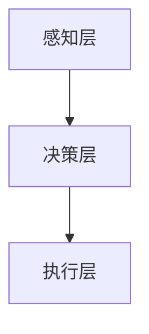
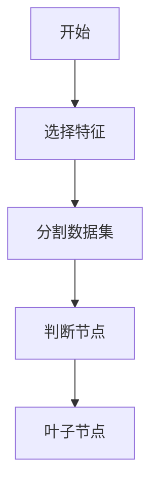
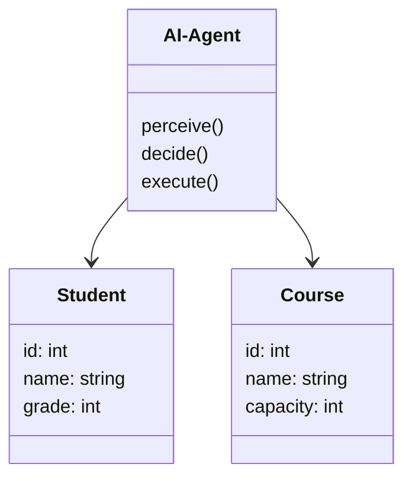
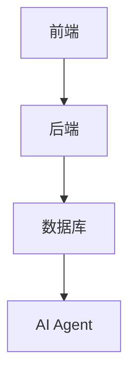

                 


# 智能校园：AI Agent的全方位教育管理

## 关键词：AI Agent，智能校园，教育管理，人工智能，校园管理，智能系统，教育科技

## 摘要：
随着人工智能技术的快速发展，AI Agent（智能体）在教育管理领域的应用日益广泛。本文将深入探讨AI Agent在智能校园中的全方位应用，涵盖教育管理的各个环节，包括学生行为分析、课程推荐、资源分配优化等。通过理论分析和实际案例结合，揭示AI Agent如何提升教育管理的智能化水平，优化教育资源配置，实现个性化教学，从而推动教育模式的革新。

---

# 第1章：背景介绍

## 1.1 教育管理的智能化转型
教育管理正面临前所未有的挑战：学生数量激增、教育资源分配不均、管理流程复杂化。传统的管理方式难以应对这些挑战，亟需智能化解决方案。

## 1.2 AI Agent的定义与作用
AI Agent是一种能够感知环境、自主决策并执行任务的智能系统，能够在教育管理中实现自动化、智能化的管理方式。

## 1.3 AI Agent在智能校园中的应用前景
通过AI Agent，校园管理可以实现数据驱动的决策、个性化的教育资源分配和实时监控，提升教育质量和管理效率。

---

# 第2章：AI Agent的核心概念与联系

## 2.1 AI Agent的原理与机制
AI Agent通过感知、决策和执行三个环节实现智能化管理。感知环境、分析数据、做出决策并执行任务是其核心机制。

## 2.2 AI Agent的核心要素对比
以下是AI Agent与传统管理系统的对比表格：

| 特性 | AI Agent | 传统管理系统 |
|------|----------|-------------|
| 感知能力 | 强 | 弱 |
| 决策能力 | 自主 | 依赖人工 |
| 执行能力 | 自动化 | 半自动化 |

## 2.3 AI Agent的系统架构
AI Agent的系统架构通常包括感知层、决策层和执行层。以下是系统架构的Mermaid图：



---

# 第3章：AI Agent的算法原理

## 3.1 AI Agent的算法基础
AI Agent的算法主要包括机器学习算法和自然语言处理算法。以下是决策树算法的流程图：



## 3.2 AI Agent的数学模型
以下是学生行为预测模型的数学公式：

$$ P(\text{行为} | \text{特征}) = \frac{\text{特征的权重}}{\sum \text{所有特征的权重}} $$

---

# 第4章：AI Agent的数学模型与公式

## 4.1 学生行为预测模型
学生行为预测模型通过分析学生的特征数据，预测其行为模式。以下是模型的数学表达式：

$$ P(\text{行为} | \text{特征}) = \frac{\text{特征的权重}}{\sum \text{所有特征的权重}} $$

## 4.2 资源分配优化模型
资源分配优化模型通过优化算法，实现教育资源的最优分配。以下是模型的数学公式：

$$ \text{总成本} = \sum_{i=1}^{n} c_i \cdot x_i $$

其中，\( c_i \) 是资源 \( i \) 的成本，\( x_i \) 是分配的数量。

---

# 第5章：AI Agent的系统分析与架构设计

## 5.1 项目介绍
本项目旨在开发一个基于AI Agent的智能校园管理系统，涵盖学生信息管理、课程推荐、资源分配等功能。

## 5.2 系统功能设计
以下是系统功能的类图：



## 5.3 系统架构设计
以下是系统架构的Mermaid图：



---

# 第6章：AI Agent的项目实战

## 6.1 环境安装
安装Python和必要的库（如scikit-learn、NLTK）。

## 6.2 核心代码实现
以下是学生行为预测的代码示例：

```python
import sklearn.tree as tree

# 训练数据
X = [[特征1, 特征2, ...], ...]
y = [标签]

# 训练模型
clf = tree.DecisionTreeClassifier()
clf.fit(X, y)

# 预测
预测结果 = clf.predict(X)
```

## 6.3 实际案例分析
通过实际案例分析，展示AI Agent在智能校园中的应用效果和优化能力。

---

# 第7章：最佳实践与小结

## 7.1 最佳实践
在实际应用中，建议结合具体场景选择合适的算法，并确保数据质量和模型的可解释性。

## 7.2 小结
通过本文的介绍，AI Agent在智能校园中的应用前景广阔，能够显著提升教育管理的效率和质量。

---

# 附录

## 附录A：进一步阅读的资源
推荐阅读相关书籍和论文，深入理解AI Agent的原理和应用。

## 附录B：工具与库
推荐使用的工具和库，如scikit-learn、NLTK等。

---

以上是《智能校园：AI Agent的全方位教育管理》的完整目录和内容概览。

