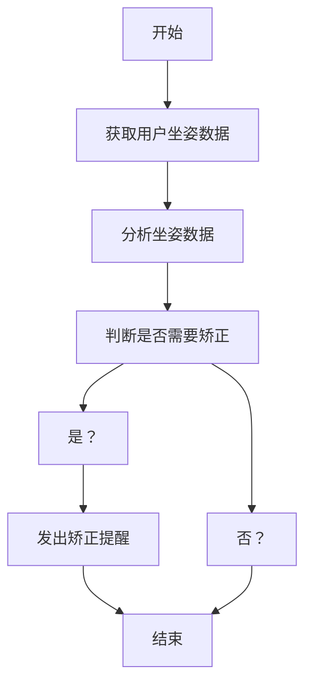
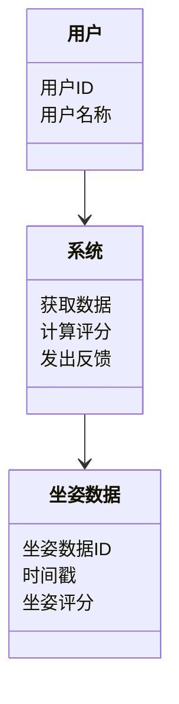
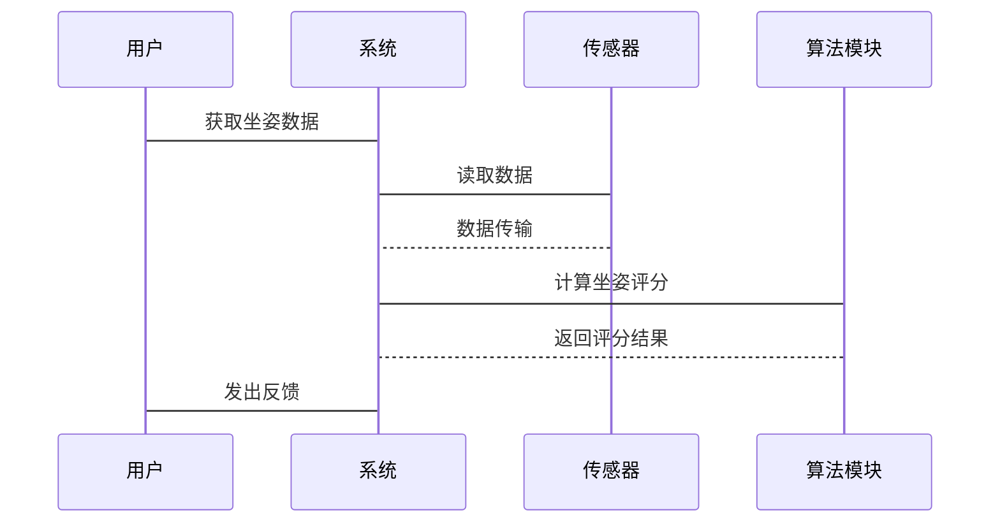

                 


# 《智能沙发：AI Agent的坐姿矫正提醒》

**关键词**：智能沙发、AI Agent、坐姿矫正、物联网、健康监测

**摘要**：本文深入探讨了智能沙发的设计与实现，结合AI Agent技术，提出了一种创新的坐姿矫正提醒系统。通过分析问题背景、设计核心算法、构建系统架构，最终实现了一个能够实时监测用户坐姿并提供反馈的智能家具解决方案。文章详细介绍了系统的各个组成部分，包括算法原理、系统架构设计、项目实战案例以及最佳实践建议，为读者提供了一个全面的技术参考。

---

# 第一部分: 智能沙发与AI Agent的背景介绍

## 第1章: 智能沙发与坐姿矫正的背景与问题背景

### 1.1 问题背景

#### 1.1.1 现代人久坐问题的现状
现代社会中，久坐已成为一种普遍现象，尤其是在办公环境中。长时间的不良坐姿导致了诸多健康问题，如腰椎病、颈椎病等。这些问题严重影响了人们的生活质量，亟需有效的解决方案。

#### 1.1.2 坐姿不正对健康的负面影响
坐姿不正是导致脊柱侧弯、肩颈疼痛等问题的主要原因之一。长期的不良坐姿不仅影响身体健康，还可能导致注意力不集中、工作效率下降。

#### 1.1.3 智能家具的兴起与发展趋势
随着科技的发展，智能家具逐渐进入人们的视野。智能沙发作为一种新兴的智能家具，结合了物联网技术和人工智能，能够实时监测用户的坐姿，并通过反馈机制帮助用户矫正坐姿。

### 1.2 问题描述

#### 1.2.1 坐姿矫正的需求分析
通过对目标用户的调查分析，发现用户对坐姿矫正的需求主要集中在实时反馈、个性化提醒和长期健康监测三个方面。

#### 1.2.2 智能沙发的功能定位
智能沙发的功能定位是通过AI Agent技术，实时监测用户的坐姿，并在发现不良坐姿时，通过震动或声音提醒用户调整坐姿。

#### 1.2.3 用户对坐姿矫正的接受度与使用场景
用户对坐姿矫正的接受度较高，尤其是在办公室、家庭和学习场所等需要长时间坐姿的场景中，智能沙发的应用前景广阔。

### 1.3 问题解决

#### 1.3.1 AI Agent在坐姿矫正中的作用
AI Agent通过实时监测用户的坐姿数据，分析坐姿的健康程度，并通过反馈机制帮助用户调整坐姿。

#### 1.3.2 智能沙发的设计目标与核心功能
设计目标是提供一种舒适、健康的坐姿矫正解决方案；核心功能包括实时监测坐姿、智能反馈提醒、长期健康数据分析等。

#### 1.3.3 解决方案的可行性分析
通过技术可行性分析、市场调研和用户需求分析，证明智能沙发的设计方案具有较高的可行性和市场潜力。

### 1.4 系统的边界与外延

#### 1.4.1 系统的功能边界
系统的主要功能是实时监测坐姿、智能反馈提醒和长期数据分析。

#### 1.4.2 系统的外延与扩展性
系统可以与其他智能设备（如手机APP、云端服务器）协同工作，实现数据的共享和分析。

#### 1.4.3 系统与其他设备的协同工作
智能沙发可以通过蓝牙或Wi-Fi连接到手机APP，用户可以在手机上查看坐姿数据和矫正建议。

### 1.5 概念结构与核心要素

#### 1.5.1 系统的核心要素组成
系统的核心要素包括：传感器模块、AI Agent模块、反馈模块和数据存储模块。

#### 1.5.2 系统的逻辑架构
系统的逻辑架构分为数据采集层、数据处理层和用户交互层。

#### 1.5.3 系统的核心功能模块
核心功能模块包括坐姿监测模块、坐姿矫正模块和数据管理模块。

### 1.6 本章小结

---

## 第2章: AI Agent与坐姿矫正提醒系统的核心概念

### 2.1 AI Agent的基本原理

#### 2.1.1 AI Agent的定义与特点
AI Agent是一种智能体，能够感知环境、自主决策并执行任务。其特点是智能化、自主性和适应性。

#### 2.1.2 AI Agent的核心技术
AI Agent的核心技术包括自然语言处理、机器学习和计算机视觉。

#### 2.1.3 AI Agent在智能沙发中的应用
AI Agent在智能沙发中的应用主要体现在坐姿监测、用户行为分析和智能反馈方面。

### 2.2 坐姿矫正提醒系统的工作原理

#### 2.2.1 坐姿检测的技术实现
坐姿检测主要通过传感器和摄像头实现，传感器用于监测坐姿的角度和压力，摄像头用于捕捉用户的坐姿图像。

#### 2.2.2 坐姿矫正的反馈机制
系统通过震动、声音或手机通知的方式，提醒用户调整坐姿。

#### 2.2.3 系统的用户交互设计
用户可以通过手机APP设置提醒频率、查看坐姿数据和接收矫正建议。

### 2.3 AI Agent与坐姿矫正系统的关联

#### 2.3.1 AI Agent在坐姿检测中的作用
AI Agent通过分析传感器数据和图像数据，判断用户的坐姿是否正确。

#### 2.3.2 AI Agent在用户反馈中的应用
AI Agent可以根据用户的反馈数据，优化提醒策略，提高坐姿矫正的效果。

#### 2.3.3 系统的整体架构与功能模块
系统的整体架构包括传感器模块、AI Agent模块、反馈模块和数据管理模块。

### 2.4 核心概念对比表

| **概念**       | **AI Agent**            | **传统软件**             |
|----------------|------------------------|--------------------------|
| 智能性         | 高                     | 低                       |
| 自主性         | 高                     | 低                       |
| 适应性         | 高                     | 低                       |

### 2.5 ER实体关系图

```mermaid
erd
    节点 坐姿数据 {
        id 坐姿数据ID
        datetime 时间戳
        user_id 用户ID
        坐姿评分 坐姿评分
    }
    节点 用户 {
        id 用户ID
        name 用户名称
    }
    关系：坐姿数据 --> 用户
```

### 2.6 本章小结

---

## 第3章: AI Agent的算法原理与实现

### 3.1 AI Agent的算法流程

#### 3.1.1 算法流程图（Mermaid）



#### 3.1.2 算法实现
AI Agent通过机器学习算法分析坐姿数据，判断是否需要矫正坐姿。

#### 3.1.3 算法优化
通过不断优化机器学习模型，提高坐姿检测的准确率和反馈的及时性。

### 3.2 数学模型与公式

#### 3.2.1 坐姿评分模型
坐姿评分公式：
$$ 坐姿评分 = \alpha \times 背部角度 + \beta \times 肩部角度 + \gamma \times 头部角度 $$
其中，$\alpha + \beta + \gamma = 1$。

#### 3.2.2 坐姿矫正算法
通过回归分析优化坐姿评分模型，提高坐姿检测的准确率。

### 3.3 算法实现代码

#### 3.3.1 传感器数据采集
```python
import sensor_module

def get_posture_data():
    return sensor_module.read_data()
```

#### 3.3.2 坐姿评分计算
```python
def calculate_posture_score(data):
    score = 0.5 * data['back_angle'] + 0.3 * data['shoulder_angle'] + 0.2 * data['head_angle']
    return score
```

#### 3.3.3 坐姿矫正反馈
```python
def feedback_correction(score):
    if score < 0.6:
        return "请调整坐姿"
    else:
        return "坐姿良好"
```

### 3.4 本章小结

---

## 第4章: 系统架构设计与实现

### 4.1 系统功能设计

#### 4.1.1 领域模型（Mermaid 类图）



#### 4.1.2 系统架构设计（Mermaid 架构图）


#### 4.1.3 系统接口设计
系统接口包括数据采集接口、数据处理接口和用户反馈接口。

#### 4.1.4 系统交互设计（Mermaid 序列图）



### 4.2 系统实现

#### 4.2.1 环境安装
需要安装传感器模块、AI算法库和数据库。

#### 4.2.2 核心代码实现
```python
import sensor_module
import ai_module
import database_module

def main():
    data = sensor_module.get_data()
    score = ai_module.calculate_score(data)
    if score < 0.6:
        ai_module.send_feedback("请调整坐姿")
    else:
        ai_module.send_feedback("坐姿良好")
    database_module.store_data(data, score)

if __name__ == "__main__":
    main()
```

#### 4.2.3 代码解读与分析
代码实现包括数据采集、坐姿评分计算、反馈发送和数据存储四个部分。

### 4.3 本章小结

---

## 第5章: 项目实战与案例分析

### 5.1 环境安装
安装所需的传感器模块、AI算法库和数据库。

### 5.2 系统核心实现
实现坐姿数据采集、评分计算和反馈发送的核心功能。

### 5.3 代码解读与分析
详细解读核心代码，分析其工作原理。

### 5.4 案例分析
通过实际案例分析，验证系统的有效性和实用性。

### 5.5 本章小结

---

## 第6章: 最佳实践与注意事项

### 6.1 小结
总结智能沙发的设计与实现过程。

### 6.2 注意事项
注意事项包括数据隐私保护、系统稳定性保障和用户使用体验优化。

### 6.3 拓展阅读
建议读者阅读相关领域的最新研究和技术进展。

### 6.4 本章小结

---

## 第7章: 结语

### 7.1 项目总结
总结智能沙发项目的成果和意义。

### 7.2 未来展望
展望智能沙发技术的未来发展和应用前景。

### 7.3 感谢与致谢
感谢参与项目开发的团队成员和提供支持的机构。

### 7.4 本章小结

---

**参考文献**：
1. [1] 现代AI Agent技术研究
2. [2] 物联网技术在智能家具中的应用
3. [3] 坐姿矫正系统的实现与优化

