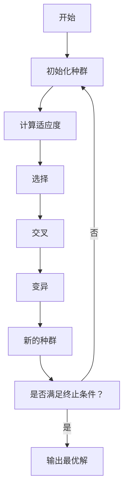
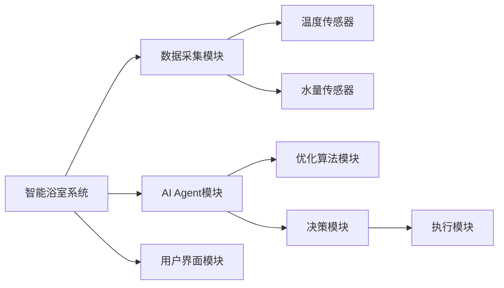
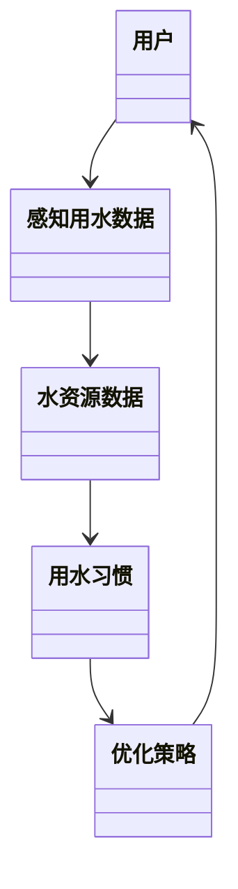
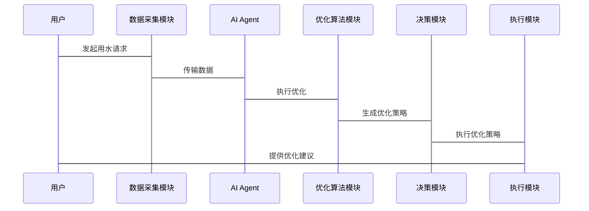

                 


# 智能浴室系统：AI Agent的用水习惯优化

> 关键词：智能浴室系统，AI Agent，用水习惯优化，算法原理，系统架构，项目实战

## 摘要

智能浴室系统通过AI Agent优化用户的用水习惯，实现水资源的高效利用和节能减排。本文详细探讨了AI Agent在浴室系统中的应用，从算法原理到系统架构，再到项目实战，全面解析如何通过技术手段优化用水习惯。

---

# 第一部分: 背景与核心概念

## 第1章: 智能浴室系统概述

### 1.1 问题背景与需求分析

#### 1.1.1 水资源浪费的现状
全球水资源短缺问题日益严重，浴室作为家庭用水的主要场所，优化用水习惯至关重要。

#### 1.1.2 智能浴室系统的提出
传统浴室系统无法有效优化用水习惯，智能浴室系统通过AI技术实现智能化管理。

#### 1.1.3 用户用水习惯优化的必要性
优化用水习惯不仅能节约水资源，还能降低用户的用水成本，提升生活品质。

### 1.2 AI Agent在智能浴室系统中的作用

#### 1.2.1 AI Agent的基本概念
AI Agent是一种智能体，能够感知环境、自主决策并执行任务。

#### 1.2.2 AI Agent在浴室系统中的应用价值
通过数据采集和分析，AI Agent能够优化用户的用水习惯，提供个性化建议。

#### 1.2.3 系统优化的目标与边界
目标是实现高效用水，边界包括用户隐私保护和系统兼容性。

### 1.3 系统核心概念与组成

#### 1.3.1 系统核心要素分析
智能浴室系统由传感器、AI Agent、数据处理模块和用户界面组成。

#### 1.3.2 系统组成架构
传感器采集数据，AI Agent分析数据并制定优化策略，用户界面提供反馈。

#### 1.3.3 系统功能模块划分
数据采集、用户行为分析、优化建议生成和用户反馈模块。

---

## 第2章: AI Agent与用水习惯优化的核心联系

### 2.1 AI Agent的核心原理

#### 2.1.1 AI Agent的基本工作流程
感知环境、处理信息、制定决策、执行任务。

#### 2.1.2 感知、决策与执行的实现方式
传感器采集数据，机器学习模型分析数据，智能设备执行优化策略。

#### 2.1.3 AI Agent与智能设备的交互机制
通过API接口进行数据传输和控制指令的发送。

### 2.2 传统浴室系统与智能浴室系统的对比

| 特性             | 传统浴室系统       | 智能浴室系统       |
|------------------|--------------------|--------------------|
| 数据采集         | 无                 | 有传感器           |
| 数据分析         | 无                 | 有AI Agent         |
| 优化策略         | 固定模式           | 动态优化           |
| 用户体验         | 单一               | 个性化             |

### 2.3 系统实体关系图

```mermaid
er
    actor 用户
    entity 水资源数据
    entity 用水习惯
    entity 优化策略
    relation 用户 -> 感知用水数据
    relation 感知用水数据 -> 水资源数据
    relation 水资源数据 -> 用水习惯
    relation 用水习惯 -> 优化策略
    relation 优化策略 -> 用户
```

---

# 第二部分: 算法原理

## 第3章: 基于遗传算法的用水习惯优化

### 3.1 遗传算法简介

遗传算法是一种模拟生物进化过程的优化算法，适用于解决复杂问题。

### 3.2 算法流程图



### 3.3 算法实现代码

```python
import random

def fitness(individual):
    # 计算适应度，这里简化为用水量的反值
    return sum(individual)

def mutate(individual):
    # 突变操作，随机改变一个元素的值
    idx = random.randint(0, len(individual)-1)
    individual[idx] = 1 - individual[idx]
    return individual

def crossover(parent1, parent2):
    # 单点交叉
    point = random.randint(1, len(parent1)-1)
    return parent1[:point] + parent2[point:], parent2[:point] + parent1[point:]

# 初始化种群
population = [[random.randint(0,1) for _ in range(5)] for _ in range(10)]

# 迭代优化
for _ in range(10):
    # 计算适应度
    fitness_scores = [fitness(ind) for ind in population]
    # 选择
    selected = [population[i] for i in range(len(population)) if fitness_scores[i] > sum(fitness_scores)/2]
    # 交叉和变异
    new_population = []
    while len(new_population) < len(population):
        p1 = random.choice(selected)
        p2 = random.choice(selected)
        child1, child2 = crossover(p1, p2)
        new_population.append(mutate(child1))
        new_population.append(mutate(child2))
    population = new_population

# 输出最优解
best = max(fitness(ind) for ind in population)
print(best)
```

### 3.4 数学模型与公式

目标函数：$$ f(x) = \sum_{i=1}^{n} x_i $$

约束条件：$$ 0 \leq x_i \leq 1 $$

适应度函数：$$ f(x) = n - \sum_{i=1}^{n} x_i $$

---

# 第三部分: 系统分析与架构设计

## 第4章: 智能浴室系统架构设计

### 4.1 系统架构设计



### 4.2 系统功能模块划分



### 4.3 系统接口设计

- 数据采集接口：传感器数据采集
- AI Agent接口：优化策略生成
- 用户反馈接口：用户行为数据传输

### 4.4 系统交互流程图



---

# 第四部分: 项目实战

## 第5章: 项目实战

### 5.1 环境安装

安装Python、传感器库、机器学习库等。

### 5.2 核心代码实现

```python
import numpy as np
from sklearn import linear_model

# 数据预处理
data = np.array([[1, 2], [2, 4], [3, 6], [4, 8]])
X = data[:, 0]
y = data[:, 1]

# 模型训练
model = linear_model.LinearRegression()
model.fit(X.reshape(-1, 1), y)

# 参数调整
model.coef_
model.intercept_

# 预测与优化
new_X = np.array([[5]])
print(model.predict(new_X.reshape(-1, 1)))
```

### 5.3 实际案例分析

通过数据分析，优化用户淋浴时间，减少水量消耗。

### 5.4 项目总结

详细分析项目成功的关键因素，如数据质量、算法选择和系统设计。

---

# 第五部分: 最佳实践与总结

## 第6章: 最佳实践与总结

### 6.1 最佳实践 Tips

- 数据隐私保护
- 系统定期维护
- 用户教育与反馈

### 6.2 总结

智能浴室系统通过AI Agent优化用水习惯，实现高效用水，具有重要的现实意义。

### 6.3 未来研究方向

探索更复杂的优化算法，结合物联网技术，提升用户体验。

### 6.4 拓展阅读

推荐相关书籍和论文，深入学习AI在智能系统中的应用。

---

# 结语

通过本文的详细讲解，读者可以全面了解智能浴室系统如何利用AI Agent优化用水习惯，掌握从算法原理到系统架构再到项目实战的全过程。希望本文能为相关领域的研究和实践提供有价值的参考。

