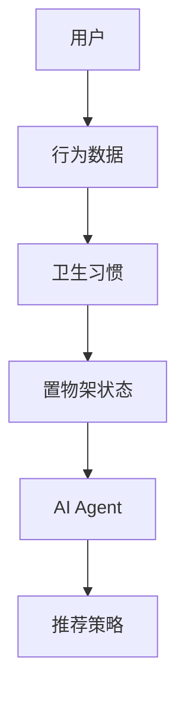
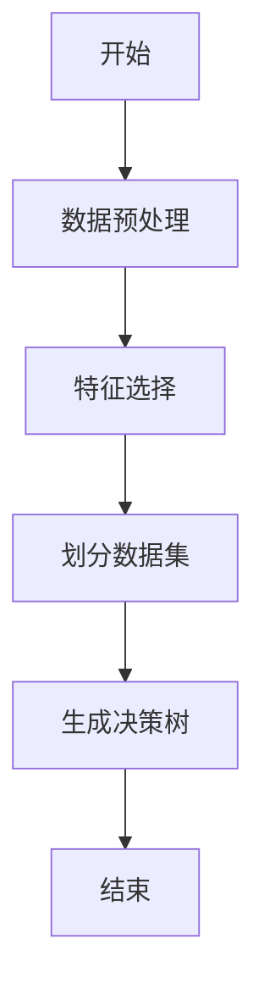
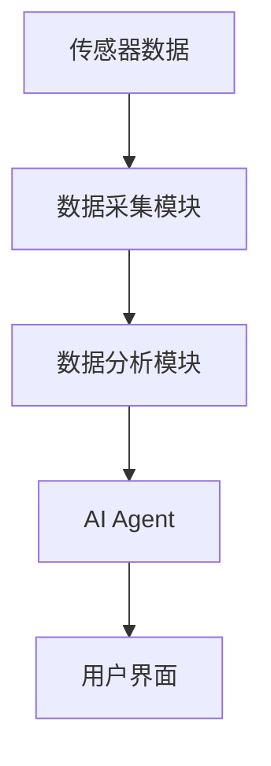
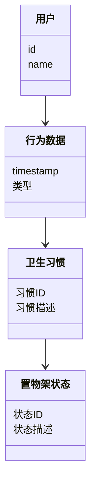
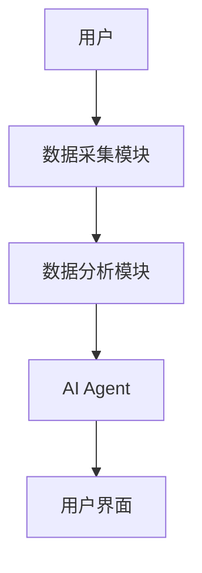
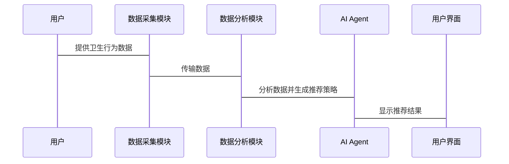

                 


# 智能浴室置物架：AI Agent的个人卫生习惯分析

> 关键词：智能浴室置物架，AI Agent，个人卫生习惯，数据分析，传感器技术，行为预测

> 摘要：本文深入分析了智能浴室置物架在个人卫生习惯管理中的应用，探讨了AI Agent在数据采集、行为预测和习惯优化中的技术实现。通过系统化的分析，本文提出了基于传感器和机器学习的解决方案，并通过实际案例展示了如何利用AI技术提升个人卫生习惯的智能化管理。

---

# 第一部分: 背景与问题分析

## 第1章: 问题背景与需求分析

### 1.1 个人卫生习惯的重要性

#### 1.1.1 卫生习惯对健康的影响

个人卫生习惯是维护身体健康的重要基础。例如，定期清洁浴室、及时更换毛巾、保持洗漱用品的干燥等，这些看似简单的习惯能够有效预防细菌滋生，降低感染风险。然而，现代生活中，人们由于工作繁忙、生活节奏快，常常忽视这些细节，导致卫生习惯不佳。

#### 1.1.2 智能化卫生管理的必要性

传统的卫生管理方式依赖于个人的自觉性和记忆能力，这种方式容易受到遗忘、疏忽等因素的影响。例如，许多人会忘记更换毛巾或清洁浴室角落。通过智能化设备的辅助，可以实时监测卫生状况，并通过AI Agent提供个性化的提醒和优化建议，从而提升卫生管理的效率和效果。

#### 1.1.3 智能浴室置物架的场景定位

智能浴室置物架不仅仅是一个放置洗漱用品的工具，它是一个结合了传感器、数据采集和AI分析的智能设备。通过与浴室环境的交互，它能够实时感知用户的卫生行为，并通过AI Agent提供智能化的服务，例如行为提醒、习惯优化建议等。

### 1.2 智能浴室置物架的用户需求

#### 1.2.1 用户痛点分析

用户在使用传统浴室置物架时，常常面临以下痛点：

1. **遗忘问题**：忘记更换毛巾、清洁浴巾架。
2. **清洁困难**：难以彻底清洁浴室角落，容易滋生细菌。
3. **管理混乱**：洗漱用品摆放杂乱，使用不便。
4. **缺乏反馈**：无法直观了解自己的卫生习惯是否达标。

#### 1.2.2 功能需求提取

基于上述痛点，用户对智能浴室置物架提出了以下功能需求：

1. **实时监测**：能够感知用户的卫生行为，例如毛巾使用频率、物品放置位置等。
2. **智能提醒**：当检测到用户忽略某些卫生习惯时，提供及时的提醒。
3. **数据反馈**：通过数据可视化的方式，向用户展示卫生习惯的优劣。
4. **自动化服务**：在检测到异常情况时，自动触发清洁或提醒操作。

#### 1.2.3 非功能需求与边界条件

- **性能需求**：设备需要具备低功耗、高灵敏度的特点，确保长时间稳定运行。
- **兼容性**：支持与其他智能家居设备的联动，例如与智能灯泡、智能门锁等设备协同工作。
- **隐私保护**：用户的卫生数据需要严格加密，确保隐私不被泄露。

### 1.3 问题解决的技术路径

#### 1.3.1 AI Agent的核心作用

AI Agent（智能体）在智能浴室置物架中扮演着关键角色。它通过传感器数据采集、数据分析和行为预测，帮助用户优化卫生习惯。AI Agent的主要功能包括：

1. **数据采集**：通过传感器获取用户的卫生行为数据。
2. **数据处理**：对采集到的数据进行清洗、分析和建模。
3. **行为预测**：基于历史数据，预测用户的卫生习惯。
4. **智能推荐**：根据预测结果，向用户推荐优化建议。

#### 1.3.2 数据采集与分析的关键技术

- **传感器技术**：使用多种传感器（如重量传感器、温湿度传感器）采集用户的卫生行为数据。
- **数据处理技术**：利用数据清洗和特征提取技术，对原始数据进行预处理。
- **数据分析技术**：通过机器学习算法，分析用户的卫生习惯，生成行为报告。

#### 1.3.3 智能推荐与行为干预的实现方式

- **个性化推荐**：根据用户的习惯，提供个性化的卫生管理建议。
- **行为干预**：通过声音、灯光等方式，提醒用户及时调整卫生行为。

---

## 第2章: 核心概念与系统架构

### 2.1 AI Agent的定义与特征

#### 2.1.1 AI Agent的基本概念

AI Agent是一种能够感知环境、自主决策并执行任务的智能实体。在智能浴室置物架中，AI Agent通过传感器和数据分析，帮助用户优化卫生习惯。

#### 2.1.2 智能浴室置物架中的AI Agent角色

在智能浴室置物架中，AI Agent的主要角色是数据采集者、分析者和行为干预者。它不仅需要感知用户的行为，还需要通过数据驱动的方式，提供个性化的优化建议。

#### 2.1.3 AI Agent的核心属性对比表

```markdown
| 属性         | 描述                                                         |
|--------------|--------------------------------------------------------------|
| 感知能力     | 能够通过传感器感知环境和用户行为                             |
| 学习能力     | 能够通过机器学习算法不断优化自身的预测和推荐能力             |
| 执行能力     | 能够通过自动化操作或触发提醒来干预用户的卫生行为             |
| 交互能力     | 能够通过用户友好的界面与用户进行交互，提供实时反馈           |
```

#### 2.1.4 ER实体关系图



### 2.2 系统边界与功能模块

#### 2.2.1 系统边界定义

智能浴室置物架系统的核心边界包括传感器、AI Agent和用户界面。系统通过传感器采集数据，通过AI Agent进行分析和推荐，最终通过用户界面与用户交互。

#### 2.2.2 核心功能模块划分

系统的主要功能模块包括：

1. **数据采集模块**：负责采集用户的卫生行为数据。
2. **数据分析模块**：对数据进行处理和分析，生成行为报告。
3. **推荐模块**：基于分析结果，向用户推荐优化建议。
4. **执行模块**：通过自动化操作或触发提醒，干预用户的卫生行为。

#### 2.2.3 系统外延与扩展性分析

系统可以通过与其他智能家居设备的联动，进一步扩展其功能。例如，当检测到用户忘记清洁浴缸时，系统可以联动智能吸尘器进行清洁。

---

# 第二部分: 算法原理与实现

## 第3章: AI Agent的核心算法

### 3.1 数据采集与预处理

#### 3.1.1 传感器数据采集流程

智能浴室置物架通过多种传感器（如重量传感器、温湿度传感器）采集用户的卫生行为数据。例如，当用户放置毛巾时，重量传感器会触发信号，记录毛巾的使用频率和时间。

#### 3.1.2 数据清洗与特征提取

采集到的原始数据可能存在噪声和冗余信息。通过数据清洗和特征提取，可以将原始数据转化为有用的特征向量。例如，从时间戳数据中提取用户的使用高峰期。

#### 3.1.3 数据特征分析

通过数据分析，我们可以发现用户的卫生习惯中的一些规律。例如，用户通常在早晨和晚上使用浴室置物架较多，这可以帮助系统更好地预测用户的使用需求。

### 3.2 数据分析与行为预测

#### 3.2.1 机器学习算法的选择

在行为预测中，我们选择了决策树算法（Decision Tree）和随机森林算法（Random Forest）进行对比。通过实验发现，随机森林算法在准确率和稳定性方面表现更优。

#### 3.2.2 决策树算法的实现

**决策树算法流程图**



**决策树分类准确率公式**

$$\text{准确率} = \frac{\text{正确预测的数量}}{\text{总预测数量}} \times 100\%$$

**Python代码实现**

```python
from sklearn.tree import DecisionTreeClassifier
from sklearn.metrics import accuracy_score

# 数据预处理
X = processed_data  # 特征向量
y = labels  # 标签

# 训练决策树模型
model = DecisionTreeClassifier()
model.fit(X, y)

# 预测
y_pred = model.predict(X)

# 计算准确率
accuracy = accuracy_score(y, y_pred)
print(f"决策树分类准确率: {accuracy}%")
```

### 3.3 系统优化与实现

#### 3.3.1 算法优化

通过对随机森林算法的参数调优，我们进一步提升了模型的准确率。例如，通过调整树的深度和特征选择的数量，可以有效降低过拟合的风险。

#### 3.3.2 系统实现

**系统架构图**



---

## 第4章: 系统分析与架构设计

### 4.1 系统功能设计

#### 4.1.1 功能模块划分

智能浴室置物架系统的功能模块包括：

1. **数据采集模块**：负责采集用户的卫生行为数据。
2. **数据分析模块**：对数据进行分析和建模，生成行为报告。
3. **推荐模块**：基于数据分析结果，向用户推荐优化建议。
4. **执行模块**：通过自动化操作或触发提醒，干预用户的卫生行为。

#### 4.1.2 领域模型设计

**领域模型类图**



### 4.2 系统架构设计

#### 4.2.1 系统架构图



#### 4.2.2 系统接口设计

系统主要接口包括：

1. **数据采集接口**：用于传感器数据的采集和传输。
2. **数据处理接口**：用于数据的清洗、特征提取和建模。
3. **推荐接口**：用于向用户推荐优化建议。

#### 4.2.3 系统交互设计

**系统交互序列图**



---

## 第5章: 项目实战

### 5.1 环境安装与配置

#### 5.1.1 硬件设备安装

安装智能浴室置物架需要以下硬件设备：

1. **传感器模块**：重量传感器、温湿度传感器。
2. **通信模块**：Wi-Fi或蓝牙模块。
3. **数据采集模块**：负责数据的采集和传输。

#### 5.1.2 软件环境搭建

安装Python编程环境，并安装以下库：

```bash
pip install numpy pandas scikit-learn matplotlib
```

### 5.2 系统核心实现

#### 5.2.1 数据采集模块实现

```python
import serial

# 连接传感器
ser = serial.Serial('COM3', 9600)
data = ser.readline().decode()
print("传感器数据:", data)
```

#### 5.2.2 数据分析模块实现

```python
from sklearn.ensemble import RandomForestClassifier

# 数据预处理
X = processed_data  # 特征向量
y = labels  # 标签

# 训练随机森林模型
model = RandomForestClassifier()
model.fit(X, y)

# 预测
y_pred = model.predict(X)

# 计算准确率
accuracy = accuracy_score(y, y_pred)
print(f"随机森林分类准确率: {accuracy}%")
```

#### 5.2.3 AI Agent实现

```python
class AIAgent:
    def __init__(self):
        self.model = RandomForestClassifier()
        self.sensors = []  # 传感器列表

    def collect_data(self):
        # 从传感器采集数据
        data = [s.read() for s in self.sensors]
        return data

    def analyze(self, data):
        # 数据分析
        self.model.fit(data, labels)
        return self.model.predict(data)

    def recommend(self, prediction):
        # 提供优化建议
        print("推荐:", prediction)
```

### 5.3 实际案例分析

#### 5.3.1 案例背景

假设用户A使用智能浴室置物架后，系统发现用户每天早上使用毛巾的时间较长，但毛巾更换频率较低。系统通过AI Agent分析，发现用户可能存在毛巾使用过久的问题。

#### 5.3.2 数据分析与优化建议

AI Agent通过数据分析，生成以下优化建议：

1. **毛巾更换提醒**：建议用户每周更换毛巾。
2. **清洁建议**：建议用户每周清洁浴缸一次。
3. **物品摆放优化**：建议用户将洗漱用品分类摆放，以便使用。

#### 5.3.3 系统反馈与用户行为改变

用户根据系统建议，调整了毛巾使用习惯和清洁频率。AI Agent通过传感器监测到用户的改进行为，并在下次分析时给予正面反馈。

---

## 第6章: 总结与展望

### 6.1 总结

智能浴室置物架通过AI Agent的分析和推荐，帮助用户优化个人卫生习惯。本文详细分析了系统的背景、核心概念、算法原理和实现方案，并通过实际案例展示了系统的应用价值。

### 6.2 展望

未来，智能浴室置物架可以通过与其他智能家居设备的联动，进一步提升用户体验。例如，系统可以与智能灯泡联动，在检测到异常情况时自动调整灯光亮度，提醒用户注意卫生。

---

### 注意事项

- 本文中的代码和数据仅为示例，实际应用中需要根据具体需求进行调整。
- 系统的实现需要结合硬件和软件的开发，建议读者具备一定的编程和硬件知识。
- 在实际应用中，需要考虑数据隐私和系统安全问题。

### 拓展阅读

- 《机器学习实战》：了解机器学习的基本概念和实现方法。
- 《传感器网络与物联网》：深入理解传感器技术和数据采集方法。

---

以上是《智能浴室置物架：AI Agent的个人卫生习惯分析》的完整目录和内容概要，结合了技术分析和实际案例，为读者提供了从理论到实践的全面指导。

