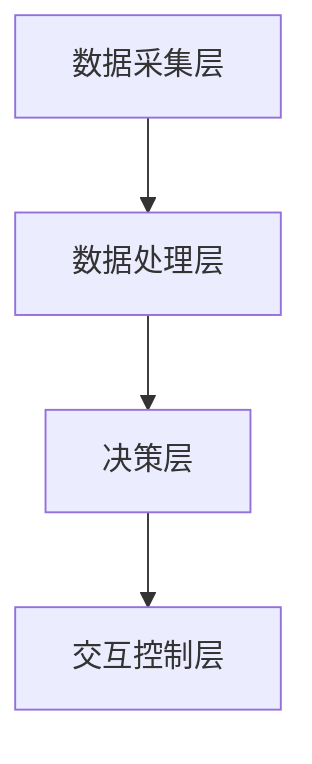

                 


# 智能浴室置物架：AI Agent的个人护理建议

> 关键词：智能浴室置物架，AI Agent，个人护理，智能化设计，传感器技术，数据融合，语音交互

> 摘要：本文深入探讨了智能浴室置物架结合AI Agent的技术实现与应用场景，从背景介绍、核心概念、算法原理到系统设计与项目实战，全面解析了如何通过AI技术提升浴室置物架的功能与用户体验。通过本篇文章，读者可以了解到AI Agent在智能浴室置物架中的具体应用，掌握相关算法原理与实现方法，并学习如何将这些技术应用于实际项目中。

---

# 第一部分: 智能浴室置物架与AI Agent的背景介绍

## 第1章: AI Agent与智能浴室置物架概述

### 1.1 AI Agent的基本概念

#### 1.1.1 人工智能代理的定义
人工智能代理（AI Agent）是一种能够感知环境并采取行动以实现目标的智能实体。它可以理解并响应用户的输入，执行任务，并通过学习优化其行为。AI Agent的核心在于其智能性，它能够通过传感器获取信息，通过推理和决策系统做出反应。

#### 1.1.2 AI Agent的核心属性与特征
| 特性 | 描述 |
|------|------|
| 感知能力 | 能够通过传感器或输入接口获取环境信息 |
| 决策能力 | 具备基于获取信息做出决策的能力 |
| 学习能力 | 能够通过经验或数据优化其行为模式 |
| 交互能力 | 能够与用户或其他系统进行有效交互 |

#### 1.1.3 AI Agent与传统自动化设备的区别
AI Agent不仅能够执行预设的任务，还能够根据环境变化和用户需求动态调整其行为。与传统自动化设备相比，其最大的区别在于智能化和适应性。

---

### 1.2 智能浴室置物架的智能化需求

#### 1.2.1 浴室环境的特点与挑战
浴室是一个湿度高、空间有限且需要高度个性化的地方。传统的浴室置物架仅具备存储功能，无法满足用户对智能化、个性化和便捷性的需求。

#### 1.2.2 智能置物架的功能需求
智能浴室置物架需要具备以下功能：
- 自动调整高度以适应不同用户的需求。
- 智能识别物品类型并优化存储空间。
- 提供语音交互功能，方便用户操作。
- 结合环境传感器，优化存储环境（如防潮、防霉）。

#### 1.2.3 AI Agent在浴室置物架中的应用场景
AI Agent可以应用于以下场景：
- 根据用户的使用习惯推荐存储位置。
- 实时监控环境数据并优化存储条件。
- 提供语音交互功能，实现便捷操作。

---

## 第2章: AI Agent的核心概念与系统架构

### 2.1 AI Agent的核心概念

#### 2.1.1 AI Agent的系统架构模型
AI Agent的系统架构可以分为以下几层：
1. **感知层**：负责数据采集。
2. **决策层**：负责数据处理和决策。
3. **执行层**：负责输出结果。

#### 2.1.2 AI Agent的核心功能模块
- **数据采集模块**：通过传感器获取环境数据。
- **数据处理模块**：对采集的数据进行分析和处理。
- **决策模块**：基于处理后的数据做出决策。
- **交互模块**：与用户或外部系统进行交互。

#### 2.1.3 AI Agent与传统自动化设备的区别
AI Agent能够通过学习和适应环境变化，提供更智能化的服务，而传统自动化设备仅能执行预设任务。

---

## 第3章: AI Agent的算法原理与实现

### 3.1 传感器数据融合算法

#### 3.1.1 数据融合的基本概念
数据融合是指将多个传感器的数据进行综合处理，以提高系统的准确性和可靠性。

#### 3.1.2 基于加权平均的融合算法
$$
\text{融合后的数据} = \sum_{i=1}^{n} w_i x_i
$$
其中，\( w_i \) 是传感器 \( i \) 的权重，\( x_i \) 是传感器 \( i \) 的数据。

---

### 3.2 语音识别与自然语言处理算法

#### 3.2.1 语音识别的基本原理
语音识别是将语音信号转换为文本的过程。基于深度学习的语音识别模型（如循环神经网络）能够实现高精度的识别。

#### 3.2.2 基于深度学习的NLP模型
$$
P(y|x) = \frac{P(x|y)P(y)}{P(x)}
$$
其中，\( P(y|x) \) 是条件概率，表示在输入 \( x \) 下输出 \( y \) 的概率。

---

### 3.3 AI Agent的决策算法

#### 3.3.1 基于规则的决策算法
基于规则的决策算法通过预设规则进行判断和决策。例如：
- 如果湿度超过阈值，则启动除湿功能。

#### 3.3.2 基于强化学习的决策算法
强化学习是一种通过奖励机制优化决策策略的方法。例如：
$$
Q(s, a) = r + \gamma \max_{a'} Q(s', a')
$$
其中，\( Q(s, a) \) 是状态 \( s \) 下动作 \( a \) 的价值函数，\( \gamma \) 是折扣因子。

---

## 第4章: 智能浴室置物架的系统设计与实现

### 4.1 系统功能模块划分

#### 4.1.1 数据采集模块
数据采集模块负责采集浴室环境中的各种数据，包括湿度、温度、光照强度等。

#### 4.1.2 数据处理模块
数据处理模块对采集的数据进行分析和处理，生成可用于决策的特征。

#### 4.1.3 交互控制模块
交互控制模块负责与用户进行交互，并根据决策结果控制置物架的动作。

---

### 4.2 系统架构设计

#### 4.2.1 分层架构设计
系统架构分为以下几层：
1. **数据采集层**：负责数据采集。
2. **数据处理层**：负责数据处理和特征提取。
3. **决策层**：负责决策和控制。

#### 4.2.2 模块之间的交互关系
模块之间的交互关系可以用以下Mermaid图表示：



---

### 4.3 系统接口设计

#### 4.3.1 数据接口
数据接口用于不同模块之间的数据传输。例如，传感器数据接口、决策模块接口等。

#### 4.3.2 用户接口
用户接口负责与用户的交互，包括语音输入、显示输出等。

---

## 第5章: 项目实战

### 5.1 环境安装

#### 5.1.1 系统环境
- 操作系统：Linux
- 开发工具：Python 3.8+
- 传感器：DHT22温湿度传感器

### 5.2 核心代码实现

#### 5.2.1 数据采集模块

```python
import Adafruit_DHT

sensor = Adafruit_DHT.DHT22
gpio = 4
pin = 17
humidity, temperature = Adafruit_DHT.read_retry(sensor, pin)
```

---

#### 5.2.2 数据处理模块

```python
def process_data(humidity, temperature):
    if humidity > 60:
        return "高湿度"
    elif temperature > 25:
        return "高温"
    else:
        return "正常"
```

---

#### 5.2.3 决策模块

```python
def decision_rule(status):
    if status == "高湿度":
        return "启动除湿"
    elif status == "高温":
        return "启动风扇"
    else:
        return "无需操作"
```

---

### 5.3 代码应用解读与分析

#### 5.3.1 数据采集模块
数据采集模块通过GPIO接口读取DHT22传感器的数据，获取湿度和温度信息。

#### 5.3.2 数据处理模块
数据处理模块根据湿度和温度数据，判断当前状态是否为高湿度或高温，并返回相应的状态信息。

#### 5.3.3 决策模块
决策模块根据数据处理模块返回的状态信息，决定是否启动除湿或风扇功能。

---

## 第6章: 最佳实践与小结

### 6.1 小结
通过本文的讲解，我们了解了AI Agent在智能浴室置物架中的具体应用，掌握了相关算法原理与实现方法，并学习了如何将这些技术应用于实际项目中。

### 6.2 注意事项
- 在实际项目中，需要根据具体需求调整算法参数。
- 注意传感器的安装位置和环境干扰问题。

### 6.3 拓展阅读
- 深度学习在智能硬件中的应用
- 多传感器融合技术的研究与应用

---

通过本文的详细讲解，读者可以深入了解智能浴室置物架与AI Agent的技术实现，并能够将这些技术应用到实际项目中，提升浴室置物架的智能化水平和用户体验。

