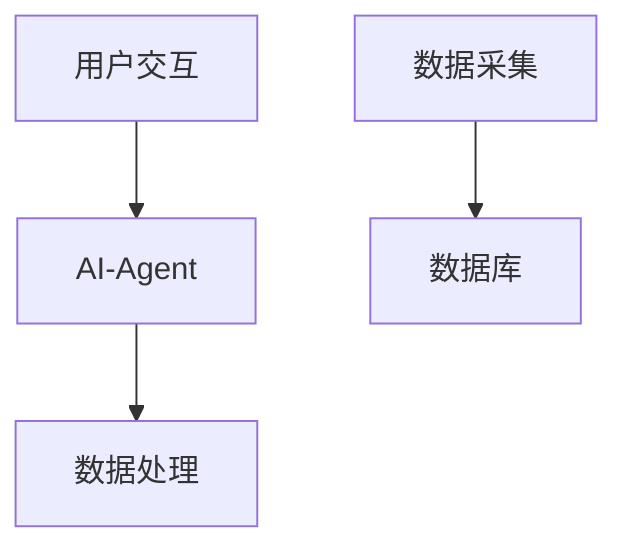
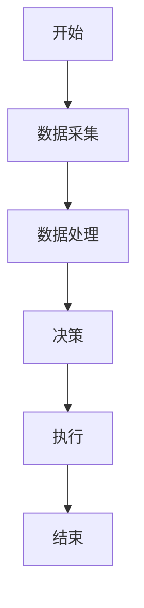
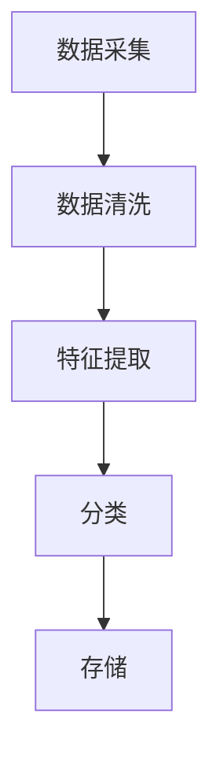
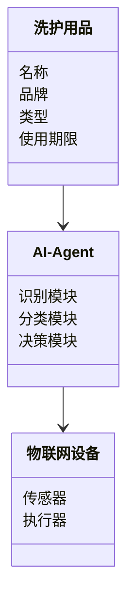
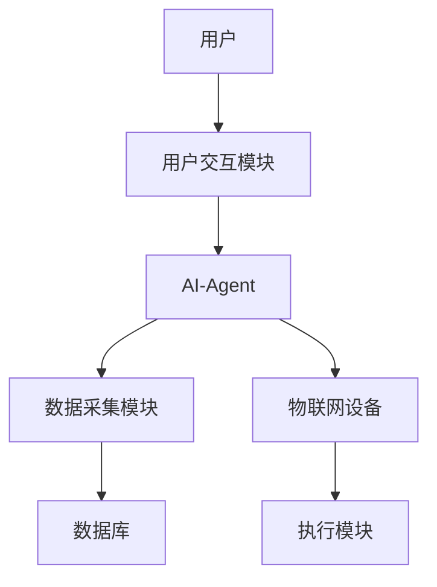
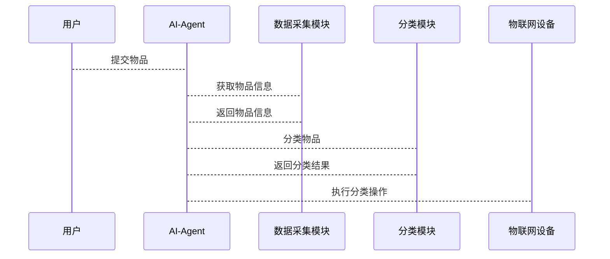

                 


# 智能浴室置物架：AI Agent的洗护用品管理

> 关键词：智能浴室置物架，AI Agent，物联网，洗护用品管理，智能家居

> 摘要：本文详细探讨了智能浴室置物架的设计与实现，结合AI Agent和物联网技术，分析了其在洗护用品管理中的应用，包括算法原理、系统架构、项目实战及最佳实践。

---

# 第1章: 智能浴室置物架的背景介绍

## 1.1 问题背景与描述

### 1.1.1 浴室置物架的使用痛点
传统浴室置物架存在以下问题：
- **空间利用不足**：传统置物架设计固定，无法根据用户需求灵活调整。
- **管理复杂**：洗护用品种类繁多，管理混乱，容易丢失或过期。
- **智能化缺失**：缺乏智能化管理手段，无法实时监控和提醒。

### 1.1.2 洗护用品管理的复杂性
洗护用品管理涉及多个方面：
- **分类与存储**：不同类型的洗护用品需要分类存储，便于取用和管理。
- **库存管理**：需要实时掌握每种用品的库存情况，避免浪费或缺货。
- **使用提醒**：及时提醒用户使用即将过期的产品，延长产品使用寿命。

### 1.1.3 智能化管理的需求
智能化管理的需求包括：
- **自动化管理**：通过AI Agent实现自动分类、存储和提醒。
- **数据驱动决策**：利用物联网数据进行智能决策，优化管理效率。
- **用户友好体验**：提供便捷的操作界面和个性化的管理功能。

## 1.2 问题解决与边界

### 1.2.1 AI Agent在洗护用品管理中的应用
AI Agent（智能体）通过以下方式实现洗护用品管理：
- **物体识别**：利用计算机视觉技术识别洗护用品的类型和品牌。
- **自然语言处理**：通过NLP技术解析用户的指令和需求。
- **决策与执行**：根据识别结果和用户需求，决策并执行相应的操作。

### 1.2.2 智能浴室置物架的功能边界
系统功能边界包括：
- **数据采集**：通过传感器和摄像头采集洗护用品信息。
- **数据处理**：对采集的数据进行分类、存储和分析。
- **用户交互**：提供友好的用户界面，支持语音和触摸交互。

### 1.2.3 系统的外延与扩展性
系统的扩展性包括：
- **设备扩展**：支持更多种类的洗护用品和设备。
- **功能扩展**：增加更多智能化功能，如健康监测、环境监控等。
- **平台扩展**：支持与其他智能家居设备的联动。

## 1.3 概念结构与核心要素

### 1.3.1 系统核心要素分析
系统的核心要素包括：
- **AI Agent**：负责数据处理和决策。
- **物联网设备**：包括传感器、摄像头等，用于数据采集。
- **用户交互界面**：支持用户与系统的互动。
- **数据库**：存储洗护用品信息和用户数据。

### 1.3.2 系统功能模块划分
系统功能模块包括：
- **数据采集模块**：负责采集洗护用品信息。
- **数据处理模块**：对数据进行分类和分析。
- **用户交互模块**：提供用户操作界面。
- **决策执行模块**：根据分析结果执行相应操作。

### 1.3.3 核心概念的结构化展示
使用Mermaid图表示核心概念结构：



## 1.4 本章小结
本章介绍了智能浴室置物架的背景和需求，分析了传统管理的痛点，并提出了智能化管理的解决方案。通过AI Agent和物联网技术的应用，系统可以实现自动化的洗护用品管理，提升用户体验。

---

# 第2章: AI Agent与物联网基础

## 2.1 AI Agent的基本原理

### 2.1.1 AI Agent的定义与特点
AI Agent是一种智能实体，具备以下特点：
- **自主性**：能够自主决策和执行任务。
- **反应性**：能够实时感知环境并做出反应。
- **社交能力**：能够与其他系统或用户进行交互。

### 2.1.2 AI Agent的核心功能
AI Agent的核心功能包括：
- **感知环境**：通过传感器和摄像头感知环境信息。
- **数据分析**：对数据进行处理和分析。
- **决策与执行**：根据分析结果做出决策并执行操作。

### 2.1.3 AI Agent与智能设备的交互
AI Agent与智能设备的交互方式包括：
- **数据交互**：通过API进行数据交换。
- **命令交互**：AI Agent向设备发送指令。
- **反馈交互**：设备向AI Agent反馈执行结果。

## 2.2 物联网技术基础

### 2.2.1 物联网的定义与组成
物联网（IoT）是由设备、传感器、网络和云平台组成的生态系统，用于实现物体的智能化连接和数据交换。

### 2.2.2 物联网的核心技术
物联网的核心技术包括：
- **传感器技术**：用于数据采集。
- **通信技术**：包括Wi-Fi、蓝牙等无线通信技术。
- **云计算**：用于数据存储和处理。

### 2.2.3 物联网在智能家居中的应用
物联网在智能家居中的应用包括：
- **设备联动**：通过物联网实现设备间的联动。
- **数据共享**：设备间共享数据，提升智能化水平。
- **远程控制**：通过远程终端控制智能家居设备。

## 2.3 AI Agent与物联网的结合

### 2.3.1 AI Agent在物联网中的角色
AI Agent在物联网中作为智能中枢，负责数据处理、决策和设备控制。

### 2.3.2 物联网数据的处理与分析
AI Agent通过数据处理模块对物联网采集的数据进行分类、存储和分析，生成有用的信息。

### 2.3.3 AI Agent与物联网设备的协同工作
AI Agent与物联网设备协同工作，实现智能化的设备管理和用户服务。

## 2.4 本章小结
本章介绍了AI Agent和物联网的基本原理及其在智能浴室置物架中的应用。通过AI Agent和物联网技术的结合，系统能够实现智能化的数据采集、处理和设备控制。

---

# 第3章: 智能浴室置物架的核心算法原理

## 3.1 AI Agent的算法原理

### 3.1.1 自然语言处理（NLP）的应用
AI Agent通过NLP技术解析用户的指令，例如识别用户的语音指令并将其转化为系统操作。

### 3.1.2 物体识别与分类算法
AI Agent使用计算机视觉技术识别洗护用品的类型和品牌，并将其分类存储。

### 3.1.3 基于规则的决策逻辑
AI Agent根据预设的规则和数据进行决策，例如根据用户的使用习惯推荐洗护用品。

## 3.2 算法流程图

### 3.2.1 算法整体流程


### 3.2.2 数据处理流程


## 3.3 算法实现代码

### 3.3.1 环境安装与配置
安装所需的Python库：
```bash
pip install numpy pandas scikit-learn
```

### 3.3.2 核心算法代码
物体识别的分类算法：
```python
from sklearn import tree
import numpy as np

# 训练数据
X = np.array([[...], [...]])  # 特征向量
y = np.array([...])            # 标签

# 创建决策树分类器
clf = tree.DecisionTreeClassifier()
clf.fit(X, y)

# 预测
预测结果 = clf.predict(X_new)
```

### 3.3.3 代码功能解读
- **数据采集**：从传感器和摄像头获取洗护用品的数据。
- **数据处理**：清洗和特征提取，为分类算法提供输入。
- **分类与存储**：使用决策树算法对数据进行分类，并将结果存储在数据库中。

## 3.4 数学模型与公式

### 3.4.1 基于概率的分类模型
- **概率计算公式**：
  $$ P(y|x) = \frac{P(x|y)P(y)}{P(x)} $$
  
### 3.4.2 基于规则的决策树
- **决策树结构**：
  ```
  根节点：类型
    左子节点：品牌
    右子节点：用途
  ```

### 3.4.3 算法性能评估指标
- **准确率**：$$ \text{准确率} = \frac{\text{正确预测数}}{\text{总预测数}} $$
- **召回率**：$$ \text{召回率} = \frac{\text{正确预测的正例数}}{\text{实际正例数}} $$

## 3.5 本章小结
本章详细讲解了AI Agent的核心算法，包括自然语言处理、物体识别和基于规则的决策逻辑。通过算法流程图和代码示例，展示了如何实现智能化的洗护用品管理。

---

# 第4章: 智能浴室置物架的系统架构设计

## 4.1 项目场景介绍

### 4.1.1 系统目标与功能
系统目标是实现智能化的洗护用品管理，功能包括：
- **物品识别与分类**：识别洗护用品并分类存储。
- **库存管理**：实时更新库存信息。
- **使用提醒**：提醒用户及时使用即将过期的产品。

### 4.1.2 系统用户与角色
系统用户包括：
- **普通用户**：使用系统进行洗护用品管理。
- **系统管理员**：负责系统的维护和管理。

### 4.1.3 系统运行环境
系统运行环境包括：
- **硬件设备**：传感器、摄像头、智能设备。
- **软件平台**：操作系统、云平台。

## 4.2 系统功能设计

### 4.2.1 领域模型类图


### 4.2.2 功能模块划分
功能模块包括：
- **数据采集模块**：采集洗护用品信息。
- **数据处理模块**：对数据进行分类和存储。
- **用户交互模块**：提供用户操作界面。
- **决策执行模块**：根据分析结果执行操作。

## 4.3 系统架构设计

### 4.3.1 系统架构图


### 4.3.2 接口设计
- **用户交互接口**：提供语音和触摸交互。
- **数据接口**：与数据库和物联网设备进行数据交互。

## 4.4 系统交互序列图

### 4.4.1 使用场景：物品分类


## 4.5 本章小结
本章详细描述了智能浴室置物架的系统架构设计，包括功能模块划分、系统架构图和接口设计。通过这些设计，系统能够实现智能化的洗护用品管理。

---

# 第5章: 项目实战

## 5.1 环境安装与配置

### 5.1.1 系统安装
安装所需的硬件和软件：
- **硬件**：Raspberry Pi、摄像头、传感器。
- **软件**：Raspbian OS、OpenCV、Python库。

### 5.1.2 开发工具
使用VS Code进行开发，安装必要的Python插件。

## 5.2 系统核心实现源代码

### 5.2.1 数据采集模块
```python
import cv2

# 初始化摄像头
cap = cv2.VideoCapture(0)

# 采集图像
ret, frame = cap.read()

# 保存图像
cv2.imwrite("item.jpg", frame)

cap.release()
```

### 5.2.2 数据处理模块
```python
import numpy as np
from sklearn import tree

# 训练数据
X = np.array([...])  # 特征向量
y = np.array([...])  # 标签

# 创建决策树分类器
clf = tree.DecisionTreeClassifier()
clf.fit(X, y)

# 预测新数据
X_new = np.array([...])
预测结果 = clf.predict(X_new)
```

### 5.2.3 用户交互模块
```python
import speech_recognition as sr

# 初始化语音识别器
r = sr.Recognizer()

# 识别语音
with sr.Microphone() as source:
    audio = r.listen(source)
    命令 = r.recognize_google(audio)
```

## 5.3 代码应用解读与分析

### 5.3.1 数据采集模块解读
- **摄像头采集**：使用OpenCV库捕获摄像头图像。
- **图像保存**：将捕获的图像保存为JPEG格式。

### 5.3.2 数据处理模块解读
- **数据训练**：使用决策树算法训练模型。
- **数据预测**：对新数据进行分类预测。

### 5.3.3 用户交互模块解读
- **语音识别**：通过语音识别库实现用户指令的识别。

## 5.4 实际案例分析与详细讲解剖析
以一个实际案例为例，展示系统如何处理用户的洗护用品管理需求：
1. **用户需求**：用户希望管理沐浴露和洗发水。
2. **系统响应**：
   - 采集物品信息。
   - 分类并存储。
   - 提醒用户使用即将过期的产品。

## 5.5 本章小结
本章通过实际案例展示了智能浴室置物架的实现过程，包括环境配置、核心代码实现和系统功能展示。

---

# 第6章: 最佳实践、小结、注意事项与拓展阅读

## 6.1 小结与总结

### 6.1.1 本章小结
本章总结了智能浴室置物架的设计与实现，通过AI Agent和物联网技术实现了智能化的洗护用品管理。

### 6.1.2 全文总结
全文详细探讨了智能浴室置物架的设计与实现，结合AI Agent和物联网技术，分析了其在洗护用品管理中的应用，包括算法原理、系统架构、项目实战及最佳实践。

## 6.2 注意事项

### 6.2.1 系统维护
- **数据备份**：定期备份数据库，防止数据丢失。
- **设备维护**：定期检查硬件设备，确保其正常运行。

### 6.2.2 安全提示
- **数据安全**：保护用户数据，防止泄露。
- **系统安全**：防止系统受到恶意攻击。

## 6.3 拓展阅读

### 6.3.1 相关技术领域
- **AI Agent**：深入学习AI Agent的原理和应用。
- **物联网**：研究物联网的最新技术和发展趋势。

### 6.3.2 推荐书籍与资源
- **《Python机器学习实战》**：学习机器学习的基础知识。
- **《物联网开发指南》**：了解物联网的开发和应用。

## 6.4 本章小结
本章总结了智能浴室置物架的实现过程，并提出了系统的维护和安全注意事项，同时推荐了相关的技术资源供读者进一步学习。

---

# 结语

通过本文的详细讲解，读者可以全面了解智能浴室置物架的设计与实现，掌握AI Agent和物联网技术在洗护用品管理中的应用。希望本文能为相关领域的技术人员和爱好者提供有价值的参考和启发。

