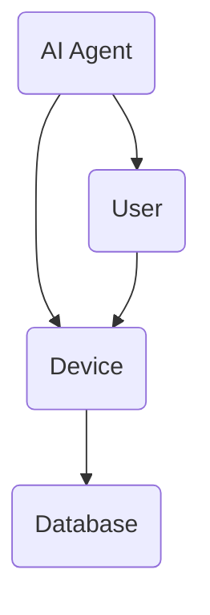
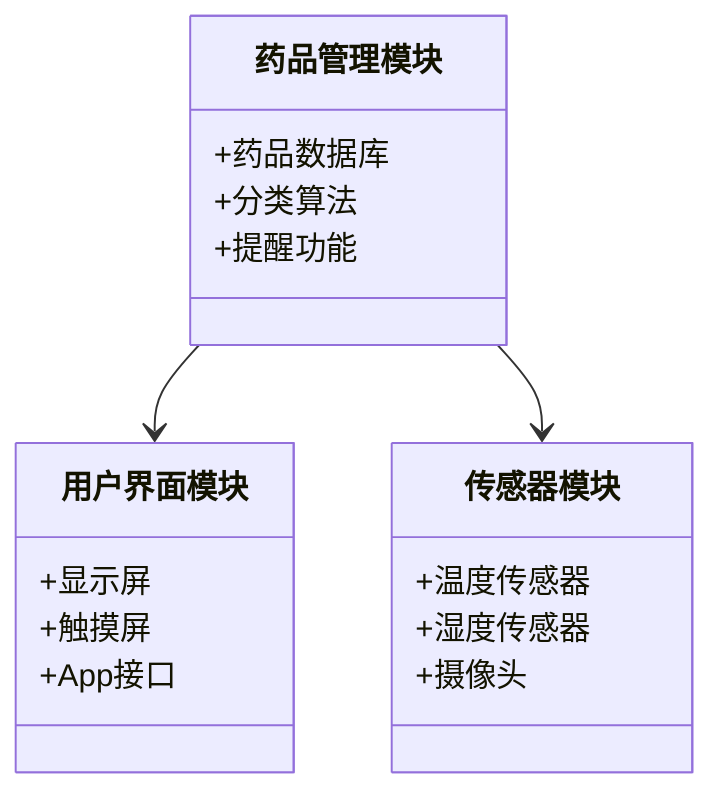
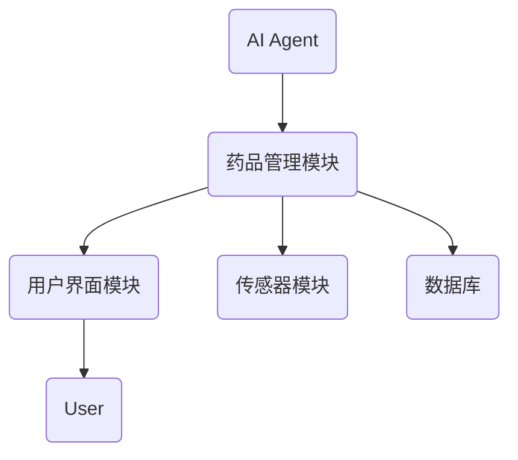
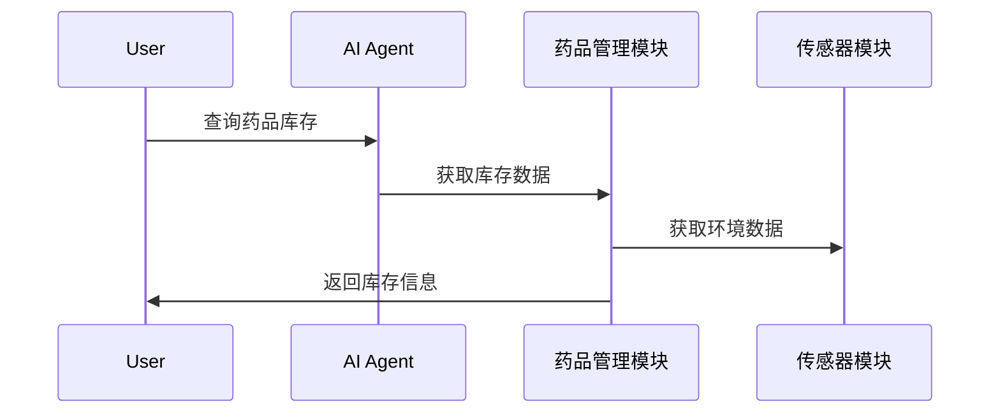

                 


# 智能浴室镜柜：AI Agent的药品管理

## 关键词：
智能浴室镜柜, AI Agent, 药品管理, 物联网, 人工智能, 系统架构, 项目实战

## 摘要：
本文详细探讨了智能浴室镜柜中AI Agent在药品管理中的应用。从背景介绍到系统架构设计，从算法实现到项目实战，系统性地分析了如何利用人工智能技术优化家庭药品管理。文章通过具体案例和代码实现，展示了AI Agent在智能设备中的实际应用，并提出了系统的优化与扩展方案。

---

# 第一部分: 背景介绍

# 第1章: 背景与问题分析

## 1.1 问题背景
### 1.1.1 智能浴室镜柜的出现背景
随着智能家居的普及，浴室镜柜逐渐从单一的收纳功能向智能化方向发展。现代家庭对健康管理和药品管理的需求日益增长，智能浴室镜柜成为家庭医疗管理的重要工具。

### 1.1.2 药品管理的痛点与挑战
传统药品管理存在以下问题：
- **药品过期**：用户容易忘记检查药品的有效期，导致药品浪费或使用过期药品。
- **管理混乱**：药品种类繁多，存储空间有限，导致药品查找困难。
- **缺乏智能提醒**：用户无法及时获取药品使用建议或管理提醒。

### 1.1.3 智能化管理的必要性
通过智能化管理，可以实时监控药品状态，提供智能提醒，优化药品使用效率，确保家庭成员的健康安全。

## 1.2 问题描述
### 1.2.1 药品管理的现状分析
当前，市场上缺乏智能化的药品管理工具，用户主要依靠手动记录或简单的电子提醒，存在效率低、易遗忘等问题。

### 1.2.2 智能浴室镜柜的定义与目标
智能浴室镜柜是一种结合人工智能技术的智能设备，旨在通过AI Agent实现药品的智能化管理，包括药品分类、库存管理、智能提醒等功能。

### 1.2.3 用户需求与期望
用户期望智能浴室镜柜能够：
- 自动识别药品信息并分类存储。
- 提供药品使用建议和过期提醒。
- 实现远程监控和管理。

## 1.3 问题解决
### 1.3.1 AI Agent的核心作用
AI Agent通过感知、决策和执行机制，实现对药品的智能化管理。

### 1.3.2 智能化药品管理的实现路径
1. 数据采集与处理：通过传感器和条码扫描识别药品信息。
2. 数据分析与分类：基于AI算法对药品进行分类和管理。
3. 智能提醒与交互：通过语音或App提醒用户药品使用情况。

### 1.3.3 技术与场景的结合
将AI技术与智能家居场景结合，提升用户体验和药品管理效率。

## 1.4 边界与外延
### 1.4.1 智能浴室镜柜的功能边界
- **核心功能**：药品分类、库存管理、智能提醒。
- **辅助功能**：天气预报、日历提醒、健康数据记录。

### 1.4.2 与其他智能设备的交互边界
- **智能家居**：与智能音箱、智能灯等设备联动。
- **医疗设备**：与智能手环、血压计等设备数据互通。

### 1.4.3 药品管理的扩展场景
- **远程管理**：通过手机App远程查看药品库存和状态。
- **健康管理**：结合用户的健康数据提供个性化用药建议。

## 1.5 核心概念与组成
### 1.5.1 AI Agent的定义与特征
- **定义**：AI Agent是一种智能主体，能够感知环境并采取行动以实现目标。
- **特征**：
  - 感知能力：通过传感器和摄像头获取环境信息。
  - 决策能力：基于数据进行分析和决策。
  - 执行能力：通过执行机构完成任务。

### 1.5.2 智能浴室镜柜的结构与功能
- **结构**：包含镜面、存储空间、传感器、摄像头、显示屏、扬声器、网络模块。
- **功能**：药品分类、库存管理、智能提醒、远程控制。

### 1.5.3 药品管理系统的组成要素
- **药品数据库**：存储药品信息，包括名称、类别、生产日期、过期日期。
- **AI算法**：用于药品分类、库存管理和智能提醒。
- **用户界面**：包括镜面显示屏和手机App。

---

# 第二部分: 核心概念与联系

# 第2章: AI Agent的基本原理

## 2.1 AI Agent的核心原理
### 2.1.1 感知机制
AI Agent通过传感器和摄像头感知环境信息，例如温度、湿度、药品位置等。

### 2.1.2 决策机制
基于感知到的信息，AI Agent利用算法进行分析和决策，例如判断药品是否过期。

### 2.1.3 执行机制
根据决策结果，AI Agent通过执行机构完成任务，例如发出提醒或调整存储位置。

## 2.2 AI Agent与物联网的结合
### 2.2.1 物联网的基本概念
物联网是指通过信息传感设备，按照约定的协议，把任何物品与互联网连接起来，进行信息交换和通信。

### 2.2.2 AI Agent在物联网中的角色
AI Agent作为智能主体，负责感知、分析和执行任务，是物联网系统的核心部分。

### 2.2.3 物联网与AI Agent的协同工作
1. **数据采集**：传感器采集环境数据。
2. **数据处理**：AI Agent分析数据并做出决策。
3. **数据反馈**：通过物联网设备执行决策。

## 2.3 AI Agent的实体关系图


---

# 第三部分: 算法原理讲解

# 第3章: 算法原理与实现

## 3.1 算法原理
### 3.1.1 数据采集与处理
通过传感器和条码扫描器采集药品信息，包括名称、生产日期、过期日期。

### 3.1.2 数据分析与分类
利用机器学习算法对药品进行分类，例如基于支持向量机（SVM）的分类算法。

### 3.1.3 智能提醒与预测
基于历史数据预测药品使用情况，例如使用时间序列分析预测药品消耗速度。

---

## 3.2 算法实现
### 3.2.1 药品分类算法
```python
# 示例：基于SVM的药品分类
from sklearn.svm import SVC
from sklearn.preprocessing import StandardScaler

# 假设X为训练数据，y为标签
scaler = StandardScaler()
X_scaled = scaler.fit_transform(X)
model = SVC()
model.fit(X_scaled, y)
```

### 3.2.2 药品使用预测算法
```python
# 示例：基于时间序列的药品使用预测
import pandas as pd
from statsmodels.tsa.arima_model import ARIMA

# 假设data为时间序列数据
model = ARIMA(data, order=(1, 1, 1))
model_fit = model.fit()
```

### 3.2.3 算法优缺点对比
| 算法 | 优点 | 缺点 |
|------|------|------|
| SVM  | 高精度，适合小样本数据 | 计算复杂度高 |
| ARIMA | 能够预测时间序列数据 | 对异常值敏感 |

---

## 3.3 算法优化
### 3.3.1 超参数调优
通过网格搜索（Grid Search）优化模型参数，例如调整SVM的核函数和惩罚系数。

### 3.3.2 数据预处理
对数据进行归一化或标准化处理，提升模型训练效果。

---

# 第四部分: 系统分析与架构设计

# 第4章: 系统架构设计

## 4.1 项目介绍
智能浴室镜柜系统旨在通过AI Agent实现药品的智能化管理，提升用户体验。

## 4.2 系统功能设计
### 4.2.1 领域模型


### 4.2.2 系统架构


### 4.2.3 系统接口设计
- **硬件接口**：与传感器和显示屏的物理接口。
- **软件接口**：与手机App的API接口。

### 4.2.4 系统交互


---

# 第五部分: 项目实战

# 第5章: 项目实战

## 5.1 环境搭建
### 5.1.1 开发工具
- **编程语言**：Python
- **框架库**：TensorFlow、Scikit-learn
- **工具**：Jupyter Notebook、VS Code

### 5.1.2 硬件设备
- **传感器模块**：温度、湿度传感器
- **摄像头模块**：用于识别药品包装
- **显示屏模块**：LCD或OLED显示屏

## 5.2 系统核心实现
### 5.2.1 药品分类实现
```python
# 示例：使用随机森林进行药品分类
from sklearn.ensemble import RandomForestClassifier

# 假设X为训练数据，y为标签
model = RandomForestClassifier()
model.fit(X, y)
```

### 5.2.2 智能提醒实现
```python
# 示例：基于时间的提醒功能
import datetime

def schedule_check():
    current_time = datetime.datetime.now().time()
    # 根据当前时间判断是否需要提醒
    if current_time.hour == 8 or current_time.hour == 18:
        send_notification("检查药品库存")
```

### 5.2.3 系统功能实现
- **药品录入**：通过扫描条码录入药品信息。
- **药品分类**：基于AI算法自动分类。
- **智能提醒**：根据药品使用情况和用户习惯发送提醒。

## 5.3 项目小结
通过实际案例分析，展示了AI Agent在智能浴室镜柜中的应用，验证了系统的可行性和实用性。

---

# 第六部分: 优化与扩展

# 第6章: 优化与扩展

## 6.1 系统优化
### 6.1.1 性能优化
- 优化算法复杂度，减少计算时间。
- 采用分布式架构提升处理能力。

### 6.1.2 功能优化
- 增加语音交互功能，支持语音控制。
- 提供多语言支持，适应不同用户需求。

## 6.2 功能扩展
### 6.2.1 健康管理
结合用户的健康数据，提供个性化用药建议。

### 6.2.2 远程管理
通过手机App实现远程药品管理，支持多人共享。

## 6.3 未来趋势
随着AI技术的不断发展，智能浴室镜柜将具备更多功能，例如健康监测、医疗建议等，成为家庭医疗管理的核心设备。

---

# 第七部分: 最佳实践与小结

# 第7章: 最佳实践与小结

## 7.1 最佳实践
- **模块化设计**：确保系统结构清晰，便于维护和扩展。
- **数据安全**：加强数据加密和用户隐私保护。
- **用户体验**：注重界面设计和交互体验，提升用户满意度。

## 7.2 小结
本文详细探讨了智能浴室镜柜中AI Agent的药品管理应用，从背景分析到系统设计，从算法实现到项目实战，系统性地展示了如何利用人工智能技术优化家庭药品管理。通过实际案例和代码实现，验证了系统的可行性和实用性。

## 7.3 注意事项
- 确保系统稳定性，避免因故障导致数据丢失。
- 定期更新算法模型，提升分类准确率。
- 提供完善的用户手册和售后服务。

## 7.4 拓展阅读
建议读者进一步阅读相关技术文档，了解AI Agent在其他领域的应用，例如智能家居、医疗健康等。

---

# 结语

智能浴室镜柜作为家庭医疗管理的重要工具，通过AI Agent实现了药品的智能化管理，提升了用户体验和健康安全。未来，随着技术的不断进步，智能浴室镜柜将具备更多功能，为用户带来更多便利。

