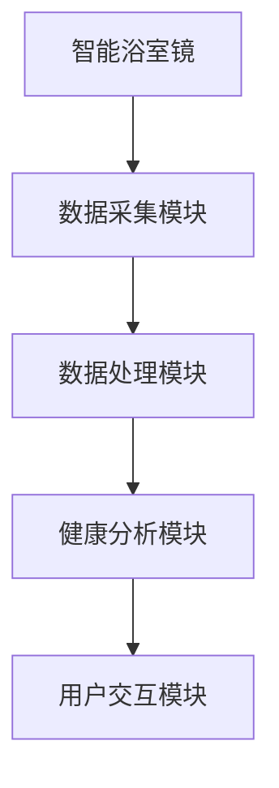

                 


# 智能浴室镜：AI Agent的健康状态分析

---

## 关键词：
智能浴室镜、AI Agent、健康监测、图像识别、机器学习、系统架构

---

## 摘要：
智能浴室镜作为一种结合AI技术的智能家居设备，通过AI Agent实现对人体健康状态的实时监测与分析。本文从智能浴室镜的发展背景出发，详细探讨了AI Agent的核心原理、健康状态分析的算法实现、系统架构设计以及项目实战案例，最后总结了智能浴室镜在健康监测领域的应用前景和未来发展方向。

---

## 第一部分：背景介绍

### 第1章：智能浴室镜的发展与应用

#### 1.1 智能浴室镜的起源与发展
- **智能浴室镜的起源**：智能浴室镜的概念最早可以追溯到智能家居的概念提出，随着科技的发展，浴室镜逐渐从单纯的反射工具演变为集健康监测、信息交互于一体的智能设备。
- **智能家居的兴起**：智能家居的普及为智能浴室镜的发展提供了技术基础，用户可以通过智能设备实现对家中设备的远程控制和数据监测。
- **智能镜子的演变**：从最初的电子镜到现在的智能浴室镜，技术的进步使得镜子的功能从简单的显示扩展到健康监测、环境监测等多个方面。

#### 1.2 AI Agent的基本概念
- **AI Agent的定义**：AI Agent（人工智能代理）是一种能够感知环境并采取行动以实现目标的智能实体，广泛应用于自动驾驶、智能助手等领域。
- **AI Agent的核心功能**：包括数据采集、信息处理、决策制定和用户交互。
- **智能浴室镜中的AI Agent**：通过摄像头、传感器等硬件设备采集用户数据，利用AI算法分析用户的健康状态，并通过屏幕显示结果或发送至手机APP。

#### 1.3 健康状态分析的意义
- **健康监测的重要性**：通过实时监测用户的健康数据，可以在早期发现健康问题，预防疾病的发生。
- **智能浴室镜的优势**：相比传统的健康监测设备，智能浴室镜具有使用方便、集成度高、数据实时性强等优点。
- **隐私与数据安全**：智能浴室镜涉及用户的敏感数据，如何保障数据的安全性和隐私性是设计中的重要问题。

---

## 第二部分：核心概念与联系

### 第2章：AI Agent的原理与实现

#### 2.1 AI Agent的核心原理
- **数据采集与处理**：通过摄像头、心率传感器等硬件设备采集用户的面部图像、体温、心率等数据，并进行预处理。
- **图像识别与分析**：利用图像处理技术对采集到的面部图像进行分析，提取特征点，识别用户的健康状态。
- **健康指标的计算与反馈**：基于机器学习模型对健康指标进行预测，并通过屏幕或手机APP向用户反馈结果。

#### 2.2 AI Agent与智能浴室镜的结合
- **硬件设备的集成**：智能浴室镜通常集成摄像头、心率传感器、温度传感器等硬件设备，用于数据采集。
- **软件算法的实现**：通过AI算法对采集到的数据进行处理，实现健康状态的分析与预测。
- **用户交互的设计**：设计友好的用户界面，确保用户能够方便地使用智能浴室镜，并通过语音或触控等方式进行交互。

#### 2.3 健康状态分析的数学模型
- **数据预处理与特征提取**：对采集到的数据进行归一化处理，提取关键特征，如面部颜色、纹理、心率变化等。
- **机器学习模型的选择**：选择适合的机器学习模型，如支持向量机（SVM）、随机森林（Random Forest）或深度学习模型（如CNN）。
- **模型训练与优化**：通过大量数据训练模型，调整模型参数，提高预测准确率。

---

## 第三部分：算法原理与实现

### 第3章：图像识别与健康状态分析

#### 3.1 图像处理技术
- **图像采集与预处理**：通过摄像头采集用户的面部图像，并进行噪声消除、对比度增强等预处理操作。
- **图像分割与特征提取**：将图像分割为感兴趣区域（如面部），提取纹理、颜色等特征。
- **图像识别算法**：利用卷积神经网络（CNN）对图像进行分类，识别用户的健康状态，如是否疲劳、是否有皮肤问题等。

#### 3.2 机器学习模型的实现
- **模型选择与训练**：选择适合的机器学习模型，使用健康数据进行训练，优化模型参数。
- **模型评估与优化**：通过交叉验证等方法评估模型性能，调整模型结构以提高预测准确率。
- **健康指标的预测**：基于训练好的模型，对用户实时数据进行预测，输出健康状态结果。

#### 3.3 健康状态分析的数学模型
- **面部特征提取模型**：利用主成分分析（PCA）提取面部特征，构建用户健康状态的特征向量。
- **健康预测模型**：基于支持向量回归（SVR）或随机森林模型，对健康指标进行回归预测。

---

## 第四部分：系统架构与设计

### 第4章：系统架构设计

#### 4.1 系统功能设计
- **数据采集模块**：负责采集用户的面部图像、心率、体温等数据。
- **数据处理模块**：对采集到的数据进行预处理和特征提取。
- **健康分析模块**：利用机器学习模型对健康指标进行预测和分析。
- **用户交互模块**：通过屏幕或手机APP向用户显示健康状态结果。

#### 4.2 系统架构图



#### 4.3 接口设计与交互流程
- **数据接口**：智能浴室镜通过蓝牙或Wi-Fi与手机APP进行数据通信。
- **用户交互流程**：用户站在镜子前，系统采集数据并进行分析，结果显示在屏幕上或发送至手机APP。

---

## 第五部分：项目实战

### 第5章：项目实现与案例分析

#### 5.1 环境搭建
- **开发环境**：安装Python、TensorFlow、OpenCV等开发工具。
- **硬件设备**：配置摄像头、心率传感器等硬件设备。

#### 5.2 核心代码实现

```python
import cv2
import numpy as np
from sklearn.svm import SVC

# 数据预处理
def preprocess_image(image):
    # 转换为灰度图
    gray = cv2.cvtColor(image, cv2.COLOR_BGR2GRAY)
    # 调整对比度和亮度
    contrast = 1.5
    brightness = 50
    image_enhanced = cv2.addWeighted(gray, contrast, gray, 0, brightness)
    return image_enhanced

# 特征提取
def extract_features(image):
    # 使用HOG特征提取
    hog = cv2.HOGDescriptor()
    features = hog.compute(image)
    return features.flatten()

# 训练模型
def train_model(X, y):
    model = SVC()
    model.fit(X, y)
    return model

# 预测健康状态
def predict_health(model, features):
    return model.predict(features)
```

#### 5.3 案例分析
- **案例一**：用户A使用智能浴室镜测量心率，系统通过摄像头捕捉面部图像，结合心率传感器数据，预测用户的心率并显示结果。
- **案例二**：用户B通过镜子检测皮肤状态，系统分析面部图像，识别出皮肤问题并给出护肤建议。

---

## 第六部分：总结与展望

### 第6章：总结与未来发展方向

#### 6.1 总结
智能浴室镜通过AI Agent实现了对人体健康状态的实时监测与分析，结合先进的图像处理技术和机器学习算法，为用户提供便捷、精准的健康监测服务。

#### 6.2 未来发展方向
- **多模态数据融合**：结合更多的生理数据，如心率、体温、血氧等，提高健康监测的准确性。
- **个性化健康建议**：基于用户的历史数据，提供个性化的健康建议和生活方式优化方案。
- **隐私与数据安全**：加强数据加密和隐私保护技术，确保用户数据的安全性。

#### 6.3 最佳实践 Tips
- 在开发智能浴室镜时，需注意硬件设备的精度和稳定性，确保数据采集的准确性。
- 在算法设计中，选择适合的数据处理方法和机器学习模型，优化模型性能。
- 在系统架构设计中，注重模块化和可扩展性，方便后续功能的添加和优化。

---

## 参考文献
1. 《人工智能导论》
2. 《机器学习实战》
3. 《深度学习入门：基于Python》
4. OpenCV官方文档

---

通过以上目录和内容的详细分析，您可以根据需要进一步扩展每个部分的内容，添加更多的技术细节和实际案例，以丰富文章的内容和深度。

