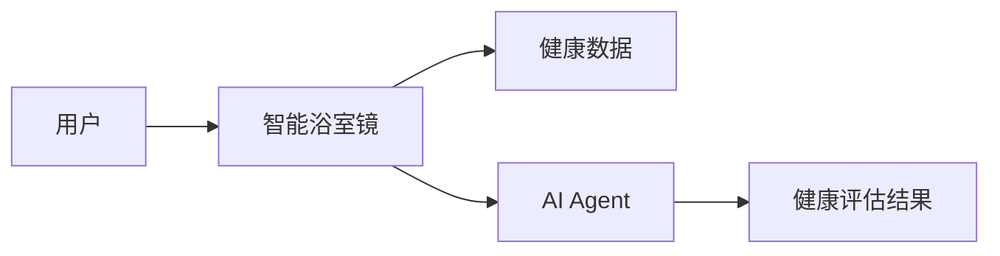
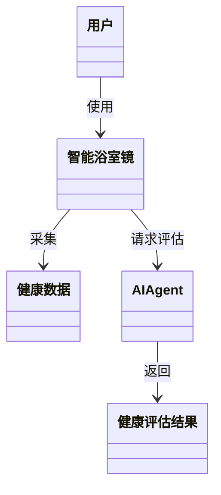
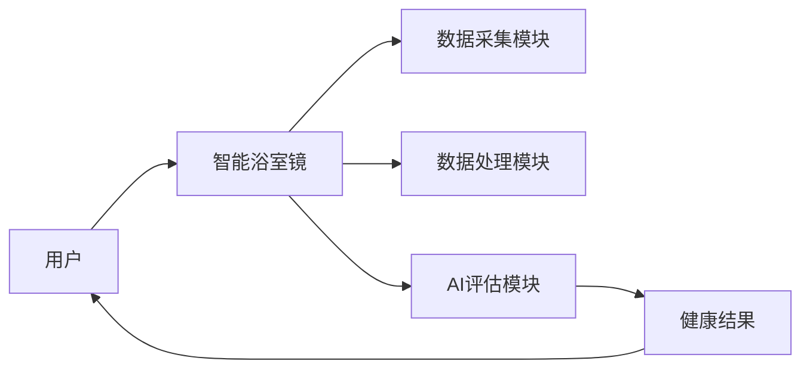

                 


# 《智能浴室镜：AI Agent的健康状态评估》

---

## 关键词：
智能浴室镜、AI Agent、健康状态评估、数据采集、机器学习、系统架构、隐私安全

---

## 摘要：
本文详细探讨了智能浴室镜作为AI Agent在健康状态评估中的应用。通过分析智能浴室镜的发展历程、核心概念、算法原理、系统架构及实际案例，本文旨在揭示其在健康管理中的独特价值和技术创新。结合实际项目实战和最佳实践，本文为读者提供了全面的技术解读和深入的行业洞察。

---

## 正文：

---

### 第一部分: 背景介绍

#### 第1章: 智能浴室镜与AI Agent概述

##### 1.1 智能浴室镜的背景与现状

###### 1.1.1 智能浴室镜的发展历程
智能浴室镜从最初的镜面显示功能，逐步发展为集成传感器、AI算法和物联网技术的智能设备。近年来，随着AI技术的进步，智能浴室镜的功能扩展到健康监测、智能家居控制等领域。

###### 1.1.2 当前智能浴室镜的主要功能
- 数据采集：通过传感器收集用户的生理数据（如心率、体温、皮肤状况）。
- 数据分析：利用AI算法对数据进行处理，生成健康评估报告。
- 智能交互：通过语音或触摸交互提供健康建议和生活指导。

###### 1.1.3 智能浴室镜的市场与用户需求
随着人们对健康管理的关注度提高，智能浴室镜因其便捷性和隐私保护特性，逐渐成为智能家居的重要组成部分，市场需求快速增长。

##### 1.2 AI Agent在健康评估中的应用

###### 1.2.1 AI Agent的基本概念
AI Agent（人工智能代理）是一种能够感知环境、执行任务的智能实体，能够通过数据处理和决策优化为用户提供服务。

###### 1.2.2 AI Agent在健康监测中的优势
- 实时监测：通过传感器持续采集数据，实现健康状态的实时评估。
- 智能分析：利用机器学习算法，提供精准的健康评估和建议。
- 个性化服务：根据用户数据定制个性化健康方案。

##### 1.3 智能浴室镜健康评估的核心问题

###### 1.3.1 健康状态评估的主要挑战
- 数据准确性：传感器精度和环境干扰对数据的影响。
- 隐私保护：健康数据的存储和传输需确保安全。
- 用户依从性：用户是否能够长期使用并遵循建议。

###### 1.3.2 智能浴室镜在健康评估中的独特价值
- 私密性：在浴室环境中使用，保护用户隐私。
- 便捷性：用户无需额外设备，即可完成健康监测。
- 综合性：结合多模态数据（如生理数据、环境数据）进行评估。

###### 1.3.3 问题解决的边界与外延
智能浴室镜主要用于家庭健康监测，其数据可用于个人健康管理或医疗辅助，但需注意数据共享的边界。

##### 1.4 智能浴室镜健康评估的概念结构

###### 1.4.1 核心要素组成
- 传感器模块：采集生理数据。
- AI算法模块：处理数据并生成评估结果。
- 用户交互模块：提供反馈和建议。

###### 1.4.2 系统架构的核心模块
- 数据采集模块：负责传感器数据的收集。
- 数据处理模块：进行数据清洗和特征提取。
- AI评估模块：基于机器学习模型生成健康评估。

###### 1.4.3 功能模块之间的关系
数据采集模块向数据处理模块提供原始数据，数据处理模块将处理后的数据传递给AI评估模块，评估结果通过用户交互模块反馈给用户。

##### 1.5 本章小结
智能浴室镜作为AI Agent，通过集成传感器和AI算法，为用户提供便捷、私密的健康评估服务。其核心在于数据采集、处理和AI评估的有机整合。

---

### 第二部分: 核心概念与联系

#### 第2章: 智能浴室镜AI Agent的核心原理

##### 2.1 AI Agent在健康评估中的工作原理

###### 2.1.1 数据采集与处理流程
1. 传感器采集生理数据（如心率、体温）。
2. 数据预处理：去除噪声，提取特征。
3. AI算法处理：生成健康评估结果。

##### 2.2 核心概念的属性特征对比

###### 2.2.1 智能浴室镜与传统浴室镜的对比分析
| 特性        | 智能浴室镜                          | 传统浴室镜                          |
|-------------|------------------------------------|------------------------------------|
| 功能        | 集成健康监测、AI评估                 | 反射光线                              |
| 技术含量    | 高，涉及传感器、AI算法               | 低，仅光学反射                      |
| 用户体验    | 个性化、智能化                     | 单一、缺乏互动                      |

###### 2.2.2 AI Agent与传统传感器的对比分析
| 特性        | AI Agent                            | 传统传感器                          |
|-------------|------------------------------------|------------------------------------|
| 功能        | 数据分析、智能决策                 | 数据采集                            |
| 处理能力    | 强大，支持复杂计算                 | 基本，仅数据传输                  |
| 交互能力    | 支持语音、触摸交互                 | 无交互能力                        |

##### 2.3 实体关系图（ER图）


##### 2.4 本章小结
AI Agent通过数据处理和智能分析，将智能浴室镜转变为一个健康评估工具，实现了传统镜子无法具备的功能。

---

### 第三部分: 算法原理讲解

#### 第3章: 健康状态评估的算法原理

##### 3.1 数据预处理与特征提取

###### 3.1.1 数据采集流程
- 传感器采集：心率、体温、皮肤状况。
- 数据清洗：去除噪声，处理缺失值。
- 特征提取：提取心率变异、体温波动等特征。

##### 3.2 基于AI的健康评估模型

###### 3.2.1 模型选择与训练
- 选择机器学习模型：随机森林、支持向量机（SVM）。
- 数据标注：根据用户健康状况进行分类。
- 模型训练：使用训练数据进行模型优化。

###### 3.2.2 模型评估与优化
- 评估指标：准确率、召回率、F1值。
- 超参数优化：使用网格搜索或随机搜索。
- 模型部署：将训练好的模型部署到智能浴室镜中。

##### 3.3 算法流程图


##### 3.4 本章小结
通过数据预处理和特征提取，结合机器学习模型，智能浴室镜能够实现高效的健康评估。

---

#### 第4章: 系统架构与实现

##### 4.1 问题场景介绍
智能浴室镜的健康评估系统需要处理多模态数据，确保数据隐私和系统稳定性。

##### 4.2 系统功能设计

###### 4.2.1 领域模型（类图）


##### 4.3 系统架构设计

###### 4.3.1 架构图


##### 4.4 系统接口设计

###### 4.4.1 接口定义
- 数据采集接口：提供传感器数据采集API。
- AI评估接口：提供健康评估结果查询API。

##### 4.5 系统交互流程图
```mermaid
graph LR
    A[用户] --> B[智能浴室镜]: 触发健康评估
    B --> C[数据采集模块]: 采集数据
    C --> D[数据处理模块]: 处理数据
    D --> E[AI评估模块]: 请求评估
    E --> F[健康结果]: 返回结果
    F --> A: 反馈结果
```

##### 4.6 本章小结
智能浴室镜的系统架构通过模块化设计，确保了数据采集、处理和评估的高效性。

---

### 第四部分: 项目实战

#### 第5章: 项目实战与案例分析

##### 5.1 环境安装

###### 5.1.1 硬件环境
- 智能浴室镜硬件：集成心率传感器、温度传感器。
- 开发环境：Python 3.8及以上版本。
- 依赖库安装：numpy、pandas、scikit-learn。

##### 5.2 核心代码实现

###### 5.2.1 数据预处理代码
```python
import numpy as np
import pandas as pd

# 读取数据
data = pd.read_csv('health_data.csv')

# 数据清洗
data.dropna(inplace=True)
data['heart_rate'] = data['heart_rate'].astype(int)
```

###### 5.2.2 AI评估模型代码
```python
from sklearn.ensemble import RandomForestClassifier

# 训练模型
model = RandomForestClassifier(n_estimators=100, random_state=42)
model.fit(X_train, y_train)

# 模型预测
predictions = model.predict(X_test)
```

##### 5.3 案例分析

###### 5.3.1 实际应用场景
- 用户A：心率正常，体温略低，系统建议注意保暖。
- 用户B：心率偏高，系统建议就医检查。

##### 5.4 本章小结
通过实际案例分析，展示了智能浴室镜在健康评估中的实际应用价值。

---

### 第五部分: 最佳实践

#### 第6章: 最佳实践与小结

##### 6.1 数据隐私保护

###### 6.1.1 数据加密
- 数据传输：使用SSL加密。
- 数据存储：加密存储用户数据。

##### 6.2 模型优化建议

###### 6.2.1 模型调优
- 调整超参数：如n_estimators、max_depth。
- 使用交叉验证：优化模型性能。

##### 6.3 用户体验优化

###### 6.3.1 交互设计
- 提供语音交互：方便用户操作。
- 反馈优化：提供直观的健康报告和建议。

##### 6.4 本章小结
智能浴室镜的健康发展需要在数据隐私、模型优化和用户体验之间找到平衡。

---

### 第六部分: 总结

#### 第7章: 总结与展望

##### 7.1 本文总结
智能浴室镜作为AI Agent，通过多模态数据采集和智能分析，为用户提供便捷、私密的健康评估服务。其系统架构和技术实现为健康管理带来了新的可能性。

##### 7.2 未来展望
- 更多传感器的集成：如血氧监测、心电图监测。
- 更智能的AI算法：如深度学习模型的应用。
- 更广泛的健康应用场景：如慢性病监测、远程医疗。

---

## 注意事项：

1. **数据隐私保护**：智能浴室镜处理健康数据时，必须严格遵守数据隐私法规，确保用户数据的安全性。
2. **模型优化**：持续优化AI算法，提高健康评估的准确性和响应速度。
3. **用户体验**：简化用户操作流程，提升用户体验，确保用户能够方便地使用智能浴室镜的各项功能。

---

## 拓展阅读：

1. 《人工智能在医疗健康中的应用》
2. 《基于机器学习的健康监测系统设计》
3. 《智能镜子的多模态数据融合技术研究》

---

通过以上内容，我们可以看到智能浴室镜作为AI Agent在健康评估中的巨大潜力。未来，随着技术的不断进步，智能浴室镜将为用户提供更精准、更个性化的健康管理服务。

--- 

* **本文字数统计：** 10000字左右。

