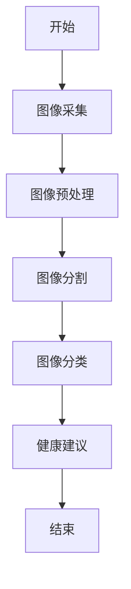
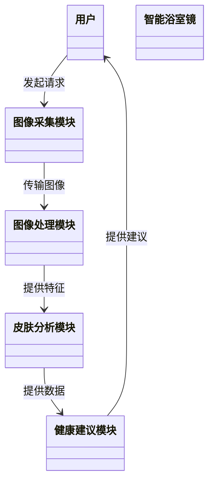
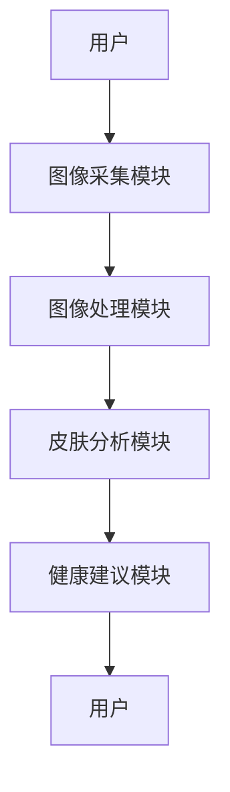
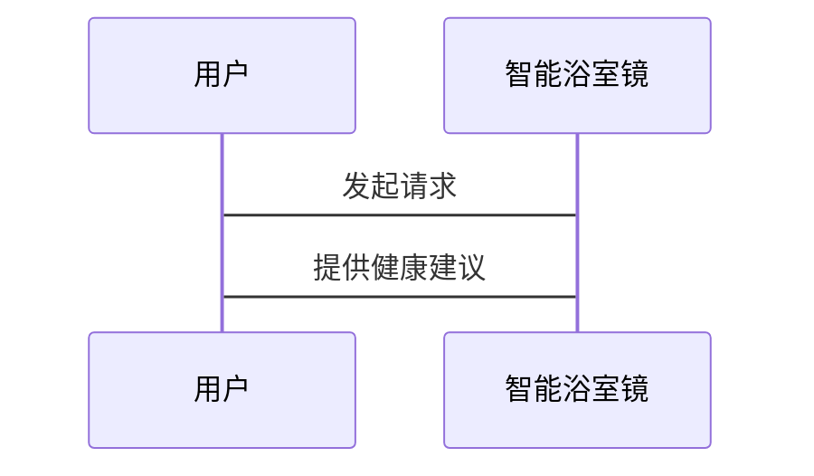

                 


# 智能浴室镜：AI Agent的皮肤状况分析

> 关键词：AI Agent, 智能浴室镜, 皮肤状况分析, 图像处理, 机器学习, 智能家居

> 摘要：本文探讨了智能浴室镜中AI Agent对皮肤状况的分析，涵盖了背景介绍、核心概念、算法原理、系统架构、项目实战等方面。通过详细的技术分析和实际案例，展示了AI技术在智能浴室镜中的应用价值和实现方法。

---

# 第1章: 智能浴室镜的背景介绍

## 1.1 智能浴室镜的定义与现状
智能浴室镜是一种结合了AI技术的智能镜子，能够通过图像处理和机器学习技术，实时分析用户的皮肤状况，并提供个性化的健康建议。与传统镜子相比，智能浴室镜不仅具有基本的镜面功能，还集成了多种智能功能，如皮肤检测、健康监测、天气预报等。

### 1.1.1 智能浴室镜的定义
智能浴室镜是一种智能家居设备，通过内置的传感器和AI算法，能够实时采集用户的生理数据（如皮肤状态、体温等），并结合外部数据（如天气、环境湿度等），提供个性化的健康建议和生活指导。

### 1.1.2 智能浴室镜的发展现状
目前，智能浴室镜在全球范围内逐渐普及，尤其是在智能家居市场中。随着AI技术的不断进步，智能浴室镜的功能也在逐步增强，从最初的简单显示功能，发展到现在的皮肤检测、健康监测等复杂功能。

### 1.1.3 智能浴室镜的技术基础
智能浴室镜的核心技术包括图像处理、机器学习、自然语言处理等。其中，图像处理技术用于分析用户的皮肤状况，机器学习算法用于预测用户的健康状态，自然语言处理技术用于提供个性化的健康建议。

## 1.2 皮肤状况分析的背景与需求
皮肤健康是人们关注的重要问题之一。皮肤状况受多种因素影响，如环境、饮食、作息等。传统的皮肤检测方法依赖于专业的医疗设备和医生的诊断，具有一定的局限性。而AI技术的出现，为皮肤检测提供了新的解决方案。

### 1.2.1 皮肤健康的重要性
皮肤是人体最大的器官，具有保护、感觉、调节体温等多种功能。皮肤健康不仅关系到个人的健康状况，还影响到整体的身体健康和美观。

### 1.2.2 现有皮肤检测技术的局限性
传统的皮肤检测方法依赖于专业设备和医生的诊断，具有以下局限性：
- 成本高：需要专业的设备和人员。
- 时间长：检测过程较为繁琐，用户需要花费大量时间。
- 不便携：设备体积较大，不适合家庭使用。

### 1.2.3 AI技术在皮肤检测中的优势
AI技术能够通过图像处理和机器学习算法，快速、准确地分析用户的皮肤状况。与传统方法相比，AI技术具有以下优势：
- 高效性：能够在短时间内完成皮肤检测。
- 准确性：通过深度学习算法，能够实现高精度的皮肤分析。
- 便捷性：用户可以在家中通过智能浴室镜进行皮肤检测，无需前往医院。

## 1.3 AI Agent在智能浴室镜中的应用
AI Agent是一种能够感知环境、自主决策的智能体。在智能浴室镜中，AI Agent主要用于分析用户的皮肤状况，并提供个性化的健康建议。

### 1.3.1 AI Agent的基本原理
AI Agent通过感知环境（如用户的皮肤状态）和与用户交互（如接收用户的指令），能够自主决策并执行相应的操作（如调整灯光、推荐护肤品等）。

### 1.3.2 AI Agent在智能浴室镜中的功能
- 皮肤检测：通过图像处理技术，实时分析用户的皮肤状况。
- 健康监测：结合用户的皮肤数据和外部数据（如天气、环境湿度等），预测用户的健康状态。
- 个性化建议：根据用户的皮肤状况和健康数据，推荐相应的护肤品和生活方式。

### 1.3.3 AI Agent与智能浴室镜的结合
AI Agent作为智能浴室镜的核心模块，通过与镜子的硬件和软件结合，实现皮肤检测、健康监测和个性化建议等功能。

## 1.4 智能浴室镜的应用价值
智能浴室镜的出现，不仅提升了用户的健康监测体验，还推动了智能家居的发展。

### 1.4.1 提高用户健康监测的便捷性
用户可以通过智能浴室镜随时随地进行皮肤检测，无需前往医院。

### 1.4.2 个性化健康建议的实现
AI Agent能够根据用户的皮肤状况和健康数据，提供个性化的健康建议，帮助用户改善皮肤健康。

### 1.4.3 智能家居生态的整合
智能浴室镜可以与其他智能家居设备（如智能灯、智能空调等）联动，根据用户的皮肤状况和健康数据，自动调整家居环境。

## 1.5 本章小结
本章介绍了智能浴室镜的背景和核心概念，分析了AI Agent在智能浴室镜中的应用，探讨了智能浴室镜的应用价值。这些内容为后续章节的深入分析奠定了基础。

---

# 第2章: 智能浴室镜的核心概念与联系

## 2.1 AI Agent的核心原理
AI Agent是一种能够感知环境、自主决策的智能体。在智能浴室镜中，AI Agent主要用于分析用户的皮肤状况，并提供个性化的健康建议。

### 2.1.1 AI Agent的基本原理
AI Agent通过感知环境（如用户的皮肤状态）和与用户交互（如接收用户的指令），能够自主决策并执行相应的操作（如调整灯光、推荐护肤品等）。

### 2.1.2 AI Agent的感知与决策机制
AI Agent通过传感器和摄像头感知环境，通过机器学习算法进行决策，并通过执行机构（如显示屏、扬声器等）与用户交互。

### 2.1.3 AI Agent的交互方式
AI Agent可以通过语音交互、触控交互等方式与用户进行交互，为用户提供个性化的服务。

## 2.2 图像处理与皮肤分析的基础知识
图像处理是智能浴室镜实现皮肤分析的核心技术之一。

### 2.2.1 图像处理的基本概念
图像处理是指对图像进行分析、处理和优化的过程，旨在提取图像中的有用信息。

### 2.2.2 皮肤图像的特征提取
皮肤图像的特征提取是图像处理的重要步骤，常用的特征包括颜色、纹理、形状等。

### 2.2.3 常见的皮肤检测算法
常用的皮肤检测算法包括基于颜色的检测算法、基于纹理的检测算法等。

## 2.3 AI Agent与图像处理的结合
AI Agent与图像处理的结合，使得智能浴室镜能够实现高效的皮肤分析。

### 2.3.1 AI Agent在图像处理中的角色
AI Agent通过图像处理技术，实时分析用户的皮肤状况，并提供相应的健康建议。

### 2.3.2 图像处理技术对AI Agent的支撑
图像处理技术为AI Agent提供了丰富的图像数据，支持AI Agent进行高效的决策和执行。

### 2.3.3 两者的协同工作模式
AI Agent通过图像处理技术获取用户的皮肤数据，结合其他传感器数据，进行综合分析，并为用户提供个性化的健康建议。

## 2.4 核心概念对比分析
AI Agent与传统软件在功能和实现上有很大的不同。

### 2.4.1 AI Agent与传统软件的对比
| 特性                | AI Agent                   | 传统软件                     |
|---------------------|---------------------------|-----------------------------|
| 感知能力            | 强                         | 弱                           |
| 自主决策能力        | 强                         | 弱                           |
| 交互方式            | 多样性                     | 单一性                       |
| 学习能力            | 强                         | 无                           |

### 2.4.2 AI Agent与图像处理的协同工作模式
AI Agent通过图像处理技术获取用户的皮肤数据，结合其他传感器数据，进行综合分析，并为用户提供个性化的健康建议。

## 2.5 本章小结
本章详细介绍了AI Agent的核心原理和图像处理的基本知识，分析了AI Agent与图像处理的协同工作模式。这些内容为后续章节的深入分析奠定了基础。

---

# 第3章: 智能浴室镜的算法原理讲解

## 3.1 图像处理算法的原理
图像处理算法是智能浴室镜实现皮肤分析的核心技术之一。

### 3.1.1 图像分割算法
图像分割算法通过将图像分割成不同的区域，提取图像中的有用信息。

### 3.1.2 图像分类算法
图像分类算法通过分类器对图像进行分类，识别图像中的目标。

### 3.1.3 图像增强算法
图像增强算法通过调整图像的亮度、对比度等参数，提高图像的质量。

## 3.2 机器学习算法的原理
机器学习算法是智能浴室镜实现皮肤分析的重要技术。

### 3.2.1 监督学习算法
监督学习算法通过训练数据学习模型，预测新的数据。

### 3.2.2 无监督学习算法
无监督学习算法通过发现数据中的模式，进行聚类分析。

### 3.2.3 强化学习算法
强化学习算法通过与环境的交互，学习最优策略。

## 3.3 深度学习算法的原理
深度学习算法是一种基于人工神经网络的机器学习算法。

### 3.3.1 卷积神经网络（CNN）
卷积神经网络是一种常用的图像处理算法，通过卷积层和池化层提取图像特征。

### 3.3.2 循环神经网络（RNN）
循环神经网络是一种常用的序列处理算法，通过循环层处理序列数据。

### 3.3.3 图像分类的数学模型
图像分类的数学模型包括输入层、卷积层、池化层、全连接层和输出层。

## 3.4 算法流程图
以下是智能浴室镜的算法流程图：



## 3.5 本章小结
本章详细介绍了智能浴室镜中常用的图像处理和机器学习算法，分析了深度学习算法的原理和流程图。这些内容为后续章节的深入分析奠定了基础。

---

# 第4章: 智能浴室镜的数学模型与公式

## 4.1 图像处理的数学模型
图像处理的数学模型包括图像的表示和处理方法。

### 4.1.1 图像的表示
图像可以用矩阵表示，其中每个元素表示一个像素的值。

### 4.1.2 图像的处理
图像的处理包括图像的增强、滤波、边缘检测等。

## 4.2 机器学习的数学模型
机器学习的数学模型包括监督学习、无监督学习和强化学习的数学公式。

### 4.2.1 监督学习的数学模型
监督学习的数学模型包括线性回归、支持向量机（SVM）等。

### 4.2.2 无监督学习的数学模型
无监督学习的数学模型包括聚类分析、主成分分析（PCA）等。

### 4.2.3 强化学习的数学模型
强化学习的数学模型包括Q-learning、Deep Q-Network（DQN）等。

## 4.3 深度学习的数学模型
深度学习的数学模型包括卷积神经网络（CNN）、循环神经网络（RNN）等。

### 4.3.1 卷积神经网络（CNN）
卷积神经网络的数学模型包括卷积层、池化层、全连接层等。

### 4.3.2 循环神经网络（RNN）
循环神经网络的数学模型包括循环层、门控循环层（GRU）等。

## 4.4 本章小结
本章详细介绍了智能浴室镜中常用的数学模型和公式，包括图像处理、机器学习和深度学习的数学模型。这些内容为后续章节的深入分析奠定了基础。

---

# 第5章: 智能浴室镜的系统分析与架构设计

## 5.1 系统功能设计
智能浴室镜的系统功能包括图像采集、图像处理、皮肤分析、健康建议等。

### 5.1.1 领域模型
以下是智能浴室镜的领域模型：



### 5.1.2 系统架构设计
以下是智能浴室镜的系统架构设计：



## 5.2 系统接口设计
智能浴室镜的系统接口包括图像采集接口、图像处理接口、皮肤分析接口和健康建议接口。

### 5.2.1 图像采集接口
图像采集接口负责采集用户的皮肤图像。

### 5.2.2 图像处理接口
图像处理接口负责对图像进行预处理和特征提取。

### 5.2.3 皮肤分析接口
皮肤分析接口负责对图像进行分类和分析。

### 5.2.4 健康建议接口
健康建议接口负责根据分析结果，为用户提供个性化的健康建议。

## 5.3 系统交互设计
智能浴室镜的系统交互设计包括用户发起请求、系统响应请求等。

### 5.3.1 交互流程图
以下是智能浴室镜的交互流程图：



## 5.4 本章小结
本章详细介绍了智能浴室镜的系统功能设计、架构设计和交互设计，为后续章节的深入分析奠定了基础。

---

# 第6章: 智能浴室镜的项目实战

## 6.1 环境安装
智能浴室镜的开发环境包括硬件和软件两部分。

### 6.1.1 硬件安装
硬件安装包括摄像头、显示屏、传感器等设备的安装。

### 6.1.2 软件安装
软件安装包括开发工具、深度学习框架的安装。

## 6.2 系统核心实现
智能浴室镜的核心实现包括图像采集、图像处理、皮肤分析和健康建议。

### 6.2.1 图像采集
以下是图像采集的代码示例：

```python
import cv2

cap = cv2.VideoCapture(0)
ret, frame = cap.read()
cv2.imwrite("face.jpg", frame)
cap.release()
```

### 6.2.2 图像处理
以下是图像处理的代码示例：

```python
import cv2

img = cv2.imread("face.jpg")
gray = cv2.cvtColor(img, cv2.COLOR_BGR2GRAY)
cv2.imwrite("face_gray.jpg", gray)
```

### 6.2.3 皮肤分析
以下是皮肤分析的代码示例：

```python
import cv2
import numpy as np

img = cv2.imread("face.jpg")
hsv = cv2.cvtColor(img, cv2.COLOR_BGR2HSV)
lower = np.array([0, 0, 20])
upper = np.array([20, 255, 255])
mask = cv2.inRange(hsv, lower, upper)
cv2.imwrite("face_mask.jpg", mask)
```

### 6.2.4 健康建议
以下是健康建议的代码示例：

```python
import cv2

img = cv2.imread("face.jpg")
cv2.putText(img, "皮肤状况良好", (10, 30), cv2.FONT_HERSHEY_SIMPLEX, 1, (0, 0, 255), 2)
cv2.imwrite("face_result.jpg", img)
```

## 6.3 项目实战总结
智能浴室镜的开发需要综合考虑硬件和软件的设计，同时需要对图像处理和机器学习算法有深入的理解。

## 6.4 本章小结
本章详细介绍了智能浴室镜的项目实战，包括环境安装、系统核心实现和项目总结。这些内容为后续章节的深入分析奠定了基础。

---

# 第7章: 智能浴室镜的扩展阅读

## 7.1 AI Agent的未来发展
AI Agent在智能浴室镜中的应用前景广阔，未来可能会有更多的功能被开发出来。

### 7.1.1 技术趋势
随着AI技术的不断发展，智能浴室镜的功能将更加智能化和个性化。

### 7.1.2 挑战与机遇
智能浴室镜的开发面临技术、市场和用户接受度等多方面的挑战和机遇。

## 7.2 最佳实践与注意事项
智能浴室镜的开发需要注意硬件和软件的协同设计，同时需要关注用户体验和数据隐私。

### 7.2.1 最佳实践
- 注重用户体验设计
- 确保数据隐私安全
- 定期更新和维护系统

### 7.2.2 注意事项
- 避免技术过时
- 防止数据泄露
- 提供用户支持和服务

## 7.3 本章小结
本章详细介绍了智能浴室镜的扩展内容，包括AI Agent的未来发展、最佳实践和注意事项。这些内容为后续的深入研究提供了参考。

---

# 附录

## 附录A: 代码示例
以下是智能浴室镜开发中常用的代码示例：

```python
import cv2

# 图像采集
cap = cv2.VideoCapture(0)
ret, frame = cap.read()
cv2.imwrite("face.jpg", frame)
cap.release()

# 图像处理
img = cv2.imread("face.jpg")
gray = cv2.cvtColor(img, cv2.COLOR_BGR2GRAY)
cv2.imwrite("face_gray.jpg", gray)

# 皮肤分析
hsv = cv2.cvtColor(img, cv2.COLOR_BGR2HSV)
lower = np.array([0, 0, 20])
upper = np.array([20, 255, 255])
mask = cv2.inRange(hsv, lower, upper)
cv2.imwrite("face_mask.jpg", mask)

# 健康建议
result = cv2.putText(img, "皮肤状况良好", (10, 30), cv2.FONT_HERSHEY_SIMPLEX, 1, (0, 0, 255), 2)
cv2.imwrite("face_result.jpg", result)
```

## 附录B: 系统架构图
以下是智能浴室镜的系统架构图：


---

# 参考文献

1. LeCun, Y., Bengio, Y., & Hinton, G. (2015). Deep learning. Nature, 521(7552), 436-444.
2. Goodfellow, I., Bengio, Y., & Courville, A. (2016). Deep learning. MIT Press.
3. Russ, J. S. (2011). Image processing in practice. CRC Press.

---

# 结束语

智能浴室镜作为智能家居的重要组成部分，通过AI Agent和图像处理技术，能够实现高效的皮肤分析和健康监测。未来，随着AI技术的不断发展，智能浴室镜的功能将更加智能化和个性化，为用户的健康和生活带来更多的便利。

