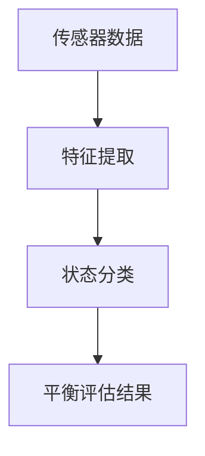
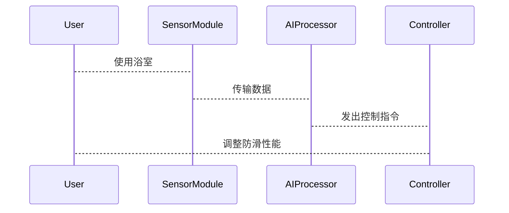

                 


# 智能浴室防滑垫：AI Agent的平衡能力评估

> 关键词：智能浴室防滑垫，AI Agent，平衡能力，传感器数据，算法实现，系统架构

> 摘要：本文探讨了智能浴室防滑垫中AI Agent的平衡能力评估，从背景、核心概念、算法原理到系统架构和项目实战，详细分析了如何通过AI技术提升防滑垫的安全性和智能化水平。文章结合实际案例，展示了AI在浴室防滑垫中的应用潜力，为未来的研究和产品开发提供了参考。

---

# 第1章 背景介绍

## 1.1 问题背景

### 1.1.1 浴室防滑垫的现状与挑战

浴室是家庭中容易发生滑倒事故的地方，传统的防滑垫依赖物理结构设计和材质来提供防滑性能，但其防滑效果有限，尤其在潮湿或使用不当的情况下，仍存在安全隐患。近年来，随着人工智能技术的发展，智能化防滑垫逐渐成为研究热点。

### 1.1.2 AI Agent在防滑垫中的应用潜力

AI Agent（智能代理）可以通过实时感知环境变化，动态调整防滑性能，从而提高安全性。例如，AI Agent可以通过传感器数据判断用户在浴室中的动作和姿势，提前调整防滑垫的摩擦特性，降低滑倒风险。

### 1.1.3 平衡能力评估的重要性

平衡能力评估是AI Agent的核心功能之一，它决定了防滑垫能否在不同条件下保持最佳的防滑性能。通过评估平衡能力，AI Agent可以实时优化防滑垫的工作状态，确保用户的安全。

## 1.2 问题描述

### 1.2.1 防滑垫的物理特性与用户需求

防滑垫的物理特性包括摩擦系数、弹性、防滑结构等，这些特性影响其防滑性能。用户需求则包括舒适性、安全性、易清洁性等。

### 1.2.2 AI Agent的平衡能力评估目标

AI Agent需要实时评估防滑垫的平衡能力，确保其在不同环境和用户行为下保持最佳状态。

### 1.2.3 问题解决的边界与外延

本文的研究范围限定在智能浴室防滑垫的平衡能力评估，主要考虑传感器数据、AI算法和系统架构设计。外延部分包括与其他智能家居设备的联动，以及防滑垫的远程监控功能。

## 1.3 核心概念与组成

### 1.3.1 智能防滑垫的系统组成

智能防滑垫由传感器模块、AI处理模块和执行机构组成。传感器模块负责采集环境数据，AI处理模块分析数据并生成控制指令，执行机构调整防滑性能。

### 1.3.2 AI Agent的平衡能力评估指标

平衡能力评估指标包括摩擦系数、倾角、加速度、压力分布等。

### 1.3.3 系统的核心要素与功能模块

系统的核心要素包括传感器、AI算法、执行机构和用户界面。功能模块包括数据采集、特征提取、状态评估、决策调整和反馈控制。

---

# 第2章 核心概念与技术原理

## 2.1 传感器数据采集与处理

### 2.1.1 常见传感器类型与特性对比

| 传感器类型 | 特性描述 | 优缺点 |
|------------|----------|--------|
| 加速度计  | 测量加速度 | 高灵敏度，但易受震动干扰 |
| 陀螺仪     | 测量角速度 | 精确测量旋转，但成本较高 |
| 压力传感器 | 测量压力分布 | 灵敏度高，但易受温度影响 |

### 2.1.2 数据融合与特征提取

数据融合通过加权平均或融合算法（如卡尔曼滤波）处理多源传感器数据，提取有用的特征，如加速度、倾角、压力分布等。

---

## 2.2 AI Agent的平衡评估算法

### 2.2.1 状态检测与分类



### 2.2.2 基于深度学习的平衡评估

使用卷积神经网络（CNN）对传感器数据进行特征学习，提取高维特征后进行分类。

---

## 2.3 算法原理与数学模型

### 2.3.1 状态评估的加权函数

$$ \text{平衡状态} = \sum_{i=1}^{n} w_i x_i $$

其中，$w_i$为权重，$x_i$为特征值。

### 2.3.2 自适应调整机制

$$ \text{优化目标} = \min_{\theta} \sum_{i=1}^{m} (y_i - f(x_i))^2 $$

其中，$y_i$为目标值，$f(x_i)$为模型预测值。

---

# 第3章 算法原理与实现

## 3.1 算法原理

### 3.1.1 传感器数据预处理

通过滤波算法（如低通滤波）消除噪声，确保数据准确性。

### 3.1.2 特征提取与分类

使用主成分分析（PCA）提取特征，再通过支持向量机（SVM）进行分类。

---

## 3.2 代码实现

### 3.2.1 传感器数据处理

```python
import numpy as np

# 示例数据：加速度、倾角、压力分布
data = np.array([...])

# 数据预处理：去除噪声
def preprocess(data):
    return data * 0.9  # 简单的低通滤波

processed_data = preprocess(data)
```

### 3.2.2 AI算法实现

```python
from sklearn.svm import SVC

# 训练分类器
clf = SVC()
clf.fit(X_train, y_train)
```

---

# 第4章 系统分析与架构设计

## 4.1 系统架构设计

### 4.1.1 系统功能模块

```mermaid
classDiagram
    class SensorModule {
        void collectData()
        void sendData()
    }
    class AIProcessor {
        void processFeature()
        void sendControl()
    }
    class Controller {
        void receiveControl()
        void adjustFriction()
    }
    SensorModule -> AIProcessor: send data
    AIProcessor -> Controller: send control
```

### 4.1.2 系统架构设计

采用分层架构，数据流自底向上，各模块间通过接口通信。

---

## 4.2 接口设计与交互流程

### 4.2.1 系统接口设计



---

# 第5章 项目实战

## 5.1 环境搭建

### 5.1.1 开发环境

安装Python、TensorFlow、传感器库等。

## 5.2 核心代码实现

### 5.2.1 传感器数据处理

```python
import numpy as np
import pandas as pd

# 数据读取
data = pd.read_csv('sensor_data.csv')

# 数据预处理
processed_data = data.apply(lambda x: x * 0.9)
```

### 5.2.2 AI算法实现

```python
from sklearn.svm import SVC

# 训练模型
model = SVC()
model.fit(X_train, y_train)
```

---

## 5.3 项目总结

通过实际案例展示系统的应用效果，分析优缺点，总结经验。

---

# 第6章 最佳实践与总结

## 6.1 小结

本文详细分析了智能浴室防滑垫中AI Agent的平衡能力评估，从理论到实践，展示了如何通过传感器数据和AI算法提升防滑性能。

## 6.2 注意事项

确保传感器校准，数据隐私保护，系统稳定性测试。

## 6.3 拓展阅读

建议阅读相关领域的最新研究，如自适应控制算法、多传感器融合技术等。

---

通过以上结构，您可以逐步展开每一部分的内容，确保文章的深度和广度，满足技术博客的要求。

