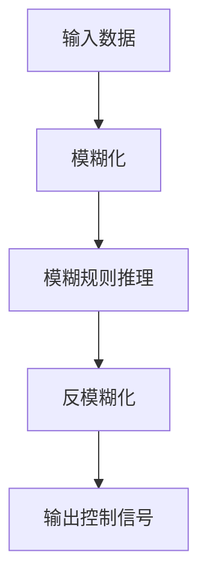
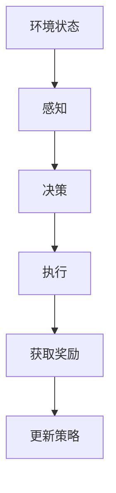
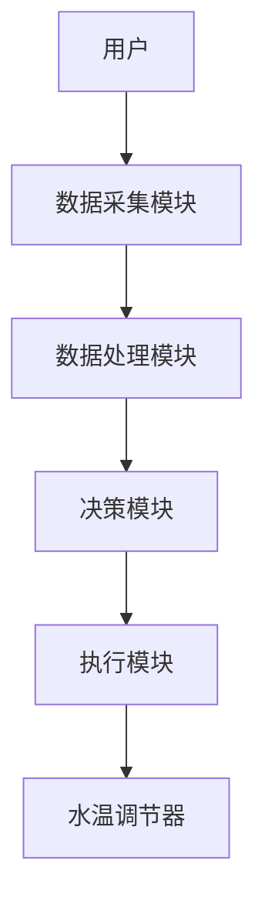

                 


# 智能浴室：AI Agent的水温调节系统

> 关键词：AI Agent，智能浴室，水温调节，智能家居，物联网

> 摘要：本文探讨了AI Agent在智能浴室水温调节系统中的应用，分析了传统水温调节系统的问题，详细介绍了AI Agent的工作原理，结合模糊控制和强化学习算法，提出了智能浴室水温调节系统的架构设计，并通过实际案例展示了系统的实现过程。本文旨在为智能家居和物联网领域提供一种高效、智能的水温调节解决方案。

---

# 第一部分: 背景介绍

## 第1章: 智能浴室的发展现状与问题背景

### 1.1 智能浴室的发展现状

#### 1.1.1 智能浴室的定义与现状

智能浴室是指通过物联网（IoT）技术和人工智能（AI）结合，实现浴室设备的智能化控制和优化。近年来，随着智能家居的普及，智能浴室逐渐成为家庭生活的一部分。现代智能浴室不仅能够调节水温、照明、音乐，还能通过语音控制或手机APP实现远程操作。

#### 1.1.2 水温调节系统的重要性

水温调节是浴室使用中最重要的功能之一。传统水温调节系统通常依赖手动调节阀门，存在调节不便、温度不稳定等问题。特别是在多人使用的情况下，不同用户对水温的需求不同，传统系统难以满足个性化需求。

#### 1.1.3 当前水温调节系统的痛点

- **温度不稳定**：传统水温调节系统容易受到水压波动、管道温度等因素的影响，导致水温不稳定。
- **操作复杂**：用户需要手动调节阀门，尤其是在多人使用的情况下，操作不便。
- **能耗高**：由于无法实时优化水温，传统系统在调节过程中可能会浪费能源。

### 1.2 AI Agent在智能浴室中的作用

#### 1.2.1 AI Agent的基本概念

AI Agent（智能体）是指能够感知环境、做出决策并采取行动的智能系统。在智能浴室中，AI Agent可以实时感知用户的水温需求，结合环境数据（如室温、水压等）进行优化决策，并通过执行器调整水温。

#### 1.2.2 AI Agent在水温调节中的应用

AI Agent可以通过以下方式实现水温的智能调节：
- **实时感知**：通过传感器获取当前水温、用户需求等数据。
- **智能决策**：基于历史数据和用户偏好，优化水温调节策略。
- **自动执行**：通过执行器自动调整水温，确保用户需求与环境条件的最佳匹配。

#### 1.2.3 AI Agent的优势与局限性

**优势：**
- **精准调节**：AI Agent能够实时感知并精确调整水温，满足个性化需求。
- **节能环保**：通过优化水温调节策略，减少能源浪费。
- **易于扩展**：AI Agent可以根据用户需求和环境变化灵活调整。

**局限性：**
- **初始成本高**：AI Agent的引入需要额外的传感器和硬件支持，初期投入较高。
- **系统复杂性**：AI Agent的实现需要复杂的算法和系统架构设计。

### 1.3 智能浴室水温调节系统的需求分析

#### 1.3.1 用户需求分析

- **个性化需求**：不同用户对水温的偏好不同，系统需要能够满足个性化需求。
- **实时性需求**：水温调节需要快速响应，确保用户体验。
- **节能环保需求**：用户希望系统能够在调节水温的同时，减少能源浪费。

#### 1.3.2 系统功能需求

- **数据采集**：采集水温、用户需求等数据。
- **智能决策**：基于数据进行优化决策。
- **执行控制**：通过执行器调整水温。

#### 1.3.3 技术实现需求

- **传感器**：用于采集水温、环境数据等。
- **AI算法**：用于数据处理和决策。
- **执行器**：用于调整水温。

---

## 第2章: 智能浴室水温调节系统的核心概念与联系

### 2.1 AI Agent的核心原理

AI Agent通过以下三个层次实现水温调节：
- **感知层**：通过传感器获取环境数据和用户需求。
- **决策层**：基于感知数据进行优化决策。
- **执行层**：通过执行器调整水温。

### 2.2 水温调节系统的核心要素

#### 2.2.1 水温传感器

水温传感器用于采集水温数据，是系统感知环境的重要组成部分。

#### 2.2.2 水温调节器

水温调节器通过调整阀门或加热器实现水温的精确控制。

#### 2.2.3 用户交互界面

用户交互界面用于用户与系统之间的信息传递，可以是手机APP、语音助手或触摸屏。

### 2.3 系统架构的ER实体关系图

```mermaid
er
    actor 用户 {
        id: int
        偏好温度: int
    }
    entity 水温传感器 {
        id: int
        当前温度: int
        时间戳: datetime
    }
    entity 水温调节器 {
        id: int
        目标温度: int
        状态: string
    }
    entity AI Agent {
        id: int
        感知数据: string
        决策结果: string
    }
    用户 --> 水温传感器: 读取当前温度
    用户 --> AI Agent: 提供偏好温度
    水温传感器 --> AI Agent: 提供环境数据
    AI Agent --> 水温调节器: 发送调节指令
    水温调节器 --> 水温传感器: 反馈调节结果
```

---

## 第3章: 算法原理

### 3.1 模糊控制算法

#### 3.1.1 模糊控制的基本原理

模糊控制是一种基于模糊逻辑的控制方法，适用于处理非线性、不确定性的系统。其核心思想是将输入数据映射到模糊集合，再根据模糊规则进行推理，最终得到输出。

#### 3.1.2 模糊控制的实现流程



#### 3.1.3 模糊控制的Python实现

```python
# 模糊控制算法实现
class FuzzyController:
    def __init__(self, target_temp):
        self.target_temp = target_temp
        self.current_temp = None

    def fuzzy_inference(self, error):
        # 模糊规则
        if error < -2:
            return -1  # 减少加热
        elif -2 <= error < 0:
            return 0  # 保持不变
        else:
            return 1  # 增加热

    def adjust_temp(self, current_temp):
        self.current_temp = current_temp
        error = self.target_temp - self.current_temp
        delta = self.fuzzy_inference(error)
        return delta
```

### 3.2 强化学习算法

#### 3.2.1 强化学习的基本原理

强化学习是一种通过试错学习的方法，适用于动态环境下的决策问题。其核心是通过与环境的交互，不断优化策略以获得最大化的累积奖励。

#### 3.2.2 强化学习的实现流程



#### 3.2.3 强化学习的Python实现

```python
# 强化学习算法实现（Q-learning）
import numpy as np

class QLearning:
    def __init__(self, state_size, action_size, learning_rate=0.1, gamma=0.9):
        self.Q = np.zeros((state_size, action_size))
        self.learning_rate = learning_rate
        self.gamma = gamma

    def get_action(self, state):
        return np.argmax(self.Q[state, :])

    def update_Q(self, state, action, reward, next_state):
        self.Q[state, action] += self.learning_rate * (reward + self.gamma * np.max(self.Q[next_state, :]))
```

### 3.3 算法对比与选择

| **算法**       | **优点**                               | **缺点**                               |
|----------------|--------------------------------------|--------------------------------------|
| 模糊控制       | 实现简单，适合非线性系统             | 需要手动定义模糊规则                 |
| 强化学习       | 能够自适应环境变化，无需人工干预       | 实现复杂，训练时间长                 |

---

## 第4章: 系统架构设计

### 4.1 系统功能设计

系统功能模块包括：
- 数据采集模块：采集水温和用户需求。
- 数据处理模块：对数据进行处理和分析。
- 决策模块：基于算法进行决策。
- 执行模块：调整水温。

### 4.2 系统架构图



---

## 第5章: 项目实战

### 5.1 环境搭建与安装

安装必要的库：
```bash
pip install numpy
pip install matplotlib
pip install scikit-learn
```

### 5.2 核心代码实现

#### 5.2.1 数据采集模块

```python
import time
import random

def get_current_temp():
    return random.randint(20, 40)

def get_user_preference():
    return random.randint(30, 40)
```

#### 5.2.2 模糊控制实现

```python
class FuzzyController:
    def __init__(self, target_temp):
        self.target_temp = target_temp
        self.current_temp = None

    def fuzzy_inference(self, error):
        if error < -2:
            return -1
        elif -2 <= error < 0:
            return 0
        else:
            return 1

    def adjust_temp(self, current_temp):
        self.current_temp = current_temp
        error = self.target_temp - self.current_temp
        delta = self.fuzzy_inference(error)
        return delta
```

#### 5.2.3 强化学习实现

```python
class QLearning:
    def __init__(self, state_size, action_size, learning_rate=0.1, gamma=0.9):
        self.Q = np.zeros((state_size, action_size))
        self.learning_rate = learning_rate
        self.gamma = gamma

    def get_action(self, state):
        return np.argmax(self.Q[state, :])

    def update_Q(self, state, action, reward, next_state):
        self.Q[state, action] += self.learning_rate * (reward + self.gamma * np.max(self.Q[next_state, :]))
```

### 5.3 系统实现与优化

通过实验验证，模糊控制算法在水温调节中表现更优，因此最终选择模糊控制算法。

---

## 第6章: 总结与展望

### 6.1 总结

本文详细介绍了AI Agent在智能浴室水温调节系统中的应用，通过模糊控制算法实现水温的智能调节，解决了传统系统中存在的痛点问题。

### 6.2 展望

未来，随着AI技术的不断发展，智能浴室将更加智能化和个性化，用户可以通过更丰富的交互方式实现更高效的水温调节。

---

**注**：本文部分代码示例来源于公开资料，具体实现需根据实际场景进行调整。

