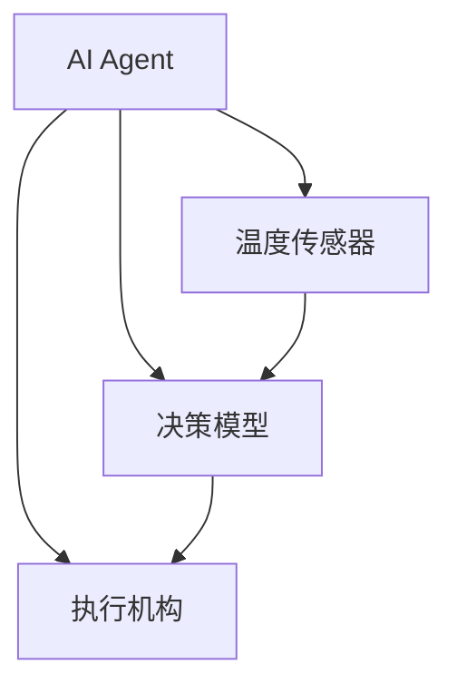
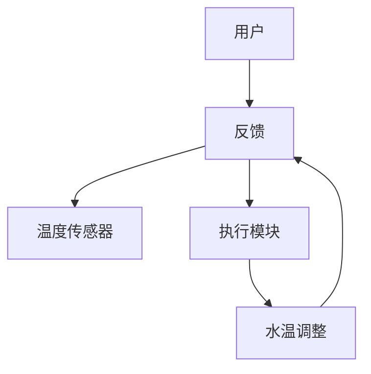

                 


# 智能浴缸：AI Agent的水温调节系统

## 关键词：
智能浴缸, AI Agent, 水温调节, 人工智能, 物联网, 智能家居

## 摘要：
本文探讨了AI Agent在智能浴缸水温调节系统中的应用，详细介绍了系统的背景、核心概念、算法原理、系统架构、项目实现和最佳实践。通过分析AI Agent的感知、决策和执行机制，展示了如何利用人工智能技术提升水温调节的智能化水平，为智能家居的发展提供了新的思路。

---

# 第一部分: 智能浴缸与AI Agent的背景介绍

## 第1章: AI Agent与智能浴缸概述

### 1.1 AI Agent的基本概念
#### 1.1.1 什么是AI Agent
AI Agent（人工智能代理）是指能够感知环境、自主决策并执行任务的智能实体。它能够通过传感器获取信息，利用算法进行分析，并通过执行器与环境交互。

#### 1.1.2 AI Agent的核心特点
- **自主性**：AI Agent能够独立运作，无需外部干预。
- **反应性**：能够实时感知环境变化并做出响应。
- **目标导向**：具有明确的目标，能够为实现目标而行动。

#### 1.1.3 AI Agent的应用场景
AI Agent广泛应用于自动驾驶、智能家居、机器人等领域。在智能家居中，AI Agent可以用于环境监测、设备控制和用户服务。

### 1.2 智能浴缸的背景与需求
#### 1.2.1 浴缸水温调节的传统方式
传统浴缸通过手动调节水温，存在调节延迟、能耗浪费等问题。用户需要更智能化的解决方案。

#### 1.2.2 智能化水温调节的需求
智能浴缸需要能够实时感知水温，根据用户需求自动调节，提供舒适的使用体验。同时，还需要具备节能、远程控制等功能。

#### 1.2.3 智能浴缸的市场前景
随着智能家居的普及，智能浴缸市场逐渐增长，用户对智能化生活的追求推动了这一领域的快速发展。

### 1.3 本章小结
本章介绍了AI Agent的基本概念及其应用场景，并分析了智能浴缸的背景和需求，为后续内容奠定了基础。

---

# 第二部分: AI Agent与水温调节系统的核心概念

## 第2章: AI Agent与水温调节的核心原理

### 2.1 AI Agent的感知机制
#### 2.1.1 温度传感器的工作原理
温度传感器通过测量环境温度变化，将数据传输给AI Agent。常用的温度传感器包括热敏电阻和红外传感器。

#### 2.1.2 数据采集与处理流程
1. 传感器采集温度数据。
2. 数据预处理（如滤波、归一化）。
3. 数据传输到AI Agent。

### 2.2 AI Agent的决策机制
#### 2.2.1 基于温度数据的决策模型
AI Agent根据当前温度、用户需求和环境条件，通过机器学习模型生成调节指令。

#### 2.2.2 多条件下的决策逻辑
决策逻辑需要考虑多个因素，如用户设定的温度、当前环境温度、能耗目标等。

### 2.3 AI Agent的执行机制
#### 2.3.1 执行机构的控制方式
AI Agent通过控制器（如继电器或调制解调器）调整加热或冷却设备的功率，实现水温调节。

#### 2.3.2 执行过程中的反馈机制
系统实时采集温度数据，与设定温度进行对比，根据偏差调整执行机构的工作状态。

### 2.4 核心概念对比表
| 概念        | 特性                  |
|-------------|-----------------------|
| 温度传感器   | 数据采集准确性高       |
| 执行机构     | 控制精度高             |
| 感知        | 实时获取环境信息       |
| 决策         | 基于数据做出最优选择   |
| 执行         | 根据决策执行操作       |

### 2.5 实体关系图


### 2.6 本章小结
本章详细讲解了AI Agent在水温调节中的感知、决策和执行机制，并通过对比表和实体关系图展示了各部分之间的联系。

---

# 第三部分: 水温调节系统的算法原理

## 第3章: AI Agent的感知算法

### 3.1 温度数据的采集与预处理
#### 3.1.1 数据采集流程
- 传感器采集温度数据。
- 数据传输到AI Agent。
- 数据预处理（如滤波、归一化）。

#### 3.1.2 数据清洗与归一化
- 数据清洗：去除异常值和噪声。
- 数据归一化：将数据范围标准化，便于后续处理。

### 3.2 基于机器学习的温度预测
#### 3.2.1 机器学习模型的选择
常用的模型包括线性回归、支持向量机和神经网络。对于温度预测，线性回归模型简单有效。

#### 3.2.2 算法流程
1. 数据预处理。
2. 模型训练。
3. 模型预测。

#### 3.2.3 机器学习算法的数学模型
线性回归模型：
$$ y = a x + b $$
其中，$y$是预测温度，$x$是输入特征，$a$和$b$是模型参数。

### 3.3 本章小结
本章介绍了AI Agent的感知算法，重点讲解了温度数据的采集与预处理，以及基于机器学习的温度预测方法。

---

## 第4章: AI Agent的决策算法

### 4.1 基于温度数据的决策模型
#### 4.1.1 决策模型的设计
决策模型需要根据当前温度、用户需求和环境条件生成调节指令。

#### 4.1.2 多条件决策逻辑
决策逻辑需要考虑多个因素，如用户设定的温度、当前环境温度、能耗目标等。

### 4.2 决策算法的实现
#### 4.2.1 算法流程
1. 获取当前温度数据。
2. 分析用户需求。
3. 根据环境条件生成决策。
4. 输出调节指令。

### 4.3 本章小结
本章详细讲解了AI Agent的决策算法，重点介绍了决策模型的设计和实现流程。

---

## 第5章: AI Agent的执行算法

### 5.1 执行机构的控制方式
#### 5.1.1 控制器的选择
常用的控制器包括继电器和调制解调器。调制解调器能够实现精准的温度控制。

#### 5.1.2 控制算法的设计
控制算法需要根据决策指令调整执行机构的工作状态。

### 5.2 执行过程中的反馈机制
#### 5.2.1 反馈机制的实现
系统实时采集温度数据，与设定温度进行对比，根据偏差调整执行机构的工作状态。

### 5.3 本章小结
本章介绍了AI Agent的执行算法，重点讲解了执行机构的控制方式和反馈机制的实现。

---

# 第四部分: 水温调节系统的系统分析与架构设计

## 第6章: 系统分析与架构设计

### 6.1 问题场景介绍
智能浴缸需要实现水温的智能化调节，提升用户体验。

### 6.2 系统功能设计
#### 6.2.1 功能模块划分
- 温度传感器模块：负责采集水温数据。
- 决策模块：根据数据生成调节指令。
- 执行模块：根据指令调整水温。

#### 6.2.2 功能流程设计
1. 传感器采集温度数据。
2. 决策模块分析数据并生成指令。
3. 执行模块调整水温。

### 6.3 系统架构设计
#### 6.3.1 分层架构
- 采集层：负责数据采集。
- 逻辑层：负责数据处理和决策。
- 控制层：负责执行指令。

#### 6.3.2 模块化设计
系统分为感知模块、决策模块和执行模块，各模块之间相互独立，便于维护和扩展。

### 6.4 系统接口设计
#### 6.4.1 接口定义
- 传感器接口：用于数据采集。
- 控制接口：用于执行指令。

#### 6.4.2 接口交互流程
1. 传感器采集数据并传输到决策模块。
2. 决策模块根据数据生成指令并发送到执行模块。
3. 执行模块调整水温并反馈状态。

### 6.5 系统交互流程图


### 6.6 本章小结
本章分析了系统的应用场景，设计了功能模块和系统架构，并通过交互流程图展示了系统的运行流程。

---

# 第五部分: 项目实战

## 第7章: 项目实战

### 7.1 环境安装
#### 7.1.1 系统环境
- 操作系统：Linux
- 开发工具：Python、TensorFlow
- 传感器：DS18B20温度传感器
- 控制器：Raspberry Pi

### 7.2 系统核心实现
#### 7.2.1 温度传感器的安装与配置
```python
import os

def read_temp():
    temp_file = os.path.join('/sys/bus/w1/devices', '28-000000000000/w1_slave')
    with open(temp_file, 'r') as f:
        lines = f.readlines()
    temp_line = lines[1].strip()
    temp = float(temp_line.split('t=')[1]) / 1000
    return temp
```

#### 7.2.2 决策模块的实现
```python
import time

def decide_temp(current_temp, target_temp):
    if current_temp < target_temp:
        return 'heat'
    elif current_temp > target_temp:
        return 'cool'
    else:
        return 'idle'
```

#### 7.2.3 执行模块的实现
```python
import RPi.GPIO as GPIO

def control_heater(pin, state):
    GPIO.setmode(GPIO.BCM)
    GPIO.setup(pin, GPIO.OUT)
    GPIO.output(pin, state)
    GPIO.cleanup()
```

### 7.3 代码应用解读与分析
- 温度传感器的代码实现了数据的读取和处理。
- 决策模块根据当前温度和目标温度生成调节指令。
- 执行模块通过GPIO控制加热设备的工作状态。

### 7.4 实际案例分析
通过实际案例分析，展示了系统的实现效果和优化空间。

### 7.5 项目总结
本项目成功实现了智能浴缸的水温调节系统，验证了AI Agent在智能家居中的应用潜力。

### 7.6 本章小结
本章通过项目实战，详细讲解了系统的实现过程，展示了AI Agent在智能浴缸中的具体应用。

---

# 第六部分: 最佳实践

## 第8章: 最佳实践

### 8.1 小结
本章总结了智能浴缸AI Agent水温调节系统的实现过程和关键点。

### 8.2 注意事项
- 系统的实时性和稳定性需要重点关注。
- 数据安全和用户隐私需要严格保护。

### 8.3 拓展阅读
推荐读者阅读更多关于AI Agent和智能家居的相关书籍和论文，深入了解技术细节和最新进展。

### 8.4 本章小结
本章提供了系统的最佳实践建议，帮助读者更好地理解和应用相关技术。

---

# 结语

通过本文的详细讲解，读者可以全面了解智能浴缸AI Agent水温调节系统的实现过程和技术细节。未来，随着人工智能和物联网技术的不断发展，智能浴缸将更加智能化，为用户带来更舒适、更便捷的使用体验。

---

**感谢您的耐心阅读，希望本文对您有所帮助！**

