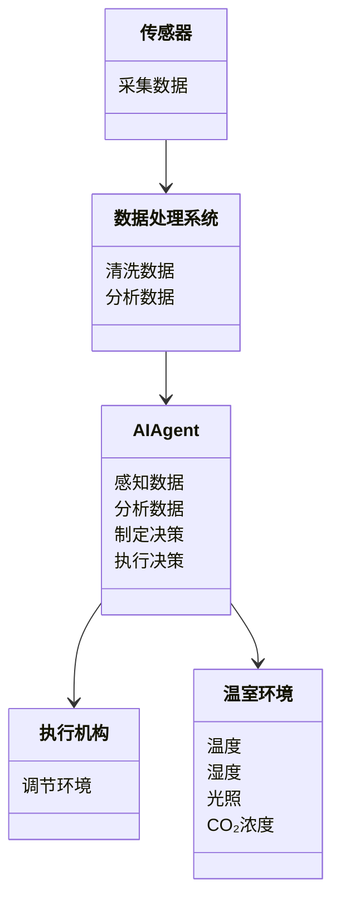

                 


# 第一部分: 智能温室与AI Agent的背景介绍

## 第1章: 智能温室概述

### 1.1 智能温室的定义与特点

#### 1.1.1 智能温室的定义
智能温室是一种利用物联网、人工智能和自动化技术实现温室环境智能化管理的现代农业设施。通过实时监测和调控温度、湿度、光照、CO₂浓度等环境参数，智能温室能够为作物提供最佳生长条件，从而提高产量和质量。

#### 1.1.2 智能温室的核心特点
- **智能化**：通过AI技术实现环境的自动监测和调节。
- **自动化**：无需人工干预，系统自动完成环境控制。
- **高效性**：实时数据采集和快速决策，提高环境调节效率。
- **可持续性**：通过优化环境控制，减少资源浪费，实现可持续农业。

#### 1.1.3 智能温室与传统温室的区别
| 特性         | 智能温室                     | 传统温室                     |
|--------------|------------------------------|------------------------------|
| 环境控制     | 自动化、智能化                | 手动或半自动化                |
| 数据采集     | 高频、精准                   | 低频、人工采集                |
| 决策方式     | 基于AI和大数据                | 依赖经验或简单规则            |
| 资源利用效率 | 高                           | 较低                          |

### 1.2 AI Agent的基本概念

#### 1.2.1 AI Agent的定义
AI Agent（人工智能代理）是指能够感知环境、做出决策并执行动作的智能实体。它能够根据环境信息自主选择和执行行动，以实现特定目标。

#### 1.2.2 AI Agent的核心功能
- **感知**：通过传感器或其他数据源获取环境信息。
- **推理**：利用机器学习算法分析数据，做出决策。
- **行动**：根据决策结果，通过执行机构（如阀门、风机等）调整环境参数。

#### 1.2.3 AI Agent在智能温室中的作用
AI Agent在智能温室中主要负责环境监测、数据分析和自动调节。它能够实时感知温室内的温度、湿度、光照等参数，分析这些数据，然后通过控制执行机构（如加热系统、喷雾系统）来调节环境，确保作物生长的最佳条件。

---

## 第2章: 智能温室环境调节的背景与问题

### 2.1 智能温室环境调节的背景

#### 2.1.1 现代农业的发展需求
随着全球人口的增长和可用耕地的减少，提高农业产量和质量成为当务之急。智能温室通过精确控制环境条件，能够显著提高作物的产量和品质，满足现代农业的发展需求。

#### 2.1.2 温室环境调节的重要性
温室内的环境参数（如温度、湿度、光照、CO₂浓度等）直接影响作物的生长。通过智能调节这些参数，可以优化作物生长条件，减少资源浪费，提高农业效率。

#### 2.1.3 AI技术在农业中的应用趋势
人工智能技术的快速发展为农业智能化提供了新的可能性。AI Agent在温室环境调节中的应用，是农业智能化的重要组成部分。

### 2.2 温室环境调节中的问题与挑战

#### 2.2.1 环境监测的复杂性
温室环境是一个多变量系统，温度、湿度、光照、CO₂浓度等参数相互影响。如何准确监测和分析这些参数是一个复杂的问题。

#### 2.2.2 自动调节的精确性要求
为了确保作物的健康成长，环境调节必须精确到一定程度。任何偏差都可能影响作物的生长，因此，AI Agent的决策算法必须高度准确。

#### 2.2.3 系统稳定性和安全性问题
智能温室是一个复杂的系统，涉及到多个子系统（如传感器、执行机构、数据处理系统等）的协调工作。系统的稳定性和安全性对作物的生长至关重要。

### 2.3 AI Agent在环境调节中的解决方案

#### 2.3.1 AI Agent的核心优势
- **智能感知**：能够准确感知环境参数。
- **自主决策**：基于感知数据，自主做出调节决策。
- **快速响应**：能够快速执行调节动作，确保环境稳定。

#### 2.3.2 AI Agent如何实现环境调节
AI Agent通过感知环境数据，利用机器学习算法分析数据，做出调节决策，并通过执行机构调整环境参数。例如，当温度过高时，AI Agent可以启动喷雾系统降低温度。

#### 2.3.3 AI Agent的未来发展潜力
随着AI技术的不断进步，AI Agent在智能温室中的应用将更加广泛。未来的AI Agent将更加智能化、自主化，能够适应更多的环境变化和作物需求。

---

## 第3章: AI Agent与智能温室的系统架构

### 3.1 AI Agent的核心原理

#### 3.1.1 感知层：环境数据的采集与分析
AI Agent通过传感器（如温度传感器、湿度传感器、光照传感器等）采集环境数据，并利用数据处理技术（如特征提取、数据清洗）对数据进行预处理。

#### 3.1.2 决策层：基于数据的智能决策
AI Agent利用机器学习算法（如回归算法、分类算法）对预处理后的数据进行分析，做出调节决策。例如，当温度低于设定值时，启动加热系统。

#### 3.1.3 执行层：调节设备的自动化控制
AI Agent通过执行机构（如加热器、喷雾器、风机等）调整环境参数，确保作物生长的最佳条件。

### 3.2 智能温室的系统组成

#### 3.2.1 环境监测系统
环境监测系统包括各种传感器，用于实时采集温室内的环境数据。

#### 3.2.2 数据分析与处理系统
数据分析与处理系统对采集到的环境数据进行分析和处理，为决策层提供支持。

#### 3.2.3 自动调节系统
自动调节系统包括各种执行机构，用于根据决策层的指令调整环境参数。

### 3.3 AI Agent与智能温室的实体关系图

```mermaid
er
actor: AI Agent
actor: 温室环境
actor: 调节设备
```

---

## 第4章: AI Agent的核心算法与数学模型

### 4.1 环境感知算法

#### 4.1.1 数据采集与预处理
AI Agent通过传感器采集环境数据，然后对数据进行预处理（如去噪、归一化）。

#### 4.1.2 基于机器学习的环境预测模型
AI Agent利用机器学习算法（如线性回归、支持向量机）建立环境预测模型，用于预测未来环境参数。

---

### 4.2 智能决策算法

#### 4.2.1 决策树算法
决策树算法是一种常用的机器学习算法，能够根据环境数据做出决策。例如，当温度低于某个阈值时，启动加热系统。

#### 4.2.2 线性回归算法
线性回归算法可以用于预测环境参数的变化趋势，为决策提供依据。

---

## 第5章: 系统分析与架构设计方案

### 5.1 问题场景介绍

#### 5.1.1 温室环境复杂多变
温室内的环境参数受到多种因素的影响，如光照、温度、湿度等，这些参数的变化可能会影响作物的生长。

#### 5.1.2 传统调节方式效率低下
传统的温室环境调节方式通常依赖人工操作，效率低下且容易出错。

#### 5.1.3 对作物生长影响显著
环境参数的波动可能会影响作物的生长周期、产量和质量。

### 5.2 项目介绍

#### 5.2.1 项目目标
本项目旨在开发一个基于AI Agent的智能温室环境调节系统，实现温室环境的智能化管理。

#### 5.2.2 项目范围
本项目涵盖环境监测、数据分析、智能决策和自动调节四个部分。

### 5.3 系统功能设计

#### 5.3.1 领域模型（Mermaid类图）


---

## 第6章: 项目实战

### 6.1 环境安装

#### 6.1.1 硬件设备安装
需要安装温度传感器、湿度传感器、光照传感器、CO₂传感器、加热器、喷雾器、风机等硬件设备。

#### 6.1.2 软件环境配置
需要安装Python、机器学习库（如scikit-learn）、数据处理库（如Pandas）、可视化库（如Matplotlib）等。

---

### 6.2 系统核心实现源代码

#### 6.2.1 数据采集与预处理代码
```python
import pandas as pd
from sklearn.preprocessing import StandardScaler

# 读取传感器数据
data = pd.read_csv('sensor_data.csv')

# 数据清洗
data.dropna(inplace=True)

# 数据归一化
scaler = StandardScaler()
scaled_data = scaler.fit_transform(data)
```

#### 6.2.2 AI Agent决策算法代码
```python
from sklearn.tree import DecisionTreeClassifier

# 训练决策树模型
model = DecisionTreeClassifier()
model.fit(X_train, y_train)

# 预测环境状态
y_pred = model.predict(X_test)
```

---

## 第7章: 最佳实践、小结、注意事项、拓展阅读

### 7.1 最佳实践
- **数据质量**：确保传感器数据的准确性和完整性。
- **算法选择**：根据具体需求选择合适的机器学习算法。
- **系统维护**：定期检查硬件设备和软件系统，确保系统稳定运行。

### 7.2 小结
本文详细介绍了AI Agent在智能温室环境调节系统中的应用，从系统架构设计到具体实现，全面展示了AI技术在农业中的巨大潜力。

### 7.3 注意事项
- 确保系统的安全性和稳定性。
- 定期更新和优化算法模型。
- 加强系统的容错和纠错能力。

### 7.4 拓展阅读
- 《机器学习在农业中的应用》
- 《智能温室系统的设计与实现》
- 《AI Agent在物联网中的应用研究》

---

通过以上步骤，我们可以逐步构建一个完整的智能温室AI Agent环境调节系统。从理论到实践，从算法到系统设计，本文为读者提供了一个全面的视角，帮助他们理解和掌握这一前沿技术。

