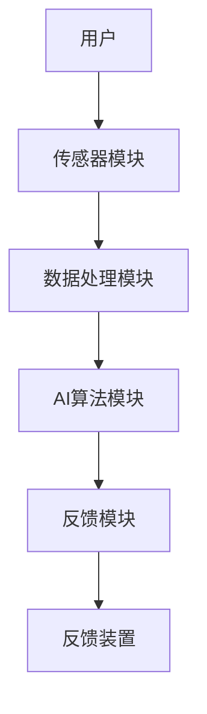
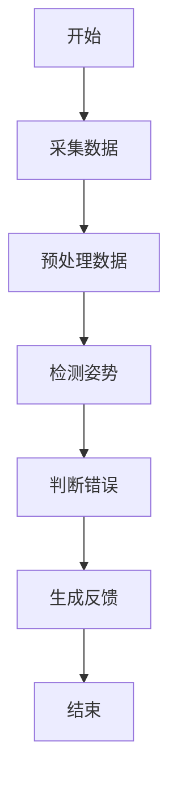
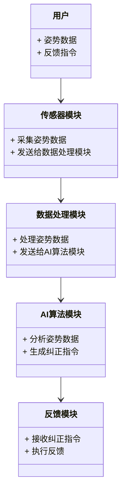
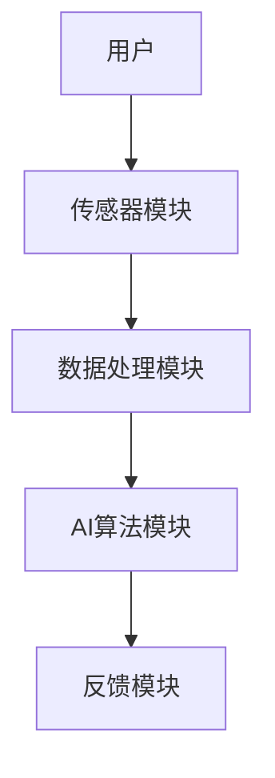
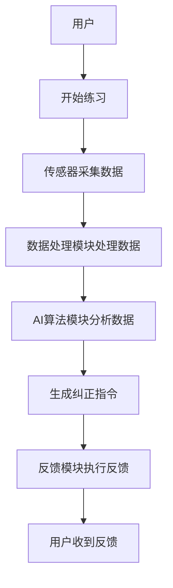

                 


# 智能瑜伽垫：AI Agent的实时姿势纠正系统

> 关键词：智能瑜伽垫，AI Agent，实时姿势纠正，传感器数据，机器学习，反馈机制

> 摘要：本文详细介绍了智能瑜伽垫的设计与实现，探讨了AI代理在实时姿势纠正中的应用。通过传感器数据采集、姿势检测算法、反馈机制的设计，展示了如何利用AI技术提升瑜伽练习的效果与安全性。文章还提供了系统的架构设计、算法实现和实际案例分析，为读者提供了全面的技术解读。

---

# 第一部分: 背景介绍

# 第1章: 智能瑜伽垫的背景与问题背景

## 1.1 问题背景

### 1.1.1 瑜伽姿势矫正的重要性
瑜伽是一项通过调节呼吸和姿势来改善身体柔韧性、平衡性和专注力的运动。然而，错误的姿势可能导致肌肉拉伤或其他身体损伤，尤其是对于初学者来说，缺乏专业指导容易引发这些问题。

### 1.1.2 现有瑜伽教学的局限性
传统的瑜伽教学主要依赖教练的现场指导，但教练无法实时纠正每个学员的姿势。此外，学员在家中练习时，往往缺乏即时反馈，容易养成错误的姿势习惯。

### 1.1.3 AI技术在健身领域的应用潜力
AI技术的快速发展为实时姿势纠正提供了新的可能性。通过传感器和机器学习算法，AI代理能够实时分析用户的姿势，并提供个性化的反馈。

## 1.2 问题描述

### 1.2.1 瑜伽练习中常见姿势错误
常见的错误姿势包括肩胛骨耸起、膝盖过度内弯、臀部抬高等，这些错误姿势可能导致运动损伤。

### 1.2.2 现有瑜伽垫的功能局限性
传统瑜伽垫仅提供支撑和缓冲作用，无法提供实时反馈，无法帮助用户纠正姿势。

### 1.2.3 用户对实时反馈的需求
用户需要一种能够实时监测和纠正姿势的工具，以确保练习的安全性和有效性。

## 1.3 问题解决

### 1.3.1 智能瑜伽垫的核心功能
智能瑜伽垫能够实时监测用户的姿势，并通过震动或声音提供纠正反馈。

### 1.3.2 AI Agent在姿势纠正中的作用
AI代理负责分析传感器数据，识别错误姿势，并生成纠正指令。

### 1.3.3 实时反馈的技术实现
通过传感器采集数据，AI算法分析数据，生成纠正反馈，并通过反馈装置通知用户。

## 1.4 边界与外延

### 1.4.1 智能瑜伽垫的功能边界
智能瑜伽垫主要专注于姿势纠正，不涉及其他功能如心率监测或运动计步。

### 1.4.2 与传统瑜伽垫的区别
传统瑜伽垫仅提供物理支撑，而智能瑜伽垫具备实时反馈功能。

### 1.4.3 系统的可扩展性与未来发展方向
未来可以将智能瑜伽垫的功能扩展到其他运动领域，如普拉提或力量训练。

## 1.5 核心概念

### 1.5.1 智能瑜伽垫的核心要素
- 传感器：采集用户的姿势数据。
- AI Agent：分析数据并生成纠正指令。
- 反馈装置：将纠正指令传递给用户。

### 1.5.2 AI Agent的定义与属性
AI Agent是一种能够感知环境、分析数据并采取行动的智能体，具备实时分析和决策能力。

### 1.5.3 系统的组成与功能模块
- 数据采集模块：负责采集用户的姿势数据。
- 数据处理模块：对采集的数据进行分析和处理。
- 反馈生成模块：根据分析结果生成纠正反馈。

---

# 第二部分: 核心概念与联系

# 第2章: AI Agent的核心原理

## 2.1 AI Agent的基本原理

### 2.1.1 传感器数据采集
智能瑜伽垫通过内置的传感器采集用户的姿势数据，包括压力分布、身体姿态等。

### 2.1.2 数据处理与分析
AI Agent对采集的数据进行预处理，去除噪声，并使用机器学习算法识别用户的姿势。

### 2.1.3 姿势纠正算法
AI Agent根据识别的姿势，判断是否存在错误，并生成纠正指令。

## 2.2 智能瑜伽垫的系统架构

### 2.2.1 系统组成模块
- 传感器模块：采集用户姿势数据。
- 数据处理模块：处理和分析数据。
- AI算法模块：识别姿势并生成纠正指令。
- 反馈模块：将纠正指令传递给用户。

### 2.2.2 各模块之间的关系
数据流从传感器模块流向数据处理模块，处理后的数据流向AI算法模块，生成的反馈指令流向反馈模块。

### 2.2.3 系统的实体关系图



---

# 第三部分: 算法原理讲解

# 第4章: 姿势检测与纠正算法

## 4.1 算法原理

### 4.1.1 基于AI的姿势检测流程
1. 传感器采集用户姿势数据。
2. 数据预处理，去除噪声。
3. 使用机器学习算法识别姿势。

### 4.1.2 姿势纠正算法的实现步骤
1. 分析识别的姿势，判断是否存在错误。
2. 根据错误类型生成纠正指令。
3. 将纠正指令传递给反馈装置。

### 4.1.3 算法的数学模型

姿势检测的数学模型如下：

$$
\text{姿势类别} = \arg\min_{i} \sum_{j=1}^{n} (x_j - c_{ij})^2
$$

其中，$x_j$ 是传感器数据，$c_{ij}$ 是第i个姿势类别的特征。

## 4.2 算法流程图



---

# 第5章: 算法实现与数学模型

## 5.1 算法实现

### 5.1.1 传感器数据采集代码

```python
import numpy as np

def collect_data():
    # 模拟传感器数据采集
    data = np.random.randn(100, 5)  # 生成100个样本，5个特征
    return data
```

### 5.1.2 姿势检测算法代码

```python
from sklearn.ensemble import RandomForestClassifier

def detect_posture(data):
    # 使用随机森林进行姿势分类
    model = RandomForestClassifier()
    model.fit(data, labels)
    return model.predict(new_data)
```

### 5.1.3 反馈生成算法代码

```python
def generate_feedback(posture, target_posture):
    # 根据错误姿势生成纠正反馈
    feedback = []
    for p in posture:
        if p != target_posture:
            feedback.append("调整你的肩膀，使其放松")
        else:
            feedback.append("继续保持")
    return feedback
```

## 5.2 数学模型与公式

姿势纠正的优化公式如下：

$$
\text{纠正力度} = \alpha \times (\text{错误程度}) + \beta \times (\text{用户反馈})
$$

其中，$\alpha$ 和 $\beta$ 是权重系数，$\text{错误程度}$ 是姿势错误的严重程度。

---

# 第四部分: 系统分析与架构设计

# 第6章: 系统分析

## 6.1 系统分析

### 6.1.1 问题场景介绍
用户在练习瑜伽时，可能会出现姿势错误，导致运动损伤。智能瑜伽垫通过实时监测和纠正，帮助用户保持正确的姿势。

### 6.1.2 项目介绍
智能瑜伽垫是一个结合传感器、AI算法和反馈装置的系统，能够实时监测用户的姿势并提供纠正反馈。

### 6.1.3 系统功能设计



---

# 第7章: 系统架构设计

## 7.1 系统架构设计

### 7.1.1 系统架构图



### 7.1.2 系统接口设计
- 用户与传感器模块的接口：用户在瑜伽垫上练习，传感器采集数据。
- 数据处理模块与AI算法模块的接口：数据处理模块将处理后的数据传递给AI算法模块。
- AI算法模块与反馈模块的接口：AI算法模块将纠正指令传递给反馈模块。

### 7.1.3 系统交互流程图



---

# 第五部分: 项目实战

# 第8章: 项目实战

## 8.1 项目环境搭建

### 8.1.1 环境安装
- 安装Python和必要的库，如NumPy和Scikit-learn。
- 安装传感器模块，如加速度计或压力传感器。

### 8.1.2 系统核心实现源代码

```python
import numpy as np
from sklearn.ensemble import RandomForestClassifier

def collect_data():
    # 模拟传感器数据采集
    data = np.random.randn(100, 5)  # 生成100个样本，5个特征
    return data

def detect_posture(data):
    # 使用随机森林进行姿势分类
    model = RandomForestClassifier()
    model.fit(data, labels)
    return model.predict(new_data)

def generate_feedback(posture, target_posture):
    # 根据错误姿势生成纠正反馈
    feedback = []
    for p in posture:
        if p != target_posture:
            feedback.append("调整你的肩膀，使其放松")
        else:
            feedback.append("继续保持")
    return feedback
```

## 8.2 代码应用解读与分析
- `collect_data()`函数用于采集传感器数据。
- `detect_posture()`函数使用随机森林算法进行姿势分类。
- `generate_feedback()`函数根据分类结果生成纠正反馈。

## 8.3 实际案例分析
假设用户在练习下犬式时，传感器检测到肩膀耸起，AI算法识别为错误姿势，并生成纠正反馈：“调整你的肩膀，使其放松”。

## 8.4 项目小结
通过实际案例分析，展示了智能瑜伽垫在实时姿势纠正中的应用效果。

---

# 第六部分: 最佳实践、小结、注意事项和拓展阅读

# 第9章: 最佳实践

## 9.1 最佳实践 tips
- 定期校准传感器，确保数据准确性。
- 用户应按照反馈逐步调整姿势，避免过度矫正。
- 系统应支持多种反馈方式，如震动、声音等。

## 9.2 小结
智能瑜伽垫通过AI代理实现了实时姿势纠正，有效提升了瑜伽练习的效果与安全性。

## 9.3 注意事项
- 用户在使用前应阅读说明书，确保正确操作。
- 系统应在稳定的网络环境下使用，以保证数据传输的实时性。

## 9.4 拓展阅读
- 《机器学习在健身领域的应用》
- 《基于AI的实时反馈系统设计》

---

# 结语

智能瑜伽垫作为AI技术在健身领域的一个创新应用，通过实时监测和纠正用户的姿势，为瑜伽练习者提供了更加安全和高效的方式。随着技术的不断发展，智能瑜伽垫的功能将更加智能化和个性化，为用户带来更好的体验。

---

