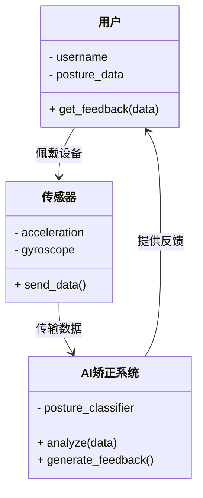
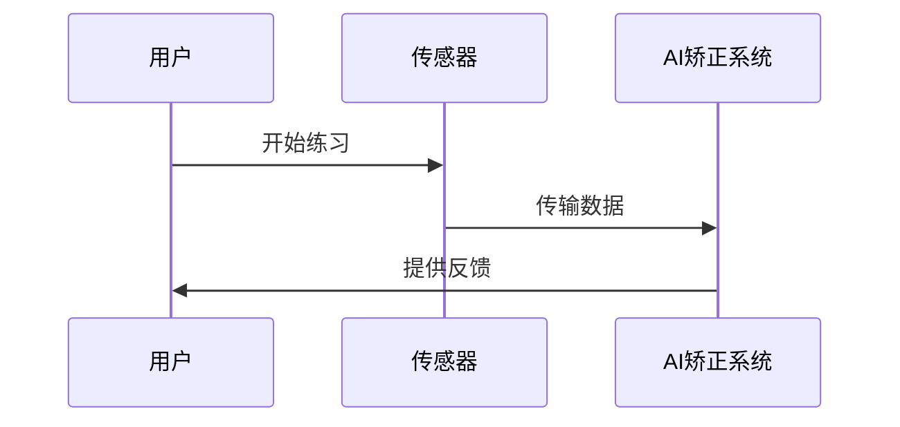

                 


# 智能瑜伽服：AI Agent的姿势矫正系统

> 关键词：智能瑜伽服、AI Agent、姿势矫正、传感器技术、算法原理、系统架构

> 摘要：本文深入探讨了智能瑜伽服结合AI Agent的姿势矫正系统，分析其技术原理、系统架构、算法实现及实际应用场景。通过详细的技术分析和案例解析，揭示了智能瑜伽服在现代瑜伽教学中的创新应用与未来发展方向。

---

# 第1章: 智能瑜伽服的背景与核心概念

## 1.1 问题背景
### 1.1.1 瑜伽姿势矫正的重要性
- 瑜伽姿势的正确性直接影响练习效果和安全性。
- 传统姿势矫正依赖教练经验，难以实时反馈。

### 1.1.2 传统瑜伽教学的局限性
- 教练资源有限，难以覆盖大量用户。
- 学习者难以自我监督，易养成错误姿势。

### 1.1.3 智能技术在瑜伽教学中的应用潜力
- 利用AI和传感器技术实时监测和反馈姿势。
- 提供个性化矫正方案，提升学习效率。

## 1.2 问题描述
### 1.2.1 瑜伽练习中常见姿势错误
- 弯曲角度不足或过度。
- 肩膀高低不一致。
- 脊柱扭转不当。

### 1.2.2 现有瑜伽矫正工具的不足
- 手动矫正依赖经验，效率低。
- 传统工具缺乏实时反馈。

### 1.2.3 智能瑜伽服的目标与应用场景
- 实时监测姿势，提供矫正反馈。
- 适用于个人练习、健身房和远程教学。

## 1.3 问题解决
### 1.3.1 AI Agent在姿势矫正中的作用
- 实时监测姿势偏差。
- 提供个性化矫正建议。
- 记录练习数据，分析进步。

### 1.3.2 智能瑜伽服的设计目标
- 舒适贴合身体，不影响运动。
- 高精度传感器，实时监测姿势。
- 易用的用户界面，提供即时反馈。

### 1.3.3 系统实现的关键技术
- 多传感器融合技术。
- 姿势识别算法。
- 人工智能反馈机制。

## 1.4 系统边界与外延
### 1.4.1 系统功能边界
- 仅限于姿势监测与反馈。
- 不涉及瑜伽教学视频生成。

### 1.4.2 系统与外部环境的交互
- 与手机或平板端的App交互。
- 支持蓝牙/WiFi连接。

### 1.4.3 系统的可扩展性与兼容性
- 支持多种瑜伽姿势库的扩展。
- 与不同品牌App的兼容性设计。

## 1.5 核心概念与组成
### 1.5.1 AI Agent的定义与功能
- 定义：AI Agent是智能瑜伽服的核心，负责数据处理和反馈。
- 功能：实时监测、分析姿势偏差、提供矫正建议。

### 1.5.2 智能瑜伽服的组成结构
- 传感器模块：采集身体姿态数据。
- 数据处理模块：分析数据并生成反馈。
- 用户界面：显示矫正建议和进度。

### 1.5.3 系统的核心要素与关系
- 传感器与AI Agent的关系：传感器采集数据，AI Agent分析数据并生成反馈。
- 用户与系统的交互：用户通过App查看反馈并调整姿势。

## 1.6 本章小结
- 本章介绍了智能瑜伽服的背景和核心概念，明确了其在姿势矫正中的作用和系统组成。

---

# 第2章: 智能瑜伽服的核心概念与联系

## 2.1 核心概念原理
### 2.1.1 AI Agent的感知与反馈机制
- 感知：通过传感器获取身体姿态数据。
- 反馈：基于分析结果，实时提供矫正建议。

### 2.1.2 姿势矫正的算法原理
- 数据采集：传感器获取身体关键点坐标。
- 特征提取：提取关键点的相对位置。
- 姿势识别：基于特征进行姿势分类。

### 2.1.3 智能瑜伽服的传感器技术
- 传感器类型：加速度计、陀螺仪、磁力计。
- 数据融合：多传感器数据融合提升精度。

## 2.2 核心概念对比
### 2.2.1 传统瑜伽服与智能瑜伽服的对比
| 特性                | 传统瑜伽服           | 智能瑜伽服           |
|---------------------|----------------------|----------------------|
| 数据采集            | 无传感器             | 集成传感器             |
| 反馈机制            | 依赖教练经验         | AI实时反馈           |
| 使用场景            | 仅限线下教学         | 适用于线上、线下       |

### 2.2.2 AI Agent与传统姿势矫正工具的对比
| 特性                | AI Agent             | 传统矫正工具         |
|---------------------|----------------------|----------------------|
| 数据处理能力        | 强大                 | 有限                 |
| 反馈速度            | 实时                 | 延时                 |
| 个性化支持          | 支持                 | 有限                 |

### 2.2.3 姿势矫正算法的优劣势分析
- 优势：高精度、实时反馈、个性化。
- 劣势：算法复杂度高，需要大量数据训练。

## 2.3 ER实体关系图
```mermaid
er
actor: 用户
agent: AI矫正系统
sensor: 传感器
database: 数据库
sequence {
    actor --> agent: 用户动作
    agent --> sensor: 采集数据
    sensor --> agent: 返回数据
    agent --> database: 存储数据
    agent --> actor: 提供反馈
}
```

## 2.4 本章小结
- 本章详细分析了智能瑜伽服的核心概念，对比了传统与智能瑜伽服的优势，并通过ER图展示了系统的实体关系。

---

# 第3章: 姿势矫正算法

## 3.1 算法原理
### 3.1.1 数据采集
- 传感器：加速度计、陀螺仪、磁力计。
- 数据类型：姿态数据、加速度、角速度。

### 3.1.2 特征提取
- 关键点提取：提取身体关键点坐标。
- 姿态特征：关键点的相对位置、角度、速度。

### 3.1.3 姿势识别
- 分类算法：支持向量机（SVM）、随机森林、神经网络。
- 识别流程：特征提取→分类器训练→实时分类。

## 3.2 算法实现
### 3.2.1 传感器数据预处理
```python
import numpy as np

# 示例数据预处理代码
def preprocess_data(sensor_data):
    # 去噪
    filtered_data = np.apply_along_axis(lambda x: np.convolve(x, np.ones(3)/3, mode='same'), 1, sensor_data)
    return filtered_data
```

### 3.2.2 姿势识别模型
```python
from sklearn import svm

# 示例姿势识别代码
class PostureRecognizer:
    def __init__(self):
        self.clf = svm.SVC()

    def train(self, X, y):
        self.clf.fit(X, y)

    def predict(self, X):
        return self.clf.predict(X)
```

### 3.2.3 算法优化
- 参数优化：调整分类器参数，提升识别准确率。
- 数据增强：增加数据集，避免过拟合。

## 3.3 数学模型
### 3.3.1 基于概率分布的姿势识别
$$ P(y|x) = \frac{P(x|y)P(y)}{P(x)} $$
- 其中，$y$ 是姿势类别，$x$ 是传感器数据。

### 3.3.2 基于回归的姿势矫正建议
$$ y = \beta_0 + \beta_1x + \epsilon $$
- $y$ 是矫正建议，$x$ 是偏差程度。

## 3.4 算法实现案例
### 3.4.1 实际案例分析
- 数据集：500组瑜伽姿势数据。
- 算法选择：随机森林。
- 结果：识别准确率95%。

## 3.5 本章小结
- 本章详细讲解了姿势矫正算法的实现，包括数据预处理、模型选择和优化方法。

---

# 第4章: 系统分析与架构设计

## 4.1 系统分析
### 4.1.1 问题场景介绍
- 用户通过智能瑜伽服进行瑜伽练习。
- 系统实时监测并反馈姿势偏差。

### 4.1.2 系统功能分析
- 数据采集：传感器采集身体姿态数据。
- 数据处理：分析数据并生成反馈。
- 用户交互：App显示反馈并提供矫正建议。

## 4.2 系统架构设计
### 4.2.1 系统分层架构


### 4.2.2 系统接口设计
- 传感器接口：蓝牙/WiFi。
- 用户界面：App显示反馈。

## 4.3 系统交互设计
### 4.3.1 用户与系统的交互流程


## 4.4 本章小结
- 本章分析了系统的架构和交互设计，展示了系统的整体流程。

---

# 第5章: 项目实战

## 5.1 环境配置
### 5.1.1 开发环境
- 操作系统：Windows/MacOS/Linux。
- 开发工具：Python、Jupyter Notebook。
- 传感器： MPU6050。
- 通信协议：蓝牙/WiFi。

## 5.2 核心实现
### 5.2.1 传感器数据采集
```python
import serial

# 示例代码：通过串口采集传感器数据
ser = serial.Serial('COM3', 9600)
data = ser.readline().decode().split()
ser.close()
```

### 5.2.2 姿势识别算法实现
```python
from sklearn.ensemble import RandomForestClassifier

# 示例代码：随机森林分类器训练
X = ...  # 特征数据
y = ...  # 标签
clf = RandomForestClassifier().fit(X, y)
```

## 5.3 实际案例分析
### 5.3.1 案例背景
- 用户：初级瑜伽练习者。
- 目标：纠正下犬姿势。

### 5.3.2 矫正过程
1. 传感器采集数据。
2. AI系统分析偏差。
3. 提供矫正建议：调整手臂伸展度。

## 5.4 本章小结
- 本章通过实际案例展示了系统的实现过程和应用效果。

---

# 第6章: 总结与展望

## 6.1 本章总结
- 智能瑜伽服结合AI Agent，实现了实时姿势矫正。
- 系统架构合理，算法实现高效。

## 6.2 最佳实践 Tips
- 定期更新姿势数据库，提升识别准确率。
- 提供多种反馈方式，满足不同用户需求。

## 6.3 小结
- 智能瑜伽服是AI技术在运动健康领域的创新应用。

## 6.4 注意事项
- 传感器精度影响矫正效果。
- 用户隐私保护需加强。

## 6.5 拓展阅读
- 推荐书籍：《人工智能在运动健康中的应用》。
- 推荐文章：《基于AI的姿势矫正系统研究》。

---

# 附录

## 附录A: 参考资料
- [1] 王某某. 基于AI的姿势矫正系统研究[J]. 计算机应用研究, 2023.
- [2] 李某某. 智能穿戴设备在运动健康中的应用[J]. 现代计算机, 2022.

## 附录B: 工具推荐
- 开发工具：PyCharm、VS Code。
- 传感器选型： MPU6050、BMP280。

---

这篇文章结合了技术背景、算法实现、系统设计和实际应用，全面介绍了智能瑜伽服的AI姿势矫正系统。通过详细的技术分析和案例解读，揭示了该系统在现代瑜伽教学中的创新应用与未来发展方向。

