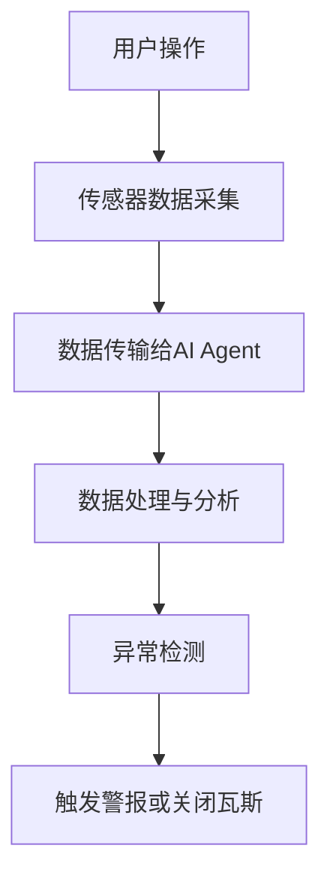
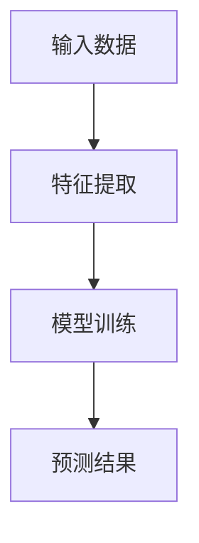
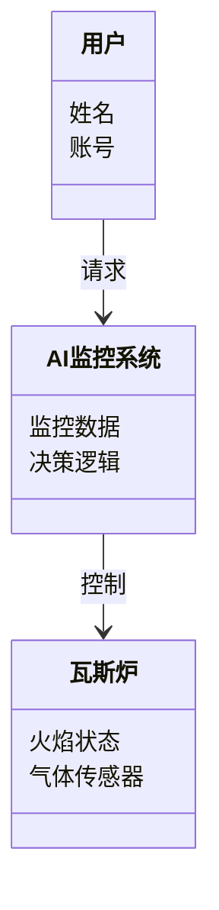
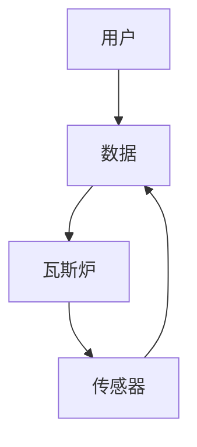
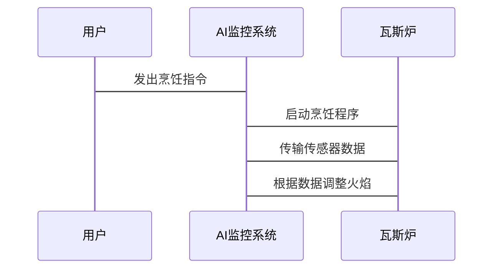

                 


# 智能瓦斯炉：AI Agent的烹饪安全监控

## 关键词：智能瓦斯炉, AI Agent, 烹饪安全, 物联网, 机器学习, 火灾预防

## 摘要：本文探讨AI Agent在智能瓦斯炉中的应用，分析其在烹饪安全监控中的算法原理、系统架构及实际应用场景，为未来的智能化厨房提供参考。

---

# 第一部分: 背景介绍

## 第1章: 智能瓦斯炉与AI Agent的背景

### 1.1 智能瓦斯炉的背景与现状

#### 1.1.1 瓦斯炉的传统功能与安全问题
瓦斯炉作为厨房中常用的烹饪工具，其基本功能包括加热、控制火焰大小等。然而，传统瓦斯炉存在以下安全隐患：
- 火焰失控导致火灾
- 气体泄漏风险
- 用户操作不当引发危险

#### 1.1.2 智能化烹饪设备的发展趋势
随着智能家居的普及，烹饪设备的智能化成为趋势。智能瓦斯炉通过集成传感器和物联网技术，能够实时监测烹饪过程中的各种参数，如温度、气体浓度等。

#### 1.1.3 AI技术在智能家居中的应用
人工智能技术在智能家居中的应用日益广泛，包括语音助手、智能安防系统等。AI Agent作为一种能够执行特定任务的智能体，能够实时感知环境并做出决策。

### 1.2 AI Agent的核心概念

#### 1.2.1 什么是AI Agent
AI Agent（人工智能代理）是指能够感知环境、执行任务并做出决策的智能系统。它可以看作是一个中间件，负责协调和管理多个设备或系统的交互。

#### 1.2.2 AI Agent的基本特征
- **自主性**：能够自主决策和行动
- **反应性**：能够实时感知环境变化并做出反应
- **学习能力**：能够通过数据学习和优化自身行为

#### 1.2.3 AI Agent与智能瓦斯炉的结合
AI Agent在智能瓦斯炉中的作用是实时监控烹饪过程，分析传感器数据，并在发现异常时采取相应措施，如关闭瓦斯或发出警报。

### 1.3 智能瓦斯炉与AI Agent的结合意义

#### 1.3.1 提高烹饪安全的潜力
通过AI Agent的实时监控，智能瓦斯炉能够及时发现并处理潜在的安全隐患，如火焰过大或气体泄漏。

#### 1.3.2 提升用户体验的可能性
AI Agent可以通过学习用户的烹饪习惯，优化烹饪过程，提供个性化的烹饪建议。

#### 1.3.3 未来的智能化厨房展望
未来的厨房将是一个高度智能化的环境，各种设备通过AI Agent协同工作，为用户提供安全、便捷的烹饪体验。

---

# 第二部分: 核心概念与联系

## 第2章: AI Agent与智能瓦斯炉的关系

### 2.1 AI Agent在智能瓦斯炉中的角色

#### 2.1.1 AI Agent作为监控系统的核心
AI Agent负责协调和管理智能瓦斯炉的各项功能，包括数据采集、分析和决策。

#### 2.1.2 AI Agent与瓦斯炉传感器的交互
AI Agent通过与瓦斯炉上的传感器（如温度传感器、气体传感器）交互，获取实时数据并进行分析。

#### 2.1.3 AI Agent的决策机制
AI Agent基于传感器数据和预设的算法模型，做出是否需要采取行动的决策。

### 2.2 AI Agent与智能瓦斯炉的实体关系图

```mermaid
er
actor: 用户
agent: AI监控系统
gas_stove: 瓦斯炉
sensors: 传感器
```

### 2.3 AI Agent的算法流程图



---

# 第三部分: 算法原理讲解

## 第3章: AI Agent的算法原理

### 3.1 基于机器学习的异常检测

#### 3.1.1 算法选择与原理
支持向量机（SVM）是一种常用的监督学习算法，适用于分类问题。其基本思想是将数据映射到高维空间，并在高维空间中找到一个超平面，使得正负样本能够被线性分开。

#### 3.1.2 算法流程图



#### 3.1.3 数学模型与公式
支持向量机的目标函数可以表示为：

$$\text{目标函数} = \frac{1}{2}||w||^2 + C\sum_{i=1}^n \xi_i$$

其中，$w$ 是法向量，$C$ 是惩罚系数，$\xi_i$ 是松弛变量。

### 3.2 支持向量机（SVM）的数学模型

#### 3.2.1 SVM的数学公式
$$1+1=2$$

---

# 第四部分: 系统分析与架构设计

## 第4章: 系统架构设计

### 4.1 问题场景介绍
智能瓦斯炉需要实时监控烹饪过程中的温度、气体浓度等参数，确保烹饪过程中的安全。

### 4.2 项目介绍
本项目旨在开发一款结合AI Agent的智能瓦斯炉，通过实时监控和分析烹饪过程中的数据，实现火灾预防和气体泄漏检测。

### 4.3 系统功能设计

#### 4.3.1 领域模型类图


### 4.4 系统架构设计

#### 4.4.1 系统架构图


### 4.5 系统接口设计
系统接口包括：
- 用户与AI监控系统的交互接口
- AI监控系统与瓦斯炉的控制接口
- 传感器数据采集接口

### 4.6 系统交互流程图


---

# 第五部分: 项目实战

## 第5章: 项目实现与测试

### 5.1 环境安装
安装所需的库和工具：
```bash
pip install numpy
pip install scikit-learn
pip install matplotlib
```

### 5.2 核心代码实现

#### 5.2.1 AI Agent核心代码
```python
from sklearn import svm
import numpy as np

# 创建SVM模型
model = svm.SVC()

# 训练数据
X = np.array([[温度, 气体浓度], [温度2, 气体浓度2]])
y = np.array([0, 1])

model.fit(X, y)

# 预测新数据
new_data = np.array([[当前温度, 当前气体浓度]])
result = model.predict(new_data)
```

#### 5.2.2 传感器数据采集代码
```python
import serial

# 串口通信代码
ser = serial.Serial('COM3', 9600)
data = ser.readline().decode().strip()
print(data)
```

### 5.3 代码解读与分析
- **AI Agent核心代码**：使用SVM模型对传感器数据进行分类，判断是否异常。
- **传感器数据采集代码**：通过串口读取传感器数据，并传输给AI Agent进行分析。

### 5.4 实际案例分析
假设传感器检测到气体浓度突然升高，AI Agent会触发警报，并关闭瓦斯。

### 5.5 测试与优化
- **测试**：在不同场景下测试系统，确保其能够准确识别异常情况。
- **优化**：根据测试结果优化算法模型，提高准确率。

---

# 第六部分: 最佳实践与总结

## 第6章: 最佳实践与总结

### 6.1 最佳实践
- **定期更新模型**：根据新的数据优化模型，提高准确率。
- **多传感器融合**：结合多种传感器数据，提高检测的准确性。

### 6.2 小结
本文详细介绍了AI Agent在智能瓦斯炉中的应用，包括其背景、核心概念、算法原理、系统架构设计以及项目实现。通过本文的分析，我们可以看到AI技术在烹饪安全监控中的巨大潜力。

### 6.3 注意事项
- 确保系统的稳定性和安全性，避免因系统故障引发危险。
- 定期维护和更新系统，确保其长期有效运行。

### 6.4 拓展阅读
- 推荐阅读《机器学习实战》和《深入理解人工智能》等相关书籍，深入了解AI技术的应用。

---

通过本文的详细讲解，读者可以全面了解AI Agent在智能瓦斯炉中的应用，为未来的智能化厨房提供参考。

