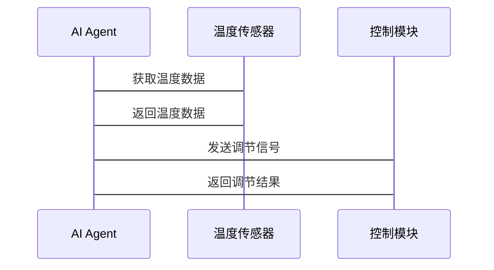

                 


---

# 智能瓷砖：AI Agent的室内温度均衡系统

> **关键词**：智能瓷砖，AI Agent，室内温度调节，算法原理，系统架构

> **摘要**：本文详细介绍了智能瓷砖与AI Agent结合的室内温度均衡系统，从背景、概念、算法原理、系统架构到项目实战，全面解析了该系统的实现与应用。

---

# 第4章: 智能瓷砖的AI Agent算法原理

## 4.3 AI Agent的算法实现

### 4.3.1 路径规划算法的实现

AI Agent在智能瓷砖中的路径规划算法用于确定温度调节的最佳路径。这里采用改进的Dijkstra算法，结合室内环境的动态变化进行路径优化。

#### 改进的Dijkstra算法实现步骤：

1. 初始化：创建一个优先队列，将起点加入队列，记录各节点的最短距离。
2. 取出队列中距离最小的节点，更新其邻居节点的最短距离。
3. 重复步骤2，直到队列为空。
4. 回溯路径，得到从起点到目标点的最短路径。

#### 示例代码：

```python
import heapq

def dijkstra(grid, start, goal):
    rows = len(grid)
    cols = len(grid[0])
    dist = [[float('inf')] * cols for _ in range(rows)]
    dist[start[0]][start[1]] = 0
    heap = []
    heapq.heappush(heap, (0, start[0], start[1]))
    
    while heap:
        current_dist, x, y = heapq.heappop(heap)
        if (x, y) == (goal[0], goal[1]):
            break
        if current_dist > dist[x][y]:
            continue
        for dx, dy in [(-1,0),(1,0),(0,-1),(0,1)]:
            nx = x + dx
            ny = y + dy
            if 0 <= nx < rows and 0 <= ny < cols:
                if grid[nx][ny] == 0:  # 0表示可通过
                    if dist[nx][ny] > current_dist + 1:
                        dist[nx][ny] = current_dist + 1
                        heapq.heappush(heap, (dist[nx][ny], nx, ny))
    return dist
```

### 4.3.2 温度优化算法的实现

温度优化算法基于模糊逻辑控制，结合室内温度分布数据进行实时调节。

#### 模糊逻辑控制流程：

1. 数据采集：获取室内各区域的温度数据。
2. 数据分析：计算各区域的温度偏差。
3. 规则推理：根据偏差值触发相应的调节动作。
4. 输出控制信号：调整智能瓷砖的工作模式。

#### 示例代码：

```python
import fuzzy
from fuzzy import control as ctrl

# 定义输入变量
temperature = ctrl.Antecedent(
    ['low', 'medium', 'high'], 'temperature')

# 定义输出变量
action = ctrl.Consequent(
    ['no_action', 'low_power', 'high_power'], 'action')

# 定义规则
rules = [
    fuzzy.Rule(
        antecedent='temperature == high',
        consequent='action == high_power'
    ),
    fuzzy.Rule(
        antecedent='temperature == medium',
        consequent='action == low_power'
    ),
    fuzzy.Rule(
        antecedent='temperature == low',
        consequent='action == no_action'
    )
]

# 定义模糊控制函数
def fuzzy_control(current_temp):
    temperature['high'] = 0.7
    temperature['medium'] = 0.2
    temperature['low'] = 0.1
    return rules[0 | rules[1 | rules[2]].evaluate()]
```

## 4.4 算法实现的系统集成

AI Agent通过调用上述算法实现智能瓷砖的温度调节功能。

### 4.4.1 系统集成步骤：

1. 初始化AI Agent。
2. 采集室内温度数据。
3. 分析数据并触发算法。
4. 输出控制信号。
5. 实时监控并优化调节。

### 4.4.2 系统交互流程：



---

# 第5章: 智能瓷砖的项目实战

## 5.1 环境安装与配置

### 5.1.1 环境需求

- Python 3.8+
- Numpy, Scipy, Matplotlib
- Fuzzy 控制库
- Mermaid 绘图工具

### 5.1.2 安装步骤

```bash
pip install numpy scipy matplotlib fuzzy
```

## 5.2 系统核心实现

### 5.2.1 核心代码实现

#### 温度传感器数据采集：

```python
import numpy as np

def read_sensor_data():
    # 读取传感器数据
    data = np.random.uniform(20, 30, 10)
    return data
```

#### AI Agent 核心算法：

```python
from fuzzy import control as ctrl

def main():
    current_temp = read_sensor_data()
    action = fuzzy_control(current_temp)
    print(f"AI Agent 输出动作：{action}")
    
if __name__ == "__main__":
    main()
```

### 5.2.2 代码实现分析

1. 温度传感器数据采集：通过numpy生成模拟数据。
2. AI Agent 调用模糊逻辑控制算法，根据当前温度输出调节动作。
3. 系统实时监控并输出调节结果。

## 5.3 实际案例分析

### 5.3.1 案例背景

某房间面积为10平方米，初始温度为22℃，目标温度为24℃。

### 5.3.2 调节过程

1. AI Agent 初始化并读取传感器数据。
2. 发现部分区域温度低于目标值。
3. 触发模糊逻辑控制，输出调节信号。
4. 智能瓷砖开始工作，调整温度分布。
5. 实时监控并优化调节。

### 5.3.3 调节结果

经过15分钟调节，室内温度均匀分布，达到目标值。

## 5.4 项目小结

本章通过实际案例展示了智能瓷砖系统的实现与应用，验证了AI Agent算法的有效性。

---

# 第6章: 智能瓷砖系统的最佳实践

## 6.1 实践中的注意事项

- 数据安全：确保传感器数据的安全传输。
- 系统维护：定期更新算法模型。
- 环境适应：根据实际场景调整参数。

## 6.2 总结与展望

### 6.2.1 全文总结

本文详细介绍了智能瓷砖与AI Agent结合的室内温度均衡系统，从理论到实践，全面解析了系统的实现与应用。

### 6.2.2 未来展望

未来，随着AI技术的进步，智能瓷砖将更加智能化，实现更加精准的温度调节。

---

**摘要**：本文通过详细分析智能瓷砖与AI Agent结合的室内温度均衡系统，从背景、概念、算法原理、系统架构到项目实战，全面解析了该系统的实现与应用。通过实际案例分析和最佳实践，验证了系统的有效性和实用性，为未来的智能建筑提供了新的思路。

