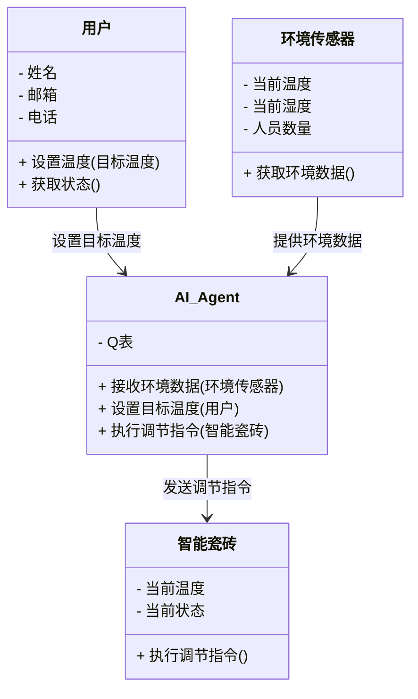
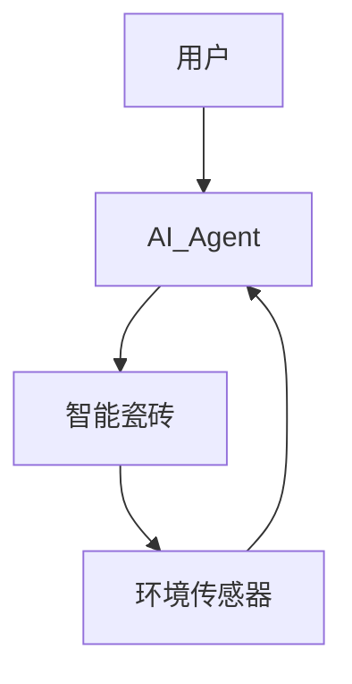

                 


# 智能瓷砖：AI Agent的室内温度调节系统

> 关键词：智能瓷砖，AI Agent，室内温度调节，强化学习，系统架构，智能家居

> 摘要：本文详细探讨了智能瓷砖在AI Agent辅助下的室内温度调节系统的实现。通过分析问题背景、核心概念、算法原理、系统架构、项目实战和最佳实践，系统性地阐述了如何利用AI技术优化室内温度调节系统。本文内容涵盖从理论到实践的各个方面，旨在为读者提供一个全面的技术视角，了解智能瓷砖在智能家居中的应用潜力。

---

## 第一部分: 背景与核心概念

### 第1章: 智能瓷砖与AI Agent的背景介绍

#### 1.1 问题背景
现代建筑中，室内温度调节是一个复杂而重要的问题。传统的温度调节系统通常依赖于恒温器和空调设备，但这些系统存在以下局限性：
- **用户需求多样性**：不同用户对温度的偏好不同，传统系统难以满足个性化需求。
- **环境变化影响**：室内外温差、人员数量变化等环境因素会影响温度调节的效果。
- **能源浪费**：传统系统缺乏智能优化能力，可能导致能源浪费。

#### 1.2 问题描述
智能瓷砖是一种新型的智能家居设备，它通过集成传感器、通信模块和AI算法，能够实时感知室内环境并动态调整温度。AI Agent（智能代理）在其中扮演关键角色，负责接收传感器数据、制定优化策略并执行调节指令。

#### 1.3 问题解决与边界
智能瓷砖的目标是通过AI Agent实现以下功能：
- **智能感知**：实时感知室内温度、湿度、人员数量等信息。
- **动态调节**：根据感知数据和用户需求，动态调整室内温度。
- **优化策略**：通过AI算法优化能源使用，降低能耗。

系统的边界包括：
- **物理边界**：智能瓷砖仅限于室内环境调节。
- **功能边界**：AI Agent仅负责温度调节，不涉及其他家居设备的控制。
- **数据边界**：系统仅处理与温度调节相关的数据。

#### 1.4 核心概念与结构
智能瓷砖系统的核心要素包括：
- **AI Agent**：负责数据处理、策略制定和指令执行。
- **智能瓷砖**：作为执行机构，负责实际的温度调节。
- **传感器**：提供室内环境数据。
- **用户交互界面**：用户可以通过手机或网页设置需求。

### 第2章: 智能瓷砖与AI Agent的核心概念

#### 2.1 AI Agent的基本原理
AI Agent是一种能够感知环境并采取行动以实现目标的智能实体。它可以分为以下几类：
- **基于规则的AI Agent**：根据预定义的规则进行决策。
- **基于模型的AI Agent**：通过构建环境模型进行决策。
- **基于强化学习的AI Agent**：通过与环境互动学习优化策略。

#### 2.2 智能瓷砖的功能与属性
智能瓷砖的功能包括：
- **温度感知**：内置温度、湿度传感器。
- **数据通信**：通过Wi-Fi或蓝牙与AI Agent通信。
- **智能调节**：通过内置加热或冷却模块调节温度。

智能瓷砖的属性包括：
- **可编程性**：支持用户自定义调节策略。
- **自适应性**：能够根据环境变化自动调整。
- **能源效率**：通过优化算法降低能耗。

#### 2.3 核心概念对比表
以下是对传统温度调节系统、AI Agent和智能瓷砖的对比：

| 对比维度       | 传统温度调节系统 | AI Agent辅助的智能瓷砖 |
|----------------|------------------|-------------------------|
| 数据来源       | 单一传感器       | 多传感器融合           |
| 调节策略       | 固定模式         | 动态优化策略           |
| 用户交互       | 有限             | 个性化定制             |
| 能耗效率       | 一般             | 高效率                 |

#### 2.4 ER实体关系图
以下是一个简单的实体关系图，展示了智能瓷砖系统的主要组成部分：

```mermaid
er
    actor 用户
    actor 环境传感器
    actor AI Agent
    actor 云端服务器
    relation 用户 -> AI Agent: 设置目标温度
    relation 环境传感器 -> AI Agent: 提供环境数据
    relation AI Agent -> 云端服务器: 请求历史数据
    relation 云端服务器 -> AI Agent: 返回优化策略
    relation AI Agent -> 智能瓷砖: 发送调节指令
    relation 智能瓷砖 -> 环境传感器: 提供反馈数据
```

---

## 第二部分: 算法原理与数学模型

### 第3章: AI Agent的算法原理

#### 3.1 强化学习算法
强化学习是一种通过与环境互动来学习策略的方法。以下是Q-learning算法的流程：

```mermaid
graph TD
    A[开始] --> B[接收状态s]
    B --> C[选择动作a]
    C --> D[执行动作a，获得奖励r]
    D --> E[更新Q表：Q(s,a) = Q(s,a) + α(r + γ max Q(s',a'))]
    E --> F[重复]
```

以下是一个简单的Q-learning算法实现示例：

```python
import numpy as np

class AI_Agent:
    def __init__(self, state_space, action_space):
        self.state_space = state_space
        self.action_space = action_space
        self.Q = np.zeros((state_space, action_space))
    
    def choose_action(self, state, epsilon=0.1):
        if np.random.random() < epsilon:
            return np.random.randint(self.action_space)
        else:
            return np.argmax(self.Q[state, :])
    
    def update_Q(self, state, action, reward, next_state, alpha=0.1, gamma=0.9):
        self.Q[state, action] = self.Q[state, action] + alpha * (reward + gamma * np.max(self.Q[next_state, :]))
```

#### 3.2 数学模型
以下是一个简单的温度预测模型：

$$
T_{\text{预测}} = \beta T_{\text{当前}} + \alpha T_{\text{外部}} + \gamma N_{\text{人员}}
$$

其中：
- $T_{\text{预测}}$ 是预测的温度
- $T_{\text{当前}}$ 是当前室内温度
- $T_{\text{外部}}$ 是当前室外温度
- $N_{\text{人员}}$ 是室内人员数量
- $\alpha, \beta, \gamma$ 是模型参数

---

## 第三部分: 系统架构与设计

### 第4章: 系统架构设计

#### 4.1 应用场景介绍
智能瓷砖系统可以应用于各种室内场景，例如家庭、办公室、酒店客房等。

#### 4.2 系统功能设计
以下是系统功能的领域模型：



#### 4.3 系统架构设计
以下是系统的架构图：



#### 4.4 接口设计
以下是系统的接口设计：

- **用户接口**：通过手机APP或网页设置目标温度。
- **传感器接口**：通过MQTT协议发送环境数据。
- **AI Agent接口**：通过RESTful API接收数据和发送指令。

---

## 第四部分: 项目实战

### 第5章: 项目实战

#### 5.1 环境安装
以下是项目环境安装步骤：

1. 安装Python和必要的库：
   ```bash
   pip install numpy matplotlib scikit-learn
   ```

2. 安装MQTT客户端：
   ```bash
   pip install paho-mqtt
   ```

#### 5.2 核心代码实现
以下是AI Agent的核心代码：

```python
import paho.mqtt.client as mqtt

class MQTT_Client:
    def __init__(self, broker, port):
        self.broker = broker
        self.port = port
        self.client = None
    
    def connect(self):
        self.client = mqtt.Client()
        self.client.connect(self.broker, self.port)
    
    def publish(self, topic, payload):
        self.client.publish(topic, payload)
    
    def subscribe(self, topic):
        self.client.subscribe(topic)
    
    def on_message(self, callback):
        self.client.on_message = callback
```

#### 5.3 代码解读
AI Agent的核心代码如下：

```python
class AI_Agent:
    def __init__(self):
        self.mqtt_client = MQTT_Client("localhost", 1883)
        self.mqtt_client.connect()
        self.mqtt_client.subscribe("environment/sensor")
        self.mqtt_client.on_message(self.on_message)
    
    def on_message(self, message):
        # 解析环境数据
        data = json.loads(message.payload.decode())
        # 更新Q表
        self.update_Q(...)
        # 发送调节指令
        self.mqtt_client.publish("tile/instruction", json.dumps(...))
```

---

## 第五部分: 最佳实践

### 第6章: 最佳实践

#### 6.1 小结
智能瓷砖与AI Agent的结合为室内温度调节提供了新的解决方案。通过强化学习算法和系统优化，可以实现更智能、更高效的温度调节。

#### 6.2 注意事项
- **数据隐私**：确保用户数据的安全性。
- **系统兼容性**：确保与现有家居设备的兼容性。
- **能源效率**：优化算法以降低能耗。

#### 6.3 未来趋势
未来的智能瓷砖可能会集成更多的传感器和更复杂的AI算法，例如：
- **边缘计算**：在瓷砖本地进行数据处理。
- **多模态交互**：支持语音、手势等多种交互方式。

#### 6.4 拓展阅读
- 《强化学习：算法与应用》
- 《智能家居系统设计》
- 《AI在建筑自动化中的应用》

---

# 结语

智能瓷砖与AI Agent的结合是智能家居发展的趋势之一。通过本文的系统性介绍，读者可以深入了解智能瓷砖的实现原理、算法设计和系统架构。未来，随着AI技术的不断发展，智能瓷砖将在智能家居中发挥更大的作用。

