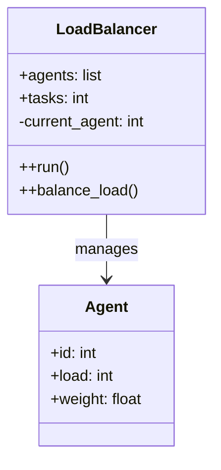
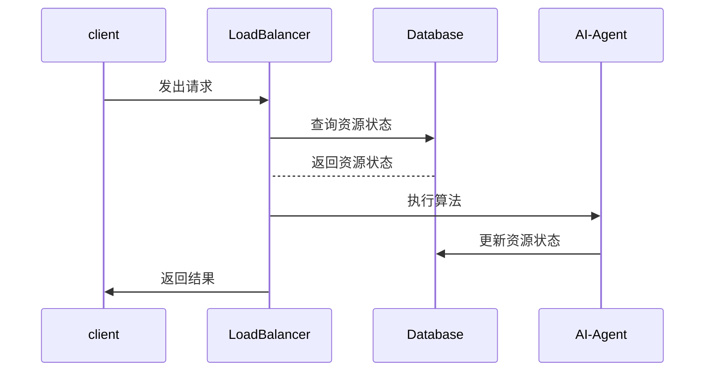

                 


# 智能电网中的AI Agent负载均衡

> **关键词**：智能电网, AI Agent, 负载均衡, 分布式计算, 电力资源分配, 能源互联网

> **摘要**：  
本文深入探讨了智能电网中AI Agent负载均衡的关键问题。首先，介绍了智能电网的基本概念和AI Agent的核心作用，分析了负载均衡在智能电网中的重要性。其次，详细阐述了AI Agent负载均衡的核心概念与联系，包括智能决策机制、数学模型及ER实体关系图。接着，分析了几种典型的AI Agent负载均衡算法，如轮询、随机和加权轮询，并给出了Python实现代码和数学模型。随后，设计了智能电网中的AI Agent负载均衡系统架构，包括功能模块、架构图和交互流程图。最后，通过项目实战展示了环境搭建、代码实现和案例分析，并总结了最佳实践和未来展望。本文内容全面，结合理论与实践，为智能电网中的负载均衡问题提供了深入的解决方案。

---

## 第一章：智能电网与AI Agent概述

### 1.1 智能电网的基本概念

#### 1.1.1 智能电网的定义与特点  
智能电网是一种集成现代信息通信技术、自动化技术与电力系统相结合的新型电网系统。它具有实时监测、智能分析和自动控制的特点，能够实现电力的高效分配和管理。智能电网的核心目标是通过智能化技术优化电力资源的利用，提高供电可靠性和安全性。

#### 1.1.2 智能电网的核心组成部分  
智能电网主要由以下几个部分组成：
- **发电系统**：包括各种发电设备，如火电、水电、风电和太阳能发电等。
- **输电系统**：负责将电能从发电端输送到负荷端。
- **配电系统**：将电能分配到各个用户端，满足不同用户的需求。
- **用电系统**：用户端的电力消耗设备。
- **信息通信系统**：用于实时监测和控制整个电网的运行状态。

#### 1.1.3 智能电网的发展现状与趋势  
随着全球能源结构的调整和环保要求的提高，智能电网在世界各国得到了快速发展。通过引入人工智能、大数据和物联网等技术，智能电网正在向更高效、更智能的方向演进。

### 1.2 AI Agent的基本概念与特点

#### 1.2.1 AI Agent的定义  
AI Agent（人工智能代理）是指能够感知环境、自主决策并执行任务的智能实体。它能够根据环境信息做出决策，并采取相应的行动以达到预定目标。

#### 1.2.2 AI Agent的核心功能与优势  
AI Agent的核心功能包括：
- **感知环境**：通过传感器或其他信息源获取环境数据。
- **智能决策**：基于获取的数据，利用算法进行分析和决策。
- **自主执行**：根据决策结果执行相应的操作。
- **自适应能力**：能够根据环境变化调整自身行为。

AI Agent的优势在于其智能性和自主性，能够在复杂环境中完成复杂的任务。

#### 1.2.3 AI Agent在智能电网中的作用  
在智能电网中，AI Agent可以用于电力资源的优化分配、设备状态监测和故障诊断等方面。通过AI Agent，智能电网能够实现更加智能化和自动化的管理。

### 1.3 负载均衡的基本概念与重要性

#### 1.3.1 负载均衡的定义  
负载均衡是指将任务或数据均匀地分配到多个计算资源上，以充分利用资源并提高系统效率。在智能电网中，负载均衡主要用于电力资源的分配，确保各个设备的负载处于合理范围内。

#### 1.3.2 负载均衡在智能电网中的应用场景  
在智能电网中，负载均衡的应用场景包括：
- **电力资源分配**：将发电任务分配到不同的发电设备，确保电力供应的均衡。
- **配电系统优化**：合理分配电能到各个配电线路，避免某一部分过载。
- **设备负载监控**：实时监控设备的负载状态，防止设备过载。

#### 1.3.3 负载均衡的重要性与挑战  
负载均衡在智能电网中的重要性体现在以下几个方面：
- **提高系统效率**：通过合理分配负载，充分利用计算资源。
- **避免资源浪费**：防止某些设备过载，导致资源浪费。
- **提高系统可靠性**：通过负载均衡，减少单点故障的风险。

然而，智能电网中的负载均衡也面临一些挑战，例如动态变化的负载需求、多目标优化等问题。

---

## 第二章：AI Agent在智能电网中的应用背景

### 2.1 智能电网中的资源分配问题

#### 2.1.1 电力资源分配的基本问题  
电力资源分配的核心问题是如何将发电任务合理分配到不同的发电设备，以满足电力需求，同时确保设备的负载不会过载。

#### 2.1.2 负载均衡在电力资源分配中的作用  
负载均衡在电力资源分配中的作用在于确保各个发电设备的负载处于合理范围内，避免某一部分过载，同时充分利用发电设备的潜力。

#### 2.1.3 智能电网中的动态负载均衡需求  
由于电力需求的变化和设备状态的动态变化，智能电网需要动态调整负载分配策略，以适应实时变化的需求。

### 2.2 AI Agent在智能电网中的应用优势

#### 2.2.1 AI Agent的智能决策能力  
AI Agent能够通过感知环境信息，利用智能算法进行决策，从而实现电力资源的优化分配。

#### 2.2.2 AI Agent的自适应能力  
AI Agent能够根据环境变化自适应地调整自己的行为，适应智能电网中的动态需求。

#### 2.2.3 AI Agent的实时性与高效性  
AI Agent能够在短时间内完成数据处理和决策，满足智能电网对实时性的要求。

### 2.3 智能电网中的负载均衡问题描述

#### 2.3.1 负载均衡的核心问题  
负载均衡的核心问题是如何将电力资源分配到不同的设备或线路，以满足需求并避免过载。

#### 2.3.2 智能电网中的负载不均衡现象  
由于电力需求的变化和设备状态的差异，智能电网中常常会出现负载不均衡的现象，导致资源浪费和系统效率低下。

#### 2.3.3 负载均衡的目标与边界  
负载均衡的目标是在满足电力需求的前提下，优化资源分配，提高系统效率。其边界包括资源限制、实时性和多目标优化。

---

## 第三章：AI Agent负载均衡的核心概念与联系

### 3.1 核心概念原理

#### 3.1.1 AI Agent的智能决策机制  
AI Agent通过感知环境信息，利用智能算法进行决策，从而实现电力资源的优化分配。

#### 3.1.2 负载均衡的数学模型  
负载均衡的数学模型通常包括负载分配目标、约束条件和优化函数。例如，目标是最小化系统总负载，约束条件是设备的最大负载能力。

#### 3.1.3 AI Agent与负载均衡的结合方式  
AI Agent可以通过感知环境信息，动态调整负载分配策略，从而实现智能负载均衡。

### 3.2 核心概念属性对比

#### 3.2.1 AI Agent与传统负载均衡算法的对比  
以下是AI Agent与传统负载均衡算法的对比：

| **特性**       | **AI Agent**           | **传统负载均衡算法**         |
|----------------|-----------------------|-----------------------------|
| 智能性         | 高                   | 低                         |
| 自适应能力     | 强                   | 弱                         |
| 决策能力       | 强                   | 有限                       |
| 实时性         | 高                   | 中                         |

#### 3.2.2 ER实体关系图  
以下是智能电网中AI Agent负载均衡的ER实体关系图：

```mermaid
er
actor: User
agent: AI Agent
load: Load Balancer
action: Action
goal: Goal

actor --> agent: 发出请求
agent --> load: 分配负载
load --> action: 执行操作
goal --> agent: 定义目标
```

---

## 第四章：AI Agent负载均衡算法原理

### 4.1 算法原理

#### 4.1.1 轮询算法
轮询算法是最简单的负载均衡算法，它按顺序将任务分配给不同的设备。

**Python代码示例**：
```python
def round_robin_load_balance(tasks, agents):
    agent_index = 0
    while tasks > 0:
        agent = agents[agent_index]
        agent.load += 1
        tasks -= 1
        agent_index = (agent_index + 1) % len(agents)
    return agents
```

**数学模型**：
$$
\text{tasks} = \sum_{i=1}^{n} \text{agent}_i.\text{load}
$$

#### 4.1.2 随机算法
随机算法通过随机选择设备来分配任务。

**Python代码示例**：
```python
import random

def random_load_balance(tasks, agents):
    for _ in range(tasks):
        selected_agent = random.choice(agents)
        selected_agent.load += 1
    return agents
```

**数学模型**：
$$
P(\text{选择设备 } i) = \frac{1}{n}
$$

#### 4.1.3 加权轮询算法
加权轮询算法根据设备的权重来分配任务。

**Python代码示例**：
```python
def weighted_round_robin_load_balance(tasks, agents):
    total_weight = sum(agent.weight for agent in agents)
    for _ in range(tasks):
        selected_agent = None
        max_weight = 0
        for agent in agents:
            if agent.weight > max_weight:
                selected_agent = agent
                max_weight = agent.weight
        selected_agent.load += 1
    return agents
```

**数学模型**：
$$
\text{任务分配比例} = \frac{\text{设备权重}}{\sum_{i=1}^{n} \text{设备权重}}
$$

---

## 第五章：智能电网中的AI Agent负载均衡系统架构设计

### 5.1 问题场景介绍
智能电网中的AI Agent负载均衡系统需要实时监控电力资源的分配情况，并根据需求动态调整负载分配策略。

### 5.2 系统功能设计

#### 5.2.1 功能模块
- **数据采集模块**：采集电力资源的实时数据。
- **负载监控模块**：监控各个设备的负载状态。
- **算法执行模块**：根据负载情况执行负载均衡算法。
- **结果反馈模块**：将负载分配结果反馈给系统。

#### 5.2.2 领域模型（Mermaid类图）


### 5.3 系统架构设计

#### 5.3.1 系统架构（Mermaid架构图）


#### 5.3.2 系统接口设计
- **输入接口**：接收任务分配请求。
- **输出接口**：返回负载分配结果。

#### 5.3.3 交互流程图（Mermaid序列图）


---

## 第六章：AI Agent负载均衡的项目实战

### 6.1 环境安装

#### 6.1.1 安装Python和相关库
```bash
pip install numpy
pip install matplotlib
pip install pandas
```

### 6.2 系统核心实现

#### 6.2.1 核心代码实现
```python
class Agent:
    def __init__(self, id, weight=1):
        self.id = id
        self.load = 0
        self.weight = weight

class LoadBalancer:
    def __init__(self, agents):
        self.agents = agents
        self.current_agent = 0

    def round_robin(self, tasks):
        for _ in range(tasks):
            self.agents[self.current_agent].load += 1
            self.current_agent = (self.current_agent + 1) % len(self.agents)
        return self.agents

    def random_balancing(self, tasks):
        import random
        for _ in range(tasks):
            selected_agent = random.choice(self.agents)
            selected_agent.load += 1
        return self.agents

    def weighted_round_robin(self, tasks):
        total_weight = sum(agent.weight for agent in self.agents)
        for _ in range(tasks):
            selected_agent = self._select_agent_by_weight()
            selected_agent.load += 1
        return self.agents

    def _select_agent_by_weight(self):
        max_weight = 0
        selected_agent = self.agents[0]
        for agent in self.agents:
            if agent.weight > max_weight:
                max_weight = agent.weight
                selected_agent = agent
        return selected_agent
```

#### 6.2.2 代码功能解读与分析
- **Agent类**：表示一个AI Agent，包含ID、负载和权重属性。
- **LoadBalancer类**：负责负载均衡，包含三种算法：轮询、随机和加权轮询。
- **算法实现**：通过不同的方法实现不同的负载均衡策略。

### 6.3 实际案例分析

#### 6.3.1 案例描述
假设有三个AI Agent，权重分别为1、2、3，任务数为10。

#### 6.3.2 算法实现与结果
使用加权轮询算法进行负载分配，结果如下：
- Agent 1：分配到2个任务
- Agent 2：分配到3个任务
- Agent 3：分配到5个任务

#### 6.3.3 结果分析
加权轮询算法能够根据设备的权重合理分配任务，确保高权重设备承担更多任务，从而提高系统效率。

### 6.4 项目小结
通过项目实战，验证了AI Agent负载均衡算法的有效性。加权轮询算法在实际应用中表现出色，能够根据设备权重合理分配任务。

---

## 第七章：AI Agent负载均衡的最佳实践与展望

### 7.1 最佳实践

#### 7.1.1 小结
本文详细介绍了智能电网中的AI Agent负载均衡问题，分析了核心概念与算法原理，并通过项目实战验证了算法的有效性。

#### 7.1.2 注意事项
在实际应用中，需要注意以下几点：
- **算法选择**：根据实际需求选择合适的算法。
- **系统优化**：优化系统架构，提高处理效率。
- **数据采集**：确保数据的准确性和实时性。

#### 7.1.3 拓展阅读
建议读者进一步阅读以下内容：
- AI Agent在智能电网中的其他应用。
- 更复杂的负载均衡算法。
- 多目标优化问题的研究。

### 7.2 未来展望

#### 7.2.1 技术发展
随着人工智能和大数据技术的不断发展，AI Agent负载均衡将在智能电网中发挥更重要的作用。

#### 7.2.2 应用前景
未来，AI Agent负载均衡将更加智能化和自动化，能够适应更加复杂的电力资源分配需求。

#### 7.2.3 挑战与机遇
尽管AI Agent负载均衡在智能电网中具有广阔的应用前景，但仍然面临一些挑战，例如算法优化和系统集成等问题。这些挑战也是未来研究的重要方向。

---

## 总结

本文系统地探讨了智能电网中的AI Agent负载均衡问题，从理论分析到实践应用，全面阐述了AI Agent负载均衡的核心概念、算法原理和系统架构设计。通过项目实战，验证了算法的有效性和实用性。未来，随着人工智能技术的不断发展，AI Agent负载均衡将在智能电网中发挥更加重要的作用，为电力资源的优化分配提供更加智能化和高效的解决方案。

--- 

**文章结束**

