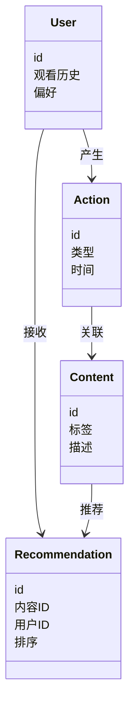
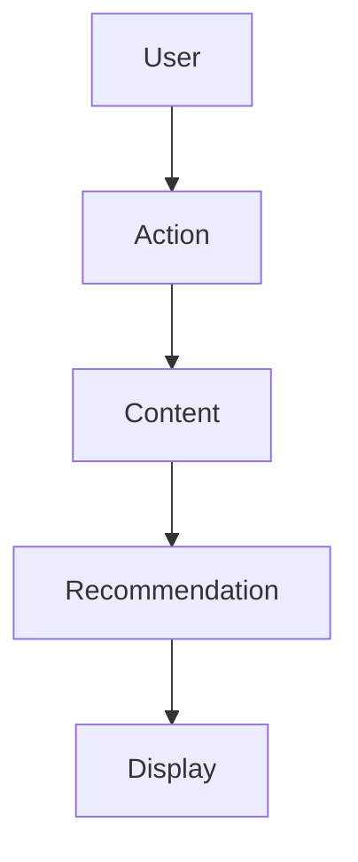

                 


# 智能电视：AI Agent的个性化内容推荐引擎

## 关键词：
智能电视，AI Agent，个性化推荐，推荐引擎，机器学习，深度学习

## 摘要：
本文深入探讨了智能电视中AI Agent的个性化内容推荐引擎的实现与应用。文章从智能电视的发展背景出发，详细分析了AI Agent的核心概念与推荐引擎的工作原理，结合主流的推荐算法（如协同过滤、内容推荐、混合推荐），并通过系统架构设计与项目实战，展示了如何构建高效的个性化推荐系统。文章最后总结了当前推荐引擎的优缺点，并展望了未来的发展方向。

---

## 第一部分: 智能电视与AI Agent的背景与概述

### 第1章: 智能电视的发展与AI Agent的引入

#### 1.1 智能电视的定义与演进
智能电视是一种集成了计算机技术、网络通信技术和人工智能技术的下一代电视设备。它不仅具备传统电视的基本功能，还能连接互联网，提供丰富的交互式功能，如视频点播、在线游戏、智能家居控制等。

- **传统电视的功能与局限性**：传统电视只能被动接收信号，无法与用户互动，也无法提供个性化的内容推荐。
- **智能电视的定义与核心特征**：智能电视具备联网能力，支持多任务处理，能够通过语音或手势控制，并且能够根据用户的行为和偏好推荐内容。
- **智能电视的发展趋势**：随着人工智能技术的不断进步，智能电视将更加智能化，推荐系统将更加个性化和精准。

#### 1.2 AI Agent的基本概念
AI Agent（人工智能代理）是指能够感知环境并采取行动以实现目标的智能实体。在智能电视中，AI Agent通常用于推荐系统，帮助用户发现他们感兴趣的内容。

- **AI Agent的定义与特点**：AI Agent能够通过学习用户的行为模式，预测用户的偏好，并主动推荐相关内容。
- **AI Agent在智能电视中的作用**：AI Agent通过分析用户的观看历史、搜索记录、点赞和评分等数据，生成个性化的推荐列表。
- **AI Agent与其他智能设备的对比**：与其他智能设备相比，AI Agent在智能电视中的应用更加注重内容推荐的精准性和用户体验的优化。

#### 1.3 个性化内容推荐的重要性
个性化推荐是智能电视的核心功能之一，能够显著提升用户体验。

- **个性化推荐的定义与目标**：个性化推荐是指根据用户的兴趣和偏好，主动推送相关内容的过程。其目标是提高用户的满意度和粘性。
- **智能电视中推荐系统的应用场景**：智能电视的推荐系统可以应用于节目推荐、视频点播推荐、广告推荐等多个场景。
- **个性化推荐对用户体验的提升**：通过个性化推荐，用户能够更快地找到感兴趣的内容，减少选择疲劳，提升观看体验。

### 第2章: 智能电视AI Agent推荐引擎的背景与问题描述

#### 2.1 当前智能电视推荐系统的现状
目前，智能电视的推荐系统主要基于传统的协同过滤算法，存在以下问题：

- **基于规则的传统推荐系统**：这些系统通常基于简单的规则，如“热门推荐”或“同类推荐”，推荐效果有限。
- **基于协同过滤的推荐系统**：协同过滤算法通过分析用户的相似性来推荐内容，但其计算复杂度较高，且容易受到数据稀疏性的影响。
- **当前推荐系统的局限性**：传统推荐系统难以处理用户偏好随时间变化的问题，推荐结果不够精准。

#### 2.2 AI Agent推荐引擎的提出
为了克服传统推荐系统的局限性，引入AI Agent推荐引擎成为必然趋势。

- **AI Agent在推荐系统中的优势**：AI Agent能够通过深度学习技术，实时分析用户的观看行为，动态调整推荐策略。
- **个性化推荐的核心问题与挑战**：如何高效地处理海量数据，如何保证推荐的实时性，如何避免推荐结果的偏差等。
- **AI Agent推荐引擎的边界与外延**：AI Agent推荐引擎不仅限于推荐内容，还可以与其他智能设备联动，提供更加智能化的服务。

#### 2.3 问题背景与目标
智能电视AI Agent推荐引擎的目标是为用户提供个性化、实时化的推荐服务。

- **用户需求分析**：用户希望快速找到感兴趣的内容，减少选择疲劳，同时希望推荐系统能够理解他们的偏好。
- **系统目标与核心问题**：系统的目标是实现高效的个性化推荐，核心问题包括数据采集、特征提取、模型训练等。
- **问题解决的路径与方法**：通过引入机器学习和深度学习技术，构建高效的推荐模型，实时处理用户行为数据。

### 第3章: 智能电视AI Agent推荐引擎的核心概念与联系

#### 3.1 核心概念的定义与属性
智能电视AI Agent推荐引擎的核心概念包括AI Agent、推荐引擎和用户行为分析。

- **AI Agent的定义与属性**：AI Agent是具有感知和行动能力的智能实体，能够通过学习用户的偏好，主动推荐相关内容。
- **推荐引擎的定义与属性**：推荐引擎是AI Agent的核心模块，负责分析用户数据，生成推荐结果。
- **用户行为分析的定义与属性**：用户行为分析是指通过记录和分析用户的观看历史、搜索记录等行为数据，了解用户的兴趣和偏好。

#### 3.2 核心概念之间的关系
AI Agent、推荐引擎和用户行为分析三者之间存在密切的关系。

- **AI Agent与推荐引擎的关系**：AI Agent通过推荐引擎实现内容推荐功能。
- **用户行为与推荐结果的关系**：用户的观看行为直接影响推荐引擎的输出结果。
- **数据源与推荐算法的关系**：推荐算法的性能依赖于数据源的质量和多样性。

#### 3.3 ER实体关系图
以下是智能电视AI Agent推荐引擎的ER实体关系图：

```mermaid
erd
  User
  Content
  Action
  Recommendation
  User -[1..n]-> Action
  Action -[1]-> Content
  Action -[1]-> Recommendation
  Content -[1]-> Recommendation
```

---

## 第二部分: 核心概念与算法原理

### 第4章: 推荐算法原理与实现

#### 4.1 协同过滤算法
协同过滤是一种基于用户相似性推荐算法。

- **基于用户的协同过滤**：通过分析用户的行为数据，找到与目标用户相似的用户群体，推荐这些用户喜欢的内容。
- **基于物品的协同过滤**：通过分析内容的相似性，推荐与目标用户已观看内容相似的节目。

#### 4.2 基于深度学习的推荐算法
深度学习推荐算法能够处理更复杂的数据，推荐效果更优。

- **神经协同过滤（Neural Collaborative Filtering）**：通过神经网络建模用户-物品的交互关系，提升推荐的准确性。
- **深度学习推荐模型（Deep Learning Recommender Model）**：利用深度神经网络提取用户和内容的特征，生成推荐结果。

#### 4.3 混合推荐算法
混合推荐算法结合了协同过滤和内容推荐的优点，能够提供更加精准的推荐结果。

- **混合推荐算法的实现步骤**：
  1. 数据预处理：清洗和归一化用户数据和内容数据。
  2. 特征提取：通过协同过滤提取用户相似性特征，通过内容推荐提取内容特征。
  3. 模型训练：利用混合模型训练推荐算法。
  4. 推荐生成：根据用户的行为数据和模型预测结果生成推荐列表。

---

## 第三部分: 系统架构与项目实战

### 第5章: 系统架构设计与实现

#### 5.1 系统功能设计
智能电视AI Agent推荐引擎的系统功能包括数据采集、特征提取、模型训练、推荐生成和效果评估。

- **数据采集**：通过智能电视收集用户的观看历史、搜索记录、点赞和评分等数据。
- **特征提取**：利用自然语言处理和计算机视觉技术提取内容特征。
- **模型训练**：基于深度学习算法训练推荐模型。
- **推荐生成**：根据用户的行为数据和模型预测结果生成推荐列表。
- **效果评估**：通过A/B测试评估推荐系统的性能。

#### 5.2 系统架构设计
以下是智能电视AI Agent推荐引擎的系统架构图：



---

## 第四部分: 总结与展望

### 第6章: 总结与未来展望

#### 6.1 总结
智能电视AI Agent推荐引擎通过引入人工智能技术，显著提升了推荐系统的性能和用户体验。本文详细介绍了推荐引擎的核心概念、算法原理和系统架构，并通过项目实战展示了推荐系统的实现过程。

#### 6.2 未来展望
未来，智能电视AI Agent推荐引擎将朝着以下方向发展：

- **更精准的推荐算法**：通过引入强化学习和自适应算法，进一步提升推荐的精准性。
- **多模态推荐**：结合文本、图像、语音等多种模态信息，提供更加个性化的推荐服务。
- **实时推荐**：通过边缘计算和实时数据处理技术，实现毫秒级的实时推荐。

---

## 附录: 开源工具与代码示例

#### 附录A: 推荐算法的Python实现

```python
import numpy as np
from sklearn.metrics.pairwise import cosine_similarity

def collaborative_filtering(user_data, item_data):
    user_similarity = cosine_similarity(user_data)
    item_similarity = cosine_similarity(item_data)
    # 选择最相似的用户或物品进行推荐
    return user_similarity.argmax(), item_similarity.argmax()

def neural_collaborative_filtering(user_embedding, item_embedding):
    # 神经网络模型的具体实现
    pass
```

#### 附录B: 系统架构图



---

通过以上内容，我们详细探讨了智能电视AI Agent推荐引擎的实现与应用，从理论到实践，为读者提供了全面的指导。

