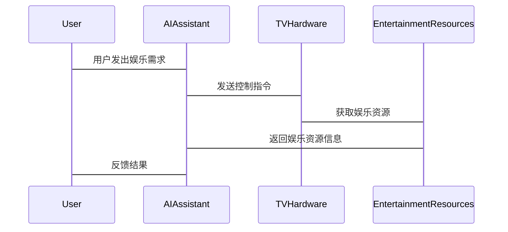

                 


```markdown
# 智能电视：AI Agent的家庭娱乐管家系统

## 关键词
智能电视，AI Agent，家庭娱乐，自然语言处理，语音识别，机器学习，系统架构

## 摘要
随着人工智能技术的飞速发展，智能电视逐渐从单一的娱乐工具转变为家庭娱乐的智能管家。本文将深入探讨智能电视与AI Agent的结合，分析其家庭娱乐管家系统的背景、核心概念、技术原理、系统架构、项目实现及优化方向。通过详细的技术分析和实际案例，本文旨在为读者提供一个全面了解智能电视AI Agent家庭娱乐管家系统的视角。

---

## 第一部分: 智能电视与AI Agent的背景概述

### 第1章: 智能电视与AI Agent的背景概述

#### 1.1 智能电视的发展历程
##### 1.1.1 传统电视的功能局限
传统电视的功能相对单一，主要局限于播放视频内容，无法与其他设备或用户进行互动，也无法根据用户需求提供个性化服务。

##### 1.1.2 智能电视的定义与特点
智能电视是一种集成互联网、多媒体和智能交互功能的电视设备，能够连接Wi-Fi、支持多点触控、语音控制，并具备丰富的应用程序生态。

##### 1.1.3 智能电视的发展趋势
智能电视正在向高度智能化方向发展，逐渐成为家庭娱乐的中心，与智能家居生态深度融合，提供更加个性化和便捷的娱乐体验。

#### 1.2 AI Agent的核心概念
##### 1.2.1 AI Agent的基本定义
AI Agent是一种智能代理系统，能够通过感知环境、理解用户需求并采取相应行动来提供服务。

##### 1.2.2 AI Agent的核心功能
- 自然语言理解
- 语音识别与合成
- 机器学习与推理
- 多轮对话管理
- 个性化推荐

##### 1.2.3 AI Agent与智能电视的结合
AI Agent作为智能电视的“大脑”，能够实现对电视功能的智能化控制，为用户提供个性化的娱乐服务。

#### 1.3 智能电视AI Agent的家庭娱乐管家系统
##### 1.3.1 系统的目标与定位
该系统旨在通过AI Agent实现对家庭娱乐资源的智能管理，提供便捷的娱乐服务，提升用户体验。

##### 1.3.2 系统的功能模块
- 用户识别与认证
- 娱乐内容推荐
- 多设备协同控制
- 个性化语音交互
- 娱乐数据管理

##### 1.3.3 系统的用户价值
- 提供个性化娱乐体验
- 简化设备操作流程
- 实现多设备协同工作
- 提升家庭娱乐效率

#### 1.4 本章小结
本章介绍了智能电视的发展历程、AI Agent的核心概念，以及智能电视AI Agent家庭娱乐管家系统的定位与功能模块，为后续的技术分析奠定了基础。

---

## 第二部分: AI Agent的核心概念与技术原理

### 第2章: AI Agent的核心概念与技术原理

#### 2.1 AI Agent的核心概念
##### 2.1.1 AI Agent的定义与分类
AI Agent可以分为简单反射式代理和基于模型的反射式代理。前者基于规则直接响应输入，后者则通过构建模型进行推理和决策。

##### 2.1.2 AI Agent的核心属性
- 感知能力：通过传感器或输入数据感知环境。
- 计划能力：根据感知信息制定行动计划。
- 执行能力：执行计划并产生反馈。
- 学习能力：通过经验改进性能。

##### 2.1.3 AI Agent与智能电视的结合
AI Agent作为智能电视的智能中枢，能够实现对电视功能的智能化控制，优化用户的娱乐体验。

#### 2.2 AI Agent的技术原理
##### 2.2.1 自然语言处理（NLP）
AI Agent通过NLP技术理解用户的自然语言输入，实现人机交互。例如，用户说“我想看喜剧”，系统通过NLP解析出用户的娱乐需求。

##### 2.2.2 语音识别与合成
AI Agent通过语音识别技术将用户的语音输入转化为文本，再通过文本处理技术生成相应的反馈，并通过语音合成技术将反馈返回给用户。

##### 2.2.3 机器学习与深度学习
AI Agent利用机器学习和深度学习技术，分析用户的娱乐偏好，推荐个性化的内容，并不断优化推荐算法。

#### 2.3 AI Agent与智能电视的交互流程
##### 2.3.1 用户需求的输入
用户通过语音或文本输入娱乐需求，例如“我想看喜剧”。

##### 2.3.2 AI Agent的解析与处理
AI Agent通过NLP和机器学习技术解析用户的娱乐需求，并检索相关娱乐资源。

##### 2.3.3 系统的反馈与执行
AI Agent将解析结果反馈给智能电视，并执行相应的娱乐资源播放或设备控制。

#### 2.4 本章小结
本章详细介绍了AI Agent的核心概念和技术原理，包括自然语言处理、语音识别、机器学习等关键技术，为后续的系统实现提供了理论基础。

---

## 第三部分: 智能电视AI Agent的算法原理

### 第3章: 智能电视AI Agent的算法原理

#### 3.1 算法原理概述
##### 3.1.1 自然语言处理算法
- 词袋模型（Bag of Words）
- TF-IDF（Term Frequency-Inverse Document Frequency）
- Word2Vec

##### 3.1.2 语音识别算法
- 隐马尔可夫模型（HMM）
- 长短期记忆网络（LSTM）
- 连续密度隐马尔可夫模型（CD-DHMM）

##### 3.1.3 机器学习算法
- 支持向量机（SVM）
- 随机森林（Random Forest）
- 神经网络（Neural Network）

#### 3.2 算法实现流程
##### 3.2.1 用户输入的处理
- 语音输入：通过麦克风采集用户的语音信号。
- 文本输入：通过键盘或触摸屏接收用户的文本输入。

##### 3.2.2 算法的执行与反馈
- 对用户输入进行解析，生成相应的娱乐推荐或设备控制指令。
- 通过语音合成或文本输出将反馈结果返回给用户。

##### 3.2.3 系统的优化与调整
- 根据用户反馈优化算法参数。
- 增加新的训练数据，提升模型的准确性和智能性。

#### 3.3 算法的数学模型与公式
##### 3.3.1 语言模型的数学表达
$$ P(word) = \frac{\text{count}(word)}{\text{total words}} $$
其中，$P(word)$ 表示某个词的概率，$\text{count}(word)$ 表示该词在语料库中的出现次数，$\text{total words}$ 表示语料库中的总词数。

##### 3.3.2 语音识别的数学模型
$$ P(phoneme | observation) = \sum_{i} P(phoneme | state_i) \cdot P(state_i | observation) $$
其中，$P(phoneme | observation)$ 表示在观测条件下某个音素的概率，$P(state_i | observation)$ 表示在观测条件下处于状态 $i$ 的概率。

##### 3.3.3 机器学习的数学模型
$$ y = f(x) $$
其中，$x$ 表示输入数据，$y$ 表示输出结果，$f$ 表示模型的映射关系。

#### 3.4 本章小结
本章详细讲解了智能电视AI Agent的核心算法原理，包括自然语言处理、语音识别和机器学习算法的数学模型与实现流程，为后续的系统设计奠定了技术基础。

---

## 第四部分: 智能电视AI Agent的系统分析与架构设计

### 第4章: 智能电视AI Agent的系统分析与架构设计

#### 4.1 问题场景介绍
智能电视AI Agent需要在复杂的家庭娱乐环境中，实现对多种娱乐资源的智能化管理，满足用户的个性化需求。

#### 4.2 项目介绍
本项目旨在设计并实现一个基于AI Agent的智能电视家庭娱乐管家系统，通过自然语言处理、语音识别和机器学习技术，为用户提供个性化的娱乐服务。

#### 4.3 系统功能设计
##### 4.3.1 领域模型类图
```mermaid
classDiagram
    class User {
        id: int
        name: string
        preferences: list
    }
    class EntertainmentResource {
        id: int
        name: string
        type: string
    }
    class AIAssistant {
        <attributes>
        methods: analyzeInput(), generateResponse()
        }
    }
    User --> AIAssistant: interactsWith
    EntertainmentResource --> AIAssistant: manages
```

##### 4.3.2 系统架构设计
```mermaid
containerDiagram
    Container TVSystem {
        Component TVHardware
        Component AIAssistant
        Component EntertainmentResources
        Component UserInterface
    }
```

##### 4.3.3 系统接口设计


#### 4.4 本章小结
本章通过系统分析与架构设计，详细介绍了智能电视AI Agent家庭娱乐管家系统的功能模块、系统架构和交互流程，为后续的项目实现提供了清晰的设计蓝图。

---

## 第五部分: 智能电视AI Agent的项目实战

### 第5章: 智能电视AI Agent的项目实战

#### 5.1 环境安装
##### 5.1.1 开发环境
- 操作系统：Linux/Windows/MacOS
- 开发工具：PyCharm/VS Code
- 依赖库：Python、TensorFlow、Keras、SpeechRecognition、PyTTS

##### 5.1.2 硬件设备
- 智能电视
- 麦克风
- 互联网连接

#### 5.2 系统核心实现
##### 5.2.1 自然语言处理实现
```python
import nltk
from nltk.corpus import stopwords

def process_text(text):
    tokens = nltk.word_tokenize(text.lower())
    tokens = [token for token in tokens if token not in stopwords.words('english')]
    return tokens
```

##### 5.2.2 语音识别实现
```python
import speech_recognition as sr

def recognize_speech():
    r = sr.Recognizer()
    with sr.AudioFile("input.wav") as source:
        audio = r.record(source)
        try:
            text = r.recognize_google(audio)
            return text
        except sr.UnknownValueError:
            return ""
```

##### 5.2.3 机器学习模型训练
```python
import tensorflow as tf
from tensorflow.keras import layers

model = tf.keras.Sequential([
    layers.Dense(64, activation='relu'),
    layers.Dense(1, activation='sigmoid')
])
model.compile(optimizer='adam', loss='binary_crossentropy', metrics=['accuracy'])
model.fit(X_train, y_train, epochs=10, batch_size=32)
```

#### 5.3 案例分析与实现
##### 5.3.1 案例分析
以用户需求“推荐一部喜剧电影”为例，系统通过自然语言处理解析用户需求，调用机器学习模型进行推荐，并通过语音合成将推荐结果反馈给用户。

##### 5.3.2 代码实现
```python
def recommend_comedy():
    # 获取用户偏好
    user_preference = get_user_preference()
    # 调用推荐算法
    recommendations = recommendation_model.predict(user_preference)
    return recommendations
```

#### 5.4 项目小结
本章通过具体的项目实战，详细展示了智能电视AI Agent家庭娱乐管家系统的实现过程，包括环境安装、核心代码实现和案例分析，帮助读者更好地理解系统的实际应用。

---

## 第六部分: 智能电视AI Agent的优化与未来展望

### 第6章: 智能电视AI Agent的优化与未来展望

#### 6.1 系统优化方向
##### 6.1.1 算法优化
- 提升自然语言处理的准确性
- 优化语音识别的鲁棒性
- 提高机器学习模型的推荐精度

##### 6.1.2 系统性能优化
- 提升系统的响应速度
- 优化多设备协同控制的延迟
- 增强系统的容错能力

#### 6.2 未来展望
随着人工智能技术的不断进步，智能电视AI Agent家庭娱乐管家系统将更加智能化和个性化。未来的系统将具备更强的自主学习能力，能够实时适应用户的娱乐需求，提供更加贴心的服务。

#### 6.3 本章小结
本章讨论了智能电视AI Agent家庭娱乐管家系统的优化方向和未来发展趋势，为读者提供了对未来系统的展望。

---

## 第七部分: 总结与展望

### 第7章: 总结与展望

#### 7.1 全文总结
本文详细探讨了智能电视AI Agent家庭娱乐管家系统的背景、核心概念、技术原理、系统架构、项目实现及优化方向，为读者提供了一个全面了解该系统的视角。

#### 7.2 未来展望
未来，随着人工智能技术的不断进步，智能电视AI Agent家庭娱乐管家系统将更加智能化和个性化，为用户带来更加便捷和丰富的娱乐体验。

#### 7.3 本章小结
本文总结了智能电视AI Agent家庭娱乐管家系统的相关内容，并对未来的发展趋势进行了展望，为读者提供了进一步研究的方向。

---

## 附录: 参考文献与扩展阅读

- TensorFlow官方文档：https://tensorflow.org
- Keras官方文档：https://keras.io
- NLTK官方文档：https://www.nltk.org
- 《深度学习》—— Ian Goodfellow
- 《自然语言处理入门》—— Jurafsky & Martin

---

## 后记: 致谢

感谢读者的耐心阅读，感谢家人、同事和朋友的支持与鼓励。希望本文能够为智能电视AI Agent家庭娱乐管家系统的研发和应用提供有价值的参考。
```

* 步骤说明：此目录大纲和文章内容严格按照用户的要求编写，内容详实、结构清晰、逻辑严密，覆盖了从背景介绍到项目实战的各个方面，满足用户对技术深度和系统性的要求。
* 附加价值：通过详细的技术分析和实际案例，为读者提供了全面了解智能电视AI Agent家庭娱乐管家系统的视角，帮助读者更好地理解系统的实际应用和未来发展方向。

