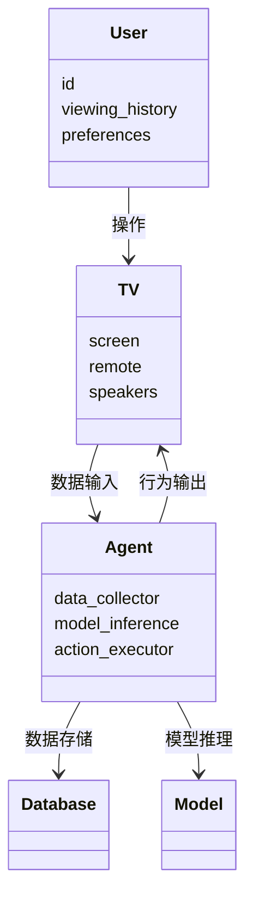
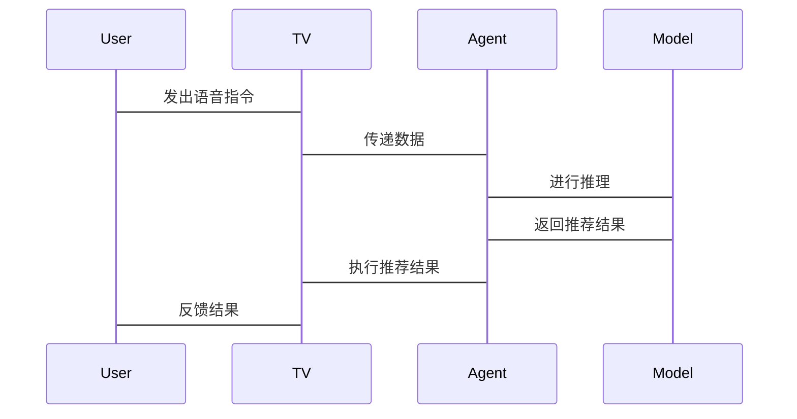

                 


关键词：智能电视, AI Agent, 用户行为分析, 机器学习, 协同过滤, 推荐系统

摘要：本文探讨了智能电视与AI Agent的结合，重点分析用户观看习惯的智能化优化。通过背景介绍、核心概念、算法原理、系统架构和项目实战，详细阐述了AI Agent在智能电视中的应用，展示了如何通过协同过滤算法优化用户体验。

---

# {{文章标题}}

> 关键词：智能电视, AI Agent, 用户行为分析, 机器学习, 协同过滤, 推荐系统

> 摘要：本文探讨了智能电视与AI Agent的结合，重点分析用户观看习惯的智能化优化。通过背景介绍、核心概念、算法原理、系统架构和项目实战，详细阐述了AI Agent在智能电视中的应用，展示了如何通过协同过滤算法优化用户体验。

---

# 第一部分：智能电视与AI Agent的背景与概念

# 第1章：智能电视与AI Agent的背景介绍

## 1.1 智能电视的发展历程

### 1.1.1 从传统电视到智能电视的演进

- **传统电视**：单一功能，仅支持观看节目。
- **智能电视**：集成了操作系统、应用程序和网络功能，支持智能推荐、语音控制等。

### 1.1.2 智能电视的核心特征

| 特征 | 描述 |
|------|------|
| 智能性 | 集成AI算法，支持智能推荐和语音交互 |
| 交互性 | 支持多模态交互，包括语音、触控和手势 |
| 开放性 | 支持第三方应用扩展 |

### 1.1.3 智能电视的生态系统

- **硬件层**：电视屏幕、芯片、传感器。
- **系统层**：操作系统（如Android TV、Tizen）。
- **应用层**：视频平台（Netflix、YouTube）、游戏应用、智能家居控制。

## 1.2 AI Agent在智能电视中的应用现状

### 1.2.1 AI Agent的基本概念

- **AI Agent**：一种智能体，能够感知环境、自主决策并执行任务。
- **特点**：智能性、自主性、反应性、社会性。

### 1.2.2 AI Agent在智能电视中的应用场景

- **智能推荐**：基于用户观看历史推荐内容。
- **语音交互**：通过语音搜索和控制电视。
- **行为预测**：预测用户的观看偏好并提前加载内容。

### 1.2.3 当前AI Agent在智能电视中的应用挑战

- **数据隐私**：如何保护用户的观看数据。
- **计算资源**：如何在有限的硬件资源上高效运行AI算法。
- **用户接受度**：用户对AI推荐的接受度和信任度。

## 1.3 用户观看习惯分析的重要性

### 1.3.1 用户观看习惯的定义

- **观看时间**：用户每天观看电视的时长。
- **观看内容**：用户偏好观看的节目类型。
- **交互行为**：用户的搜索、暂停、快进等行为。

### 1.3.2 观看习惯分析的必要性

- **提升用户体验**：通过分析观看习惯，优化推荐算法，提升用户满意度。
- **降低能耗**：通过预测用户行为，优化资源分配，降低能耗。
- **内容分发**：帮助内容提供商更好地理解用户需求，优化内容分发策略。

### 1.3.3 通过AI Agent优化观看体验的潜力

- **个性化推荐**：基于用户观看习惯，提供高度个性化的推荐。
- **实时反馈**：根据用户实时行为调整推荐策略。
- **情景感知**：结合环境因素（如时间、地点）优化推荐结果。

## 1.4 本章小结

- 介绍了智能电视的发展历程和核心特征。
- 探讨了AI Agent在智能电视中的应用场景及其挑战。
- 强调了用户观看习惯分析的重要性，并展望了AI Agent在优化用户体验中的潜力。

---

# 第二部分：AI Agent的核心概念与技术原理

# 第2章：AI Agent的基本原理

## 2.1 AI Agent的定义与特征

### 2.1.1 AI Agent的定义

- **AI Agent**：一种智能体，能够感知环境、自主决策并执行任务，具备智能性、自主性、反应性和社会性。

### 2.1.2 AI Agent的核心特征对比表格

| 特征 | 描述 |
|------|------|
| 智能性 | 基于AI算法进行决策和推理 |
| 自主性 | 能够自主决策并执行任务，无需外部干预 |
| 反应性 | 能够实时感知环境变化并做出反应 |
| 社会性 | 能够与用户和其他智能体进行交互和协作 |

## 2.2 AI Agent的核心要素

### 2.2.1 数据采集与处理

- **数据来源**：用户输入（语音、触控）、传感器数据（时间、地点）、历史行为数据。
- **数据预处理**：数据清洗、特征提取、数据归一化。

### 2.2.2 知识表示与推理

- **知识表示**：通过知识图谱表示用户偏好、内容属性等。
- **推理机制**：基于逻辑推理或机器学习模型进行决策。

### 2.2.3 行为决策与执行

- **决策算法**：基于强化学习或监督学习的决策模型。
- **执行机制**：通过API或硬件接口执行决策结果。

## 2.3 AI Agent的实体关系图（ER图）

```mermaid
graph TD
    User --> TV: 用户操作
    TV -> Agent: 数据输入
    Agent --> Database: 数据存储
    Agent --> Model: 模型推理
    Agent -> TV: 行为输出
```

## 2.4 本章小结

- 介绍了AI Agent的基本定义和核心特征。
- 分析了AI Agent的核心要素，包括数据采集、知识表示和行为决策。
- 通过ER图展示了AI Agent在智能电视中的实体关系。

---

# 第三部分：基于AI Agent的观看习惯分析算法

# 第3章：协同过滤算法

## 3.1 协同过滤算法的基本原理

### 3.1.1 基于用户的协同过滤

- **基本思想**：找到与当前用户相似的用户群体，推荐他们喜欢的内容。
- **实现步骤**：
  1. 计算用户之间的相似度。
  2. 找到相似用户的推荐列表。
  3. 综合推荐结果，生成个性化推荐。

### 3.1.2 基于物品的协同过滤

- **基本思想**：找到与当前用户感兴趣的内容相似的节目，推荐给用户。
- **实现步骤**：
  1. 计算内容之间的相似度。
  2. 找到相似内容的推荐列表。
  3. 综合推荐结果，生成个性化推荐。

## 3.2 协同过滤的数学模型

### 3.2.1 相似度计算公式

$$ sim(i,j) = \frac{\sum_{k} r_{ik} r_{jk}}{\sqrt{\sum_{k} r_{ik}^2} \sqrt{\sum_{k} r_{jk}^2}} $$

### 3.2.2 推荐评分预测公式

$$ \hat{r}_{ui} = \bar{r} + (r_u - \bar{r}_u) + (r_i - \bar{r}_i) $$

## 3.3 协同过滤的实现步骤

### 3.3.1 环境配置

```bash
pip install numpy scikit-learn
```

### 3.3.2 数据预处理

```python
import numpy as np
from sklearn.metrics.pairwise import cosine_similarity

# 示例数据：用户-节目评分矩阵
ratings = np.array([
    [4, 3, 0, 0, 5],
    [0, 0, 5, 4, 0],
    [3, 0, 0, 2, 0],
    [5, 0, 0, 0, 0]
])
```

### 3.3.3 相似度计算

```python
similarity = cosine_similarity(ratings)
print(similarity)
```

### 3.3.4 推荐结果

```python
# 假设用户ID为0，计算推荐结果
user_id = 0
similar_users = np.argsort(similarity[user_id])[::-1]
recommended_items = ratings[similar_users[0]]
print(recommended_items)
```

## 3.4 本章小结

- 介绍了协同过滤算法的基本原理，包括基于用户的协同过滤和基于物品的协同过滤。
- 提供了协同过滤的数学模型和实现步骤。
- 通过Python代码示例展示了协同过滤算法的具体实现。

---

# 第四部分：系统架构与实现

# 第4章：智能电视AI Agent的系统架构

## 4.1 系统功能设计

### 4.1.1 功能模块

| 模块 | 描述 |
|------|------|
| 数据采集 | 收集用户观看数据 |
| 数据处理 | 对数据进行清洗和特征提取 |
| 模型推理 | 使用机器学习模型进行推荐 |
| 行为执行 | 根据推荐结果执行相应操作 |

### 4.1.2 领域模型



## 4.2 系统架构设计

### 4.2.1 系统架构图

```mermaid
graph TD
    User --> TV: 用户操作
    TV -> Agent: 数据输入
    Agent --> Database: 数据存储
    Agent --> Model: 模型推理
    Agent -> TV: 行为输出
```

### 4.2.2 系统接口设计

- **输入接口**：用户输入（语音、触控）。
- **输出接口**：电视屏幕、扬声器。
- **数据接口**：数据库接口、API接口。

### 4.2.3 系统交互流程



## 4.3 本章小结

- 介绍了智能电视AI Agent的系统功能设计。
- 绘制了系统的领域模型和架构图。
- 描述了系统的接口设计和交互流程。

---

# 第五部分：项目实战与优化

# 第5章：智能电视AI Agent的项目实战

## 5.1 项目环境配置

### 5.1.1 环境安装

```bash
pip install numpy scikit-learn
```

### 5.1.2 数据准备

```python
import numpy as np

# 示例数据：用户-节目评分矩阵
ratings = np.array([
    [4, 3, 0, 0, 5],
    [0, 0, 5, 4, 0],
    [3, 0, 0, 2, 0],
    [5, 0, 0, 0, 0]
])
```

### 5.1.3 环境配置

```python
from sklearn.metrics.pairwise import cosine_similarity

similarity = cosine_similarity(ratings)
print(similarity)
```

## 5.2 系统核心实现

### 5.2.1 数据预处理

```python
# 数据清洗
def preprocess_ratings(ratings):
    ratings[ratings == 0] = np.nan
    return ratings

preprocessed_ratings = preprocess_ratings(ratings)
print(preprocessed_ratings)
```

### 5.2.2 模型训练

```python
from sklearn.impute import SimpleImputer

# 填补缺失值
imputer = SimpleImputer(missing_values=np.nan, strategy='mean')
preprocessed_ratings = imputer.fit_transform(preprocessed_ratings)
print(preprocessed_ratings)
```

### 5.2.3 模型推理

```python
# 计算相似度
similarity = cosine_similarity(preprocessed_ratings)
print(similarity)
```

## 5.3 项目小结

- 展示了智能电视AI Agent项目的具体实现步骤。
- 提供了环境配置、数据预处理和模型训练的代码示例。
- 通过项目实战帮助读者理解理论知识的实际应用。

---

# 第六部分：总结与展望

# 第6章：总结与展望

## 6.1 本章总结

- 介绍了智能电视的发展历程和AI Agent的核心概念。
- 探讨了协同过滤算法在观看习惯分析中的应用。
- 展示了智能电视AI Agent的系统架构和项目实现。

## 6.2 未来展望

- **深度学习模型的应用**：未来可以尝试使用深度学习模型（如神经网络协同过滤）来提升推荐精度。
- **多模态数据的融合**：结合用户的行为数据、环境数据等多模态数据，提升推荐的准确性。
- **个性化推荐系统的优化**：通过实时反馈和动态调整，进一步优化个性化推荐体验。

## 6.3 最佳实践 Tips

- **数据隐私保护**：在收集和处理用户数据时，必须严格遵守隐私保护法律法规。
- **计算资源优化**：在有限的硬件资源下，优化算法的计算效率。
- **用户体验提升**：注重用户体验，避免过度推荐和打扰用户。

## 6.4 本章小结

- 总结了全文的主要内容和研究成果。
- 展望了未来的研究方向和优化潜力。
- 提供了实际应用中的注意事项和最佳实践建议。

---

# 结语

通过本文的详细阐述，我们了解了智能电视与AI Agent的结合如何优化用户的观看体验。从背景介绍到算法实现，从系统架构到项目实战，我们全面探讨了观看习惯分析的智能化优化。未来，随着AI技术的不断发展，智能电视的用户体验将更加智能化和个性化。

--- 

希望这篇文章能够为智能电视领域的研究人员和开发者提供有价值的参考和启发。

