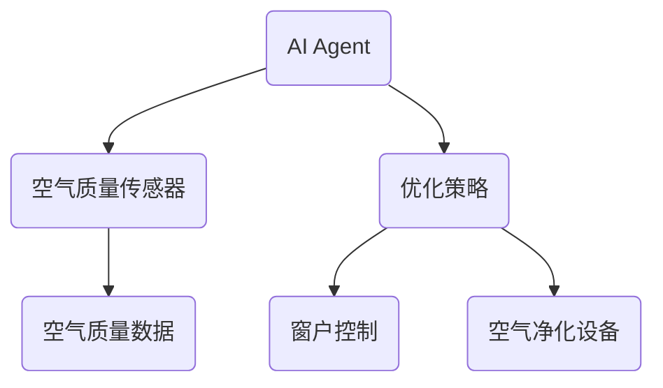
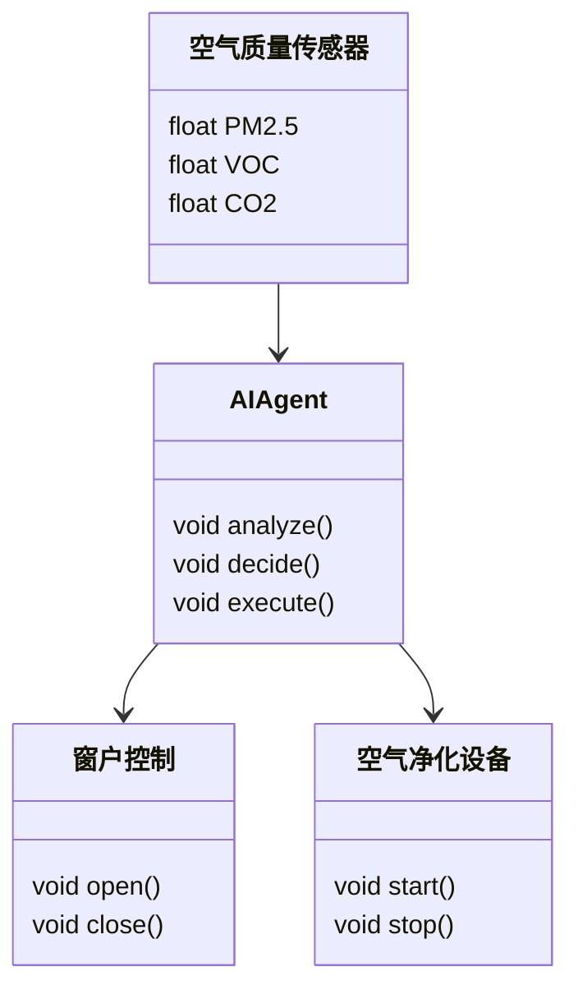
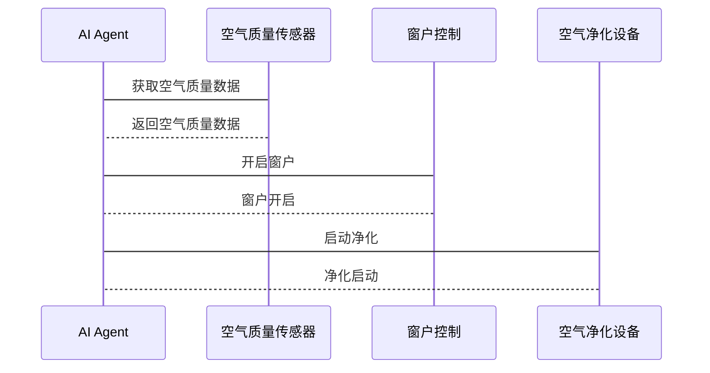

                 


# 智能窗台：AI Agent的室内空气净化优化

> 关键词：智能窗台，AI Agent，室内空气净化，空气质量优化，传感器数据，算法优化，系统设计

> 摘要：本文探讨了AI Agent在智能窗台中的应用，通过空气质量监测和优化算法，实现室内空气质量的智能化管理。文章详细介绍了核心概念、算法原理、系统架构以及项目实战，为读者提供全面的技术指导。

---

## 第1章: 室内空气质量问题与优化背景

### 1.1 室内空气质量问题概述

#### 1.1.1 室内空气质量的重要性
室内空气质量直接影响居住者的健康和生活质量。不良的空气质量可能导致呼吸系统疾病、过敏反应等问题，尤其是对于儿童、老人和免疫系统较弱的人群更为明显。

#### 1.1.2 当前室内空气净化的主要挑战
- **污染物种类多**：包括PM2.5、甲醛、挥发性有机化合物（VOC）等。
- **净化设备不足**：传统净化设备效率低，能耗高，且难以根据实时空气质量自动调整。
- **缺乏智能化**：现有净化设备大多依赖手动操作，无法根据环境变化自动优化净化策略。

#### 1.1.3 智能化空气净化的必要性
随着智能技术的发展，通过AI Agent实现智能化的空气净化成为趋势。智能化系统能够实时监测空气质量，自动调整净化设备的工作状态，从而实现高效、节能的净化效果。

### 1.2 智能窗台的概念与特点

#### 1.2.1 智能窗台的定义
智能窗台是一种结合了传感器、智能控制和AI技术的窗户系统，能够实时监测室内空气质量，并根据数据自动调整窗户的开合状态，以优化室内空气质量。

#### 1.2.2 智能窗台的核心功能
- **空气质量监测**：集成多种传感器，实时监测PM2.5、VOC、CO2等指标。
- **智能控制**：根据监测数据，自动调整窗户开合，引入新鲜空气，排出污浊空气。
- **与净化设备联动**：与其他空气净化设备（如空气净化器）联动，协同工作，提升净化效率。

#### 1.2.3 智能窗台与传统窗台的区别
智能窗台通过集成传感器和智能控制系统，能够主动响应空气质量变化，而传统窗台仅作为物理结构，无法实现智能化控制。

### 1.3 AI Agent的基本概念与作用

#### 1.3.1 AI Agent的定义
AI Agent（人工智能代理）是一种能够感知环境、做出决策并执行动作的智能实体。它能够根据环境信息自主决策，执行任务以达到目标。

#### 1.3.2 AI Agent的核心特点
- **自主性**：能够在没有外部干预的情况下自主运行。
- **反应性**：能够实时感知环境变化，并做出相应的反应。
- **目标导向**：所有行为都以实现特定目标为导向。

#### 1.3.3 AI Agent在智能窗台中的应用
在智能窗台中，AI Agent负责整合空气质量数据，分析当前空气质量状况，并根据分析结果决策是否开启窗户或启动其他净化设备，从而优化室内空气质量。

---

## 第2章: AI Agent与室内空气净化的结合

### 2.1 AI Agent的基本原理

#### 2.1.1 AI Agent的工作流程
AI Agent的工作流程包括以下几个步骤：
1. **感知环境**：通过传感器获取空气质量数据。
2. **分析数据**：对获取的数据进行分析，判断当前空气质量状况。
3. **制定决策**：根据分析结果，制定净化策略。
4. **执行动作**：根据决策结果，执行相应的动作，如开启窗户或启动净化设备。

#### 2.1.2 AI Agent的核心算法
AI Agent的核心算法包括数据采集与处理、特征提取、模型训练与预测等。常用的算法有机器学习中的监督学习和无监督学习算法。

#### 2.1.3 AI Agent的感知、决策与执行
- **感知**：通过传感器获取空气质量数据。
- **决策**：基于感知数据，判断是否需要采取净化措施。
- **执行**：根据决策结果，控制窗户或其他设备执行净化操作。

### 2.2 智能窗台中的空气质量监测

#### 2.2.1 空气质量监测的主要指标
空气质量监测的主要指标包括PM2.5、PM10、SO2、NO2、CO、VOC、CO2等。

#### 2.2.2 空气质量传感器的类型与特点
常用的空气质量传感器包括：
- **PM2.5传感器**：用于监测空气中直径小于等于2.5微米的颗粒物。
- **VOC传感器**：用于监测挥发性有机化合物。
- **CO2传感器**：用于监测二氧化碳浓度。

#### 2.2.3 空气质量数据的采集与处理
空气质量数据的采集包括传感器数据的获取和预处理。预处理步骤包括数据清洗、数据归一化等。

### 2.3 AI Agent在空气质量优化中的作用

#### 2.3.1 AI Agent如何分析空气质量数据
AI Agent通过机器学习算法对空气质量数据进行分析，识别空气质量的变化趋势，预测未来空气质量状况。

#### 2.3.2 AI Agent如何制定优化策略
基于分析结果，AI Agent制定优化策略，如开启窗户的时间、空气净化设备的运行模式等。

#### 2.3.3 AI Agent如何实现空气净化控制
AI Agent通过控制窗户的开合状态和与其他设备的联动，实现对室内空气质量的实时优化。

---

## 第3章: AI Agent的核心概念与联系

### 3.1 空气质量指标与传感器的关系

#### 3.1.1 空气质量指标的定义与分类
空气质量指标包括PM2.5、PM10、SO2、NO2、CO、VOC、CO2等。

#### 3.1.2 传感器类型与测量原理对比
| 传感器类型 | 测量原理 | 主要监测指标 |
|------------|----------|--------------|
| PM2.5传感器 | 光散射法 | PM2.5浓度 |
| VOC传感器 | 电化学法 | VOC浓度 |
| CO2传感器 | 红外吸收法 | CO2浓度 |

#### 3.1.3 空气质量指标与传感器的关联性分析
空气质量指标与传感器的关联性分析是通过统计学方法，找出各个指标之间的相关性，从而优化传感器的配置和数据处理算法。

### 3.2 AI Agent的实体关系图



---

## 第4章: 算法原理讲解

### 4.1 空气质量监测算法

#### 4.1.1 数据采集与特征提取
空气质量监测算法的核心是数据采集与特征提取。特征提取包括对传感器数据进行降维和标准化处理。

#### 4.1.2 机器学习模型训练
使用监督学习算法（如随机森林、支持向量机）对空气质量数据进行建模，训练出空气质量预测模型。

#### 4.1.3 模型优化与评估
通过交叉验证和网格搜索优化模型参数，评估模型的准确性和稳定性。

### 4.2 空气质量优化算法

#### 4.2.1 强化学习算法
强化学习算法通过与环境的交互，学习最优策略，以最小化能耗并最大化空气质量。

#### 4.2.2 算法实现
以下是一个强化学习算法的Python实现示例：

```python
import numpy as np
import gym

env = gym.make('CartPole-v1')
env.seed(1)

from gym import spaces
from collections import deque
import random

class DQN:
    def __init__(self, state_space, action_space, gamma=0.99, epsilon=1.0, eps_min=0.01, eps_dec=0.99):
        self.gamma = gamma
        self.epsilon = epsilon
        self.eps_min = eps_min
        self.eps_dec = eps_dec
        self.action_space = action_space
        self.state_space = state_space
        self.memory = deque(maxlen=1000)
        
    def remember(self, state, action, reward, next_state, done):
        self.memory.append((state, action, reward, next_state, done))
        
    def act(self, state):
        if random.random() < self.epsilon:
            return random.randint(0, self.action_space - 1)
        else:
            # 假设这里有一个预训练的模型进行预测
            # 这里简化为随机选择一个动作
            return random.randint(0, self.action_space - 1)
        
    def replay(self, batch_size):
        if len(self.memory) < batch_size:
            return
        minibatch = random.sample(self.memory, batch_size)
        states = np.array([t[0] for t in minibatch])
        actions = np.array([t[1] for t in minibatch])
        rewards = np.array([t[2] for t in minibatch])
        next_states = np.array([t[3] for t in minibatch])
        dones = np.array([t[4] for t in minibatch])
        
        # 简化处理，假设有一个预训练的模型进行预测
        # 实际应用中需要实现模型的训练和更新
        pass
        
    def decay_epsilon(self):
        self.epsilon = max(self.epsilon * self.eps_dec, self.eps_min)

# 初始化DQN代理
dqn = DQN(env.observation_space.shape[0], env.action_space.n)

# 训练过程
EPISODES = 1000
for episode in range(EPISODES):
    state = env.reset()
    done = False
    while not done:
        action = dqn.act(state)
        next_state, reward, done, info = env.step(action)
        dqn.remember(state, action, reward, next_state, done)
        dqn.replay(32)
        dqn.decay_epsilon()
        
        state = next_state
```

#### 4.2.3 算法优化与效果评估
通过强化学习算法优化空气质量优化策略，评估算法的能耗效率和空气质量提升效果。

---

## 第5章: 系统分析与架构设计

### 5.1 系统场景介绍

#### 5.1.1 智能窗台的使用场景
智能窗台主要应用于家庭、办公室、学校等需要空气净化的场所。

#### 5.1.2 系统功能需求
- 实时空气质量监测
- 智能窗户控制
- 空气净化设备联动
- 数据存储与分析

### 5.2 系统功能设计

#### 5.2.1 领域模型设计


#### 5.2.2 系统架构设计


#### 5.2.3 接口设计与交互流程


---

## 第6章: 项目实战

### 6.1 环境安装

#### 6.1.1 环境配置
安装必要的Python库：
```bash
pip install numpy pandas scikit-learn gym
```

### 6.2 核心代码实现

#### 6.2.1 空气质量监测代码
```python
import numpy as np
import pandas as pd
from sklearn.model_selection import train_test_split
from sklearn.ensemble import RandomForestRegressor

# 加载数据
data = pd.read_csv('air_quality.csv')

# 数据预处理
X = data.drop('PM2.5', axis=1)
y = data['PM2.5']

# 划分训练集和测试集
X_train, X_test, y_train, y_test = train_test_split(X, y, test_size=0.2, random_state=42)

# 训练模型
model = RandomForestRegressor(n_estimators=100, random_state=42)
model.fit(X_train, y_train)

# 模型预测
y_pred = model.predict(X_test)
```

#### 6.2.2 空气质量优化代码
```python
import gym
from gym import spaces
import random

class DQN:
    def __init__(self, state_space, action_space, gamma=0.99, epsilon=1.0, eps_min=0.01, eps_dec=0.99):
        self.gamma = gamma
        self.epsilon = epsilon
        self.eps_min = eps_min
        self.eps_dec = eps_dec
        self.action_space = action_space
        self.state_space = state_space
        self.memory = deque(maxlen=1000)
        
    def remember(self, state, action, reward, next_state, done):
        self.memory.append((state, action, reward, next_state, done))
        
    def act(self, state):
        if random.random() < self.epsilon:
            return random.randint(0, self.action_space - 1)
        else:
            return random.randint(0, self.action_space - 1)
        
    def replay(self, batch_size):
        if len(self.memory) < batch_size:
            return
        minibatch = random.sample(self.memory, batch_size)
        states = np.array([t[0] for t in minibatch])
        actions = np.array([t[1] for t in minibatch])
        rewards = np.array([t[2] for t in minibatch])
        next_states = np.array([t[3] for t in minibatch])
        dones = np.array([t[4] for t in minibatch])
        
        pass
        
    def decay_epsilon(self):
        self.epsilon = max(self.epsilon * self.eps_dec, self.eps_min)

# 初始化DQN代理
env = gym.make('CartPole-v1')
dqn = DQN(env.observation_space.shape[0], env.action_space.n)

# 训练过程
EPISODES = 1000
for episode in range(EPISODES):
    state = env.reset()
    done = False
    while not done:
        action = dqn.act(state)
        next_state, reward, done, info = env.step(action)
        dqn.remember(state, action, reward, next_state, done)
        dqn.replay(32)
        dqn.decay_epsilon()
        
        state = next_state
```

### 6.3 案例分析与优化

#### 6.3.1 实际案例分析
分析一个实际案例，展示智能窗台在不同环境下的表现。

#### 6.3.2 优化效果评估
评估优化算法在不同场景下的效果，包括能耗效率和空气质量提升效果。

### 6.4 项目小结
总结项目实施的经验，提出改进建议。

---

## 第7章: 总结与展望

### 7.1 全书内容回顾
总结本文的主要内容，强调AI Agent在智能窗台中的重要作用。

### 7.2 优化算法的局限性与改进方向
讨论当前优化算法的局限性，并提出未来的研究方向。

### 7.3 最佳实践 tips
提供一些实用的建议，帮助读者更好地实施智能窗台系统。

### 7.4 未来展望
展望AI Agent在室内空气净化领域的未来发展，提出新的研究方向和应用场景。

---

通过以上章节的详细讲解，我们系统地介绍了AI Agent在智能窗台中的应用，从理论到实践，为读者提供了全面的技术指导。

