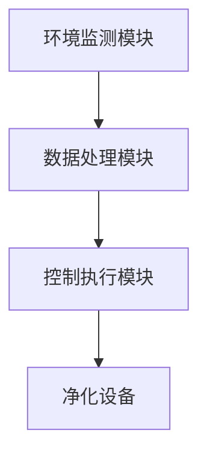
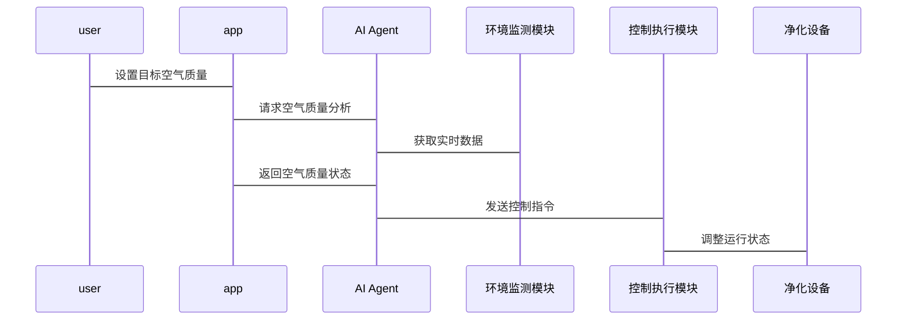

                 


# 智能窗台：AI Agent的室内空气净化控制

> 关键词：AI Agent，室内空气净化，空气质量监测，智能控制系统，机器学习

> 摘要：本文探讨了AI Agent在室内空气净化中的应用，通过分析空气质量监测、AI算法和系统架构，提出了一种智能窗台系统的设计方案，展示了如何利用AI技术提升室内空气质量控制的智能化水平。

---

# 引言

在现代生活中，室内空气质量直接影响人们的健康和舒适度。随着环境污染问题的加剧，人们对室内空气净化的需求日益增加。传统的空气净化设备虽然能有效去除污染物，但缺乏智能化的控制手段，无法根据实时环境变化进行动态调整。AI Agent（人工智能代理）的引入为解决这一问题提供了新的思路。本文将详细探讨AI Agent在室内空气净化控制中的应用，分析其核心原理和系统架构，并通过项目实战展示其实际应用价值。

---

# 第一章：背景与概述

## 1.1 问题背景

### 1.1.1 室内空气污染的现状与挑战

室内空气污染主要来源于装修材料释放的有害气体、吸烟产生的烟雾、厨房油烟、宠物皮屑以及外部污染物的进入。这些污染物可能导致过敏、呼吸系统疾病甚至癌症。随着人们对健康的关注增加，改善室内空气质量成为迫切需求。

### 1.1.2 AI Agent在智能控制中的作用

AI Agent是一种能够感知环境、自主决策并采取行动的智能系统。在室内空气净化中，AI Agent可以实时监测空气质量，分析数据并根据结果自动调整净化设备的运行状态，从而实现智能化的空气质量控制。

### 1.1.3 室内空气净化的智能化需求

传统的空气净化设备通常采用固定的运行模式，无法根据实际需求进行调整。通过引入AI Agent，系统能够实时响应环境变化，动态优化净化策略，提高能源利用效率，同时确保室内空气质量始终处于理想状态。

---

## 1.2 问题描述

### 1.2.1 室内空气质量的监测与优化

空气质量监测是实现智能化控制的基础。系统需要实时采集PM2.5、PM10、二氧化碳、甲醛、TVOC等污染物的浓度数据，并根据这些数据评估空气质量。

### 1.2.2 空气净化设备的智能控制需求

为了提高净化效率，AI Agent需要根据空气质量数据动态调整设备的运行参数，如风扇转速、过滤效率等。这不仅能够有效去除污染物，还能节省能源，降低运行成本。

### 1.2.3 AI Agent在空气净化系统中的应用前景

AI Agent的应用前景广阔，可以实现多设备协同工作，与其他智能家居系统联动，甚至通过大数据分析预测空气质量变化，提前采取措施。

---

## 1.3 问题解决

### 1.3.1 AI Agent的核心功能与优势

- **实时监测**：通过多种传感器持续采集空气质量数据。
- **智能决策**：基于机器学习算法分析数据，制定最优控制策略。
- **动态调整**：根据决策结果调整净化设备的运行状态。

### 1.3.2 智能窗台系统的解决方案

智能窗台系统通过集成空气质量传感器、AI Agent和净化设备，实现室内空气质量的智能化控制。系统能够根据环境变化自动调整净化策略，确保空气质量始终处于最佳状态。

### 1.3.3 系统的边界与外延

智能窗台系统主要关注室内空气质量的监测与控制，同时与智能家居系统联动，扩展了系统的应用范围。系统边界包括空气质量传感器、AI Agent、净化设备以及用户界面。

---

## 1.4 核心概念与联系

### 1.4.1 AI Agent的定义与特点

AI Agent是一种智能体，能够感知环境、自主决策并采取行动。其特点包括自主性、反应性、目标导向和社会能力。

### 1.4.2 室内空气质量监测技术

空气质量监测技术包括传感器技术和数据融合技术。常用的传感器有PM2.5传感器、甲醛传感器、二氧化碳传感器等。

### 1.4.3 空气净化技术的原理与分类

空气净化技术主要分为过滤、吸附、静电除尘、紫外线杀菌和负离子技术等。不同技术适用于不同的污染物。

---

## 1.5 本章小结

本章介绍了室内空气污染的现状和挑战，分析了AI Agent在智能控制中的作用，明确了系统的目标和核心概念。下一章将深入探讨AI Agent的核心原理和空气质量监测技术。

---

# 第二章：AI Agent的核心原理

## 2.1 AI Agent的基本原理

### 2.1.1 AI Agent的定义与分类

AI Agent可以分为简单反射Agent和基于模型的Agent。简单反射Agent基于预定义规则做出反应，而基于模型的Agent能够构建环境模型，进行推理和规划。

### 2.1.2 基于模型的空气质量预测

基于模型的空气质量预测需要构建环境模型，考虑传感器数据、历史数据和外部因素，预测未来空气质量。

### 2.1.3 多传感器数据融合技术

多传感器数据融合技术通过整合多个传感器的数据，提高空气质量监测的准确性和可靠性。

---

## 2.2 环境监测技术

### 2.2.1 常见环境传感器的原理与应用

- **PM2.5传感器**：通过激光散射原理测量空气中颗粒物浓度。
- **甲醛传感器**：利用电化学原理检测甲醛浓度。
- **二氧化碳传感器**：通过红外吸收原理测量二氧化碳浓度。

### 2.2.2 多传感器数据融合的实现方法

数据融合方法包括加权平均、卡尔曼滤波和神经网络融合等。通过融合多个传感器的数据，可以提高监测精度。

### 2.2.3 数据预处理与特征提取

数据预处理包括去噪、归一化和插值处理。特征提取通过主成分分析等方法提取关键特征，为后续分析提供支持。

---

## 2.3 空气净化技术

### 2.3.1 常见空气净化方法的原理

- **过滤法**：通过HEPA滤网去除颗粒物。
- **吸附法**：利用活性炭吸附有害气体。
- **静电除尘**：通过电场力捕获颗粒物。

### 2.3.2 空气净化设备的控制策略

控制策略包括恒定控制、分阶段控制和动态反馈控制。动态反馈控制根据实时空气质量调整设备运行参数。

### 2.3.3 空气净化系统的优化设计

优化设计包括模块化设计、智能控制算法和能效优化。通过优化设计，可以提高系统效率和降低能耗。

---

## 2.4 本章小结

本章详细介绍了AI Agent的基本原理、环境监测技术和空气净化技术。下一章将探讨基于机器学习的空气质量预测算法及其实现。

---

# 第三章：基于机器学习的空气质量预测

## 3.1 算法原理

### 3.1.1 机器学习在空气质量预测中的应用

机器学习算法可以用于分类和回归任务。空气质量分类任务将空气质量分为良好、中等、差等类别；回归任务预测具体的空气质量指数。

### 3.1.2 决策树与随机森林算法的原理

决策树是一种基于树状结构的分类模型，随机森林通过构建多棵决策树进行投票或平均，提高预测准确性。

### 3.1.3 算法选择与优化策略

选择合适的算法需要考虑数据特征、样本量和计算资源。优化策略包括特征选择、超参数调优和集成学习。

---

## 3.2 算法实现

### 3.2.1 数据集的构建与预处理

数据集需要包含传感器数据、时间戳和标签。预处理包括数据清洗、特征工程和数据分割。

### 3.2.2 基于决策树的空气质量分类模型

使用Scikit-learn库实现决策树分类器，训练模型并对测试数据进行预测。

### 3.2.3 算法实现的代码示例

```python
from sklearn.tree import DecisionTreeClassifier
from sklearn.model_selection import train_test_split
from sklearn.metrics import accuracy_score

# 数据预处理
X = df.drop('air_quality_label', axis=1)
y = df['air_quality_label']

X_train, X_test, y_train, y_test = train_test_split(X, y, test_size=0.2)

# 模型训练
model = DecisionTreeClassifier()
model.fit(X_train, y_train)

# 模型预测
y_pred = model.predict(X_test)

# 评估准确率
print(accuracy_score(y_test, y_pred))
```

---

## 3.3 本章小结

本章通过机器学习算法实现了空气质量预测，展示了AI Agent在智能控制中的应用。下一章将设计系统架构并实现项目。

---

# 第四章：系统架构设计与实现

## 4.1 问题场景介绍

智能窗台系统需要实时监测室内空气质量，根据数据动态调整净化设备的运行状态，确保空气质量达标。

## 4.2 系统功能设计

### 4.2.1 功能模块划分

- **环境监测模块**：采集空气质量数据。
- **数据处理模块**：分析数据并生成控制指令。
- **控制执行模块**：调整净化设备运行状态。

### 4.2.2 功能流程设计

环境监测模块将数据传输给数据处理模块，数据处理模块分析数据后向控制执行模块发送指令，控制净化设备运行。

---

## 4.3 系统架构设计

### 4.3.1 模块化设计

系统分为硬件层、数据层、算法层和应用层。硬件层负责数据采集，数据层进行数据处理，算法层实现AI算法，应用层提供用户界面。

### 4.3.2 系统架构图



---

## 4.4 系统接口设计

### 4.4.1 接口定义

- **传感器接口**：与空气质量传感器连接，获取数据。
- **控制接口**：与净化设备连接，发送控制指令。

### 4.4.2 通信协议

使用MQTT协议实现设备间通信，确保数据实时传输和系统高效运行。

---

## 4.5 系统交互设计

### 4.5.1 交互流程

用户通过手机APP设置目标空气质量，系统根据实时数据调整净化设备运行状态。

### 4.5.2 序列图



---

## 4.6 本章小结

本章详细设计了智能窗台系统的架构，并通过接口和交互设计展示了系统的实现方式。下一章将进行项目实战，展示系统实现过程。

---

# 第五章：项目实战

## 5.1 环境安装

### 5.1.1 安装Python和必要的库

安装Python 3.x和Scikit-learn、Sensor-API等库。

### 5.1.2 安装硬件设备

购买并安装空气质量传感器和净化设备，确保设备支持物联网连接。

---

## 5.2 系统核心实现

### 5.2.1 环境监测模块的实现

编写代码读取传感器数据并存储到数据库中。

```python
import sensor_api

# 读取传感器数据
data = sensor_api.get_air_quality_data()
```

### 5.2.2 数据处理模块的实现

使用机器学习模型对数据进行分析，生成控制指令。

```python
from sklearn.ensemble import RandomForestClassifier

# 训练随机森林模型
model = RandomForestClassifier()
model.fit(X_train, y_train)

# 预测空气质量
y_pred = model.predict(X_test)
```

### 5.2.3 控制执行模块的实现

根据模型预测结果，调整净化设备的运行状态。

```python
import control_api

# 发送控制指令
control_api.set_purifier_mode(mode='high')
```

---

## 5.3 代码应用解读

### 5.3.1 数据采集代码

```python
# 读取传感器数据
def get_air_quality_data():
    pm25 = sensor_api.get_pm25()
    co2 = sensor_api.get_co2()
    return {'pm25': pm25, 'co2': co2}
```

### 5.3.2 模型训练代码

```python
# 数据预处理
X = df[['pm25', 'co2']]
y = df['air_quality_label']

X_train, X_test, y_train, y_test = train_test_split(X, y, test_size=0.2)

# 训练随机森林模型
model = RandomForestClassifier(n_estimators=100)
model.fit(X_train, y_train)

# 评估模型
print(f'Accuracy: {model.score(X_test, y_test)}')
```

### 5.3.3 控制执行代码

```python
# 发送控制指令
def set_purifier_mode(mode):
    if mode == 'high':
        control_api.purifier_on()
    elif mode == 'low':
        control_api.purifier_off()
```

---

## 5.4 实际案例分析

通过实际数据测试系统的运行效果，评估空气质量预测的准确性，并根据测试结果优化系统参数。

---

## 5.5 本章小结

本章通过项目实战展示了智能窗台系统的实现过程，验证了系统的设计和算法的有效性。

---

# 第六章：最佳实践与总结

## 6.1 最佳实践

### 6.1.1 数据准确性

确保传感器数据的准确性和实时性，定期校准传感器。

### 6.1.2 系统稳定性

设计可靠的系统架构，确保系统稳定运行，避免故障发生。

### 6.1.3 安全性

确保系统数据的安全性，防止数据泄露和系统被攻击。

---

## 6.2 小结

本文详细探讨了AI Agent在室内空气净化控制中的应用，通过理论分析和项目实战展示了系统的实现过程。AI Agent的应用不仅提高了空气质量控制的智能化水平，还为智能家居系统的集成提供了新的思路。

---

## 6.3 注意事项

- 定期维护传感器和净化设备，确保系统正常运行。
- 注意数据隐私保护，避免用户信息泄露。
- 系统运行中可能出现传感器故障或网络中断，需设计容错机制。

---

## 6.4 拓展阅读

- 推荐阅读《机器学习实战》和《人工智能：现代方法》。
- 关注智能家居领域的最新动态，探索更多应用场景。

---

# 结语

通过本文的探讨，我们看到AI Agent在室内空气净化控制中的巨大潜力。未来，随着技术的进步，智能窗台系统将更加智能化和人性化，为人们创造更健康的居住环境。

---

# 参考文献

（此处列出相关文献和资料）

---

通过以上结构，您可以逐步展开每个章节的内容，深入探讨每个部分的技术细节和实现方法。

