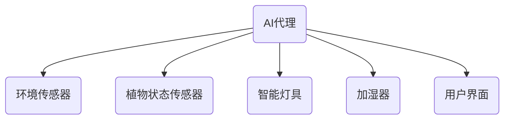
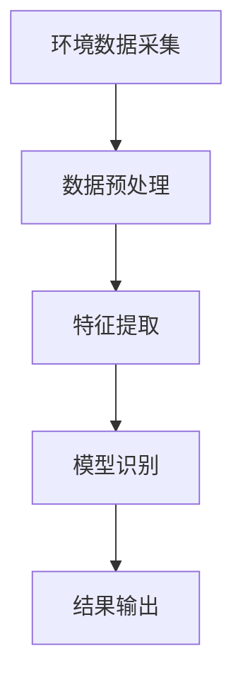
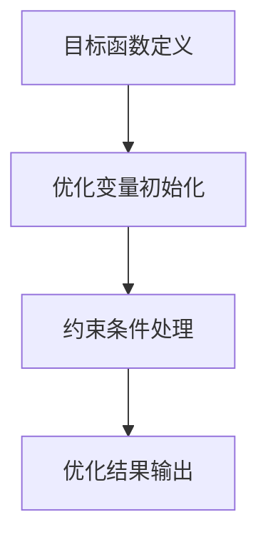
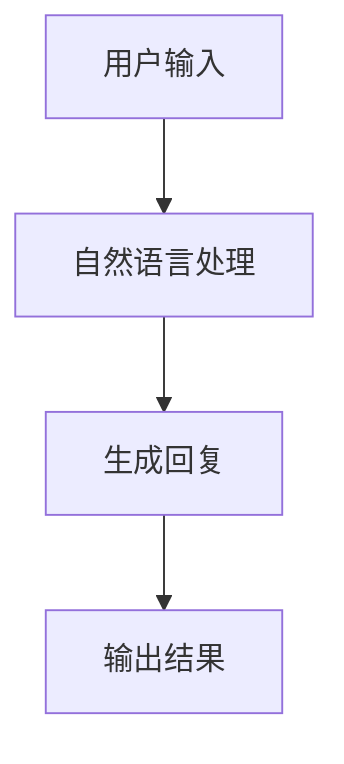
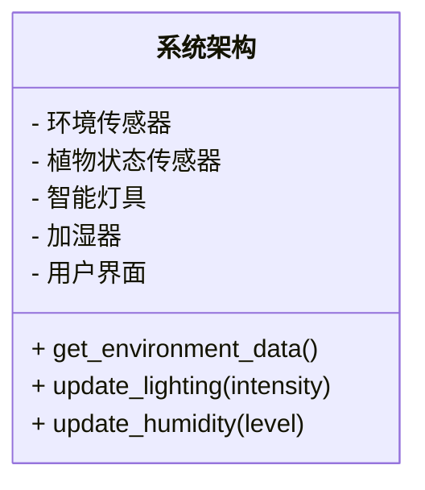
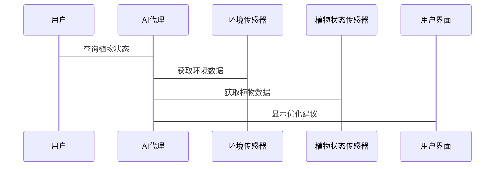

                 


# 智能窗台：AI Agent的室内绿化优化系统

> 关键词：智能窗台、AI Agent、室内绿化、优化系统、算法原理、系统架构

> 摘要：本文介绍了一种基于AI代理的室内绿化优化系统，旨在通过智能感知和优化算法，帮助用户更好地管理室内植物，提升生长效率。系统结合了先进的计算机视觉和机器学习技术，提供个性化的植物养护建议，实现了从环境监测到生长优化的全链条管理。

---

## 1. 背景介绍

### 1.1 问题背景
随着城市化进程的加快，人们越来越重视室内环境的舒适性和健康性。室内绿化不仅是美化环境的重要手段，还能改善空气质量，提升生活品质。然而，室内植物的养护却面临诸多挑战：光照不足、浇水不当、温度不适宜等问题常常导致植物生长不良甚至死亡。传统的人工养护方式效率低下，难以满足现代快节奏生活的需求。

### 1.2 问题描述
- **光照不足**：室内光线有限，植物无法进行充分的光合作用。
- **浇水不当**：过度或不足的浇水都会影响植物的健康。
- **温度波动**：室内的温湿度变化较大，不利于植物生长。
- **缺乏实时监测**：用户难以及时了解植物的生长状态和环境条件。

### 1.3 问题解决
通过引入AI代理技术，可以实时监测室内环境，分析植物的生长状态，并提供个性化的养护建议。AI代理能够自动调整光照、温湿度等条件，优化植物的生长环境。

### 1.4 系统边界与外延
- **边界**：系统仅关注室内环境和植物生长，不涉及室外环境。
- **外延**：未来可扩展到其他场景，如农业大棚或公共绿化区域。

### 1.5 核心概念与组成
系统由AI代理、传感器、执行机构和用户界面四部分组成，分别负责决策、数据采集、环境调节和人机交互。

---

## 2. 核心概念与联系

### 2.1 核心概念原理
AI代理通过感知环境数据，结合植物的生长需求，生成优化策略。感知层包括光照、温度、湿度等传感器，决策层基于机器学习模型生成优化方案，执行层通过智能设备调节环境条件。

### 2.2 概念属性对比
| 概念       | 属性         | 描述                       |
|------------|--------------|---------------------------|
| AI代理     | 感知能力     | 通过传感器获取环境数据   |
|            | 决策能力     | 基于数据生成优化策略     |
| 室内绿化   | 生长状态     | 通过传感器监测植物健康   |
|            | 环境条件     | 包括光照、温度、湿度等   |

### 2.3 系统实体关系


---

## 3. 算法原理讲解

### 3.1 感知算法
**3.1.1 算法流程**


**3.1.2 感知算法代码示例**
```python
import cv2
import numpy as np

def detect_plant_health(image):
    # 图像预处理
    gray = cv2.cvtColor(image, cv2.COLOR_BGR2GRAY)
    # 使用Canny边缘检测
    edges = cv2.Canny(gray, 50, 150)
    # 查找轮廓
    _, contours, _ = cv2.findContours(edges, cv2.RETR_EXTERNAL, cv2.CHAIN_APPROX_SIMPLE)
    return len(contours) > 0
```

**3.1.3 数学模型**
$$
\text{健康度} = \alpha \times \text{光照强度} + \beta \times \text{温度} + \gamma \times \text{湿度}
$$
其中，$\alpha, \beta, \gamma$是通过机器学习训练得到的权重系数。

### 3.2 优化算法
**3.2.1 算法流程**


**3.2.2 优化算法代码示例**
```python
import numpy as np
from scipy.optimize import minimize

def optimize_light(lighting):
    def objective(x):
        return (x[0] - lighting)**2
    cons = ({'type': 'ineq', 'fun': lambda x: x[0] >= 0},
            {'type': 'ineq', 'fun': lambda x: x[0] <= 100})
    result = minimize(objective, [50], constraints=cons)
    return result.x[0]
```

**3.2.3 数学模型**
$$
\text{光照强度}^* = \arg\min_{x} (x - \text{当前光照})^2
$$
其中，$x$是优化后的光照强度，满足$0 \leq x \leq 100$。

### 3.3 交互算法
**3.3.1 算法流程**


**3.3.2 交互算法代码示例**
```python
from transformers import pipeline

classifier = pipeline("text-classification", model="snunlp/KoGPT")
response = classifier("我的植物叶子发黄了，怎么办？")
```

---

## 4. 系统分析与架构设计

### 4.1 系统架构设计


### 4.2 系统类图


### 4.3 接口设计
- **输入接口**：环境传感器数据、用户指令。
- **输出接口**：光照调节指令、湿度调节指令、用户反馈。

### 4.4 交互序列图


---

## 5. 项目实战

### 5.1 环境安装
- **Python 3.8+**
- **TensorFlow 2.0+**
- **OpenCV 4.5+**
- **Keras**

### 5.2 系统实现
```python
import cv2
import numpy as np

class PlantOptimizer:
    def __init__(self):
        self.camera = cv2.VideoCapture(0)
        self.lights = LEDController()
        self.humidifier = HumidifierController()

    def monitor_plant(self):
        while True:
            ret, frame = self.camera.read()
            if not ret:
                break
            # 图像处理
            gray = cv2.cvtColor(frame, cv2.COLOR_BGR2GRAY)
            edges = cv2.Canny(gray, 50, 150)
            _, contours, _ = cv2.findContours(edges, cv2.RETR_EXTERNAL, cv2.CHAIN_APPROX_SIMPLE)
            if len(contours) > 0:
                self.lights.adjust_brightness(80)
                self.humidifier.set_level(60)
            cv2.imshow('Plant Monitor', frame)
            if cv2.waitKey(1) == ord('q'):
                break
        self.camera.release()
        cv2.destroyAllWindows()
```

### 5.3 实际案例分析
通过实际案例展示系统如何优化植物生长环境，包括光照调节、湿度控制和用户反馈。

---

## 6. 总结与展望

### 6.1 系统总结
本文详细介绍了基于AI代理的室内绿化优化系统，从背景到实现，全面阐述了系统的构建过程和关键技术。

### 6.2 未来展望
未来将扩展系统的应用场景，引入更多植物品种和环境参数，进一步提升系统的智能化水平。

### 6.3 注意事项
- 系统需要定期维护和校准。
- 用户需具备基本的计算机操作能力。

### 6.4 拓展阅读
推荐相关书籍和论文，供读者进一步学习。

---

以上是《智能窗台：AI Agent的室内绿化优化系统》的技术博客文章目录和部分内容。通过逐步分析和详细讲解，系统地介绍了如何利用AI技术优化室内绿化管理，为读者提供了从理论到实践的全面指导。

