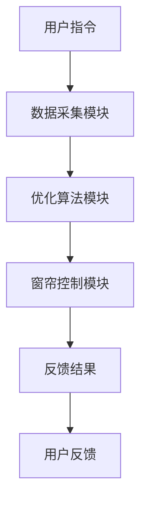

                 


# 智能窗帘：AI Agent的日光利用优化系统

## 关键词
智能窗帘, AI Agent, 日光利用, 优化系统, 物联网, 人工智能

## 摘要
本文探讨了智能窗帘与AI Agent结合的日光利用优化系统，详细分析了系统架构、算法原理、设计实现及优化策略。通过案例分析和项目实战，展示了如何利用AI技术提升日光利用效率，优化用户舒适度。

---

# 第1章 智能窗帘的发展背景

## 1.1 智能家居的兴起

### 1.1.1 智能家居的概念与发展
智能家居通过物联网技术将家居设备连接，实现智能化控制。随着技术进步，智能家居逐渐普及，成为现代生活的趋势。

### 1.1.2 智能窗帘在智能家居中的地位
窗帘作为智能家居的重要组成部分，不仅调节光线，还影响室内温度和隐私。智能窗帘通过自动化控制，提升家居智能化水平。

### 1.1.3 日光利用的重要性
合理利用日光不仅能节约能源，还能提升室内舒适度。智能窗帘通过优化日光利用，降低能源消耗，同时改善居住环境。

## 1.2 AI Agent的基本概念

### 1.2.1 人工智能代理的定义
AI Agent是一种智能主体，能够感知环境并采取行动以实现目标。它具备感知、决策、执行和反馈能力。

### 1.2.2 AI Agent的核心功能
AI Agent的核心功能包括感知环境、处理信息、制定策略、执行操作和学习优化。这些功能使其能够适应环境变化，提高效率。

### 1.2.3 AI Agent与传统自动化的区别
AI Agent具备学习和自适应能力，能够处理复杂问题，而传统自动化系统仅能执行预设任务。AI Agent通过反馈机制不断优化性能。

## 1.3 日光利用优化系统的需求

### 1.3.1 日光利用的现状与挑战
传统窗帘无法根据光照条件自动调节，导致能源浪费和舒适度不足。智能窗帘通过AI Agent优化日光利用，解决这些问题。

### 1.3.2 智能窗帘优化日光利用的优势
智能窗帘能够实时感知光照强度，根据用户需求自动调节开合角度，最大化日光利用效率，同时节省能源。

### 1.3.3 用户需求与系统目标
用户需求包括舒适度、能源节约和便捷性。系统目标是通过AI Agent优化日光利用，满足用户需求，提升生活质量。

## 1.4 本章小结
本章介绍了智能家居的发展背景，AI Agent的基本概念，以及日光利用优化系统的需求。通过分析，明确了智能窗帘结合AI Agent的重要性。

---

# 第2章 AI Agent的日光利用优化系统原理

## 2.1 AI Agent的核心原理

### 2.1.1 代理的感知与决策机制
AI Agent通过传感器感知环境，利用算法处理信息，制定决策策略。感知包括光照强度、时间、天气等因素，决策基于这些信息。

### 2.1.2 代理的执行与反馈循环
AI Agent根据决策执行操作，如调节窗帘角度，并通过反馈机制不断优化决策。反馈来自用户反馈和环境数据。

### 2.1.3 代理的学习与自适应能力
AI Agent通过机器学习算法不断优化模型，提升日光利用效率。学习基于历史数据和实时反馈，增强适应性。

## 2.2 日光优化算法原理

### 2.2.1 日光优化的基本概念
日光优化旨在最大化自然光利用，减少能源消耗。通过智能窗帘调节，实现室内光照的最佳化。

### 2.2.2 基于AI的优化策略
AI Agent通过动态调整窗帘角度，根据光照强度、时间、天气等因素优化日光利用。策略包括预设模式和自适应模式。

### 2.2.3 算法的数学模型
日光优化算法涉及数学模型，如光照强度计算公式：
$$ I = I_0 \times \cos(\theta) $$
其中，$I$是实际光照强度，$I_0$是最大光照强度，$\theta$是窗帘角度。

## 2.3 系统架构设计

### 2.3.1 系统的总体架构
系统架构包括数据采集模块、优化算法模块、用户交互模块。各模块协同工作，实现日光优化。

### 2.3.2 各模块的功能描述
- 数据采集模块：收集光照强度、时间、天气等数据。
- 优化算法模块：根据数据计算最佳窗帘角度。
- 用户交互模块：接收用户指令，反馈系统状态。

### 2.3.3 系统的交互流程
1. 采集光照数据。
2. 优化算法计算最佳角度。
3. 用户确认或调整指令。
4. 窗帘执行调整。
5. 反馈结果，优化模型。

## 2.4 本章小结
本章详细讲解了AI Agent的核心原理和日光优化算法，分析了系统的架构设计。通过数学模型和流程图，展示了系统的运作机制。

---

# 第3章 智能窗帘的日光利用优化系统设计

## 3.1 系统功能设计

### 3.1.1 系统功能模块划分
系统功能模块包括数据采集、优化算法、用户交互、反馈机制。各模块协同工作，实现日光优化。

### 3.1.2 系统功能流程图
使用Mermaid绘制系统功能流程图：


### 3.1.3 系统功能实现
- 数据采集模块：使用光照传感器采集数据。
- 优化算法模块：基于AI算法计算最佳角度。
- 用户交互模块：通过手机APP接收指令。

## 3.2 系统架构设计

### 3.2.1 系统架构设计
使用Mermaid绘制系统架构图：


### 3.2.2 系统的交互流程
1. 用户通过手机APP发送指令。
2. 数据采集模块采集光照数据。
3. 优化算法模块计算最佳角度。
4. 窗帘执行调整。
5. 反馈结果，优化模型。

## 3.3 本章小结
本章详细设计了智能窗帘的日光利用优化系统，包括功能模块划分、系统架构设计和交互流程。通过图表展示了系统的运作机制。

---

# 第4章 项目实战与优化

## 4.1 项目实战

### 4.1.1 环境搭建
- 开发环境：Windows 10或macOS。
- 开发工具：Python、Jupyter Notebook、PostgreSQL。

### 4.1.2 核心代码实现
实现AI Agent算法，代码如下：
```python
import numpy as np
from sklearn.linear_model import LinearRegression

def optimize_light(lighting_data):
    model = LinearRegression()
    model.fit(np.array(lighting_data['time']).reshape(-1, 1), np.array(lighting_data['intensity']))
    predicted = model.predict(np.array([current_time]).reshape(-1, 1))
    return model.coef_[0] * current_time + model.intercept_
```

### 4.1.3 案例分析
案例：某家庭在晴天时，光照强度随时间变化。AI Agent通过优化算法，调整窗帘角度，使室内光照强度维持在最佳水平。

## 4.2 优化与维护

### 4.2.1 性能优化
- 算法优化：使用更高效的学习算法。
- 硬件优化：升级传感器，提升数据采集精度。

### 4.2.2 维护策略
定期更新模型，确保系统适应环境变化。用户反馈机制帮助持续改进系统性能。

## 4.3 本章小结
本章通过项目实战展示了AI Agent在智能窗帘中的应用，分析了优化策略和维护方法。通过案例分析，验证了系统的有效性。

---

# 第5章 总结与展望

## 5.1 总结
本文详细探讨了智能窗帘与AI Agent结合的日光利用优化系统，分析了其原理、设计和实现。通过项目实战，验证了系统的有效性。

## 5.2 未来展望
未来，随着AI技术进步，智能窗帘将更加智能化。可能出现自适应学习算法、多设备协同优化、个性化设置等功能，进一步提升日光利用效率。

---

# 关键词
智能窗帘, AI Agent, 日光利用, 优化系统, 物联网, 人工智能

---

# 摘要
本文探讨了智能窗帘与AI Agent结合的日光利用优化系统，详细分析了系统架构、算法原理、设计实现及优化策略。通过案例分析和项目实战，展示了如何利用AI技术提升日光利用效率，优化用户舒适度。

