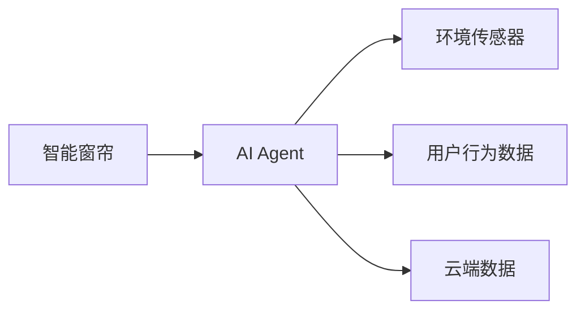
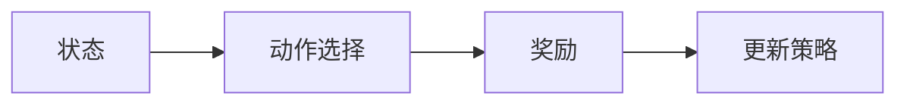
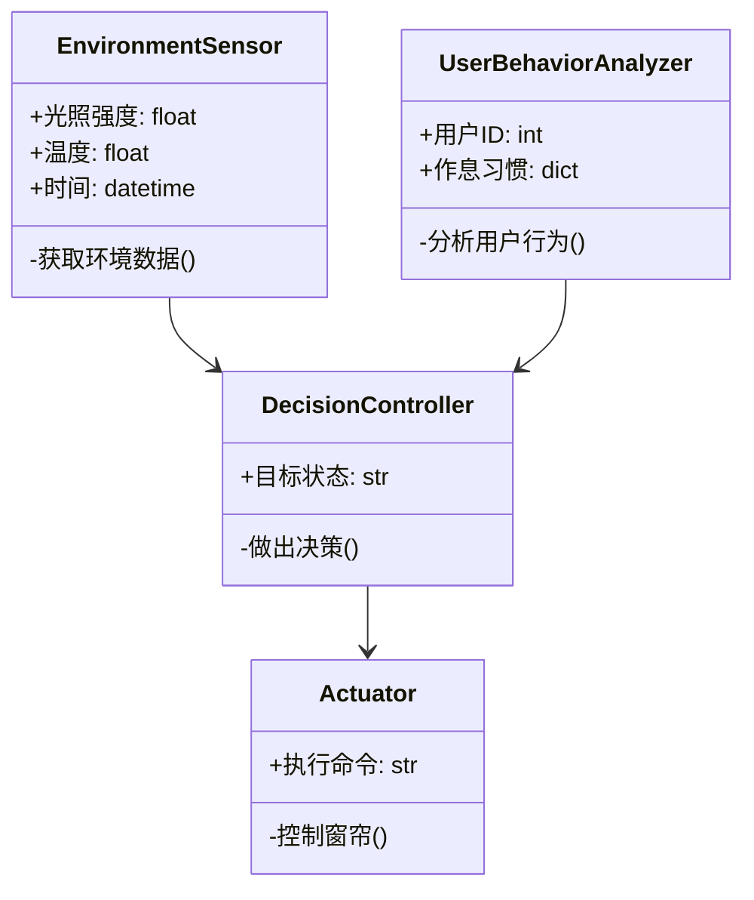
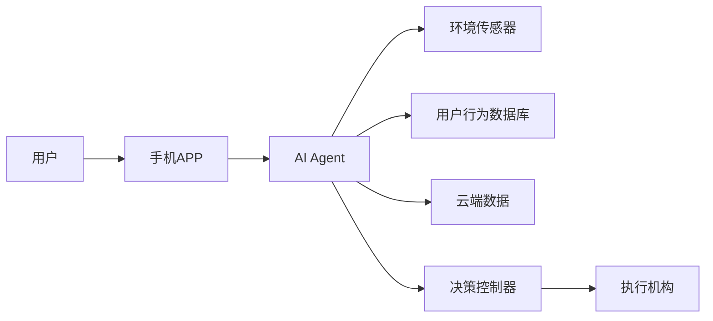

                 


# 智能窗帘：AI Agent的昼夜节律调节助手

## 关键词
智能窗帘, AI Agent, 昼夜节律, 强化学习, 系统架构, 项目实战

## 摘要
随着人工智能技术的快速发展，智能家居设备逐渐成为人们生活中不可或缺的一部分。智能窗帘作为智能家居的重要组成部分，不仅需要实现基本的开关控制，还需要能够根据用户的需求和环境的变化，自动调节窗帘的开合状态，以帮助用户调节昼夜节律，提升生活质量。本文将从AI Agent的角度出发，详细探讨智能窗帘在昼夜节律调节中的应用，分析其实现原理和系统架构，并通过实际案例展示其在智能家居中的重要作用。

---

## 第一部分：背景与概念

### 第1章：智能窗帘与AI Agent的背景介绍

#### 1.1 智能窗帘的发展历程
智能窗帘从最初的机械控制到如今的智能化控制，经历了多个阶段的发展。早期的智能窗帘主要依赖于简单的定时开关功能，用户通过预设的时间来控制窗帘的开合。随着物联网技术的普及，智能窗帘开始接入智能家居系统，能够通过手机APP远程控制。近年来，随着人工智能技术的发展，智能窗帘的功能进一步升级，不仅能够根据环境光线自动调节开合状态，还能够结合用户的作息习惯，优化室内光照环境，从而帮助用户调节昼夜节律。

#### 1.2 AI Agent的基本概念
AI Agent（人工智能代理）是一种能够感知环境并采取行动以实现目标的智能实体。在智能窗帘系统中，AI Agent负责接收环境传感器的数据（如光照强度、温度、时间等），分析用户的行为习惯，结合预设的目标（如保持室内光线适宜、节能等），做出决策并执行相应的操作（如打开或关闭窗帘）。AI Agent的核心在于其智能性和自主性，能够根据实时数据和用户需求动态调整系统的行为。

#### 1.3 昼夜节律调节的重要性
昼夜节律是指生物体随着地球自转而形成的时间节律，对人类的生理和心理活动具有重要影响。合理的昼夜节律调节有助于提高睡眠质量、增强免疫力、提升工作效率等。智能窗帘通过调节室内光线的明暗，可以有效帮助用户建立健康的昼夜节律。例如，在早晨通过模拟自然光线唤醒用户，帮助其更快进入清醒状态；在晚上通过调节光线强度帮助用户放松身心，进入良好的睡眠状态。

#### 1.4 智能窗帘与AI Agent的结合
智能窗帘与AI Agent的结合是智能家居领域的一项重要创新。通过AI Agent的强大计算能力和数据分析能力，智能窗帘能够实现从被动控制到主动调节的跨越。AI Agent不仅能够根据环境数据自动调整窗帘的开合状态，还能够结合用户的个性化需求（如作息习惯、健康状况等），提供更加贴心的服务。这种结合不仅提升了智能窗帘的功能性，还为用户带来了更加智能化、个性化的使用体验。

---

## 第二部分：核心概念与联系

### 第2章：AI Agent的核心原理

#### 2.1 AI Agent的基本原理
AI Agent的核心原理在于其感知、决策和执行能力。在智能窗帘系统中，AI Agent通过以下步骤实现昼夜节律调节：
1. **感知环境**：AI Agent通过环境传感器获取光照强度、温度、时间等数据。
2. **分析数据**：结合用户的历史行为数据和当前时间，分析用户的作息习惯和需求。
3. **制定决策**：根据分析结果，决定窗帘的开合状态。
4. **执行操作**：通过执行机构（如电机）控制窗帘的开合。

#### 2.2 昼夜节律调节的数学模型
为了实现昼夜节律调节，AI Agent需要建立一个数学模型，将光照强度、时间、用户行为等因素与用户的生理需求结合起来。一个简单的模型如下：

$$
f(t) = a \cdot \sin\left(\frac{2\pi t}{24}\right) + b
$$

其中，\( t \) 表示时间，\( a \) 和 \( b \) 是模型参数，表示光照强度随时间的变化趋势。AI Agent可以根据用户的偏好调整 \( a \) 和 \( b \) 的值，以优化室内光照环境。

#### 2.3 AI Agent与智能窗帘的实体关系
以下是AI Agent与智能窗帘的实体关系图：



---

## 第三部分：算法原理

### 第3章：AI Agent的算法实现

#### 3.1 强化学习算法
强化学习是一种通过试错机制来优化决策的算法。在智能窗帘系统中，AI Agent可以通过强化学习算法学习如何根据光照强度、时间等信息做出最优的窗帘控制决策。

**算法流程图：**



**Python代码实现：**
```python
class Agent:
    def __init__(self, state_space, action_space):
        self.state_space = state_space
        self.action_space = action_space
        self.q_table = np.zeros((state_space, action_space))
    
    def choose_action(self, state, epsilon=0.1):
        if np.random.random() < epsilon:
            return np.random.randint(self.action_space)
        else:
            return np.argmax(self.q_table[state])
    
    def update_q_table(self, state, action, reward, learning_rate=0.1):
        self.q_table[state, action] = self.q_table[state, action] + learning_rate * (reward + np.max(self.q_table[state]) - self.q_table[state, action])
```

---

## 第四部分：系统分析与架构设计

### 第4章：智能窗帘AI Agent系统架构

#### 4.1 系统功能设计
智能窗帘AI Agent系统的主要功能包括：
1. **环境感知**：通过光照传感器、温度传感器等感知环境数据。
2. **用户行为分析**：分析用户的作息习惯、偏好等。
3. **决策控制**：根据环境数据和用户行为，决策窗帘的开合状态。
4. **人机交互**：通过手机APP或语音助手与用户交互。

**领域模型类图：**



#### 4.2 系统架构设计
智能窗帘AI Agent系统的架构设计如下：



---

## 第五部分：项目实战

### 第5章：智能窗帘AI Agent的实现

#### 5.1 环境安装
为了实现智能窗帘AI Agent，需要以下硬件和软件环境：
- 窗帘电机
- 光照传感器
- 环境控制器（如Raspberry Pi）
- 开发环境（Python、TensorFlow）

#### 5.2 核心代码实现
以下是AI Agent的核心代码：

```python
import numpy as np
import time

class LightSensor:
    def get_light_intensity(self):
        # 模拟传感器数据
        return np.random.uniform(0, 100)

class AIAssistant:
    def __init__(self):
        self.light_sensor = LightSensor()
        self.user_behavior = {}  # 用户行为数据
    
    def get_environment_data(self):
        return self.light_sensor.get_light_intensity(), time.localtime().tm_hour
    
    def analyze_user_behavior(self, user_id):
        # 简单的用户行为分析
        pass
    
    def decide_action(self, light_intensity, hour):
        if hour < 6 or hour > 18:
            return '关闭'
        elif light_intensity < 50:
            return '半开'
        else:
            return '全开'
    
    def execute_action(self, action):
        print(f'执行操作：{action}')

# 示例代码
assistant = AIAssistant()
light, hour = assistant.get_environment_data()
action = assistant.decide_action(light, hour)
assistant.execute_action(action)
```

#### 5.3 案例分析
假设用户希望在早晨7点自动打开窗帘，AI Agent可以根据光照强度和时间做出决策。例如：

- 当时间在7点，且光照强度低于50时，AI Agent会决定打开窗帘。
- 如果光照强度已经足够，AI Agent则不会执行操作。

---

## 第六部分：最佳实践

### 第6章：智能窗帘AI Agent的优化与扩展

#### 6.1 小贴士
- 定期更新用户行为数据，以提高AI Agent的决策准确性。
- 根据用户的反馈优化算法参数，提升用户体验。

#### 6.2 注意事项
- 确保系统数据的安全性，防止用户隐私泄露。
- 在实际应用中，建议采用更复杂的算法（如深度强化学习）来提高系统的智能化水平。

#### 6.3 拓展阅读
- 《强化学习：理论与应用》
- 《智能建筑与物联网技术》

---

## 结语

智能窗帘作为智能家居的重要组成部分，通过AI Agent的引入，实现了从被动控制到主动调节的跨越。本文详细介绍了智能窗帘AI Agent的核心原理、系统架构和实现方法，并通过实际案例展示了其在昼夜节律调节中的应用。未来，随着人工智能技术的不断发展，智能窗帘的功能将更加智能化和个性化，为用户带来更加舒适、健康的生活体验。

