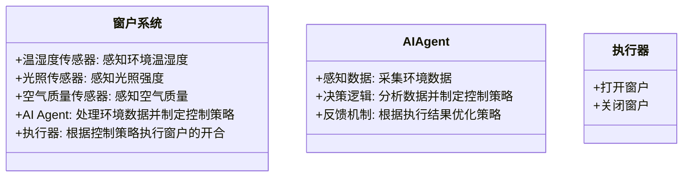
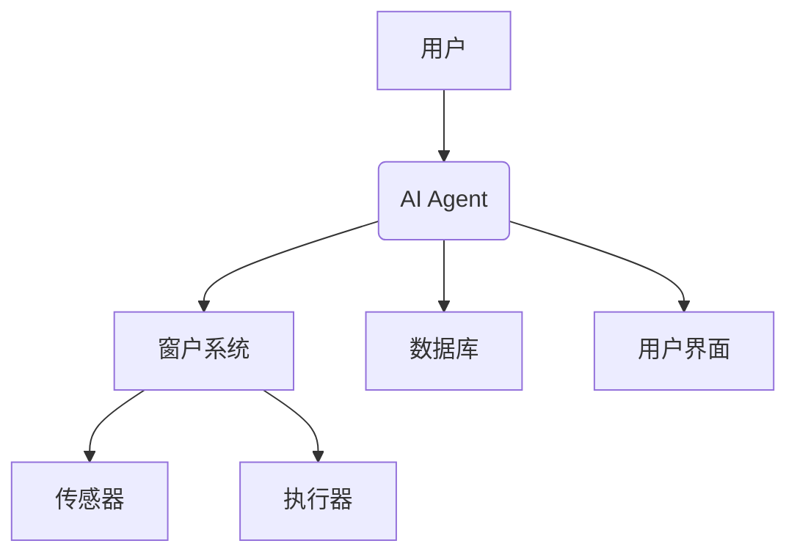
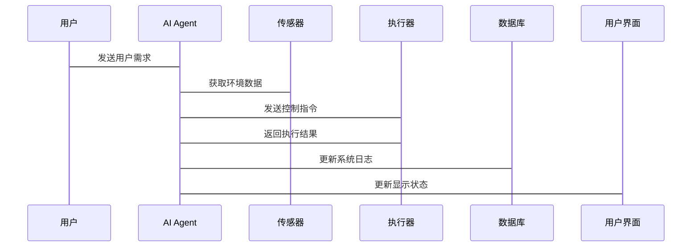

                 


# 智能窗户：AI Agent的室内温度优化控制

## 关键词：
智能窗户、AI Agent、室内温度优化、算法原理、系统架构设计、物联网、强化学习

## 摘要：
本文深入探讨了智能窗户与AI Agent结合的室内温度优化控制技术。通过分析智能窗户的核心功能、AI Agent的决策机制、强化学习算法的应用，以及系统架构设计，展示了如何利用人工智能技术实现高效、智能的室内温度调节。文章从背景介绍、核心概念、算法原理、系统设计到项目实战，全面解析了智能窗户AI Agent的实现过程。

---

# 第一部分: 背景介绍

## 第1章: 智能窗户与AI Agent概述

### 1.1 智能窗户的基本概念

#### 1.1.1 智能窗户的定义
智能窗户是一种结合了物联网技术和自动化控制的窗户系统，能够根据环境条件和用户需求，自动调节窗户的开合状态。与传统窗户不同，智能窗户集成了传感器、执行器和智能控制系统，能够实时感知环境参数并做出相应的调整。

#### 1.1.2 智能窗户的核心功能
- **环境感知**：通过传感器采集室内外温湿度、光照强度、空气质量等参数。
- **智能控制**：基于采集的环境数据，通过AI Agent进行分析和决策，自动调节窗户的开合状态。
- **能源优化**：通过优化窗户的开合状态，减少室内空调的使用，降低能源消耗。

#### 1.1.3 AI Agent在智能窗户中的作用
AI Agent（智能体）是一种能够感知环境、自主决策并执行任务的智能系统。在智能窗户中，AI Agent负责接收环境数据，分析用户需求和环境条件，制定窗户的控制策略，并通过执行器实现窗户的开合。

---

### 1.2 室内温度优化控制的背景与意义

#### 1.2.1 室内温度控制的重要性
室内温度直接影响到用户的舒适度和健康。传统的温度控制系统通常基于固定的预设值，无法根据环境变化和用户需求进行动态调整。随着能源问题的日益突出，如何高效地优化室内温度成为一个重要研究方向。

#### 1.2.2 传统温度控制的局限性
传统的温度控制系统存在以下问题：
- 基于固定阈值的控制策略，无法适应复杂的环境变化。
- 缺乏对用户行为和偏好的学习能力。
- 能源利用效率低下，无法实现真正的智能化控制。

#### 1.2.3 AI Agent在温度优化中的优势
AI Agent具有以下优势：
- **自适应性**：能够根据环境和用户需求动态调整控制策略。
- **学习能力**：通过机器学习算法，AI Agent可以不断优化其决策模型。
- **高效性**：通过智能化的控制策略，显著提高能源利用效率。

---

### 1.3 智能窗户与AI Agent的结合

#### 1.3.1 智能窗户与AI Agent的协同工作
智能窗户与AI Agent的协同工作流程如下：
1. 窗户传感器采集室内外环境数据。
2. AI Agent接收数据，结合用户需求和环境条件，制定窗户的控制策略。
3. AI Agent通过执行器（如电机）控制窗户的开合状态。
4. 系统实时反馈执行结果，并不断优化控制策略。

#### 1.3.2 AI Agent在智能窗户中的应用场景
- **节能优化**：通过AI Agent的智能控制，减少空调的使用时间，降低能源消耗。
- **舒适性优化**：根据用户的行为和偏好，动态调整窗户的开合状态，确保室内温度的舒适性。
- **应急响应**：在紧急情况下（如火灾或空气质量异常），AI Agent能够快速做出反应，确保用户的安全。

#### 1.3.3 智能窗户与物联网的融合
智能窗户与物联网的结合，使得窗户系统能够与家庭自动化系统（如智能家居、能源管理系统）无缝集成，实现更加智能化的控制。

---

## 第2章: 智能窗户与AI Agent的核心概念

### 2.1 AI Agent的基本原理

#### 2.1.1 AI Agent的定义与分类
AI Agent是一种能够感知环境、自主决策并执行任务的智能实体。根据智能水平，AI Agent可以分为：
- **反应式AI Agent**：基于当前感知的信息做出反应。
- **认知式AI Agent**：具备复杂推理和规划能力。

#### 2.1.2 AI Agent的核心功能
- **感知**：通过传感器或其他信息源获取环境数据。
- **决策**：基于感知数据和预设规则，制定行动策略。
- **执行**：通过执行器将决策转化为实际操作。

#### 2.1.3 AI Agent的决策机制
AI Agent的决策机制通常基于以下两种方式：
- **规则驱动**：基于预设的规则和逻辑进行决策。
- **数据驱动**：通过机器学习算法，基于历史数据和模式进行决策。

---

### 2.2 智能窗户的系统架构

#### 2.2.1 智能窗户的硬件组成
智能窗户的硬件组成包括：
- **传感器**：温湿度传感器、光照传感器、空气质量传感器等。
- **执行器**：电机驱动机构、电磁锁等。
- **通信模块**：Wi-Fi、蓝牙等无线通信模块。

#### 2.2.2 智能窗户的软件架构
智能窗户的软件架构包括：
- **数据采集模块**：负责采集传感器数据。
- **AI Agent模块**：负责数据处理和决策。
- **执行控制模块**：负责向执行器发送控制指令。

#### 2.2.3 智能窗户与外部系统的接口
智能窗户需要与家庭自动化系统、能源管理系统等外部系统进行接口对接，实现数据共享和协同控制。

---

### 2.3 AI Agent与智能窗户的交互机制

#### 2.3.1 AI Agent与智能窗户的数据流
1. 传感器采集环境数据并发送给AI Agent。
2. AI Agent根据环境数据和用户需求，制定窗户的控制策略。
3. AI Agent向执行器发送控制指令。
4. 执行器执行指令并反馈执行结果。

#### 2.3.2 AI Agent的感知与决策过程
AI Agent的感知与决策过程如下：
1. 传感器采集环境数据（如温湿度、光照强度）。
2. AI Agent接收数据并进行分析。
3. AI Agent结合用户需求和环境条件，制定窗户的开合策略。
4. AI Agent向执行器发送控制指令。

#### 2.3.3 AI Agent的执行与反馈机制
AI Agent的执行与反馈机制如下：
1. AI Agent向执行器发送控制指令（如“打开窗户”或“关闭窗户”）。
2. 执行器执行指令并反馈执行结果。
3. AI Agent根据反馈结果调整控制策略。

---

## 第3章: AI Agent的算法原理

### 3.1 强化学习算法在AI Agent中的应用

#### 3.1.1 强化学习的基本概念
强化学习是一种机器学习方法，通过智能体与环境的交互，学习最优策略以最大化累积奖励。强化学习的核心要素包括：
- **状态（State）**：环境的当前情况。
- **动作（Action）**：智能体采取的行为。
- **奖励（Reward）**：智能体行为的反馈，用于指导学习方向。

#### 3.1.2 强化学习算法的基本流程
1. 智能体接收环境的状态信息。
2. 智能体根据当前状态选择一个动作。
3. 智能体执行动作并获得环境的奖励。
4. 智能体根据奖励调整其策略，以优化未来决策。

#### 3.1.3 强化学习算法的数学模型
强化学习的数学模型可以用以下公式表示：
$$ Q(s, a) = Q(s, a) + \alpha (r + \gamma \max Q(s', a') - Q(s, a)) $$
其中：
- \( Q(s, a) \) 表示状态 \( s \) 下采取动作 \( a \) 的价值。
- \( \alpha \) 是学习率。
- \( r \) 是奖励。
- \( \gamma \) 是折扣因子。
- \( s' \) 是下一个状态。

#### 3.1.4 强化学习算法的实现
以下是一个基于Q-learning算法的Python实现示例：

```python
import numpy as np

# 初始化Q表
Q = np.zeros([state_space, action_space])

# 设置超参数
learning_rate = 0.1
discount_factor = 0.9
epsilon = 0.1

# Q-learning算法
for episode in range(episodes):
    state = env.reset()
    done = False
    while not done:
        # 选择动作
        if np.random.random() < epsilon:
            action = np.random.randint(action_space)
        else:
            action = np.argmax(Q[state, :])
        
        # 执行动作并获得下一个状态和奖励
        next_state, reward, done = env.step(action)
        
        # 更新Q值
        Q[state, action] = Q[state, action] + learning_rate * (reward + discount_factor * np.max(Q[next_state, :]) - Q[state, action])
        
        # 探索率衰减
        epsilon = epsilon * 0.95
```

---

### 3.2 算法在智能窗户中的具体应用

#### 3.2.1 算法选择与优化
在智能窗户中，强化学习算法可以用于优化窗户的开合策略。通过不断试验和调整，AI Agent能够找到最优的控制策略，以实现室内温度的最优化。

#### 3.2.2 算法实现的具体步骤
1. 数据采集：通过传感器采集室内外环境数据。
2. 状态表示：将环境数据和用户需求转化为状态向量。
3. 动作选择：AI Agent根据当前状态选择窗户的开合动作。
4. 奖励设计：设计合理的奖励机制，引导AI Agent学习最优策略。
5. 策略优化：通过强化学习算法不断优化AI Agent的决策策略。

---

## 第4章: 系统分析与架构设计

### 4.1 问题场景介绍

#### 4.1.1 问题背景
本文的目标是设计一种基于AI Agent的智能窗户系统，能够根据环境条件和用户需求，自动调节窗户的开合状态，实现室内温度的最优化控制。

#### 4.1.2 系统目标
系统的总体目标是：
- 实现智能窗户的自动化控制。
- 优化室内温度，提高用户舒适度。
- 减少能源消耗，降低碳排放。

#### 4.1.3 系统需求
- 实时采集室内外环境数据。
- 根据环境数据和用户需求，动态调整窗户的开合状态。
- 提供友好的用户界面，方便用户设置和控制。

---

### 4.2 系统功能设计

#### 4.2.1 领域模型设计
以下是领域模型的Mermaid类图：



---

#### 4.2.2 系统架构设计
以下是系统的整体架构图：



---

#### 4.2.3 接口设计与交互流程
以下是系统交互的Mermaid序列图：



---

## 第5章: 项目实战

### 5.1 环境安装与配置

#### 5.1.1 安装Python环境
```bash
python --version
pip install numpy
pip install matplotlib
pip install scikit-learn
```

#### 5.1.2 安装AI框架
```bash
pip install tensorflow
pip install keras
pip install gym
```

---

### 5.2 系统核心实现

#### 5.2.1 AI Agent的核心代码
```python
import gym
from gym import spaces
import numpy as np

class WindowAI:
    def __init__(self, state_space, action_space):
        self.state_space = state_space
        self.action_space = action_space
        self.Q = np.zeros([state_space, action_space])
    
    def choose_action(self, state, epsilon):
        if np.random.random() < epsilon:
            return np.random.randint(self.action_space)
        else:
            return np.argmax(self.Q[state, :])
    
    def update_Q(self, state, action, reward, next_state):
        self.Q[state, action] += 0.1 * (reward + 0.9 * np.max(self.Q[next_state, :]) - self.Q[state, action])

# 初始化环境
env = gym.make('CustomWindowEnv-v0')
env.seed(42)

# 初始化AI Agent
state_space = env.observation_space.shape[0]
action_space = env.action_space.n
ai = WindowAI(state_space, action_space)

# 训练过程
episodes = 1000
epsilon = 1.0

for episode in range(episodes):
    state = env.reset()
    done = False
    while not done:
        action = ai.choose_action(state, epsilon)
        next_state, reward, done, _ = env.step(action)
        ai.update_Q(state, action, reward, next_state)
        epsilon = max(epsilon * 0.95, 0.01)
```

---

### 5.3 实际案例分析

#### 5.3.1 案例背景
假设室内温度设定为25°C，室外温度为30°C，湿度为70%。AI Agent需要根据环境数据，动态调整窗户的开合状态。

#### 5.3.2 系统运行结果
- 当AI Agent检测到室内温度超过设定值时，会自动打开窗户进行散热。
- 当检测到室外温度过高或湿度过大时，会关闭窗户以防止热量和湿气进入室内。
- 系统通过不断优化控制策略，最终实现室内温度的最优化控制。

---

## 第6章: 总结与展望

### 6.1 总结
本文详细介绍了智能窗户与AI Agent的室内温度优化控制技术。通过强化学习算法和系统架构设计，展示了如何实现智能化的窗户控制。AI Agent能够根据环境数据和用户需求，动态调整窗户的开合状态，从而实现室内温度的最优化控制。

---

### 6.2 展望
未来的研究方向包括：
1. **算法优化**：进一步优化强化学习算法，提高AI Agent的决策效率。
2. **多目标优化**：在优化室内温度的同时，考虑能源消耗、空气质量等多目标优化问题。
3. **人机交互**：设计更加智能化的用户界面，提升用户体验。

---

## 第7章: 最佳实践

### 7.1 小结
智能窗户与AI Agent的结合，不仅提高了室内温度的舒适性，还显著降低了能源消耗。通过本文的分析和实现，我们可以看到AI技术在智能家居领域的巨大潜力。

---

### 7.2 注意事项
- 在实际应用中，需要根据具体环境和用户需求，调整AI Agent的参数和策略。
- 系统的安全性和稳定性需要高度重视，确保系统的可靠运行。

---

### 7.3 拓展阅读
1. **强化学习**：深入学习强化学习的核心概念和算法。
2. **智能建筑**：研究智能建筑的其他应用场景，如智能照明、智能安防等。
3. **边缘计算**：探索边缘计算在智能窗户中的应用，提高系统的实时性和响应速度。

---

通过本文的详细讲解，读者可以全面了解智能窗户与AI Agent的室内温度优化控制技术，并能够将其应用到实际项目中。

