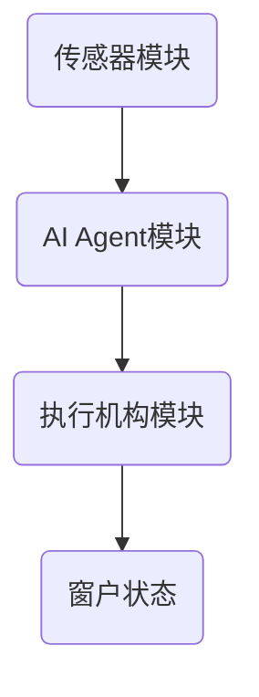

                 


# 智能窗户：AI Agent的空气质量控制

## 关键词：智能窗户、AI Agent、空气质量控制、物联网、机器学习

## 摘要：本文详细探讨了智能窗户结合AI Agent进行空气质量控制的技术实现。从背景介绍、核心概念、算法原理到系统架构设计，再到项目实战和最佳实践，全面分析了如何利用AI技术优化室内空气质量。

---

## 第一部分：智能窗户与AI Agent概述

### 第1章：智能窗户的基本概念

#### 1.1 智能窗户的定义
智能窗户是一种集成物联网技术的窗户系统，能够根据环境条件自动调节开合状态，以优化室内空气质量、温度和湿度等参数。

#### 1.2 智能窗户的发展历程
智能窗户的概念起源于20世纪90年代，随着物联网技术的发展，逐渐从单一的温控功能扩展到空气质量控制。

#### 1.3 智能窗户的应用场景
智能窗户广泛应用于家庭、办公室、学校等场所，特别是在空气质量较差的地区，能够有效改善室内环境。

---

### 第2章：AI Agent的基本概念

#### 2.1 AI Agent的定义
AI Agent是一种能够感知环境、做出决策并执行动作的智能实体，能够帮助用户完成特定任务。

#### 2.2 AI Agent的核心特征
- 感知能力：通过传感器获取环境数据。
- 决策能力：基于数据进行分析和决策。
- 执行能力：通过执行机构实现动作。

#### 2.3 AI Agent与传统自动控制系统的区别
AI Agent能够自主学习和适应环境，而传统系统仅能按照预设规则运行。

---

## 第二部分：空气质量控制的背景与需求

### 第3章：空气质量控制的背景

#### 3.1 当前空气质量问题的严重性
随着工业化进程加快，空气污染问题日益严重，直接影响人类健康。

#### 3.2 空气污染对人类健康的影响
长期暴露在污染环境中会导致呼吸系统疾病、心脏病等多种健康问题。

#### 3.3 空气质量控制的重要性
通过有效控制室内空气质量，可以显著改善居住环境，提升生活质量。

---

### 第4章：传统窗户的局限性

#### 4.1 传统窗户的功能限制
传统窗户仅能手动调节，无法根据环境变化自动调整。

#### 4.2 传统窗户在空气质量控制中的不足
无法实时监测空气质量，无法有效过滤污染物。

#### 4.3 智能窗户的优势
能够实时监测空气质量，并根据数据自动调节窗户开合状态。

---

## 第三部分：AI Agent在智能窗户中的核心概念

### 第5章：AI Agent的基本原理

#### 5.1 AI Agent的感知机制
通过传感器获取空气质量数据，如PM2.5、温湿度等。

#### 5.2 AI Agent的决策机制
基于感知数据，利用机器学习模型做出决策，如开启或关闭窗户。

#### 5.3 AI Agent的执行机制
通过执行机构（如电机）调节窗户的开合状态。

---

### 第6章：空气质量监测与数据采集

#### 6.1 空气质量监测传感器
- **PM2.5传感器**：用于监测空气中细颗粒物浓度。
- **温湿度传感器**：用于监测环境温湿度。

#### 6.2 数据采集与预处理
将传感器数据进行采集，并进行清洗、归一化等预处理，以便后续分析。

---

## 第四部分：空气质量预测的算法原理

### 第7章：空气质量预测算法

#### 7.1 机器学习模型选择
使用随机森林或支持向量机（SVM）进行空气质量预测。

#### 7.2 数据特征提取
从传感器数据中提取有效特征，如PM2.5浓度、温度、湿度等。

#### 7.3 模型训练与优化
通过训练数据训练模型，并进行参数调优，以提高预测准确率。

#### 7.4 数学模型
空气质量预测模型如下：
$$
\text{预测值} = a \times PM2.5 + b \times 温度 + c \times 湿度
$$

---

## 第五部分：系统分析与架构设计

### 第8章：系统架构设计

#### 8.1 系统整体架构
- **传感器模块**：采集空气质量数据。
- **AI Agent模块**：处理数据并做出决策。
- **执行机构模块**：根据决策调节窗户状态。

#### 8.2 系统架构图


---

## 第六部分：项目实战

### 第9章：空气质量预测系统实现

#### 9.1 环境安装
- 安装Python、NumPy、Scikit-learn等库。

#### 9.2 核心代码实现
```python
import numpy as np
from sklearn.ensemble import RandomForestRegressor

# 数据预处理
data = np.array([[25, 70], [30, 65], [20, 80], [28, 75]])
target = np.array([1.2, 1.5, 0.8, 1.1])

# 训练模型
model = RandomForestRegressor(n_estimators=100)
model.fit(data, target)

# 预测空气质量
new_data = np.array([[25, 70]])
prediction = model.predict(new_data)
print("预测空气质量：", prediction[0])
```

---

## 第七部分：总结与展望

### 第10章：总结

#### 10.1 项目总结
通过AI Agent和智能窗户的结合，能够有效控制室内空气质量，提升居住舒适度。

#### 10.2 最佳实践
- 定期更新传感器数据，确保模型准确率。
- 优化算法，提升决策效率。

### 第11章：注意事项

#### 11.1 系统维护
定期检查传感器和执行机构，确保系统正常运行。

#### 11.2 数据安全
保护用户隐私，确保数据安全。

---

## 第八部分：未来展望

### 第12章：未来发展方向

#### 12.1 智能窗户的智能化升级
引入更多AI技术，如图像识别、自然语言处理，提升用户体验。

#### 12.2 多场景应用
将智能窗户应用于更多场景，如学校、医院、公共场所等。

---

通过以上内容，我们可以看到，智能窗户结合AI Agent进行空气质量控制，不仅提升了室内环境质量，也为未来的智能家居发展提供了新的方向。

