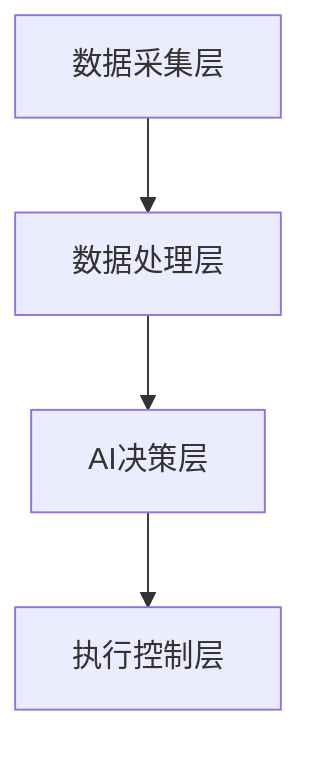

                 


# 智能花园灌溉系统：AI Agent的精准浇水控制

> **关键词**：智能灌溉系统，AI Agent，精准浇水，传感器，自动控制，农业智能化

> **摘要**：随着农业智能化的发展，智能花园灌溉系统通过AI Agent实现精准浇水控制，有效提高灌溉效率，减少资源浪费。本文详细分析了智能灌溉系统的背景、核心概念、AI Agent的工作原理、系统架构设计以及实际项目实施，帮助读者全面了解智能灌溉系统的技术实现与应用。

---

## 第一章 智能花园灌溉系统背景与问题分析

### 1.1 智能花园灌溉系统的背景

#### 1.1.1 传统灌溉系统的局限性
传统灌溉系统主要依赖人工操作，存在以下问题：
- 灌溉时间固定，无法根据土壤湿度、天气变化灵活调整。
- 水资源浪费严重，无法精准控制水量。
- 缺乏实时监测和反馈机制，无法及时应对突发情况。

#### 1.1.2 智能化灌溉的需求驱动
随着环境资源的日益紧张和农业高效化的需求，智能化灌溉系统成为必然趋势：
- 提高水资源利用效率。
- 减少人力成本。
- 实现精准灌溉，提升作物产量和品质。

#### 1.1.3 AI Agent在灌溉系统中的作用
AI Agent（智能代理）通过实时数据分析和决策，实现灌溉系统的智能化管理：
- 自动感知环境数据。
- 智能决策灌溉时间和量。
- 实现与外部系统的协同工作。

### 1.2 智能花园灌溉系统的问题描述

#### 1.2.1 灌溉效率低下
传统灌溉系统无法根据土壤湿度和天气变化自动调整，导致水资源浪费和作物生长不均匀。

#### 1.2.2 资源浪费问题
水资源浪费不仅浪费经济成本，还可能对环境造成负担。

#### 1.2.3 环境监测与实时反馈的缺失
缺乏实时监测和反馈机制，无法及时应对土壤湿度异常或天气变化。

### 1.3 智能灌溉系统的解决方案

#### 1.3.1 AI Agent的核心作用
AI Agent通过实时数据分析和智能决策，实现精准灌溉控制。

#### 1.3.2 多传感器融合技术的应用
结合土壤湿度传感器、环境温湿度传感器和光照强度传感器，提供全面的环境数据。

#### 1.3.3 精准控制与优化策略
通过AI算法优化灌溉策略，实现精准浇水，提升灌溉效率。

### 1.4 智能灌溉系统的边界与外延

#### 1.4.1 系统功能边界
- 数据采集：土壤湿度、温湿度、光照强度。
- 数据处理：环境数据的分析和处理。
- 决策控制：根据数据决策灌溉时间和量。
- 执行控制：控制水泵、雨棚和灯光等执行器。

#### 1.4.2 与外部系统的接口
- 与天气预报系统接口，获取天气数据。
- 与作物生长监测系统接口，获取作物状态。
- 与用户终端接口，提供灌溉建议和历史数据。

#### 1.4.3 系统的可扩展性
- 支持新增传感器和执行器。
- 支持多种通信协议，便于与其他系统集成。

### 1.5 智能灌溉系统的核心概念结构

#### 1.5.1 系统组成要素
- 传感器：土壤湿度传感器、环境温湿度传感器、光照强度传感器。
- 执行器：水泵、雨棚、灯光。
- AI Agent：决策模块。
- 数据传输：网络通信模块。

#### 1.5.2 各要素之间的关系
- 传感器采集数据，传输到AI Agent。
- AI Agent根据数据进行决策，控制执行器执行动作。
- 数据和决策结果可通过网络传输到用户终端。

#### 1.5.3 系统整体架构
- 分层架构：数据采集层、数据处理层、AI决策层、执行控制层。
- 模块化设计：各功能模块独立，便于维护和扩展。

---

## 第二章 AI Agent的核心原理与实现

### 2.1 AI Agent的基本原理

#### 2.1.1 AI Agent的定义与特点
AI Agent是一种能够感知环境、自主决策并执行任务的智能实体，具有以下特点：
- 智能性：能够自主决策。
- 反应性：能够实时感知环境并做出反应。
- 学习性：能够通过数据学习优化决策策略。

#### 2.1.2 AI Agent与传统自动控制的区别
| 特性 | 传统自动控制 | AI Agent |
|------|--------------|----------|
| 决策方式 | 基于预设规则 | 基于实时数据和学习 |
| 灵活性 | 较低 | 较高 |
| 复杂环境适应性 | 较差 | 较强 |

### 2.2 AI Agent的核心算法

#### 2.2.1 模糊控制算法
模糊控制算法通过模糊逻辑处理不精确的信息，适用于土壤湿度等模糊数据的处理。

#### 2.2.2 强化学习算法
强化学习算法通过奖励机制优化决策策略，适用于复杂环境下的决策。

#### 2.2.3 组合优化算法
组合优化算法将多种算法结合，提升决策的准确性和效率。

---

## 第三章 系统架构与实现

### 3.1 系统架构设计

#### 3.1.1 系统功能模块划分
- 数据采集模块：负责采集土壤湿度、温湿度、光照强度等数据。
- 数据处理模块：对采集数据进行分析和预处理。
- AI Agent决策模块：基于数据做出灌溉决策。
- 执行控制模块：根据决策控制水泵等执行器。

#### 3.1.2 系统架构的分层设计
- 数据采集层：传感器采集数据。
- 数据处理层：数据预处理和特征提取。
- AI决策层：基于机器学习算法进行决策。
- 执行控制层：执行灌溉控制。

#### 3.1.3 系统架构的分层架构图


---

## 第四章 项目实战

### 4.1 环境安装

#### 4.1.1 系统安装步骤
1. 安装传感器和执行器。
2. 配置网络通信模块。
3. 安装AI Agent决策系统。

### 4.2 系统核心实现

#### 4.2.1 核心代码实现
```python
import numpy as np
from sklearn import linear_model

# 数据采集
soil_humidity = np.array([70, 65, 80, 75])  # 土壤湿度数据
temperature = np.array([25, 22, 28, 23])     # 温度数据
humidity = np.array([60, 55, 70, 65])        # 湿度数据

# 数据处理
X = np.stack((soil_humidity, temperature, humidity), axis=1)
y = np.array([1, 0, 1, 0])  # 是否需要灌溉的标签

# 模型训练
model = linear_model.LogisticRegression()
model.fit(X, y)

# 决策逻辑
def decide_irrigate(soil_humidity, temperature, humidity):
    data = np.array([[soil_humidity, temperature, humidity]])
    prediction = model.predict(data)
    return prediction[0]
```

#### 4.2.2 代码解读
- 数据采集：读取土壤湿度、温度和湿度数据。
- 数据处理：将数据转换为模型可处理的格式。
- 模型训练：使用逻辑回归模型训练灌溉决策模型。
- 决策逻辑：根据当前环境数据，预测是否需要灌溉。

### 4.3 实际案例分析

#### 4.3.1 案例1：晴天土壤湿度低
环境数据：土壤湿度60%，温度25℃，湿度60%。
决策：需要灌溉。

#### 4.3.2 案例2：雨天土壤湿度高
环境数据：土壤湿度80%，温度22℃，湿度70%。
决策：不需要灌溉。

---

## 第五章 最佳实践

### 5.1 小结
智能花园灌溉系统通过AI Agent实现精准浇水控制，有效提高灌溉效率，减少资源浪费。

### 5.2 注意事项
- 定期维护传感器和执行器，确保系统正常运行。
- 及时更新AI模型，提升决策准确性。
- 注意数据隐私和系统安全。

### 5.3 拓展阅读
- 《机器学习实战》
- 《物联网技术与应用》
- 《智能控制系统设计》

---

通过以上目录结构，本文系统地介绍了智能花园灌溉系统的背景、核心概念、AI Agent的原理与实现、系统架构设计以及实际项目实施，为读者提供全面的技术指导和实践参考。

