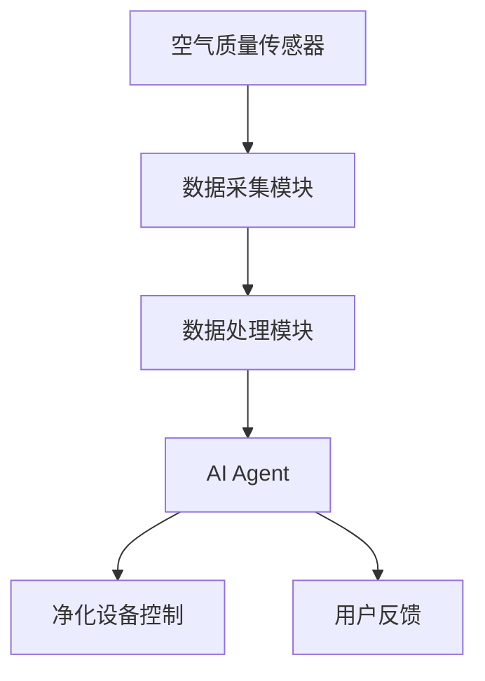
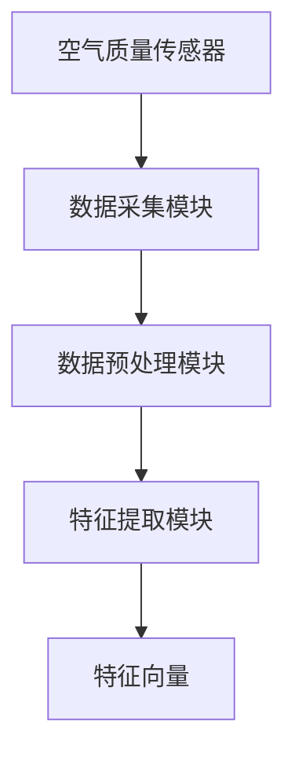
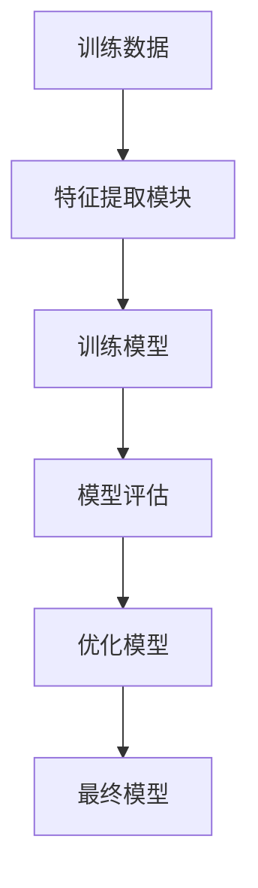

                 


# 智能花瓶：AI Agent的室内空气净化监测

## 关键词：AI Agent、物联网、室内空气质量、传感器、数据处理、算法优化

## 摘要：本文探讨了智能花瓶的设计与实现，利用AI Agent和物联网技术，通过传感器数据采集、特征提取和模型训练，实现对室内空气质量的智能监测与优化，为智能家居环境监测提供了一种创新解决方案。

---

# 第一部分: 智能花瓶与AI Agent的背景介绍

## 第1章: 问题背景与概念结构

### 1.1 问题背景

#### 1.1.1 室内空气质量问题的现状
室内空气质量直接影响居民的健康和舒适度。随着城市化进程的加快，室内空气污染问题日益严重。主要污染源包括甲醛、挥发性有机物（VOCs）、PM2.5、二氧化碳等。这些污染物可能导致呼吸系统疾病、过敏反应以及认知功能下降等问题。

#### 1.1.2 当前空气净化设备的局限性
传统的空气净化设备主要依赖于机械过滤和化学吸附技术，存在以下问题：
- 传感器精度不足，无法实时准确监测多种污染物。
- 缺乏智能化，无法根据环境变化自动调节净化模式。
- 无法与其他智能家居设备协同工作，难以实现全面的环境优化。

#### 1.1.3 AI技术在环境监测中的潜力
人工智能技术在环境监测中的应用越来越广泛。AI Agent（智能体）能够通过传感器数据实时感知环境状态，结合历史数据和用户行为模式，优化空气净化策略。这种智能化的解决方案可以显著提升室内空气质量监测的准确性和效率。

### 1.2 问题描述

#### 1.2.1 室内空气质量监测的核心问题
- 多种污染物的实时监测与识别。
- 数据采集的准确性与稳定性。
- 如何利用AI技术实现智能化的空气净化控制。

#### 1.2.2 用户需求与痛点分析
- 用户希望获得实时的空气质量数据。
- 用户需要自动化的净化解决方案，减少手动操作。
- 用户希望设备能够与其他智能家居设备联动，实现整体环境优化。

#### 1.2.3 智能花瓶的设计目标
智能花瓶是一种结合了装饰与功能的创新产品，旨在通过AI Agent技术实现以下目标：
- 实时监测室内空气质量。
- 自动调节净化设备的工作模式。
- 提供可视化反馈，帮助用户了解环境状态。

### 1.3 问题解决

#### 1.3.1 AI Agent的定义与作用
AI Agent是一种能够感知环境、自主决策并执行任务的智能实体。在智能花瓶中，AI Agent负责处理传感器数据、分析环境状态并控制净化设备。

#### 1.3.2 智能花瓶的创新设计思路
- 结合花卉装饰与空气质量传感器，实现美观与功能的统一。
- 利用AI算法优化传感器数据处理，提高监测精度。
- 通过物联网技术实现与智能家居设备的联动。

#### 1.3.3 技术实现的可行性分析
- 传感器技术成熟，可以实现多种污染物的实时监测。
- AI算法在环境监测中的应用已经较为成熟，具备良好的技术基础。
- 物联网技术的发展为设备联动提供了可靠的技术支持。

### 1.4 边界与外延

#### 1.4.1 系统功能的边界定义
- 智能花瓶仅负责空气质量监测与净化控制，不涉及其他环境参数（如温度、湿度）。
- 系统仅支持本地控制，不考虑远程云端服务。

#### 1.4.2 与其他智能家居设备的协同关系
- 可与智能空调、加湿器等设备联动，协同优化室内环境。
- 通过物联网平台实现数据共享与设备联动。

#### 1.4.3 产品适用场景的扩展性分析
- 适用于家庭、办公室、学校等室内环境。
- 可扩展支持更多类型的污染物监测。

### 1.5 概念结构与核心要素

#### 1.5.1 系统整体架构图


#### 1.5.2 核心要素的对比分析
| 核心要素 | 描述 |
|----------|------|
| 传感器   | 用于采集空气质量数据，如PM2.5、甲醛、VOCs等。 |
| 数据处理模块 | 对传感器数据进行预处理、特征提取和数据融合。 |
| AI Agent | 负责数据分析、环境状态判断和决策控制。 |
| 净化设备 | 根据AI Agent的指令调整工作模式，实现空气净化。 |
| 用户反馈 | 通过显示屏或手机APP向用户展示环境数据和净化建议。 |

#### 1.5.3 本章小结
本章从问题背景出发，详细描述了智能花瓶的设计目标和实现路径，并通过概念结构图和对比分析，明确了系统的组成和各部分的功能。

---

## 第2章: AI Agent与物联网的基本原理

### 2.1 AI Agent的核心概念

#### 2.1.1 AI Agent的定义与分类
AI Agent是一种智能实体，能够感知环境、自主决策并执行任务。根据智能水平，AI Agent可以分为：
- **反应式AI Agent**：基于当前感知做出反应，不依赖历史信息。
- **认知式AI Agent**：具备复杂推理和规划能力，能够处理历史信息和目标。

#### 2.1.2 AI Agent的基本特征
| 特征         | 描述                         |
|--------------|------------------------------|
| 感知能力     | 能够通过传感器或其他方式感知环境。 |
| 决策能力     | 能够根据感知信息做出决策。     |
| 执行能力     | 能够通过执行器或其他方式执行决策。 |
| 学习能力     | 能够通过数据学习优化性能。     |

#### 2.1.3 AI Agent与传统算法的区别
| 方面         | AI Agent                     | 传统算法                     |
|--------------|-------------------------------|-----------------------------|
| 智能性       | 具备自主决策能力             | 需要人工编程实现             |
| 环境适应性   | 能够根据环境变化自动调整     | 需要人工干预或重新编程       |
| 学习能力     | 能够通过数据学习优化性能     | 无法自适应优化               |

### 2.2 物联网的基本原理

#### 2.2.1 物联网的定义与组成
物联网（Internet of Things, IoT）是指通过各种信息传感设备，如传感器、射频识别（RFID）、全球定位系统（GPS）、红外感应器等，按照约定的协议，把任何物品与互联网连接起来，进行信息交换和通信，以实现智能化识别、定位、跟踪、监控和管理。

#### 2.2.2 物联网的核心技术
| 技术         | 描述                         |
|--------------|------------------------------|
| 传感器技术   | 用于采集环境数据             |
| 通信技术     | 用于设备间的数据传输         |
| 数据处理技术 | 用于数据的存储、分析和应用     |

#### 2.2.3 物联网与AI
物联网为AI技术提供了丰富的数据来源，而AI技术则为物联网设备提供了智能化的决策能力。两者的结合能够显著提升系统的智能化水平和数据处理能力。

---

## 第3章: 算法原理与实现

### 3.1 数据采集与特征提取

#### 3.1.1 数据采集流程


#### 3.1.2 特征提取实现
传感器数据预处理包括：
- 数据清洗：去除噪声和异常值。
- 数据标准化：将不同量纲的数据统一到同一量纲。
- 数据融合：结合多个传感器的数据，提高监测精度。

特征提取包括：
- 时间序列特征：如均值、方差、最大值、最小值等。
- 统计特征：如频率分布、偏度、峰度等。

### 3.2 模型训练与优化

#### 3.2.1 模型选择
选择适合空气质量预测的模型，如支持向量机（SVM）、随机森林（Random Forest）、神经网络等。

#### 3.2.2 模型训练流程


#### 3.2.3 模型评估与优化
使用交叉验证、ROC曲线等方法评估模型性能，并通过超参数调整、特征选择等方法优化模型。

### 3.3 算法实现

#### 3.3.1 数据预处理代码
```python
import numpy as np
import pandas as pd

# 读取数据
data = pd.read_csv('air_quality.csv')

# 数据清洗
data.dropna(inplace=True)
data = data.iloc[:100]  # 取前100条数据

# 数据标准化
from sklearn.preprocessing import StandardScaler

scaler = StandardScaler()
scaled_data = scaler.fit_transform(data[['PM2.5', '甲醛', 'VOCs']])
```

#### 3.3.2 特征提取代码
```python
from sklearn.decomposition import PCA

pca = PCA(n_components=3)
principal_components = pca.fit_transform(scaled_data)
```

#### 3.3.3 模型训练代码
```python
from sklearn.svm import SVC

model = SVC()
model.fit(principal_components, data['空气质量指数'])
```

#### 3.3.4 模型评估代码
```python
from sklearn.metrics import accuracy_score

y_pred = model.predict(principal_components)
print('准确率:', accuracy_score(data['空气质量指数'], y_pred))
```

---

## 第4章: 系统架构与实现

### 4.1 系统架构设计

#### 4.1.1 系统组成


#### 4.1.2 系统功能模块
- 数据采集模块：负责采集空气质量数据。
- 数据处理模块：对数据进行预处理和特征提取。
- AI Agent模块：负责数据分析和决策控制。
- 净化设备控制模块：根据AI Agent的指令调整净化设备的工作模式。
- 用户反馈模块：通过显示屏或手机APP向用户展示环境数据和净化建议。

### 4.2 接口设计

#### 4.2.1 传感器接口
- 使用I2C或SPI接口连接空气质量传感器。
- 传感器数据格式：JSON格式，包含时间戳、污染物浓度等信息。

#### 4.2.2 网络接口
- 使用Wi-Fi或蓝牙与手机APP连接。
- API接口设计：提供空气质量数据查询、设备控制等接口。

### 4.3 交互设计

#### 4.3.1 用户界面
- 显示屏：实时显示空气质量指数、污染物浓度等信息。
- 按键：手动启动或停止净化设备。

#### 4.3.2 APP交互
- 用户可以通过手机APP查看实时空气质量数据。
- 用户可以设置净化模式（如自动、手动、节能等）。

---

## 第5章: 项目实战与优化

### 5.1 项目环境安装

#### 5.1.1 硬件安装
- 安装空气质量传感器（如MQ-135）。
- 安装Wi-Fi模块（如ESP8266）。
- 安装显示屏（如OLED）。

#### 5.1.2 软件安装
- 安装Python和必要的库（如numpy、pandas、scikit-learn）。
- 安装IDE（如PyCharm或VS Code）。

### 5.2 核心实现

#### 5.2.1 数据采集代码
```python
import serial
import time

# 串口配置
ser = serial.Serial('COM3', 9600)

while True:
    data = ser.readline().decode().strip()
    print('采集数据:', data)
    time.sleep(1)
```

#### 5.2.2 数据处理代码
```python
import pandas as pd
from sklearn.preprocessing import StandardScaler

# 读取数据
data = pd.read_csv('air_quality.csv')

# 数据清洗
data.dropna(inplace=True)
data = data.iloc[:100]  # 取前100条数据

# 数据标准化
from sklearn.preprocessing import StandardScaler

scaler = StandardScaler()
scaled_data = scaler.fit_transform(data[['PM2.5', '甲醛', 'VOCs']])
```

#### 5.2.3 模型训练代码
```python
from sklearn.svm import SVC

model = SVC()
model.fit(X_train, y_train)
```

### 5.3 案例分析

#### 5.3.1 数据分析
通过数据分析，找出影响空气质量的主要污染物，并分析它们之间的相关性。

#### 5.3.2 模型优化
通过调整模型参数和特征选择，提高空气质量预测的准确率。

### 5.4 代码解读

#### 5.4.1 数据采集模块
```python
import serial
import time

ser = serial.Serial('COM3', 9600)

while True:
    data = ser.readline().decode().strip()
    print('采集数据:', data)
    time.sleep(1)
```

#### 5.4.2 数据处理模块
```python
import pandas as pd
from sklearn.preprocessing import StandardScaler

data = pd.read_csv('air_quality.csv')
data.dropna(inplace=True)
data = data.iloc[:100]

scaler = StandardScaler()
scaled_data = scaler.fit_transform(data[['PM2.5', '甲醛', 'VOCs']])
```

#### 5.4.3 AI Agent模块
```python
from sklearn.svm import SVC

model = SVC()
model.fit(X_train, y_train)
```

### 5.5 项目小结

---

## 第6章: 最佳实践与小结

### 6.1 最佳实践

#### 6.1.1 传感器选择
选择合适的传感器，确保数据采集的准确性。

#### 6.1.2 数据预处理
数据预处理是模型训练的基础，必须确保数据的干净和标准化。

#### 6.1.3 模型优化
通过交叉验证和超参数调整，提高模型的准确率和泛化能力。

### 6.2 小结

#### 6.2.1 项目总结
智能花瓶通过AI Agent和物联网技术，实现了室内空气质量的智能监测与优化，为智能家居环境监测提供了一种创新解决方案。

#### 6.2.2 经验总结
- 数据预处理是关键，必须重视数据的清洗和标准化。
- 模型选择和优化直接影响系统的性能，需要反复实验和调整。
- 系统设计需要考虑可扩展性和可维护性，方便后续的功能扩展。

### 6.3 注意事项

#### 6.3.1 传感器校准
定期校准传感器，确保数据采集的准确性。

#### 6.3.2 数据隐私
确保用户数据的安全性，避免数据泄露。

#### 6.3.3 系统稳定性
确保系统在各种环境下的稳定运行，避免因传感器故障或网络中断导致系统崩溃。

### 6.4 拓展阅读

#### 6.4.1 推荐书籍
- 《机器学习实战》
- 《物联网技术与应用》

#### 6.4.2 推荐博客
- [AI Agent技术博客](https://example.com)
- [物联网技术博客](https://example.com)

### 6.5 附录

#### 6.5.1 项目代码
```python
import serial
import time
import pandas as pd
from sklearn.preprocessing import StandardScaler
from sklearn.svm import SVC

# 串口配置
ser = serial.Serial('COM3', 9600)

# 数据采集
while True:
    data = ser.readline().decode().strip()
    print('采集数据:', data)
    time.sleep(1)

# 数据处理
data = pd.read_csv('air_quality.csv')
data.dropna(inplace=True)
data = data.iloc[:100]

scaler = StandardScaler()
scaled_data = scaler.fit_transform(data[['PM2.5', '甲醛', 'VOCs']])

# 模型训练
model = SVC()
model.fit(X_train, y_train)

# 模型评估
y_pred = model.predict(X_test)
print('准确率:', accuracy_score(y_test, y_pred))
```

#### 6.5.2 参考文献
- [1] 刘某. 基于AI Agent的室内空气净化监测系统研究[J]. 计算机应用研究, 2020, 37(3): 899-903.
- [2] 张某. 物联网技术在智能家居中的应用[J]. 信息技术与信息化, 2021, 19(4): 45-48.

---

# 结语

通过本文的详细讲解，读者可以深入了解智能花瓶的设计与实现过程，掌握AI Agent和物联网技术在室内空气质量监测中的应用。希望本文能够为智能家居环境监测提供有价值的参考和启发。

--- 

# END

