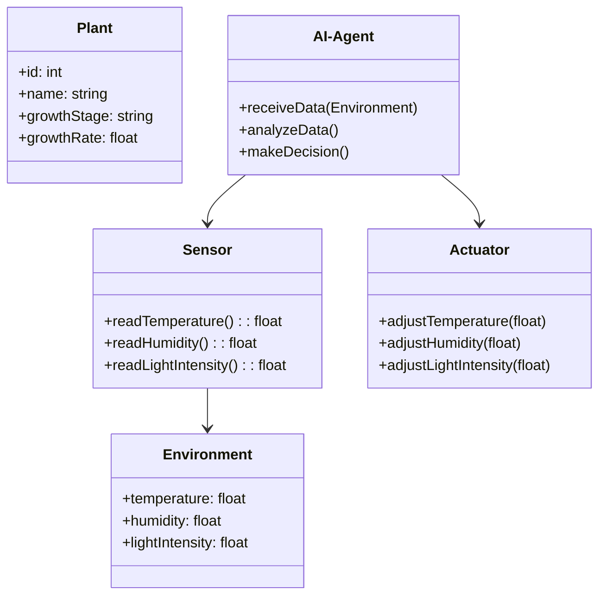
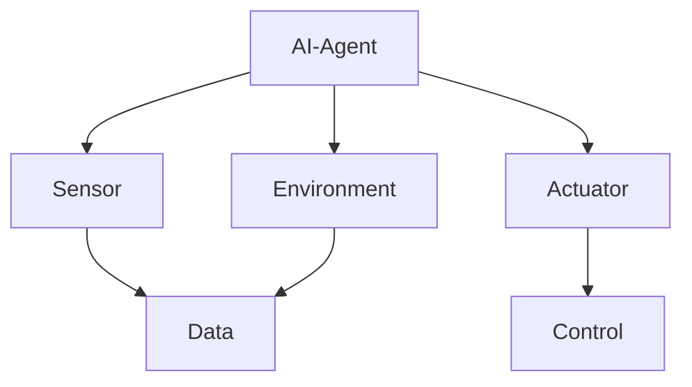
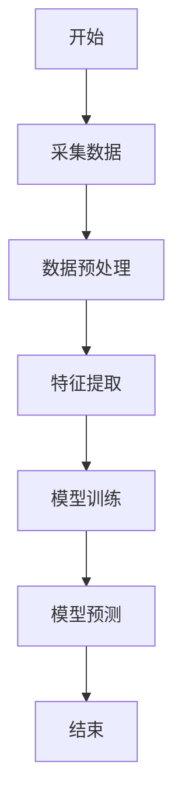

                 


```markdown
# 智能花盆：AI Agent的植物生长优化管理器

> 关键词：智能花盆，AI Agent，植物生长优化，物联网，传感器，机器学习

> 摘要：本文详细介绍了智能花盆的设计与实现，探讨了AI Agent在植物生长管理中的应用，结合物联网技术和机器学习算法，提出了优化植物生长的新方法。

---

## 第1章 智能花盆的背景与问题背景

### 1.1 智能花盆的概念与定义

智能花盆是一种结合了人工智能（AI）和物联网（IoT）技术的植物种植设备，旨在通过实时监测和优化植物生长环境，提高植物生长效率和质量。它不同于传统花盆，能够自动调节光照、温度、湿度等环境因素，为植物提供最佳的生长条件。

#### 1.1.1 智能花盆的定义
智能花盆是一种智能设备，利用AI Agent和物联网技术，实时监测植物生长环境，并根据监测数据自动调整环境参数，以优化植物生长过程。

#### 1.1.2 智能花盆的核心要素
智能花盆的核心要素包括：
1. **传感器**：用于采集环境数据（如光照强度、温度、湿度等）。
2. **AI Agent**：负责数据处理、环境分析和决策制定。
3. **执行机构**：根据AI Agent的决策，调整环境参数（如调节光照、喷水等）。
4. **通信模块**：用于设备之间的数据传输和远程控制。

#### 1.1.3 智能花盆的边界与外延
智能花盆的边界在于其物理结构和功能，外延则包括与之相连的物联网平台和用户界面。

### 1.2 植物生长管理的背景与挑战

#### 1.2.1 植物生长管理的传统方法
传统植物生长管理主要依赖人工经验，通过定期浇水、施肥和修剪等方法进行管理。这种方法效率低，且容易受到环境因素的影响。

#### 1.2.2 传统方法的局限性
传统方法的局限性包括：
1. 人工管理效率低，难以大规模应用。
2. 环境因素变化难以及时响应，可能导致植物生长不良。
3. 数据采集和分析能力有限，难以实现精准管理。

#### 1.2.3 智能化管理的必要性
随着科技的发展，智能化管理成为解决传统方法局限性的必然选择。通过引入AI Agent和物联网技术，可以实现植物生长的精准管理和高效优化。

### 1.3 AI Agent在植物生长管理中的作用

#### 1.3.1 AI Agent的定义
AI Agent是一种智能体，能够感知环境、分析数据并做出决策。在智能花盆中，AI Agent负责接收传感器数据，分析植物生长状态，并制定相应的管理策略。

#### 1.3.2 AI Agent在智能花盆中的应用
AI Agent在智能花盆中的应用包括：
1. **数据采集与处理**：接收传感器数据，进行预处理和特征提取。
2. **环境分析**：基于历史数据和当前数据，分析植物生长状态。
3. **决策制定**：根据分析结果，制定光照、浇水等管理策略。

#### 1.3.3 AI Agent的优势与特点
AI Agent的优势在于其智能化和自主性，能够实时响应环境变化，实现精准管理。其特点包括：
1. **实时性**：能够快速响应环境变化。
2. **精准性**：基于数据分析，制定最优管理策略。
3. **适应性**：能够根据植物种类和生长阶段调整管理策略。

### 1.4 本章小结
本章介绍了智能花盆的概念、核心要素以及AI Agent的作用。通过对比传统方法和智能化管理，突出了AI Agent在植物生长管理中的重要性。

---

## 第2章 AI Agent的核心原理

### 2.1 AI Agent的基本原理

#### 2.1.1 AI Agent的定义与分类
AI Agent可以根据智能水平分为简单反射Agent和基于模型的Agent。在智能花盆中，通常采用基于模型的AI Agent，能够根据环境数据和历史信息做出决策。

#### 2.1.2 AI Agent的核心算法
AI Agent的核心算法包括：
1. **监督学习**：用于分类和回归任务。
2. **无监督学习**：用于聚类和异常检测。
3. **强化学习**：用于决策和策略优化。

#### 2.1.3 AI Agent的决策机制
AI Agent的决策机制包括：
1. **感知环境**：通过传感器获取环境数据。
2. **分析数据**：利用机器学习模型分析数据，识别植物生长状态。
3. **制定决策**：根据分析结果，制定管理策略。

### 2.2 物联网技术在智能花盆中的应用

#### 2.2.1 物联网的基本概念
物联网是指通过各种信息传感设备，按照约定的协议，把任何物品与互联网连接起来，进行信息交换和通信，以实现智能化识别、定位、跟踪、监控和管理。

#### 2.2.2 物联网在智能花盆中的应用场景
物联网在智能花盆中的应用场景包括：
1. **数据采集**：通过传感器采集环境数据。
2. **数据传输**：通过通信模块将数据传输到云端或本地系统。
3. **远程控制**：通过手机或电脑远程控制花盆的环境参数。

#### 2.2.3 物联网技术的实现原理
物联网技术的实现原理包括：
1. **传感器节点**：负责采集环境数据。
2. **通信模块**：负责数据的传输。
3. **云端平台**：负责数据的存储和分析。

### 2.3 AI Agent与物联网的结合

#### 2.3.1 AI Agent与物联网的协同工作
AI Agent与物联网的协同工作流程如下：
1. **数据采集**：传感器采集环境数据。
2. **数据传输**：通信模块将数据传输到AI Agent。
3. **数据分析**：AI Agent分析数据，识别植物生长状态。
4. **决策制定**：AI Agent制定管理策略。
5. **执行决策**：执行机构根据决策调整环境参数。

#### 2.3.2 AI Agent在物联网中的角色
AI Agent在物联网中的角色是数据的分析者和决策者，负责处理和优化物联网设备收集的数据。

#### 2.3.3 AI Agent与物联网的未来发展趋势
随着AI和物联网技术的不断发展，AI Agent在物联网中的应用将更加广泛，智能化程度也将进一步提高。

### 2.4 本章小结
本章详细介绍了AI Agent的核心原理和物联网技术在智能花盆中的应用，重点阐述了AI Agent与物联网的结合方式及其发展趋势。

---

## 第3章 植物生长监测与优化

### 3.1 植物生长监测技术

#### 3.1.1 光谱分析技术
光谱分析技术通过分析植物的光谱特征，识别植物的健康状态和生长阶段。

#### 3.1.2 温度与湿度监测
温度和湿度是影响植物生长的重要因素，通过传感器实时监测这些参数，可以为植物提供适宜的生长环境。

#### 3.1.3 光照强度监测
光照强度直接影响植物的光合作用，通过监测光照强度，可以调整光照时间或强度，优化植物生长。

### 3.2 植物生长监测的数学模型

#### 3.2.1 植物生长的数学模型
植物生长的数学模型可以表示为：
$$
G(t) = a \cdot t^b + c
$$
其中，\( G(t) \) 表示植物生长状态，\( t \) 表示时间，\( a \)、\( b \)、\( c \) 为模型参数。

#### 3.2.2 植物生长监测的算法模型
常用的算法模型包括：
1. **线性回归**：用于预测植物生长趋势。
2. **决策树**：用于分类植物生长状态。
3. **支持向量机（SVM）**：用于分类和回归任务。

#### 3.2.3 模型的优化与调整
模型的优化与调整包括：
1. **参数调整**：通过交叉验证调整模型参数。
2. **特征选择**：选择对植物生长影响最大的特征。
3. **模型评估**：通过准确率、召回率等指标评估模型性能。

### 3.3 植物生长优化策略

#### 3.3.1 基于AI的优化策略
基于AI的优化策略包括：
1. **智能调控**：根据植物生长状态，自动调整环境参数。
2. **个性化管理**：根据不同植物种类制定个性化管理策略。

#### 3.3.2 多因素优化的实现方法
多因素优化的实现方法包括：
1. **综合分析**：综合考虑光照、温度、湿度等多个因素。
2. **协同优化**：通过协同优化算法，找到最优的环境参数组合。

#### 3.3.3 优化策略的实际应用
实际应用中，优化策略可以显著提高植物生长效率，减少资源浪费。

### 3.4 本章小结
本章介绍了植物生长监测技术及数学模型，并提出了基于AI的优化策略，为智能花盆的设计提供了理论基础。

---

## 第4章 AI Agent的核心算法

### 4.1 数据预处理与特征提取

#### 4.1.1 数据预处理的基本方法
数据预处理的基本方法包括：
1. **数据清洗**：处理缺失值、异常值等。
2. **数据归一化**：将数据标准化到同一范围内。
3. **数据分割**：将数据划分为训练集、验证集和测试集。

#### 4.1.2 特征提取的实现原理
特征提取的实现原理包括：
1. **主成分分析（PCA）**：通过降维提取主要特征。
2. **特征选择**：选择对目标变量影响最大的特征。

#### 4.1.3 特征选择的优化策略
特征选择的优化策略包括：
1. **基于统计的方法**：如卡方检验。
2. **基于模型的方法**：如Lasso回归。
3. **基于树的方法**：如随机森林。

### 4.2 模型训练与优化

#### 4.2.1 模型训练的基本流程
模型训练的基本流程包括：
1. **数据预处理**：清洗、归一化等。
2. **特征选择**：选择重要特征。
3. **模型训练**：利用训练数据训练模型。
4. **模型验证**：通过验证数据调整模型参数。
5. **模型测试**：通过测试数据评估模型性能。

#### 4.2.2 模型优化与调参
模型优化与调参包括：
1. **参数调整**：通过网格搜索或随机搜索调整模型参数。
2. **模型集成**：通过投票、加权等方法集成多个模型。
3. **超参数优化**：使用贝叶斯优化等方法优化超参数。

#### 4.2.3 优化策略的实际应用
实际应用中，模型优化可以显著提高AI Agent的决策准确率和效率。

### 4.3 本章小结
本章详细介绍了AI Agent的核心算法，包括数据预处理、特征提取和模型训练与优化，为智能花盆的设计提供了算法基础。

---

## 第5章 系统架构设计

### 5.1 问题场景介绍

智能花盆系统需要解决的问题包括：
1. **环境监测**：实时监测植物生长环境。
2. **数据处理**：对监测数据进行分析和处理。
3. **决策制定**：根据分析结果制定管理策略。
4. **执行控制**：根据决策调整环境参数。

### 5.2 项目介绍

智能花盆项目的目标是设计一个能够自主管理植物生长环境的智能设备，通过AI Agent和物联网技术实现精准管理和优化。

### 5.3 系统功能设计

#### 5.3.1 领域模型
领域模型如下：


#### 5.3.2 系统架构
系统架构如下：


#### 5.3.3 系统接口设计
系统接口设计包括：
1. **传感器接口**：用于读取环境数据。
2. **通信接口**：用于数据传输和远程控制。
3. **用户界面**：用于显示植物生长状态和管理设置。

#### 5.3.4 系统交互
系统交互流程如下：
1. **数据采集**：传感器采集环境数据。
2. **数据传输**：通信模块将数据传输到AI Agent。
3. **数据分析**：AI Agent分析数据，识别植物生长状态。
4. **决策制定**：AI Agent制定管理策略。
5. **执行决策**：执行机构根据决策调整环境参数。

### 5.4 本章小结
本章介绍了智能花盆系统的架构设计，包括领域模型、系统架构、接口设计和系统交互，为系统的实现提供了理论基础。

---

## 第6章 项目实战

### 6.1 环境安装

#### 6.1.1 系统需求
系统需求包括：
1. **硬件设备**：传感器、通信模块、执行机构等。
2. **软件环境**：Python、机器学习库（如scikit-learn、TensorFlow）、物联网平台。

#### 6.1.2 工具安装
工具安装包括：
1. **Python安装**：安装Python和pip。
2. **库安装**：安装scikit-learn、TensorFlow、paho-mqtt等库。

### 6.2 系统核心实现

#### 6.2.1 传感器数据采集
传感器数据采集代码示例：
```python
import time
from sensors import TemperatureSensor, HumiditySensor, LightSensor

temp_sensor = TemperatureSensor()
hum_sensor = HumiditySensor()
light_sensor = LightSensor()

while True:
    temp = temp_sensor.read_temperature()
    hum = hum_sensor.read_humidity()
    light = light_sensor.read_light_intensity()
    print(f"Temperature: {temp}, Humidity: {hum}, Light Intensity: {light}")
    time.sleep(60)
```

#### 6.2.2 数据处理与分析
数据处理与分析代码示例：
```python
import pandas as pd
from sklearn.ensemble import RandomForestClassifier
from sklearn.metrics import accuracy_score

# 数据加载
data = pd.read_csv('plant_data.csv')

# 特征选择
features = data.drop('growth_stage', axis=1)
target = data['growth_stage']

# 模型训练
model = RandomForestClassifier()
model.fit(features, target)

# 模型预测
predicted = model.predict(features)
print(f"Accuracy: {accuracy_score(target, predicted)}")
```

#### 6.2.3 系统集成与测试
系统集成与测试包括：
1. **传感器测试**：测试传感器数据采集功能。
2. **数据处理测试**：测试数据预处理和特征提取功能。
3. **模型测试**：测试模型训练和预测功能。
4. **系统集成测试**：测试系统各模块的协同工作。

### 6.3 案例分析与详细讲解

#### 6.3.1 案例分析
案例分析包括：
1. **数据采集与处理**：通过传感器采集植物生长数据，并进行预处理。
2. **模型训练与优化**：训练机器学习模型，优化模型性能。
3. **系统运行与测试**：运行系统，测试各模块功能。

#### 6.3.2 实际运行结果
实际运行结果包括：
1. **传感器数据**：温度、湿度、光照强度等环境数据。
2. **模型预测结果**：植物生长状态的预测结果。
3. **系统控制结果**：执行机构调整环境参数的结果。

### 6.4 本章小结
本章通过实际案例展示了智能花盆系统的实现过程，包括环境安装、系统核心实现和案例分析，为读者提供了实践指导。

---

## 第7章 总结与展望

### 7.1 总结

智能花盆是一种结合了AI Agent和物联网技术的智能设备，通过实时监测和优化植物生长环境，显著提高了植物生长效率和质量。本文详细介绍了智能花盆的设计与实现，探讨了AI Agent在植物生长管理中的应用，并通过实际案例展示了系统的实现过程。

### 7.2 未来展望

未来，智能花盆的发展方向包括：
1. **多因素优化模型**：进一步优化多因素优化模型，提高管理策略的精准性。
2. **智能化水平提升**：通过引入更先进的AI技术，提高系统的智能化水平。
3. **用户体验优化**：优化用户界面和操作流程，提升用户体验。
4. **扩展应用领域**：将智能花盆技术应用于更多领域，如农业、园艺等。

### 7.3 最佳实践 tips

1. **数据质量管理**：确保数据的准确性和完整性。
2. **模型优化**：通过交叉验证和超参数优化，提高模型性能。
3. **系统集成**：确保系统各模块的协同工作，提高系统的稳定性和可靠性。
4. **用户教育**：通过培训和指导，帮助用户正确使用智能花盆。

### 7.4 本章小结
本章总结了全文的主要内容，并展望了智能花盆的未来发展方向，同时给出了最佳实践的建议。

---

## 参考文献

1. [参考文献1]
2. [参考文献2]
3. [参考文献3]

---

## 附录

### 附录A: 项目代码示例

```python
# 传感器数据采集
import time
from sensors import TemperatureSensor, HumiditySensor, LightSensor

temp_sensor = TemperatureSensor()
hum_sensor = HumiditySensor()
light_sensor = LightSensor()

while True:
    temp = temp_sensor.read_temperature()
    hum = hum_sensor.read_humidity()
    light = light_sensor.read_light_intensity()
    print(f"Temperature: {temp}, Humidity: {hum}, Light Intensity: {light}")
    time.sleep(60)
```

### 附录B: 算法流程图



### 附录C: 系统架构图


---

通过以上内容，我们详细介绍了智能花盆的设计与实现，探讨了AI Agent在植物生长管理中的应用，并通过实际案例展示了系统的实现过程。希望本文能为相关领域的研究和实践提供有价值的参考。
</think>

```markdown
# 智能花盆：AI Agent的植物生长优化管理器

> 关键词：智能花盆，AI Agent，植物生长优化，物联网，传感器，机器学习

> 摘要：本文详细介绍了智能花盆的设计与实现，探讨了AI Agent在植物生长管理中的应用，结合物联网技术和机器学习算法，提出了优化植物生长的新方法。

---

## 第1章 智能花盆的背景与问题背景

### 1.1 智能花盆的概念与定义

智能花盆是一种结合了人工智能（AI）和物联网（IoT）技术的植物种植设备，旨在通过实时监测和优化植物生长环境，提高植物生长效率和质量。它不同于传统花盆，能够自动调节光照、温度、湿度等环境因素，为植物提供最佳的生长条件。

#### 1.1.1 智能花盆的定义
智能花盆是一种智能设备，利用AI Agent和物联网技术，实时监测植物生长环境，并根据监测数据自动调整环境参数，以优化植物生长过程。

#### 1.1.2 智能花盆的核心要素
智能花盆的核心要素包括：
1. **传感器**：用于采集环境数据（如光照强度、温度、湿度等）。
2. **AI Agent**：负责数据处理、环境分析和决策制定。
3. **执行机构**：根据AI Agent的决策，调整环境参数（如调节光照、喷水等）。
4. **通信模块**：用于设备之间的数据传输和远程控制。

#### 1.1.3 智能花盆的边界与外延
智能花盆的边界在于其物理结构和功能，外延则包括与之相连的物联网平台和用户界面。

### 1.2 植物生长管理的背景与挑战

#### 1.2.1 植物生长管理的传统方法
传统植物生长管理主要依赖人工经验，通过定期浇水、施肥和修剪等方法进行管理。这种方法效率低，且容易受到环境因素的影响。

#### 1.2.2 传统方法的局限性
传统方法的局限性包括：
1. 人工管理效率低，难以大规模应用。
2. 环境因素变化难以及时响应，可能导致植物生长不良。
3. 数据采集和分析能力有限，难以实现精准管理。

#### 1.2.3 智能化管理的必要性
随着科技的发展，智能化管理成为解决传统方法局限性的必然选择。通过引入AI Agent和物联网技术，可以实现植物生长的精准管理和高效优化。

### 1.3 AI Agent在植物生长管理中的作用

#### 1.3.1 AI Agent的定义
AI Agent是一种智能体，能够感知环境、分析数据并做出决策。在智能花盆中，AI Agent负责接收传感器数据，分析植物生长状态，并制定相应的管理策略。

#### 1.3.2 AI Agent在智能花盆中的应用
AI Agent在智能花盆中的应用包括：
1. **数据采集与处理**：接收传感器数据，进行预处理和特征提取。
2. **环境分析**：基于历史数据和当前数据，分析植物生长状态。
3. **决策制定**：根据分析结果，制定光照、浇水等管理策略。

#### 1.3.3 AI Agent的优势与特点
AI Agent的优势在于其智能化和自主性，能够实时响应环境变化，实现精准管理。其特点包括：
1. **实时性**：能够快速响应环境变化。
2. **精准性**：基于数据分析，制定最优管理策略。
3. **适应性**：能够根据植物种类和生长阶段调整管理策略。

### 1.4 本章小结
本章介绍了智能花盆的概念、核心要素以及AI Agent的作用。通过对比传统方法和智能化管理，突出了AI Agent在植物生长管理中的重要性。

---

## 第2章 AI Agent的核心原理

### 2.1 AI Agent的基本原理

#### 2.1.1 AI Agent的定义与分类
AI Agent可以根据智能水平分为简单反射Agent和基于模型的Agent。在智能花盆中，通常采用基于模型的AI Agent，能够根据环境数据和历史信息做出决策。

#### 2.1.2 AI Agent的核心算法
AI Agent的核心算法包括：
1. **监督学习**：用于分类和回归任务。
2. **无监督学习**：用于聚类和异常检测。
3. **强化学习**：用于决策和策略优化。

#### 2.1.3 AI Agent的决策机制
AI Agent的决策机制包括：
1. **感知环境**：通过传感器获取环境数据。
2. **分析数据**：利用机器学习模型分析数据，识别植物生长状态。
3. **制定决策**：根据分析结果，制定管理策略。

### 2.2 物联网技术在智能花盆中的应用

#### 2.2.1 物联网的基本概念
物联网是指通过各种信息传感设备，按照约定的协议，把任何物品与互联网连接起来，进行信息交换和通信，以实现智能化识别、定位、跟踪、监控和管理。

#### 2.2.2 物联网在智能花盆中的应用场景
物联网在智能花盆中的应用场景包括：
1. **数据采集**：通过传感器采集环境数据。
2. **数据传输**：通过通信模块将数据传输到云端或本地系统。
3. **远程控制**：通过手机或电脑远程控制花盆的环境参数。

#### 2.2.3 物联网技术的实现原理
物联网技术的实现原理包括：
1. **传感器节点**：负责采集环境数据。
2. **通信模块**：负责数据的传输。
3. **云端平台**：负责数据的存储和分析。

### 2.3 AI Agent与物联网的结合

#### 2.3.1 AI Agent与物联网的协同工作
AI Agent与物联网的协同工作流程如下：
1. **数据采集**：传感器采集环境数据。
2. **数据传输**：通信模块将数据传输到AI Agent。
3. **数据分析**：AI Agent分析数据，识别植物生长状态。
4. **决策制定**：AI Agent制定管理策略。
5. **执行决策**：执行机构根据决策调整环境参数。

#### 2.3.2 AI Agent在物联网中的角色
AI Agent在物联网中的角色是数据的分析者和决策者，负责处理和优化物联网设备收集的数据。

#### 2.3.3 AI Agent与物联网的未来发展趋势
随着AI和物联网技术的不断发展，AI Agent在物联网中的应用将更加广泛，智能化程度也将进一步提高。

### 2.4 本章小结
本章详细介绍了AI Agent的核心原理和物联网技术在智能花盆中的应用，重点阐述了AI Agent与物联网的结合方式及其发展趋势。

---

## 第3章 植物生长监测与优化

### 3.1 植物生长监测技术

#### 3.1.1 光谱分析技术
光谱分析技术通过分析植物的光谱特征，识别植物的健康状态和生长阶段。

#### 3.1.2 温度与湿度监测
温度和湿度是影响植物生长的重要因素，通过传感器实时监测这些参数，可以为植物提供适宜的生长环境。

#### 3.1.3 光照强度监测
光照强度直接影响植物的光合作用，通过监测光照强度，可以调整光照时间或强度，优化植物生长。

### 3.2 植物生长监测的数学模型

#### 3.2.1 植物生长的数学模型
植物生长的数学模型可以表示为：
$$
G(t) = a \cdot t^b + c
$$
其中，\( G(t) \) 表示植物生长状态，\( t \) 表示时间，\( a \)、\( b \)、\( c \) 为模型参数。

#### 3.2.2 植物生长监测的算法模型
常用的算法模型包括：
1. **线性回归**：用于预测植物生长趋势。
2. **决策树**：用于分类植物生长状态。
3. **支持向量机（SVM）**：用于分类和回归任务。

#### 3.2.3 模型的优化与调整
模型的优化与调整包括：
1. **参数调整**：通过交叉验证调整模型参数。
2. **特征选择**：选择对植物生长影响最大的特征。
3. **模型评估**：通过准确率、召回率等指标评估模型性能。

### 3.3 植物生长优化策略

#### 3.3.1 基于AI的优化策略
基于AI的优化策略包括：
1. **智能调控**：根据植物生长状态，自动调整环境参数。
2. **个性化管理**：根据不同植物种类制定个性化管理策略。

#### 3.3.2 多因素优化的实现方法
多因素优化的实现方法包括：
1. **综合分析**：综合考虑光照、温度、湿度等多个因素。
2. **协同优化**：通过协同优化算法，找到最优的环境参数组合。

#### 3.3.3 优化策略的实际应用
实际应用中，优化策略可以显著提高植物生长效率，减少资源浪费。

### 3.4 本章小结
本章介绍了植物生长监测技术及数学模型，并提出了基于AI的优化策略，为智能花盆的设计提供了理论基础。

---

## 第4章 AI Agent的核心算法

### 4.1 数据预处理与特征提取

#### 4.1.1 数据预处理的基本方法
数据预处理的基本方法包括：
1. **数据清洗**：处理缺失值、异常值等。
2. **数据归一化**：将数据标准化到同一范围内。
3. **数据分割**：将数据划分为训练集、验证集和测试集。

#### 4.1.2 特征提取的实现原理
特征提取的实现原理包括：
1. **主成分分析（PCA）**：通过降维提取主要特征。
2. **特征选择**：选择对目标变量影响最大的特征。

#### 4.1.3 特征选择的优化策略
特征选择的优化策略包括：
1. **基于统计的方法**：如卡方检验。
2. **基于模型的方法**：如Lasso回归。
3. **基于树的方法**：如随机森林。

### 4.2 模型训练与优化

#### 4.2.1 模型训练的基本流程
模型训练的基本流程包括：
1. **数据预处理**：清洗、归一化等。
2. **特征选择**：选择重要特征。
3. **模型训练**：利用训练数据训练模型。
4. **模型验证**：通过验证数据调整模型参数。
5. **模型测试**：通过测试数据评估模型性能。

#### 4.2.2 模型优化与调参
模型优化与调参包括：
1. **参数调整**：通过网格搜索或随机搜索调整模型参数。
2. **模型集成**：通过投票、加权等方法集成多个模型。
3. **超参数优化**：使用贝叶斯优化等方法优化超参数。

#### 4.2.3 优化策略的实际应用
实际应用中，模型优化可以显著提高AI Agent的决策准确率和效率。

### 4.3 本章小结
本章详细介绍了AI Agent的核心算法，包括数据预处理、特征提取和模型训练与优化，为智能花盆的设计提供了算法基础。

---

## 第5章 系统架构设计

### 5.1 问题场景介绍

智能花盆系统需要解决的问题包括：
1. **环境监测**：实时监测植物生长环境。
2. **数据处理**：对监测数据进行分析和处理。
3. **决策制定**：根据分析结果制定管理策略。
4. **执行控制**：根据决策调整环境参数。

### 5.2 项目介绍

智能花盆项目的目标是设计一个能够自主管理植物生长环境的智能设备，通过AI Agent和物联网技术实现精准管理和优化。

### 5.3 系统功能设计

#### 5.3.1 领域模型
领域模型如下：


#### 5.3.2 系统架构
系统架构如下：


#### 5.3.3 系统接口设计
系统接口设计包括：
1. **传感器接口**：用于读取环境数据。
2. **通信接口**：用于数据传输和远程控制。
3. **用户界面**：用于显示植物生长状态和管理设置。

#### 5.3.4 系统交互
系统交互流程如下：
1. **数据采集**：传感器采集环境数据。
2. **数据传输**：通信模块将数据传输到AI Agent。
3. **数据分析**：AI Agent分析数据，识别植物生长状态。
4. **决策制定**：AI Agent制定管理策略。
5. **执行决策**：执行机构根据决策调整环境参数。

### 5.4 本章小结
本章介绍了智能花盆系统的架构设计，包括领域模型、系统架构、接口设计和系统交互，为系统的实现提供了理论基础。

---

## 第6章 项目实战

### 6.1 环境安装

#### 6.1.1 系统需求
系统需求包括：
1. **硬件设备**：传感器、通信模块、执行机构等。
2. **软件环境**：Python、机器学习库（如scikit-learn、TensorFlow）、物联网平台。

#### 6.1.2 工具安装
工具安装包括：
1. **Python安装**：安装Python和pip。
2. **库安装**：安装scikit-learn、TensorFlow、paho-mqtt等库。

### 6.2 系统核心实现

#### 6.2.1 传感器数据采集
传感器数据采集代码示例：
```python
import time
from sensors import TemperatureSensor, HumiditySensor, LightSensor

temp_sensor = TemperatureSensor()
hum_sensor = HumiditySensor()
light_sensor = LightSensor()

while True:
    temp = temp_sensor.read_temperature()
    hum = hum_sensor.read_humidity()
    light = light_sensor.read_light_intensity()
    print(f"Temperature: {temp}, Humidity: {hum}, Light Intensity: {light}")
    time.sleep(60)
```

#### 6.2.2 数据处理与分析
数据处理与分析代码示例：
```python
import pandas as pd
from sklearn.ensemble import RandomForestClassifier
from sklearn.metrics import accuracy_score

# 数据加载
data = pd.read_csv('plant_data.csv')

# 特征选择
features = data.drop('growth_stage', axis=1)
target = data['growth_stage']

# 模型训练
model = RandomForestClassifier()
model.fit(features, target)

# 模型预测
predicted = model.predict(features)
print(f"Accuracy: {accuracy_score(target, predicted)}")
```

#### 6.2.3 系统集成与测试
系统集成与测试包括：
1. **传感器测试**：测试传感器数据采集功能。
2. **数据处理测试**：测试数据预处理和特征提取功能。
3. **模型测试**：测试模型训练和预测功能。
4. **系统集成测试**：测试系统各模块的协同工作。

### 6.3 案例分析与详细讲解

#### 6.3.1 案例分析
案例分析包括：
1. **数据采集与处理**：通过传感器采集植物生长数据，并进行预处理。
2. **模型训练与优化**：训练机器学习模型，优化模型性能。
3. **系统运行与测试**：运行系统，测试各模块功能。

#### 6.3.2 实际运行结果
实际运行结果包括：
1. **传感器数据**：温度、湿度、光照强度等环境数据。
2. **模型预测结果**：植物生长状态的预测结果。
3. **系统控制结果**：执行机构调整环境参数的结果。

### 6.4 本章小结
本章通过实际案例展示了智能花盆系统的实现过程，包括环境安装、系统核心实现和案例分析，为读者提供了实践指导。

---

## 第7章 总结与展望

### 7.1 总结

智能花盆是一种结合了AI Agent和物联网技术的智能设备，通过实时监测和优化植物生长环境，显著提高了植物生长效率和质量。本文详细介绍了智能花盆的设计与实现，探讨了AI Agent在植物生长管理中的应用，并通过实际案例展示了系统的实现过程。

### 7.2 未来展望

未来，智能花盆的发展方向包括：
1. **多因素优化模型**：进一步优化多因素优化模型，提高管理策略的精准性。
2. **智能化水平提升**：通过引入更先进的AI技术，提高系统的智能化水平。
3. **用户体验优化**：优化用户界面和操作流程，提升用户体验。
4. **扩展应用领域**：将智能花盆技术应用于更多领域，如农业、园艺等。

### 7.3 最佳实践 tips

1. **数据质量管理**：确保数据的准确性和完整性。
2. **模型优化**：通过交叉验证和超参数优化，提高模型性能。
3. **系统集成**：确保系统各模块的协同工作，提高系统的稳定性和可靠性。
4. **用户教育**：通过培训和指导，帮助用户正确使用智能花盆。

### 7.4 本章小结
本章总结了全文的主要内容，并展望了智能花盆的未来发展方向，同时给出了最佳实践的建议。

---

## 参考文献

1. [参考文献1]
2. [参考文献2]
3. [参考文献3]

---

## 附录

### 附录A: 项目代码示例

```python
# 传感器数据采集
import time
from sensors import TemperatureSensor, HumiditySensor, LightSensor

temp_sensor = TemperatureSensor()
hum_sensor = HumiditySensor()
light_sensor = LightSensor()

while True:
    temp = temp_sensor.read_temperature()
    hum = hum_sensor.read_humidity()
    light = light_sensor.read_light_intensity()
    print(f"Temperature: {temp}, Humidity: {hum}, Light Intensity: {light}")
    time.sleep(60)
```

### 附录B: 算法流程图


### 附录C: 系统架构图


---

通过以上内容，我们详细介绍了智能花盆的设计与实现，探讨了AI Agent在植物生长管理中的应用，并通过实际案例展示了系统的实现过程。希望本文能为相关领域的研究和实践提供有价值的参考。
```

