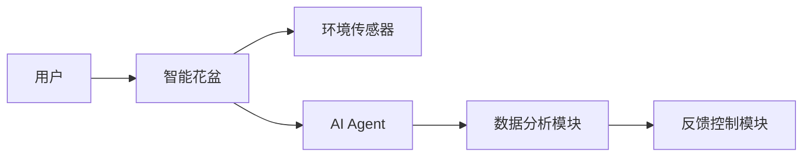
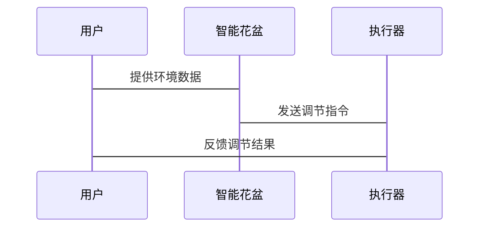

                 


# 智能花盆：AI Agent的植物生长监测

> 关键词：AI Agent、智能花盆、植物生长监测、传感器、数据融合、机器学习、物联网

> 摘要：本文探讨了AI Agent在智能花盆中的应用，重点介绍了如何通过多传感器融合技术实现植物生长监测。文章详细分析了AI Agent的原理、数据采集与预处理方法，以及系统架构设计。通过实际案例分析，展示了AI技术在农业智能化中的巨大潜力。

---

# 第一部分: 背景介绍

## 第1章: 问题背景与核心概念

### 1.1 问题背景
#### 1.1.1 植物生长监测的重要性
植物生长监测是农业和园艺领域的重要环节，能够帮助农民和园艺爱好者优化种植条件，提高产量和质量。传统的监测方法依赖人工观察，效率低且容易出错。

#### 1.1.2 现有技术的局限性
现有技术主要依赖单一传感器，监测数据片面，无法全面反映植物生长环境。数据处理方法简单，无法提供有效的决策支持。

#### 1.1.3 AI Agent在植物监测中的优势
AI Agent可以通过多传感器融合技术，实时采集和分析环境数据，结合历史数据和模型预测，提供精准的生长监测和优化建议。

### 1.2 问题描述
#### 1.2.1 植物生长监测的关键因素
光照、温度、湿度、土壤 pH 值、养分含量等是影响植物生长的关键因素。

#### 1.2.2 智能花盆的目标与功能
智能花盆的目标是通过AI Agent实现对植物生长环境的实时监测、智能分析和自动调节，优化植物生长条件。

#### 1.2.3 AI Agent在监测中的具体任务
AI Agent需要实时采集环境数据、分析数据、预测植物生长状态，并根据分析结果自动调节环境参数。

### 1.3 问题解决
#### 1.3.1 AI Agent的核心功能
- 状态感知与数据采集
- 数据分析与决策
- 行为执行与反馈

#### 1.3.2 多传感器融合技术
通过融合多种传感器数据（如温度、湿度、光照等），提高监测精度和可靠性。

#### 1.3.3 数据分析与反馈机制
利用机器学习算法对数据进行分析，生成反馈指令，自动调节环境参数。

### 1.4 边界与外延
#### 1.4.1 系统的边界条件
- 监测范围：植物生长环境（温度、湿度、光照、土壤 pH 等）
- 数据采集范围：传感器覆盖区域
- 系统控制范围：环境调节设备（如补光灯、喷水装置等）

#### 1.4.2 功能的外延与扩展
- 扩展监测参数：如二氧化碳浓度、病虫害检测
- 扩展应用场景：从家庭园艺扩展到农业大棚

#### 1.4.3 系统与环境的交互范围
- 输入：环境数据、用户输入
- 输出：环境调节指令、生长状态报告

### 1.5 核心概念
#### 1.5.1 AI Agent的定义与属性
- AI Agent：具备感知、决策和执行能力的智能体，能够自主完成任务。
- 属性：自主性、反应性、社交能力

#### 1.5.2 智能花盆的结构组成
- 硬件部分：传感器模块、控制模块、执行器模块
- 软件部分：数据采集模块、数据分析模块、反馈控制模块

#### 1.5.3 多传感器数据融合的原理
通过多种传感器的数据融合，利用加权融合算法或卡尔曼滤波算法，提高数据的准确性和可靠性。

---

# 第二部分: 核心概念与联系

## 第2章: 核心概念原理

### 2.1 AI Agent的原理
#### 2.1.1 状态感知与数据采集
AI Agent通过传感器采集环境数据，如温度、湿度、光照强度等。

#### 2.1.2 数据分析与决策
利用机器学习算法对数据进行分析，预测植物生长状态，并生成决策指令。

#### 2.1.3 行为执行与反馈
根据决策指令，控制执行器调节环境参数，并通过反馈机制优化控制策略。

### 2.2 多传感器融合技术
#### 2.2.1 传感器类型与功能
- 温度传感器：监测环境温度
- 湿度传感器：监测环境湿度
- 光照传感器：监测光照强度
- 土壤传感器：监测土壤 pH 值和湿度

#### 2.2.2 数据融合方法
- 加权融合算法：根据传感器的可靠性分配权重，计算融合值
- 卡尔曼滤波算法：通过状态估计消除噪声，提高数据精度

#### 2.2.3 融合算法的选择与优化
选择合适的融合算法，优化参数设置，提高数据的准确性和实时性。

### 2.3 系统实体关系图


---

# 第三部分: 算法原理讲解

## 第3章: 数据采集与预处理

### 3.1 数据采集流程
#### 3.1.1 传感器数据的采集
通过多种传感器采集环境数据，如温度、湿度、光照强度等。

#### 3.1.2 数据格式的转换
将传感器采集的原始数据转换为统一的数据格式，便于后续处理。

#### 3.1.3 数据清洗与预处理
去除噪声数据，填充缺失值，标准化数据，提高数据质量。

### 3.2 数据融合算法
#### 3.2.1 加权融合算法
```python
def weighted_fusion(sensor_data, weights):
    fused_value = 0
    for i in range(len(sensor_data)):
        fused_value += sensor_data[i] * weights[i]
    return fused_value
```

#### 3.2.2 基于卡尔曼滤波的融合算法
```python
def kalman_filter(previous Estimate, measurement, previous_error_estimate, error_measurement):
    # 计算最优估计
    optimal_estimate = previous_Estimate + (measurement - previous_Estimate) * error_measurement / (previous_error_estimate + error_measurement)
    return optimal_estimate
```

---

## 第4章: AI Agent的算法实现

### 4.1 数据分析与决策
#### 4.1.1 机器学习模型的训练
使用历史数据训练机器学习模型，预测植物生长状态。

#### 4.1.2 决策逻辑的实现
根据模型预测结果，生成环境调节指令，如开启补光灯或喷水装置。

### 4.2 反馈控制机制
#### 4.2.1 控制策略的设计
根据植物生长状态，动态调整环境参数，优化生长条件。

#### 4.2.2 反馈数据的处理
将环境调节结果反馈到系统，优化后续决策。

---

## 第5章: 数学模型与公式

### 5.1 数据融合模型
$$ \hat{x}_k = \hat{x}_{k-1} + K(z_k - \hat{x}_{k-1}) $$

其中，$\hat{x}_k$ 是融合后的估计值，$K$ 是卡尔曼增益，$z_k$ 是传感器测量值。

### 5.2 机器学习模型
$$ y = \sum_{i=1}^{n} w_i x_i + b $$

其中，$w_i$ 是权重，$x_i$ 是输入特征，$b$ 是偏置项。

---

# 第四部分: 系统分析与架构设计

## 第6章: 系统架构设计

### 6.1 系统功能设计
- 数据采集模块：采集环境数据
- 数据分析模块：分析数据，生成决策指令
- 反馈控制模块：调节环境参数

### 6.2 系统架构图


### 6.3 接口设计
- 数据接口：传感器数据输入接口、执行器控制接口
- 用户接口：用户界面、API接口

### 6.4 交互流程图


---

# 第五部分: 项目实战

## 第7章: 项目实现

### 7.1 环境安装
- 硬件安装：安装传感器、执行器等硬件设备
- 软件安装：安装数据采集软件、机器学习模型等

### 7.2 核心代码实现
#### 7.2.1 数据采集模块
```python
import serial

ser = serial.Serial('COM3', 9600)
data = ser.readline().decode().strip()
print(data)
```

#### 7.2.2 数据分析模块
```python
from sklearn import linear_model

# 训练模型
model = linear_model.LinearRegression()
model.fit(X_train, y_train)

# 预测结果
y_pred = model.predict(X_test)
```

#### 7.2.3 反馈控制模块
```python
import RPi.GPIO as GPIO

# 控制补光灯
GPIO.output(12, GPIO.HIGH)
```

### 7.3 案例分析
通过实际案例分析，验证系统的效果，优化系统性能。

### 7.4 项目小结
总结项目实现过程中的经验教训，提出改进建议。

---

# 第六部分: 总结

## 第8章: 总结与展望

### 8.1 最佳实践 tips
- 数据采集要准确，传感器选择要合理
- 算法选择要合适，优化参数设置
- 系统设计要模块化，便于维护和扩展

### 8.2 小结
本文详细介绍了AI Agent在智能花盆中的应用，从理论到实践，全面探讨了植物生长监测的技术实现。

### 8.3 注意事项
- 系统维护要定期检查硬件和软件
- 数据安全要注意保护用户隐私
- 环境适应性要根据不同植物调整参数

### 8.4 拓展阅读
建议读者进一步学习机器学习、物联网技术，探索AI在农业中的更多应用。

---

通过以上目录结构，文章从背景介绍到系统实现，再到项目实战，全面而深入地探讨了AI Agent在智能花盆中的应用，为读者提供了丰富的理论和实践指导。

