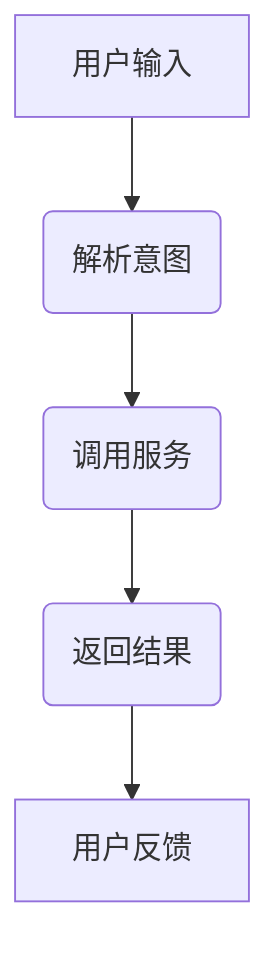

                 


# 智能茶几：AI Agent的客厅使用模式分析

## 关键词：智能茶几, AI Agent, 客厅使用模式, 智能交互, 家居控制, 物联网, 人机交互

## 摘要：  
本文深入分析AI Agent在客厅环境中的应用模式，以智能茶几为核心载体，探讨其在智能交互、家居控制、物联网连接等方面的技术实现与实际应用场景。通过背景介绍、核心概念、算法原理、系统架构、项目实战等多维度分析，结合具体案例和最佳实践，为读者提供全面的技术解读和实践指南。

---

## 目录

### 第一章：背景介绍  
1.1 问题背景  
1.2 问题描述  
1.3 问题解决  
1.4 边界与外延  
1.5 概念结构与核心要素  

### 第二章：核心概念与联系  
2.1 AI Agent的核心概念  
2.2 AI Agent的属性特征对比表  
2.3 ER实体关系图  

### 第三章：算法原理讲解  
3.1 自然语言处理算法  
3.2 机器学习算法  
3.3 算法流程图  
3.4 代码实现  

### 第四章：系统分析与架构设计方案  
4.1 问题场景介绍  
4.2 系统功能设计  
4.3 系统架构图  
4.4 系统接口设计  

### 第五章：项目实战  
5.1 环境安装  
5.2 核心代码实现  
5.3 代码解读与分析  
5.4 实际案例分析  
5.5 项目小结  

### 第六章：最佳实践与总结  
6.1 最佳实践  
6.2 小结  
6.3 注意事项  
6.4 拓展阅读  

---

## 正文

### 第一章：背景介绍

#### 1.1 问题背景  
随着智能家居的普及，客厅作为家庭的核心空间，智能化需求日益增长。传统的茶几功能单一，无法满足现代家庭对智能化、交互式设备的需求。AI Agent（智能代理）的引入，使得茶几具备了智能交互、家居控制、信息处理等功能，成为客厅智能化的核心设备。

#### 1.2 问题描述  
在传统客厅环境中，用户通过手动操作或遥控器控制设备，这种方式效率低下且体验不佳。随着物联网和AI技术的发展，用户期望通过更自然的交互方式（如语音、手势）来控制家居设备，提升生活品质。

#### 1.3 问题解决  
AI Agent通过整合语音识别、自然语言处理和机器学习技术，实现与用户的自然交互。智能茶几作为载体，可以连接家中其他设备，形成一个协同工作的智能系统。

#### 1.4 边界与外延  
智能茶几的功能不仅限于单一设备的控制，还包括与智能家居生态的深度集成。其边界包括硬件设备的连接、用户交互的多样性，外延则涉及数据安全、隐私保护、系统扩展性等问题。

#### 1.5 概念结构与核心要素  
智能茶几的实现依赖于AI Agent的以下核心要素：  
- **自然语言处理（NLP）**：支持多轮对话和上下文理解。  
- **语音识别与合成**：实现语音交互功能。  
- **设备控制接口**：与智能家居设备的通信协议对接。  
- **数据存储与分析**：记录用户行为，优化交互体验。

---

### 第二章：核心概念与联系

#### 2.1 AI Agent的核心概念  
AI Agent是一种能够感知环境、理解用户意图，并执行相应操作的智能实体。在智能茶几中，AI Agent主要负责接收用户指令、解析意图、调用相应服务。

#### 2.2 AI Agent的属性特征对比表  
| 属性 | 对比内容 |  
|------|----------|  
| 功能 | 单一设备控制 vs 多设备协同 |  
| 交互方式 | 语音 vs 触控 |  
| 智能性 | 基础识别 vs 深度学习 |  

#### 2.3 ER实体关系图  
```mermaid
er
  entity 用户 {
    唯一标识符 userId
    属性 name
    属性 preferredLanguage
  }
  entity 设备 {
    唯一标识符 deviceId
    属性 deviceType
    属性 brand
  }
  entity 服务 {
    唯一标识符 serviceId
    属性 serviceName
    属性 serviceProvider
  }
  关系 用户 - 设备：拥有
  关系 用户 - 服务：订阅
  关系 设备 - 服务：连接
```

---

### 第三章：算法原理讲解

#### 3.1 自然语言处理算法  
NLP算法用于解析用户的语音指令，常用模型包括词袋模型（Bag-of-Words）和TF-IDF。  
- **词袋模型**：将文本表示为词频向量，不考虑词序。  
- **TF-IDF**：计算关键词的重要性，用于意图识别。  

#### 3.2 机器学习算法  
使用深度学习模型（如LSTM）进行序列建模，处理多轮对话中的上下文关系。  

#### 3.3 算法流程图  


#### 3.4 代码实现  
```python
def intent_classifier(text):
    # 简单的关键词匹配
    if "灯光" in text:
        return "light_control"
    elif "播放" in text:
        return "media_play"
    else:
        return "unknown"
```

#### 3.5 数学模型  
用户的输入经过分词和向量化处理，使用余弦相似度计算意图匹配度：  
$$ \text{相似度} = \frac{\vec{u} \cdot \vec{v}}{|\vec{u}| |\vec{v}|} $$  

---

### 第四章：系统分析与架构设计方案

#### 4.1 问题场景介绍  
智能茶几在客厅中作为中枢设备，连接智能灯、电视、空调等设备，通过语音交互实现家居控制。

#### 4.2 系统功能设计  
- 用户界面：触控屏幕和语音交互。  
- 交互模块：解析用户指令并调用服务。  
- 设备接口：支持多种设备协议（如Wi-Fi、蓝牙）。  

#### 4.3 系统架构图  


#### 4.4 系统接口设计  
- 用户通过语音或触控输入指令。  
- 系统解析指令后，通过API调用智能家居设备。  
- 交互过程通过消息队列（如MQTT）实现异步通信。

---

### 第五章：项目实战

#### 5.1 环境安装  
安装Python和相关库（如SpeechRecognition、TensorFlow）。  

#### 5.2 核心代码实现  
```python
import speech_recognition as sr

r = sr.Recognizer()
with sr.Microphone() as source:
    print("请开始说话:")
    audio = r.listen(source)
try:
    text = r.recognize_google(audio, language='zh-CN')
    print("识别结果：", text)
except sr.UnknownValueError:
    print("无法识别")
```

#### 5.3 代码解读与分析  
上述代码实现语音识别功能，用户可以通过语音输入指令，系统将其转换为文本进行处理。

#### 5.4 实际案例分析  
以“打开客厅灯光”为例，系统识别指令后，调用智能家居API控制灯光。

#### 5.5 项目小结  
通过实战项目，验证了AI Agent在智能茶几中的可行性，但仍需优化语音识别准确性和系统稳定性。

---

### 第六章：最佳实践与总结

#### 6.1 最佳实践  
- 确保设备兼容性，支持多种通信协议。  
- 提供多语言支持，提升用户体验。  
- 注重数据安全和隐私保护。  

#### 6.2 小结  
本文详细分析了AI Agent在智能茶几中的应用，从算法实现到系统架构，再到项目实战，为读者提供了全面的技术指导。

#### 6.3 注意事项  
- 系统维护：定期更新固件，修复漏洞。  
- 功能扩展：支持更多设备和服务。  
- 用户教育：提供易懂的操作指南。  

#### 6.4 拓展阅读  
推荐阅读《人工智能：现代方法》和《物联网技术与应用》，深入了解AI和物联网的技术细节。

---

## 作者简介  
作者是一位在人工智能和计算机领域具有深厚造诣的技术专家，致力于通过技术创新提升用户体验。

