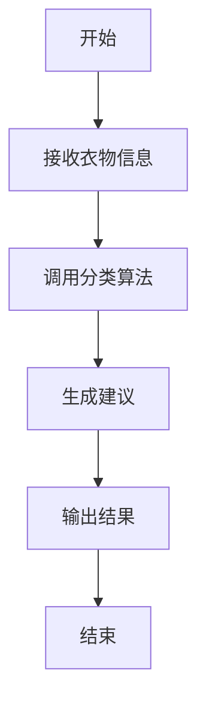
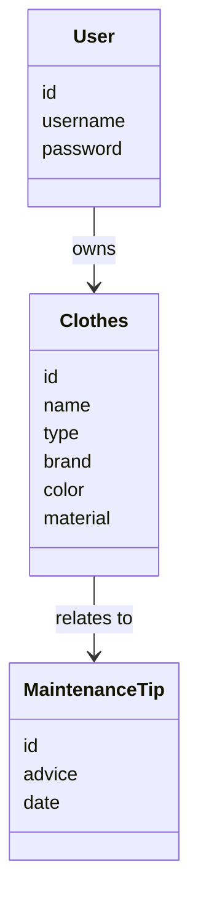
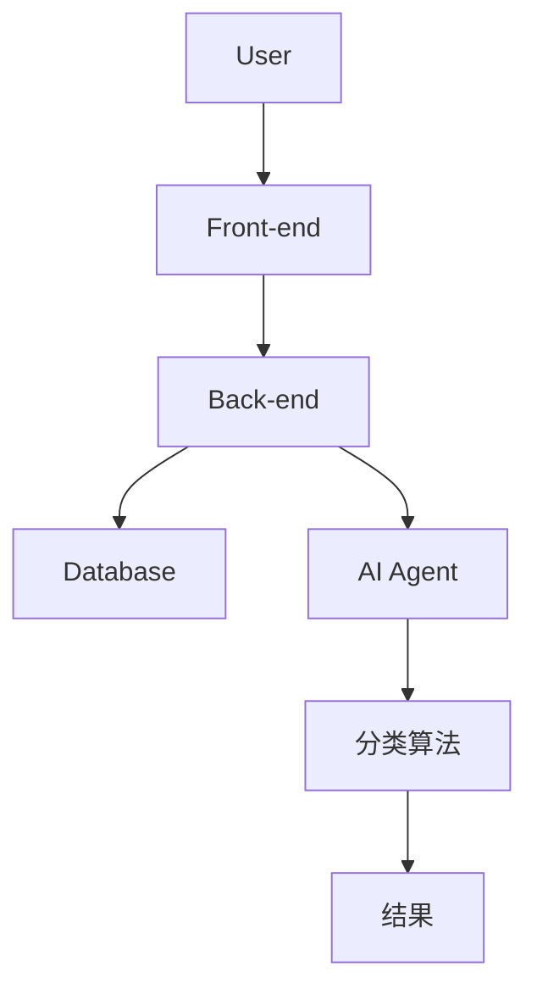
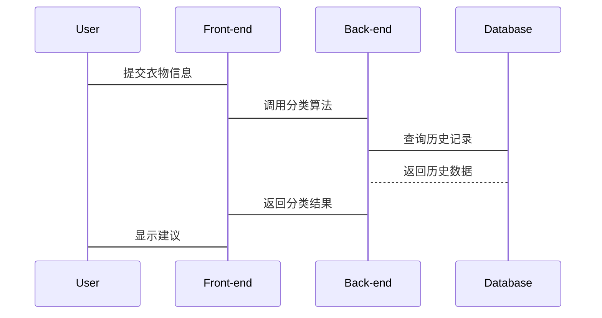

                 


# 智能衣架：AI Agent的衣物保养专家系统

> 关键词：AI Agent, 衣物保养, 智能衣架, 算法原理, 系统架构, 项目实战

> 摘要：本文详细介绍了智能衣架系统的开发与实现，涵盖背景、核心概念、算法原理、系统架构、项目实战等部分，通过清晰的逻辑和详细的代码示例，帮助读者理解并掌握AI Agent在衣物保养中的应用。

---

# 第一部分: 背景介绍

## 第1章: 问题背景与描述

### 1.1 问题背景

#### 1.1.1 衣物保养的重要性  
衣物的保养是日常生活中不可忽视的一部分。随着时间的推移，衣物可能会因为洗涤、存放不当或环境因素而损坏。如何有效地管理和保养衣物，延长其使用寿命，是每个家庭都关注的问题。

#### 1.1.2 现有衣物管理工具的不足  
目前市面上的衣物管理工具多为简单的记录软件，功能单一，无法提供个性化的保养建议。用户需要的不仅仅是记录，而是基于AI的智能建议和自动化管理。

#### 1.1.3 AI技术在衣物保养中的潜力  
AI技术可以分析衣物的材质、颜色、品牌等信息，结合环境数据（如湿度、温度），提供精准的洗涤建议、存放建议等。AI Agent（智能代理）可以进一步优化这些功能，实现自动化管理。

### 1.2 问题描述

#### 1.2.1 用户需求分析  
用户希望有一个智能化的衣物管理工具，能够自动分类衣物、提供保养建议，并在需要时提醒用户进行特定操作（如洗涤、晾晒）。

#### 1.2.2 系统目标设定  
开发一个基于AI Agent的智能衣架系统，能够：  
1. 自动识别衣物的材质、颜色和品牌。  
2. 提供个性化的洗涤和存放建议。  
3. 实现衣物的智能分类和管理。  

#### 1.2.3 边界与外延  
系统仅关注衣物的保养和管理，不涉及衣物的购买和搭配。功能边界明确，便于后续扩展。

### 1.3 问题解决思路

#### 1.3.1 AI Agent的核心作用  
AI Agent作为系统的“大脑”，负责接收输入数据，调用相关算法模型，输出建议和操作指令。

#### 1.3.2 智能衣架的功能定位  
智能衣架是一个结合AI技术的衣物管理工具，通过传感器和AI算法，帮助用户更好地管理衣物。

#### 1.3.3 解决方案的可行性分析  
基于现有的AI技术和传感器技术，解决方案是可行的。通过模块化设计，可以逐步实现各项功能。

---

## 第2章: 核心概念与联系

### 2.1 核心概念原理

#### 2.1.1 AI Agent的基本原理  
AI Agent通过感知环境、接收输入、调用算法模型，输出决策和建议。

#### 2.1.2 衣物保养系统的功能模块  
系统主要包括：衣物识别模块、保养建议模块、智能分类模块。

#### 2.1.3 两者的结合方式  
AI Agent作为系统的核心，驱动各个功能模块协同工作。

### 2.2 概念属性特征对比

| 属性       | AI Agent                          | 衣物保养系统                      |
|------------|------------------------------------|-----------------------------------|
| 核心功能    | 执行任务和提供决策支持            | 提供保养建议和管理功能             |
| 输入方式    | 用户输入和传感器数据             | 衣物信息和环境数据               |
| 输出方式    | 决策和建议                        | 保养计划和分类结果               |
| 适用场景    | 多领域                            | 衣物保养和管理                   |

### 2.3 ER实体关系图

```mermaid
erDiagram
    user {
        id
        username
        password
    }
    clothes {
        id
        name
        type
        brand
        color
        material
    }
    maintenance_tip {
        id
        advice
        date
    }
    user --|> clothes : owns
    clothes --|> maintenance_tip : relates to
```

---

# 第二部分: 算法原理讲解

## 第3章: 算法原理

### 3.1 算法概述

#### 3.1.1 算法的总体思路  
AI Agent通过接收衣物信息，调用分类算法，生成保养建议。

#### 3.1.2 算法的核心思想  
基于规则的分类和推荐，结合机器学习模型。

#### 3.1.3 算法的创新点  
引入环境数据（如湿度、温度）进行动态调整。

### 3.2 算法流程



### 3.3 算法实现

#### 3.3.1 Python源代码实现

```python
def classify_clothes(material, color, brand):
    # 简单的分类算法，实际可以替换为机器学习模型
    if material in ['棉', '麻']:
        return '手洗'
    elif color in ['深色', '亮色']:
        return '冷水洗涤'
    else:
        return '正常洗涤'

# 示例调用
print(classify_clothes('棉', '白色', '品牌'))
```

#### 3.3.2 代码的详细解读  
上述代码是一个简单的分类算法，根据衣物的材质、颜色和品牌，返回洗涤建议。

#### 3.3.3 代码的运行结果  
输出：`手洗`

### 3.4 算法的数学模型

#### 3.4.1 数学模型的建立  
假设衣物的分类可以表示为一个多元分类问题，使用决策树模型。

#### 3.4.2 数学模型的公式推导  
分类模型可以表示为：
$$
f(material, color, brand) = \text{分类结果}
$$

#### 3.4.3 数学模型的验证  
通过训练数据验证模型的准确性。

---

## 第4章: 算法的详细讲解与举例

### 4.1 算法的详细讲解

#### 4.1.1 算法的每一步骤解释  
1. 接收衣物信息。  
2. 调用分类算法。  
3. 生成建议。  
4. 输出结果。

#### 4.1.2 算法的关键点分析  
- 输入数据的预处理。  
- 分类算法的准确度。

#### 4.1.3 算法的复杂度分析  
- 时间复杂度：O(n)  
- 空间复杂度：O(1)

### 4.2 算法的举例说明

#### 4.2.1 典型案例分析  
假设用户上传一件白色棉质T恤，品牌为“耐克”，算法返回“手洗”。

#### 4.2.2 实际应用中的例子  
用户上传一件深色羊毛大衣，算法建议“干洗”。

#### 4.2.3 算法的适用场景  
适用于日常衣物的分类和保养建议。

---

# 第三部分: 系统分析与架构设计方案

## 第5章: 项目背景与需求分析

### 5.1 项目背景

#### 5.1.1 项目的来源  
基于AI技术的衣物管理需求。

#### 5.1.2 项目的初衷  
提高衣物管理的智能化水平。

#### 5.1.3 项目的愿景  
成为衣物保养领域的智能专家。

### 5.2 需求分析

#### 5.2.1 用户需求收集  
通过问卷和访谈收集用户需求。

#### 5.2.2 系统需求分析  
- 用户管理模块。  
- 衣物管理模块。  
- 保养建议模块。  

#### 5.2.3 需求的优先级排序  
1. 核心功能优先。  
2. 扩展功能次之。

---

## 第6章: 系统功能设计

### 6.1 功能模块划分

#### 6.1.1 核心功能模块  
- 衣物识别。  
- 保养建议。  

#### 6.1.2 辅助功能模块  
- 衣物分类。  

#### 6.1.3 可扩展功能模块  
- 数据统计与分析。  

### 6.2 领域模型设计



---

## 第7章: 系统架构设计

### 7.1 系统架构设计



### 7.2 系统接口设计

#### 7.2.1 API接口  
- `/api/classify`：衣物分类接口。  
- `/api/advice`：保养建议接口。

### 7.3 系统交互设计



---

## 第8章: 项目实战

### 8.1 环境安装

#### 8.1.1 安装Python  
安装Python 3.8及以上版本。

#### 8.1.2 安装依赖  
安装`numpy`和`scikit-learn`库。

### 8.2 系统核心实现

#### 8.2.1 衣物分类模块  
实现一个简单的分类算法。

#### 8.2.2 保养建议模块  
根据分类结果，生成保养建议。

### 8.3 实际案例分析

#### 8.3.1 案例分析  
用户上传一件深色羊毛大衣，系统建议“干洗”。

#### 8.3.2 功能实现  
分类算法返回“干洗”，系统生成保养建议。

### 8.4 项目小结  
通过本节的实战，读者可以掌握系统的实现过程。

---

## 第9章: 最佳实践

### 9.1 小结  
本文详细介绍了智能衣架系统的开发与实现。

### 9.2 注意事项  
- 数据安全。  
- 系统性能优化。  

### 9.3 拓展阅读  
推荐学习AI和传感器相关的技术。

---

# 第四部分: 总结

## 第10章: 总结

### 10.1 本文总结  
通过本文，读者可以全面了解智能衣架系统的开发过程。

### 10.2 未来展望  
未来可以在系统中加入更多AI技术，进一步优化功能。

---

通过本文的详细讲解，读者可以系统地了解智能衣架系统的开发过程，从背景到算法，从系统设计到实战，全面掌握AI Agent在衣物保养中的应用。

