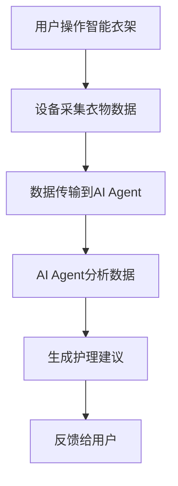
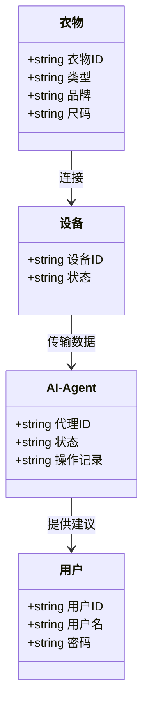
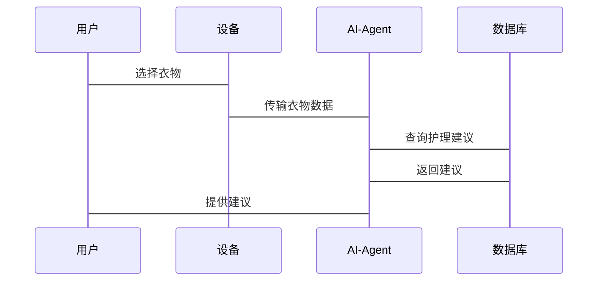
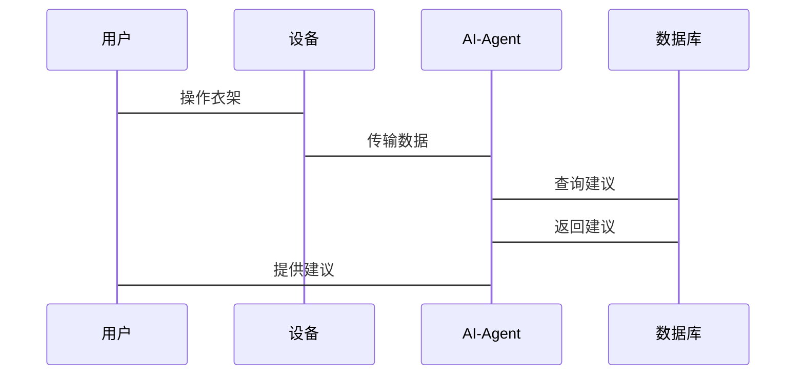

                 


# 第一部分: 背景介绍

## 第1章: 智能衣架的背景与问题背景

### 1.1 智能衣架的背景
#### 1.1.1 衣物护理的重要性
衣物护理是日常生活的重要部分，正确的护理方式可以延长衣物的使用寿命，保持衣物的整洁和美观。传统衣物护理主要依赖于人工经验，但在现代生活中，随着衣物种类的增加和护理要求的提高，人工护理显得力不从心。

#### 1.1.2 智能化衣物护理的发展趋势
随着人工智能和物联网技术的快速发展，智能化衣物护理成为趋势。通过智能设备和AI算法的结合，可以实现衣物的自动分类、清洗建议、搭配推荐等功能，提升用户体验。

#### 1.1.3 AI Agent在衣物护理中的应用前景
AI Agent（智能代理）可以通过学习用户的习惯和衣物的特性，提供个性化的衣物护理建议。结合物联网技术，智能衣架可以实时监测衣物的状态，自动调整护理方案，具有广阔的应用前景。

### 1.2 问题背景
#### 1.2.1 衣物护理中的常见问题
- 衣物分类复杂，不同材质需要不同的护理方法。
- 用户缺乏专业的护理知识，容易造成衣物损坏。
- 衣物搭配不合理，影响穿着效果。

#### 1.2.2 传统衣物护理方式的局限性
- 需要人工分类和管理，效率低下。
- 无法根据环境变化自动调整护理方案。
- 缺乏个性化推荐，难以满足用户多样化需求。

#### 1.2.3 智能化解决方案的必要性
智能化解决方案可以有效解决上述问题，提升衣物护理的效率和效果。通过AI Agent和物联网技术的结合，可以实现衣物的智能分类、清洗建议和搭配推荐。

### 1.3 问题描述
#### 1.3.1 用户需求分析
用户需要一个智能化的衣物护理系统，能够自动分类衣物、提供清洗建议、推荐搭配，并实时监控衣物状态。

#### 1.3.2 智能衣架的功能需求
智能衣架需要具备以下功能：
- 实时监测衣物状态，包括材质、颜色、品牌等信息。
- 根据衣物特性和环境因素，提供个性化的清洗建议。
- 推荐衣物搭配，提升用户的穿衣效果。
- 提供洗涤剂推荐，延长衣物使用寿命。

#### 1.3.3 系统边界与外延
智能衣架系统包括硬件部分（智能衣架、传感器）和软件部分（AI Agent、数据处理系统）。系统通过物联网技术与用户交互，提供智能化的衣物护理服务。

### 1.4 问题解决思路
#### 1.4.1 AI Agent的核心作用
AI Agent通过学习用户的习惯和衣物特性，提供个性化的护理建议。它可以实时分析衣物状态，调整护理方案，确保衣物得到最佳护理。

#### 1.4.2 物联网技术的应用
物联网技术实现智能衣架与设备的连接，实时采集衣物数据，与云端系统交互，提供智能化服务。

#### 1.4.3 多模态数据的整合与分析
通过整合图像、文本、环境等多种数据，AI Agent可以更全面地分析衣物状态，提供精准的护理建议。

---

# 第二部分: 核心概念与联系

## 第2章: 核心概念与联系

### 2.1 AI Agent的核心概念
#### 2.1.1 AI Agent的定义与特点
AI Agent是一种智能代理，能够感知环境、自主决策并执行任务。它具有学习能力、适应性和智能化等特点。

#### 2.1.2 AI Agent在智能衣架中的角色
AI Agent在智能衣架中负责数据采集、分析和决策，为用户提供个性化的衣物护理建议。

#### 2.1.3 AI Agent与物联网的结合
AI Agent通过物联网技术与智能衣架相连，实现数据的实时传输和分析，提供智能化服务。

### 2.2 核心概念的联系
#### 2.2.1 AI Agent与衣物护理的关系
AI Agent通过分析衣物数据，提供清洗建议和搭配推荐，提升衣物护理的效果。

#### 2.2.2 物联网技术在智能衣架中的应用
物联网技术实现智能衣架与设备的连接，实时采集和传输衣物数据，为AI Agent提供支持。

#### 2.2.3 数据流与系统架构的关系
数据流贯穿整个系统架构，从数据采集到分析，再到决策和反馈，形成一个完整的循环。

### 2.3 实体关系图与流程图
#### 2.3.1 ER实体关系图
```mermaid
erDiagram
    actor User {
        +string 用户ID
        +string 用户名
        +string 密码
    }
    class 衣物 {
        +string 衣物ID
        +string 类型
        +string 品牌
        +string 尺码
    }
    class 设备 {
        +string 设备ID
        +string 设备类型
        +string 状态
    }
    class AI-Agent {
        +string 代理ID
        +string 状态
        +string 操作记录
    }
 

    User --> 衣物: 管理
    User --> 设备: 操作
    设备 --> AI-Agent: 传输数据
    AI-Agent --> 衣物: 提供护理建议
```

#### 2.3.2 AI Agent工作流程图


---

# 第三部分: 算法原理讲解

## 第3章: 算法原理讲解

### 3.1 推荐算法
#### 3.1.1 推荐算法的定义与分类
推荐算法是基于用户行为和物品特征，预测用户偏好，推荐相关物品的算法。主要分为协同过滤、基于内容的推荐和混合推荐。

#### 3.1.2 基于协同过滤的推荐算法
协同过滤通过用户相似性或物品相似性进行推荐。具体步骤包括：
1. 数据预处理：构建用户-物品矩阵。
2. 计算相似度：使用余弦相似度或皮尔逊相似度。
3. 生成推荐：基于相似度计算推荐结果。

#### 3.1.3 基于内容的推荐算法
基于内容的推荐算法通过分析物品的特征，推荐相似的物品。具体步骤包括：
1. 特征提取：提取物品的特征向量。
2. 计算相似度：使用余弦相似度或欧式距离。
3. 生成推荐：基于相似度计算推荐结果。

#### 3.1.4 推荐算法的数学模型
协同过滤的数学模型：
$$ sim(u, v) = \frac{\sum_{i} (r_{u,i} - \bar{r}_u)(r_{v,i} - \bar{r}_v)}{\sqrt{\sum_{i} (r_{u,i} - \bar{r}_u)^2} \sqrt{\sum_{i} (r_{v,i} - \bar{r}_v)^2}} $$
其中，$\bar{r}_u$和$\bar{r}_v$分别是用户u和v的平均评分。

基于内容的推荐模型：
$$ sim(i, j) = \frac{\sum_{k} w_k (f_{i,k} - f_{j,k})^2}{\sqrt{\sum_{k} w_k (f_{i,k} - \bar{f}_k)^2} \sqrt{\sum_{k} w_k (f_{j,k} - \bar{f}_k)^2}} $$
其中，$w_k$是特征k的权重，$\bar{f}_k$是特征k的平均值。

#### 3.1.5 推荐算法的实现步骤
1. 数据预处理：清洗和归一化数据。
2. 特征提取：使用TF-IDF或Word2Vec提取物品特征。
3. 计算相似度：基于余弦相似度或欧式距离计算相似度。
4. 生成推荐：根据相似度排序，返回推荐结果。

#### 3.1.6 代码示例
```python
import numpy as np

def cosine_similarity(vec1, vec2):
    return np.dot(vec1, vec2) / (np.linalg.norm(vec1) * np.linalg.norm(vec2))

# 示例数据
item_features = {
    'item1': [0.5, 0.8, 0.2],
    'item2': [0.6, 0.7, 0.3],
    'item3': [0.4, 0.9, 0.1]
}

# 计算相似度
similarity = {}
for i in item_features:
    for j in item_features:
        if i != j:
            similarity[(i, j)] = cosine_similarity(item_features[i], item_features[j])

print(similarity)
```

### 3.2 图像识别算法
#### 3.2.1 图像识别算法的定义与分类
图像识别算法通过计算机视觉技术，识别图像中的物体、场景或文字。主要分为基于传统特征和基于深度学习的算法。

#### 3.2.2 基于卷积神经网络的图像识别算法
CNN通过卷积层、池化层和全连接层提取图像特征，最终分类。具体步骤包括：
1. 数据预处理：归一化和数据增强。
2. 模型训练：使用反向传播和梯度下降优化模型。
3. 模型预测：基于训练好的模型进行图像分类。

#### 3.2.3 图像识别算法的数学模型
卷积层的数学模型：
$$ y_{i,j} = \sum_{k=1}^{K} w_{k} * x_{i,j,k} + b_k $$
其中，$K$是滤镜数量，$w_k$是滤镜权重，$b_k$是偏置项。

池化层的数学模型：
$$ y_{i,j} = \max_{(i',j') \in N_{i,j}}(x_{i',j'}) $$
其中，$N_{i,j}$是池化窗口内的位置集合。

#### 3.2.4 图像识别算法的实现步骤
1. 数据预处理：归一化和数据增强。
2. 模型构建：定义卷积层、池化层和全连接层。
3. 模型训练：使用训练数据训练模型。
4. 模型预测：使用训练好的模型进行图像分类。

#### 3.2.5 代码示例
```python
import tensorflow as tf
from tensorflow.keras import layers

model = tf.keras.Sequential([
    layers.Conv2D(32, (3,3), activation='relu', input_shape=(224, 224, 3)),
    layers.MaxPooling2D((2,2)),
    layers.Conv2D(64, (3,3), activation='relu'),
    layers.MaxPooling2D((2,2)),
    layers.Flatten(),
    layers.Dense(128, activation='relu'),
    layers.Dense(10, activation='softmax')
])

model.compile(optimizer='adam', loss='sparse_categorical_crossentropy', metrics=['accuracy'])
model.summary()
```

---

# 第四部分: 系统分析与架构设计方案

## 第4章: 系统分析与架构设计方案

### 4.1 问题场景介绍
智能衣架系统需要解决衣物分类、清洗建议和搭配推荐等问题，通过AI Agent和物联网技术实现智能化服务。

### 4.2 项目介绍
本项目旨在开发一个智能衣架系统，利用AI Agent和物联网技术，为用户提供个性化的衣物护理建议。

### 4.3 系统功能设计
#### 4.3.1 领域模型类图


#### 4.3.2 系统架构图


#### 4.3.3 系统交互图


### 4.4 系统接口设计
智能衣架系统需要设计衣物数据接口、AI Agent接口和用户交互接口。

### 4.5 系统交互图


---

# 第五部分: 项目实战

## 第5章: 项目实战

### 5.1 环境安装与配置
#### 5.1.1 Python环境安装
安装Python和必要的库，如TensorFlow、Keras、OpenCV等。

#### 5.1.2 系统架构搭建
搭建智能衣架系统的架构，包括客户端、网关、服务节点和数据库。

### 5.2 系统核心实现
#### 5.2.1 AI Agent核心实现
实现AI Agent的数据采集、分析和决策功能。

#### 5.2.2 图像识别核心实现
实现基于卷积神经网络的图像识别功能。

#### 5.2.3 推荐算法核心实现
实现协同过滤和基于内容的推荐算法。

### 5.3 代码实现与解读
#### 5.3.1 AI Agent代码实现
```python
class AI-Agent:
    def __init__(self):
        self.devices = {}  # 设备列表
        self.users = {}    # 用户列表
        self.data = {}     # 数据存储

    def collect_data(self, device_id, data):
        # 收集设备数据
        self.data[device_id] = data

    def analyze_data(self):
        # 分析数据并生成建议
        pass

    def provide_recommendation(self, user_id):
        # 提供个性化建议
        pass
```

#### 5.3.2 图像识别代码实现
```python
import tensorflow as tf
from tensorflow.keras import layers

model = tf.keras.Sequential([
    layers.Conv2D(32, (3,3), activation='relu', input_shape=(224, 224, 3)),
    layers.MaxPooling2D((2,2)),
    layers.Conv2D(64, (3,3), activation='relu'),
    layers.MaxPooling2D((2,2)),
    layers.Flatten(),
    layers.Dense(128, activation='relu'),
    layers.Dense(10, activation='softmax')
])

model.compile(optimizer='adam', loss='sparse_categorical_crossentropy', metrics=['accuracy'])
model.summary()
```

### 5.4 实际案例分析
#### 5.4.1 案例背景
用户A有多种衣物，需要智能衣架提供清洗建议和搭配推荐。

#### 5.4.2 数据采集与分析
智能衣架采集用户A的衣物数据，分析衣物类型和品牌，生成清洗建议。

#### 5.4.3 系统输出
AI Agent根据数据生成清洗建议和搭配推荐，反馈给用户。

### 5.5 项目小结
通过项目实战，验证了智能衣架系统的可行性和有效性，为用户提供个性化的衣物护理服务。

---

# 第六部分: 最佳实践

## 第6章: 最佳实践

### 6.1 实施建议
在实施智能衣架系统时，建议选择合适的硬件设备和可靠的云服务提供商，确保系统的稳定性和安全性。

### 6.2 注意事项
- 确保数据的安全性和隐私保护。
- 定期更新AI模型，提升推荐的准确性。
- 提供良好的用户界面，提升用户体验。

### 6.3 拓展阅读
推荐阅读《深度学习》和《机器学习实战》，深入理解AI Agent和物联网技术的应用。

---

# 结语

通过本文的详细讲解，读者可以全面了解智能衣架系统的构建与实现。从背景介绍到算法原理，再到系统设计和项目实战，每个部分都进行了深入的探讨。希望本文能为读者提供有价值的参考和启示，帮助他们在智能衣物护理领域取得更好的成果。

