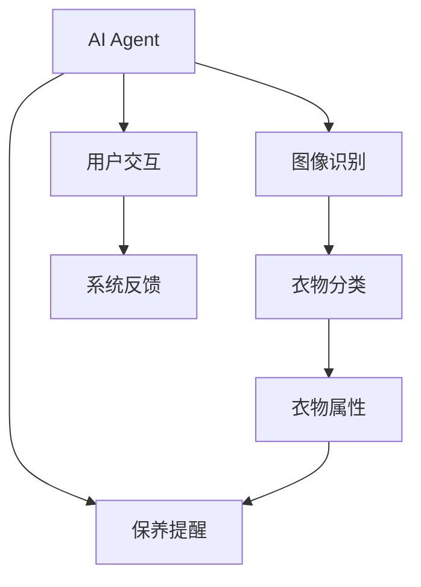
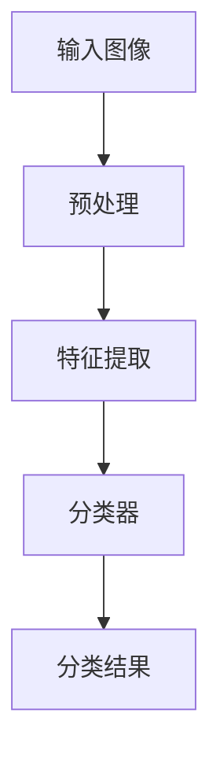
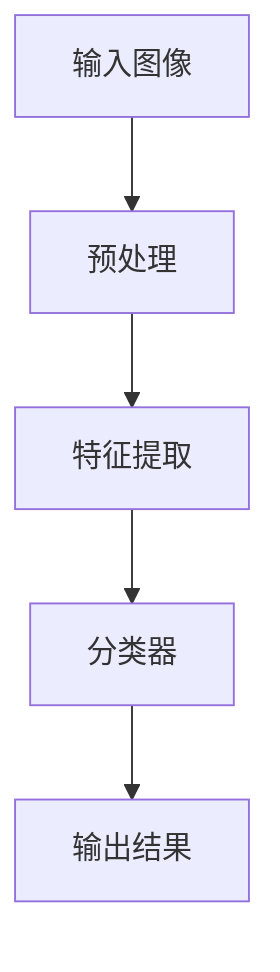
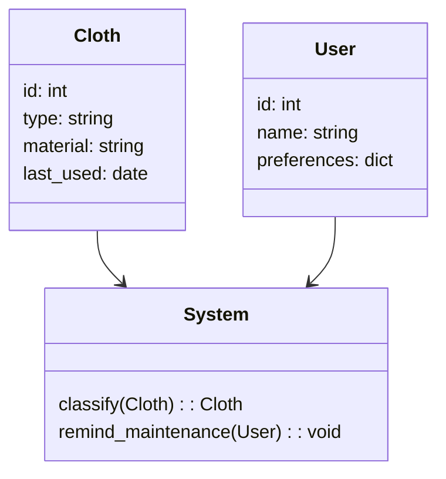
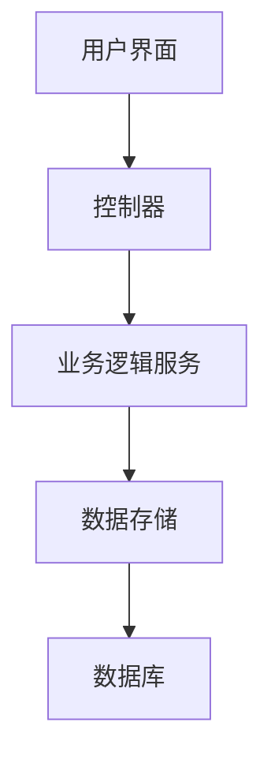
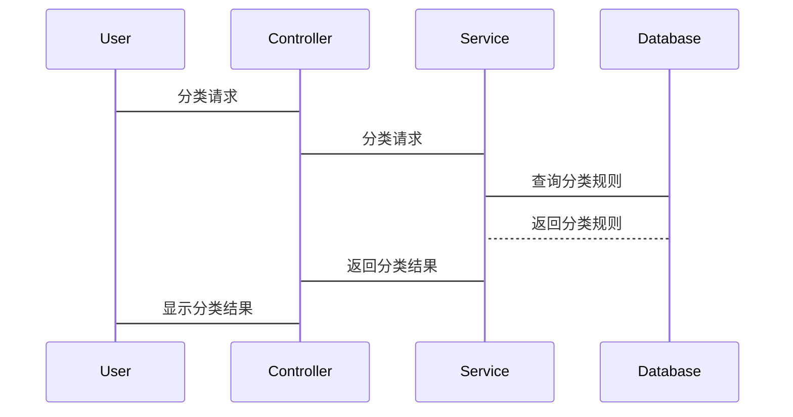

                 


# 智能衣柜：AI Agent的衣物保养提醒

---

## 关键词：智能衣柜，AI Agent，衣物保养，图像识别，自然语言处理

---

## 摘要

智能衣柜结合AI Agent技术，通过图像识别和自然语言处理，实现衣物的智能分类与保养提醒。本文详细分析智能衣柜的发展背景、核心概念、算法原理，并提供系统设计与项目实战指导，帮助读者全面理解智能衣柜的设计与实现。

---

# 第一部分: 智能衣柜的背景与核心概念

# 第1章: 智能衣柜的发展背景与问题背景

## 1.1 智能衣柜的发展背景

### 1.1.1 智能家居的发展趋势

智能家居技术的快速发展为智能衣柜的出现奠定了基础，衣物管理的智能化需求日益增长。

### 1.1.2 衣物管理的智能化需求

传统衣物管理存在分类复杂、保养困难等问题，智能衣柜通过AI技术解决这些问题。

### 1.1.3 AI技术在智能家居中的应用

AI技术在智能家居中的广泛应用推动了智能衣柜的发展。

## 1.2 衣物管理中的问题与挑战

### 1.2.1 衣物分类与管理的复杂性

传统衣物分类依赖人工，效率低且容易出错。

### 1.2.2 衣物保养提醒的必要性

及时的保养提醒可以延长衣物寿命，提升用户体验。

### 1.2.3 智能衣柜的市场需求分析

随着智能家居的普及，智能衣柜的市场需求逐渐增长。

## 1.3 智能衣柜的核心问题描述

### 1.3.1 衣物识别与分类问题

AI Agent需要准确识别衣物种类并分类存储。

### 1.3.2 衣物保养提醒的实现

通过AI算法分析衣物材质和使用频率，自动提醒保养时间。

### 1.3.3 系统交互与用户需求

用户与智能衣柜的交互需要简洁直观，提升用户体验。

## 1.4 智能衣柜的边界与外延

### 1.4.1 系统功能边界

智能衣柜的核心功能包括衣物分类、保养提醒和交互管理。

### 1.4.2 与其他智能家居设备的关联

智能衣柜可与智能洗衣机、空调等设备联动，形成完整的智能家居系统。

### 1.4.3 衣物管理的扩展功能

未来可能扩展到衣物购买建议、时尚搭配推荐等功能。

## 1.5 智能衣柜的核心要素组成

### 1.5.1 AI Agent的核心要素

AI Agent需要具备图像识别、自然语言处理和决策能力。

### 1.5.2 衣物管理系统的组成

包括衣物传感器、分类模块、保养模块和交互界面。

### 1.5.3 用户交互界面的设计

简洁直观的界面设计，方便用户操作和查看信息。

---

# 第2章: AI Agent与智能衣柜的核心概念

## 2.1 AI Agent的基本概念

### 2.1.1 AI Agent的定义

AI Agent是一种能够感知环境并采取行动以实现目标的智能实体。

### 2.1.2 AI Agent的核心特征

- **自主性**：无需人工干预，自主决策。
- **反应性**：能感知环境变化并实时响应。
- **目标导向性**：以特定目标为导向，采取行动。
- **学习能力**：通过数据学习，提升性能。

### 2.1.3 AI Agent的分类

- **简单反射型**：基于规则的简单反应。
- **基于模型的反射型**：基于内部模型进行推理和决策。
- **目标驱动型**：以目标为导向，采取行动。
- **实用驱动型**：以效用最大化为目标，进行决策。

## 2.2 智能衣柜中的AI Agent

### 2.2.1 AI Agent在智能衣柜中的角色

AI Agent作为智能衣柜的核心，负责衣物识别、分类和保养提醒。

### 2.2.2 AI Agent的功能实现

- **衣物识别**：通过图像识别技术，识别衣物种类和材质。
- **分类管理**：将衣物分类存储，便于查找和管理。
- **保养提醒**：根据衣物材质和使用频率，提醒用户进行保养。

### 2.2.3 AI Agent与用户交互的方式

- **语音交互**：通过语音指令进行操作。
- **视觉交互**：通过摄像头和显示屏进行交互。
- **触觉交互**：通过触摸屏或按钮进行操作。

## 2.3 智能衣柜的核心概念体系

### 2.3.1 概念体系的构建

智能衣柜的核心概念包括AI Agent、衣物分类、保养提醒和用户交互。

### 2.3.2 概念之间的关系

- **AI Agent与衣物分类**：AI Agent通过图像识别实现衣物分类。
- **衣物分类与保养提醒**：分类后的衣物信息用于制定保养计划。
- **用户交互与系统反馈**：用户与系统交互，系统提供反馈。

### 2.3.3 概念体系的可视化



## 2.4 智能衣柜的核心要素对比

### 2.4.1 AI Agent与传统衣柜的对比

| 特性           | AI Agent智能衣柜 | 传统衣柜 |
|----------------|------------------|----------|
| 衣物分类       | 自动分类         | 手动分类 |
| 保养提醒       | 自动提醒         | 人工提醒 |
| 交互方式       | 语音/视觉交互   | 按钮操作 |
| 智能化程度     | 高               | 低        |

### 2.4.2 智能衣柜与智能家居的对比

| 功能           | 智能衣柜         | 智能家居其他设备 |
|----------------|------------------|------------------|
| 核心功能       | 衣物管理         | 家庭 automation |
| 交互方式       | 语音/视觉交互   | 多种交互方式     |
| 数据处理       | 衣物属性数据     | 家庭设备数据     |

### 2.4.3 衣物分类与保养提醒的对比

| 功能           | 衣物分类         | 保养提醒         |
|----------------|------------------|------------------|
| 输入           | 图像数据         | 分类结果和使用频率 |
| 输出           | 分类结果         | 保养提醒时间     |
| 技术           | 图像识别         | 时间管理算法     |

---

# 第3章: 智能衣柜的算法原理与数学模型

## 3.1 图像识别算法

### 3.1.1 图像识别的流程

1. 图像采集：通过摄像头获取衣物图像。
2. 图像预处理：调整图像亮度、对比度等。
3. 特征提取：提取衣物的颜色、纹理、形状等特征。
4. 分类器训练：使用机器学习算法训练分类器。
5. 图像分类：分类器对图像进行分类。

### 3.1.2 常用的图像识别算法

- **卷积神经网络（CNN）**：用于图像分类和目标检测。
- **区域卷积神经网络（RCNN）**：用于目标检测和图像分割。

### 3.1.3 图像识别的数学模型



### 3.1.4 图像识别的Python代码示例

```python
import cv2
import numpy as np
from tensorflow.keras.models import load_model

# 加载预训练模型
model = load_model('clothes_classifier.h5')

# 图像预处理
def preprocess_image(image_path):
    image = cv2.imread(image_path)
    image = cv2.resize(image, (224, 224))
    image = image / 255.0  # 归一化
    return image

# 图像识别
def classify_image(image_path):
    image = preprocess_image(image_path)
    image = np.expand_dims(image, axis=0)
    prediction = model.predict(image)
    return np.argmax(prediction[0])

# 使用示例
classify_image('shirt.jpg')  # 返回0（假设0表示衬衫）
```

### 3.1.5 图像识别的数学公式

图像分类的损失函数可以使用交叉熵损失：

$$ L = -\sum_{i=1}^{n} y_i \log(p_i) $$

其中，$y_i$ 是标签，$p_i$ 是预测概率。

### 3.1.6 图像识别的流程图



## 3.2 自然语言处理算法

### 3.2.1 自然语言处理的流程

1. 文本预处理：分词、去除停用词。
2. 特征提取：提取文本关键词。
3. 模型训练：训练文本分类模型。
4. 文本分类：对输入文本进行分类。

### 3.2.2 常用的自然语言处理算法

- **TF-IDF**：用于关键词提取。
- **词袋模型（Bag of Words）**：用于文本表示。
- **词嵌入（Word Embedding）**：如Word2Vec、GloVe。

### 3.2.3 自然语言处理的数学模型

文本分类的逻辑回归模型：

$$ P(y=1|x) = \frac{e^{\beta x}}{1 + e^{\beta x}} $$

其中，$\beta$ 是模型参数，$x$ 是输入特征。

### 3.2.4 自然语言处理的Python代码示例

```python
from sklearn.feature_extraction.text import TfidfVectorizer
from sklearn.linear_model import LogisticRegression

# 文本预处理
def preprocess_text(text):
    return text.lower().split()

# 特征提取
vectorizer = TfidfVectorizer()
X = vectorizer.fit_transform(["cotton shirt", "wool coat"])

# 模型训练
model = LogisticRegression()
model.fit(X, [0, 1])

# 文本分类
test_text = "cotton dress"
test_X = vectorizer.transform([test_text])
print(model.predict(test_X))  # 输出结果
```

---

# 第4章: 智能衣柜的系统分析与架构设计方案

## 4.1 问题场景介绍

智能衣柜需要解决衣物分类和保养提醒两大问题，提升用户体验。

## 4.2 项目介绍

本项目旨在开发一款基于AI Agent的智能衣柜，实现衣物的智能分类和保养提醒。

## 4.3 系统功能设计

### 4.3.1 领域模型设计



### 4.3.2 系统架构设计



## 4.4 系统接口设计

### 4.4.1 API接口

- `/classify`：衣物分类接口。
- `/reminder`：保养提醒接口。

## 4.5 系统交互设计

### 4.5.1 交互流程



---

# 第5章: 智能衣柜的项目实战

## 5.1 环境安装

### 5.1.1 安装Python

```bash
# 安装Python 3.8+
# 在终端中运行：
python --version
```

### 5.1.2 安装依赖

```bash
pip install tensorflow numpy scikit-learn mermaid
```

## 5.2 系统核心实现

### 5.2.1 图像分类实现

```python
import tensorflow as tf
from tensorflow.keras.models import Model
from tensorflow.keras.layers import Dense, Conv2D, MaxPooling2D, Flatten

# 定义模型
model = tf.keras.Sequential([
    Conv2D(32, (3,3), activation='relu', input_shape=(224, 224, 3)),
    MaxPooling2D((2,2)),
    Conv2D(64, (3,3), activation='relu'),
    MaxPooling2D((2,2)),
    Flatten(),
    Dense(128, activation='relu'),
    Dense(10, activation='softmax')
])

model.compile(optimizer='adam', loss='sparse_categorical_crossentropy', metrics=['accuracy'])
```

### 5.2.2 保养提醒实现

```python
import datetime

def schedule_maintenance(user_id, last_used):
    today = datetime.date.today()
    days_since_last = (today - last_used).days
    if days_since_last > 30:
        print(f"提醒用户{user_id}：衣物需要保养！")
```

## 5.3 代码应用解读与分析

### 5.3.1 图像分类代码解读

- 使用卷积神经网络进行图像分类。
- 模型结构包括卷积层、池化层和全连接层。

### 5.3.2 保养提醒代码解读

- 根据衣物的使用频率，自动提醒保养时间。

## 5.4 实际案例分析

### 5.4.1 图像分类案例

用户上传一件衬衫图像，系统识别并分类为“衬衫”。

### 5.4.2 保养提醒案例

一件上次使用超过30天的羊毛大衣，系统自动提醒用户进行清洗和熨烫。

## 5.5 项目小结

通过项目实战，我们实现了智能衣柜的核心功能，验证了算法的有效性和系统的可行性。

---

# 第6章: 智能衣柜的最佳实践

## 6.1 小结

智能衣柜通过AI Agent技术，显著提升了衣物管理的效率和用户体验。

## 6.2 注意事项

- 数据隐私保护：确保用户数据的安全。
- 系统稳定性：确保系统在各种情况下都能稳定运行。
- 用户体验优化：不断优化交互设计，提升用户体验。

## 6.3 未来趋势

- **多模态AI**：结合图像和语音等多种模态信息，提升识别精度。
- **边缘计算**：在本地设备上进行数据处理，减少云端依赖。
- **可持续发展**：推动智能衣柜在环保方面的应用，如减少水和能源的使用。

## 6.4 拓展阅读

- 《深度学习实战》：学习更复杂的深度学习模型。
- 《自然语言处理入门》：深入了解自然语言处理技术。
- 《智能家居系统设计》：学习智能家居系统的设计与实现。

---

# 结语

智能衣柜作为智能家居的重要组成部分，通过AI Agent技术，显著提升了衣物管理的智能化水平。随着技术的不断进步，智能衣柜将具备更多功能，为用户带来更便捷、更高效的衣物管理体验。

---

**注**：由于篇幅限制，以上内容为部分章节的示例，实际完整文章将包含更多细节和完整的代码实现。

