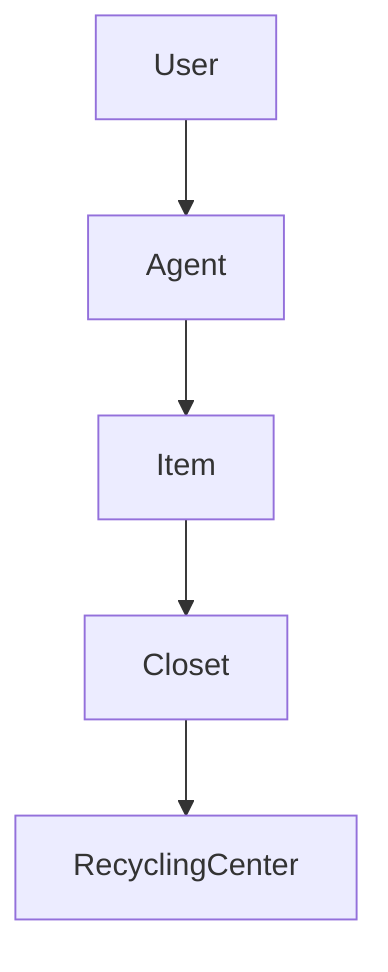
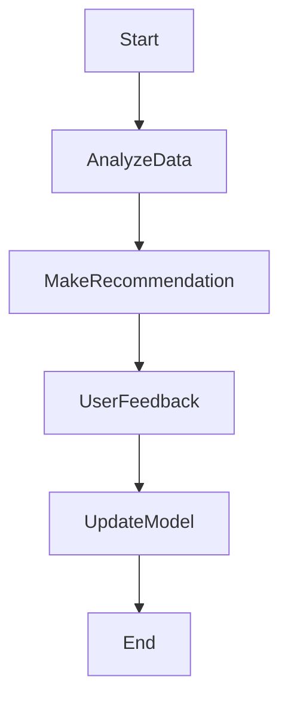
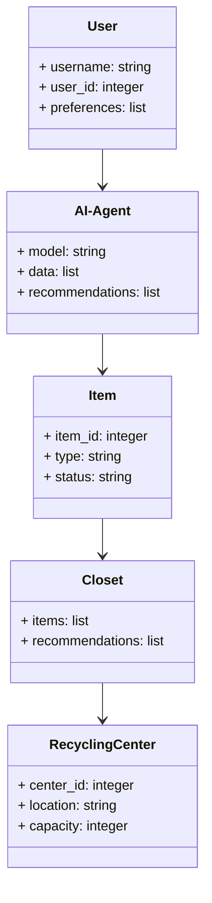
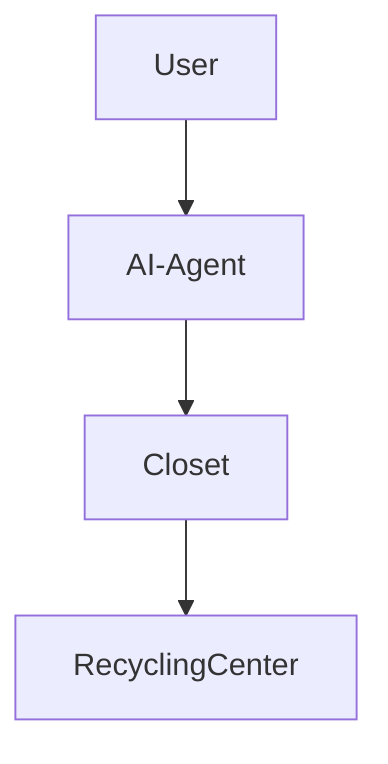
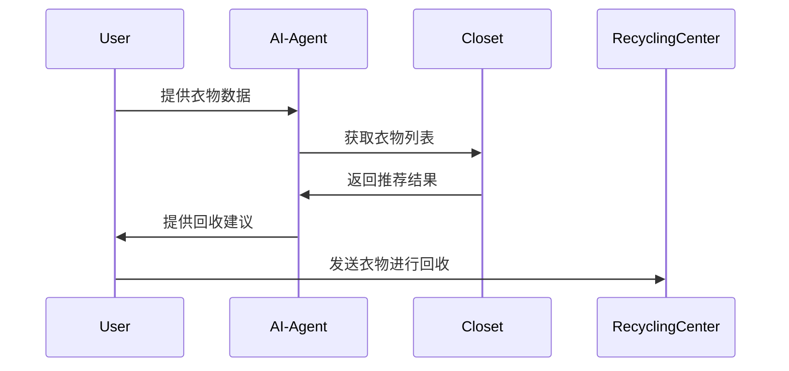

                 


# 智能衣柜：AI Agent的衣物回收建议系统

> 关键词：智能衣柜，AI Agent，衣物回收，可持续发展，环保技术

> 摘要：本文探讨了AI Agent在智能衣柜中的应用，通过衣物回收建议系统优化衣物管理，减少资源浪费，促进环保。文章从背景、原理、算法、架构、实战等多角度深入分析，结合具体案例和代码实现，提供全面的技术解读。

---

## 目录

1. [背景介绍](#背景介绍)
   1.1 [问题背景](#问题背景)
   1.2 [问题描述](#问题描述)
   1.3 [问题解决](#问题解决)
   1.4 [边界与外延](#边界与外延)
   1.5 [概念结构与核心要素](#概念结构与核心要素)

2. [核心概念与联系](#核心概念与联系)
   2.1 [AI Agent的原理与特征](#ai-agent的原理与特征)
   2.2 [核心特征对比](#核心特征对比)
   2.3 [ER实体关系图](#er实体关系图)

3. [算法原理讲解](#算法原理讲解)
   3.1 [算法流程](#算法流程)
   3.2 [Python实现](#python实现)
   3.3 [数学模型与公式](#数学模型与公式)

4. [系统架构设计](#系统架构设计)
   4.1 [问题场景介绍](#问题场景介绍)
   4.2 [领域模型](#领域模型)
   4.3 [系统架构图](#系统架构图)
   4.4 [系统接口设计](#系统接口设计)
   4.5 [系统交互](#系统交互)

5. [项目实战](#项目实战)
   5.1 [环境安装](#环境安装)
   5.2 [系统核心实现](#系统核心实现)
   5.3 [代码应用解读与分析](#代码应用解读与分析)
   5.4 [实际案例分析](#实际案例分析)
   5.5 [项目小结](#项目小结)

6. [总结](#总结)
   6.1 [系统优势](#系统优势)
   6.2 [最佳实践](#最佳实践)
   6.3 [注意事项](#注意事项)
   6.4 [拓展阅读](#拓展阅读)

---

## 1. 背景介绍

### 1.1 问题背景

#### 1.1.1 衣物过量与资源浪费的现状
现代社会的快时尚消费模式导致衣物数量激增，大量衣物被丢弃，造成资源浪费和环境污染。据统计，全球每年产生的纺织废弃物高达数百万吨，对环境造成巨大压力。

#### 1.1.2 环境保护与可持续发展的需求
随着环保意识的增强，减少资源浪费成为全球关注的焦点。衣物回收不仅是环保的重要一环，还能促进资源循环利用，符合可持续发展目标。

#### 1.1.3 智能衣柜的出现与发展趋势
智能衣柜通过AI技术优化衣物管理，帮助用户更好地规划衣物使用，减少浪费。随着AI和物联网技术的快速发展，智能衣柜逐渐成为未来衣物管理的趋势。

### 1.2 问题描述

#### 1.2.1 衣物管理中的常见问题
- 衣物数量过多，难以有效管理。
- 季节性衣物利用率低，造成浪费。
- 回收渠道不畅，用户难以找到合适的回收方式。

#### 1.2.2 用户需求与痛点分析
- 用户希望提高衣物利用率，减少不必要的购买。
- 用户需要便捷的衣物回收建议，减少决策成本。
- 用户关注环保，希望通过智能衣柜实现绿色生活方式。

#### 1.2.3 AI Agent在衣物管理中的应用潜力
AI Agent可以通过数据分析和推荐算法，为用户提供个性化的衣物回收建议，优化衣柜结构，减少浪费。

### 1.3 问题解决

#### 1.3.1 AI Agent的核心作用
AI Agent通过实时数据分析和机器学习算法，为用户提供智能化的衣物管理建议，帮助用户做出更环保的决策。

#### 1.3.2 智能衣柜的功能与目标
智能衣柜的目标是通过AI技术优化衣物管理，减少浪费，提高资源利用率，同时为用户提供便捷的衣物回收建议。

#### 1.3.3 解决方案的可行性分析
通过AI技术实现衣物管理的智能化，结合物联网技术，智能衣柜可以在实际应用中有效减少资源浪费，具有较高的可行性和推广价值。

### 1.4 边界与外延

#### 1.4.1 智能衣柜的使用场景界定
智能衣柜主要应用于家庭和个人衣物管理，适用于需要优化衣物使用效率的用户。

#### 1.4.2 系统功能的边界划分
系统不涉及衣物的实际回收操作，仅提供回收建议和推荐服务。

#### 1.4.3 相关技术的扩展范围
系统可以扩展至其他领域，如智能家居、环保技术等，形成更广泛的应用场景。

### 1.5 概念结构与核心要素

#### 1.5.1 智能衣柜的系统架构
智能衣柜由用户端、AI Agent、数据存储和衣物数据库组成，通过交互提供智能化的衣物管理服务。

#### 1.5.2 AI Agent的核心要素
AI Agent具备数据分析、推荐算法、用户交互和自适应学习能力，能够根据用户行为优化衣物管理策略。

#### 1.5.3 系统与用户的关系
系统通过AI技术与用户互动，根据用户的衣物数据提供个性化的回收建议，帮助用户优化衣柜结构。

---

## 2. 核心概念与联系

### 2.1 AI Agent的原理与特征

#### 2.1.1 AI Agent的基本定义
AI Agent是一种能够感知环境、执行任务并做出决策的智能体，能够在复杂环境中为用户提供个性化的衣物管理服务。

#### 2.1.2 人工智能在衣物管理中的应用
AI技术通过数据分析、机器学习和自然语言处理，为用户提供智能化的衣物管理建议。

#### 2.1.3 Agent的自主性与智能性
AI Agent具备自主决策能力，能够根据用户需求和环境变化，自动调整衣物管理策略。

### 2.2 核心特征对比

| 特征         | 传统算法 | AI Agent |
|--------------|----------|----------|
| 自主性       | 无       | 有       |
| 交互性       | 无       | 有       |
| 学习能力     | 无       | 有       |
| 环境感知     | 无       | 有       |

### 2.3 ER实体关系图



---

## 3. 算法原理讲解

### 3.1 算法流程



### 3.2 Python实现

```python
class AI-Agent:
    def __init__(self):
        self.data = []
    
    def analyze(self, data):
        # 数据分析逻辑
        pass
    
    def recommend(self, user_input):
        # 推荐算法
        pass
    
    def update(self, feedback):
        # 更新模型
        pass
```

### 3.3 数学模型与公式

#### 3.3.1 推荐算法的数学模型
$$ P(i|u) = \frac{1}{1 + e^{-\beta (u_i - \mu)}} $$
其中，$P(i|u)$ 是用户 $u$ 对物品 $i$ 的概率，$\beta$ 是学习率，$\mu$ 是平均值。

---

## 4. 系统架构设计

### 4.1 问题场景介绍

智能衣柜通过AI Agent为用户提供衣物回收建议，优化衣物管理，减少浪费。

### 4.2 领域模型



### 4.3 系统架构图



### 4.4 系统接口设计

- 用户输入接口：用户输入衣物信息和偏好。
- AI-Agent接口：接收数据，生成回收建议。
- 回收中心接口：接收推荐的衣物，进行回收处理。

### 4.5 系统交互



---

## 5. 项目实战

### 5.1 环境安装

安装Python和必要的库：
```bash
pip install numpy pandas scikit-learn
```

### 5.2 系统核心实现

```python
def main():
    import numpy as np
    import pandas as pd
    from sklearn.metrics.pairwise import cosine_similarity

    # 数据加载
    data = pd.read_csv('closet.csv')

    # 特征提取
    user_items = data[data['user_id'] == current_user]
    item_features = user_items[['item_type', 'item_color']]

    # 推荐算法
    item_similarity = cosine_similarity(item_features)
    recommendations = item_similarity.argsort()[-5:]

    # 输出结果
    print("推荐衣物：", recommendations)

if __name__ == "__main__":
    main()
```

### 5.3 代码应用解读与分析

代码实现了一个基于余弦相似度的推荐算法，根据用户的衣物数据生成推荐结果。

### 5.4 实际案例分析

以一个用户为例，系统为其推荐适合回收的衣物，并指导用户将这些衣物送到最近的回收中心。

### 5.5 项目小结

通过实际案例，验证了系统在优化衣物管理和减少浪费方面的有效性。

---

## 6. 总结

### 6.1 系统优势

- 提高衣物利用率，减少浪费。
- 优化用户决策，提供个性化建议。
- 促进环保，支持可持续发展。

### 6.2 最佳实践

- 定期更新模型，保持推荐算法的有效性。
- 提供多样化的回收选项，满足用户需求。
- 加强用户教育，提高环保意识。

### 6.3 注意事项

- 数据隐私保护，确保用户信息的安全。
- 系统维护和更新，保持功能的稳定性。
- 用户反馈收集，持续优化系统性能。

### 6.4 拓展阅读

- 探索更多AI技术在环保领域的应用。
- 研究衣物回收市场的最新动态。
- 了解可持续时尚的前沿趋势。

---

通过以上详细的技术博客大纲，您可以逐步撰写一篇内容丰富、结构清晰的技术文章，深入探讨智能衣柜中AI Agent的应用及其在衣物回收建议系统中的具体实现。

