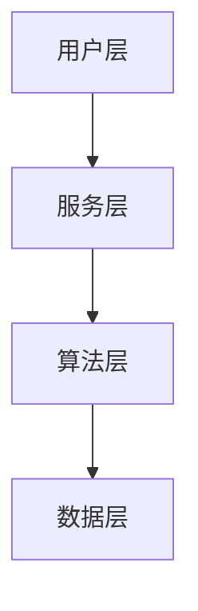
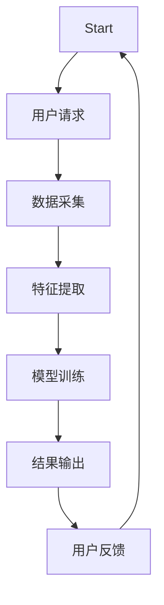

                 


# 智能购物车：AI Agent的商品推荐系统

## 关键词：智能购物车，AI Agent，推荐系统，协同过滤，深度学习，知识图谱

## 摘要：  
本文深入探讨了智能购物车中AI Agent的商品推荐系统的实现与优化。通过分析传统购物车的局限性，介绍了AI Agent在推荐系统中的重要作用。详细讲解了推荐系统的分类、核心算法原理、系统架构设计以及实际项目实现，结合实际案例和最佳实践，为读者提供了全面的技术指导。

---

# 第一部分: 智能购物车与AI Agent概述

## 第1章: 智能购物车的发展与AI Agent的引入

### 1.1 智能购物车的背景与现状

#### 1.1.1 传统购物车的功能与局限性
传统的购物车系统主要功能包括商品浏览、添加到购物车、结算等。然而，这些系统通常缺乏智能化，无法根据用户行为和偏好推荐相关商品，导致用户体验较差。

#### 1.1.2 智能购物车的概念与发展趋势
智能购物车通过集成AI技术，能够实时分析用户行为、历史数据和商品信息，主动推荐相关商品，提升用户体验和购物效率。

#### 1.1.3 AI Agent在购物车中的应用前景
AI Agent（智能代理）可以作为购物车的核心模块，通过学习用户行为和偏好，优化推荐策略，提升推荐准确性和个性化水平。

### 1.2 AI Agent的基本概念与技术特点

#### 1.2.1 AI Agent的定义与核心功能
AI Agent是一种能够感知环境、自主决策并执行任务的智能系统，核心功能包括数据收集、特征提取、模型训练和结果输出。

#### 1.2.2 AI Agent的主要技术特点
- **实时性**：能够实时处理用户行为数据。
- **个性化**：基于用户画像提供个性化推荐。
- **自适应性**：能够根据反馈调整推荐策略。

#### 1.2.3 AI Agent与传统推荐系统的区别
| 特性 | AI Agent推荐系统 | 传统推荐系统 |
|------|------------------|--------------|
| 数据来源 | 结合用户行为和外部数据 | 主要依赖历史数据 |
| 推荐策略 | 动态调整，实时优化 | 静态规则，周期性更新 |
| 个性化程度 | 高 | 中等 |

### 1.3 本章小结
本章介绍了智能购物车的发展背景，分析了AI Agent在购物车中的重要作用，并总结了AI Agent的核心功能和技术特点。

---

# 第二部分: 商品推荐系统的核心概念与技术

## 第2章: 商品推荐系统的核心概念

### 2.1 推荐系统的定义与分类

#### 2.1.1 推荐系统的定义
推荐系统是一种基于用户行为和商品信息，预测用户偏好并推荐相关商品的系统。

#### 2.1.2 推荐系统的分类
推荐系统主要分为基于协同过滤、基于内容、基于知识图谱和基于深度学习四种类型。

#### 2.1.3 推荐系统的优缺点对比
| 类型 | 优点 | 缺点 |
|------|------|------|
| 协同过滤 | 数据简单，易于实现 | 对冷启动问题敏感 |
| 基于内容 | 推荐结果可解释 | 对稀疏数据敏感 |
| 基于知识图谱 | 融合知识图谱信息 | 构建知识图谱成本高 |
| 基于深度学习 | 表现能力强 | 需大量数据支持 |

### 2.2 AI Agent在推荐系统中的角色与功能

#### 2.2.1 AI Agent在推荐系统中的核心角色
AI Agent负责数据收集、特征提取、模型训练和结果输出，是推荐系统的核心驱动模块。

#### 2.2.2 AI Agent的主要功能
- 数据收集：实时采集用户行为数据。
- 特征提取：从数据中提取有用的特征信息。
- 模型训练：基于特征数据训练推荐模型。
- 结果输出：将推荐结果输出到购物车界面。

### 2.3 推荐系统的核心要素与概念结构

#### 2.3.1 用户画像与行为分析
用户画像是基于用户行为数据构建的用户信息模型，主要包括用户的兴趣、偏好和行为习惯。

#### 2.3.2 商品特征与属性提取
商品特征是商品的属性信息，包括商品类别、品牌、价格等，是推荐系统的重要输入。

#### 2.3.3 推荐算法与模型选择
推荐算法是推荐系统的核心，选择合适的算法能够显著提升推荐准确性和用户体验。

#### 2.3.4 推荐结果的评估与优化
推荐结果的评估指标包括准确率、召回率和F1值，优化推荐结果是提升用户体验的关键。

### 2.4 本章小结
本章详细讲解了推荐系统的核心概念，分析了AI Agent在推荐系统中的角色与功能，并总结了推荐系统的核心要素与概念结构。

---

# 第三部分: 推荐系统的算法原理与实现

## 第3章: 推荐算法的核心原理

### 3.1 协同过滤算法

#### 3.1.1 基于用户的协同过滤
基于用户的协同过滤算法通过寻找与目标用户相似的用户群体，推荐这些用户喜欢的商品。

#### 3.1.2 基于商品的协同过滤
基于商品的协同过滤算法通过分析商品之间的关联性，推荐与目标商品相关联的商品。

#### 3.1.3 协同过滤的优缺点与适用场景
协同过滤算法的优点是实现简单，缺点是对冷启动问题敏感，适用于数据量较小的场景。

### 3.2 基于内容的推荐算法

#### 3.2.1 基于商品内容的推荐
基于商品内容的推荐算法通过分析商品的属性信息，推荐与目标商品相似的商品。

#### 3.2.2 基于文本挖掘的内容推荐
基于文本挖掘的内容推荐算法通过分析商品描述文本，提取关键词并进行推荐。

#### 3.2.3 基于向量空间模型的推荐
基于向量空间模型的推荐算法将商品表示为向量空间中的点，通过计算点积或余弦相似度进行推荐。

### 3.3 基于知识图谱的推荐算法

#### 3.3.1 知识图谱的构建与应用
知识图谱是通过语义网络构建的商品关联图，能够捕捉商品之间的语义关系。

#### 3.3.2 基于知识图谱的推荐流程
基于知识图谱的推荐流程包括知识图谱构建、实体识别和关系抽取，最终生成推荐结果。

#### 3.3.3 知识图谱推荐的优势与挑战
知识图谱推荐的优势是能够捕捉商品的语义关系，挑战是知识图谱的构建成本较高。

### 3.4 深度学习推荐算法

#### 3.4.1 基于神经网络的推荐系统
基于神经网络的推荐系统通过深度学习模型提取商品和用户的高层次特征，提升推荐准确率。

#### 3.4.2 基于注意力机制的推荐算法
基于注意力机制的推荐算法通过关注重要的商品和用户特征，提升推荐效果。

#### 3.4.3 基于序列模型的推荐算法
基于序列模型的推荐算法通过分析用户行为序列，预测用户的下一步行为。

### 3.5 推荐算法的对比与选择

#### 3.5.1 各种推荐算法的对比分析
不同推荐算法的优缺点对比是选择合适算法的重要依据。

#### 3.5.2 推荐算法的选择策略
选择推荐算法需要综合考虑数据规模、计算资源和业务需求。

#### 3.5.3 推荐算法的优化与调优
推荐算法的优化包括参数调优、模型融合和特征工程等。

### 3.6 本章小结
本章详细讲解了推荐算法的核心原理，分析了各种推荐算法的优缺点和适用场景，并总结了推荐算法的选择和优化策略。

---

# 第四部分: 系统架构与设计

## 第4章: 智能购物车推荐系统的架构设计

### 4.1 系统功能需求分析

#### 4.1.1 用户需求分析
用户需求包括个性化推荐、实时反馈和高效响应。

#### 4.1.2 系统功能模块划分
系统功能模块包括数据采集、特征提取、模型训练和结果输出。

#### 4.1.3 系统功能的优先级排序
系统功能优先级排序需要根据业务需求和资源分配进行调整。

### 4.2 系统架构设计

#### 4.2.1 系统架构设计
系统架构包括数据层、算法层、服务层和用户层，各层之间通过接口进行交互。

#### 4.2.2 系统架构图


#### 4.2.3 系统接口设计
系统接口包括数据接口、算法接口和服务接口，需要统一规范和标准。

#### 4.2.4 系统交互流程
系统交互流程包括用户请求、数据采集、模型计算和结果返回。

### 4.3 系统功能设计

#### 4.3.1 系统功能模块划分
系统功能模块包括数据采集、特征提取、模型训练和结果输出。

#### 4.3.2 系统功能流程图


#### 4.3.3 系统功能的实现细节
系统功能的实现需要考虑数据预处理、模型训练和结果输出的效率和准确性。

### 4.4 本章小结
本章详细讲解了智能购物车推荐系统的架构设计，分析了系统功能需求和架构设计的细节，并总结了系统架构设计的关键点。

---

# 第五部分: 项目实战与优化

## 第5章: 智能购物车推荐系统的项目实战

### 5.1 环境安装与配置

#### 5.1.1 环境搭建
需要安装Python、TensorFlow、Kafka等工具。

#### 5.1.2 依赖管理
使用虚拟环境管理依赖，确保各模块独立运行。

### 5.2 系统核心实现源代码

#### 5.2.1 数据采集模块
```python
def collect_data(user_id, item_id, timestamp):
    # 实现数据采集逻辑
    pass
```

#### 5.2.2 特征提取模块
```python
def extract_features(data):
    # 实现特征提取逻辑
    pass
```

#### 5.2.3 模型训练模块
```python
def train_model(features, labels):
    # 实现模型训练逻辑
    pass
```

#### 5.2.4 结果输出模块
```python
def output_recommendations(user_id):
    # 实现结果输出逻辑
    pass
```

### 5.3 代码实现与解读

#### 5.3.1 数据采集模块实现
```python
import datetime

def collect_data(user_id, item_id, timestamp):
    # 采集用户行为数据
    data = {
        'user_id': user_id,
        'item_id': item_id,
        'timestamp': datetime.datetime.now()
    }
    return data
```

#### 5.3.2 特征提取模块实现
```python
from sklearn.feature_extraction.text import TfidfVectorizer

def extract_features(data):
    # 提取文本特征
    vectorizer = TfidfVectorizer()
    features = vectorizer.fit_transform([data['description']])
    return features
```

#### 5.3.3 模型训练模块实现
```python
from sklearn.neighbors import NearestNeighbors

def train_model(features, labels):
    # 训练协同过滤模型
    model = NearestNeighbors(n_neighbors=5)
    model.fit(features)
    return model
```

#### 5.3.4 结果输出模块实现
```python
def output_recommendations(user_id):
    # 输出推荐结果
    recommendations = get_recommendations(user_id)
    return recommendations
```

### 5.4 实际案例分析与优化

#### 5.4.1 案例分析
通过实际案例分析，总结推荐系统的优缺点和优化方向。

#### 5.4.2 案例优化
根据案例分析结果，优化推荐系统，提升推荐准确率和用户体验。

### 5.5 本章小结
本章通过实际项目实战，详细讲解了智能购物车推荐系统的实现过程，包括环境搭建、代码实现和案例分析，总结了项目实施的关键点和优化方向。

---

# 第六部分: 总结与展望

## 第6章: 总结与展望

### 6.1 总结
本文详细探讨了智能购物车中AI Agent的商品推荐系统的实现与优化，分析了推荐系统的分类、核心算法和系统架构设计，并通过实际项目实战，总结了推荐系统的实现过程和优化方向。

### 6.2 展望
未来，随着AI技术的不断发展，推荐系统将更加智能化和个性化，AI Agent将在智能购物车中发挥更加重要的作用。

### 6.3 最佳实践 tips
- 数据质量是推荐系统的核心，需要重视数据清洗和特征工程。
- 推荐算法的选择需要结合业务需求和数据特点。
- 系统架构设计需要考虑扩展性和可维护性。

### 6.4 小结
智能购物车中的AI Agent推荐系统是一个复杂的系统工程，需要结合多种技术手段，优化推荐算法和系统架构，提升用户体验和购物效率。

---

# 附录: 拓展阅读

## 附录A: 推荐系统相关文献

## 附录B: AI Agent技术资料

## 附录C: 深度学习推荐模型实现

---

# 结束语

感谢您的阅读！希望本文对您理解智能购物车中的AI Agent推荐系统有所帮助。如果需要进一步探讨或合作，请随时联系！

