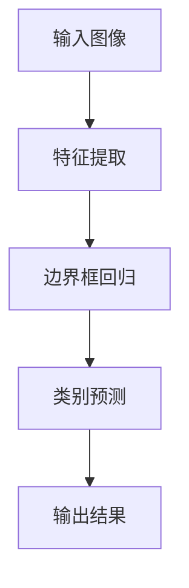
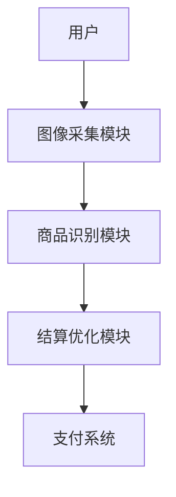
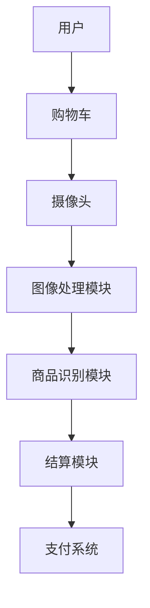
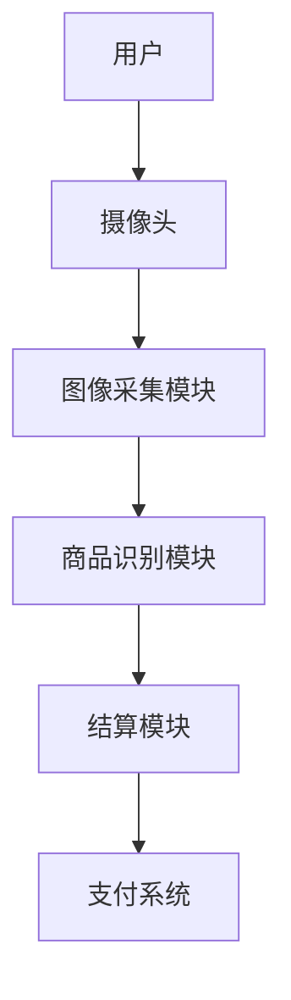

                 


# 智能购物车：AI Agent的商品识别与结算

## 关键词：AI Agent, 智能购物车, 商品识别, 图像识别, 结算优化, 机器学习, 深度学习

## 摘要：本文探讨了AI Agent在智能购物车中的应用，重点分析了商品识别与结算优化的技术实现。通过详细讲解目标检测和图像识别的算法，结合系统架构设计和项目实战，展示了AI如何提升购物体验。文章还提供了最佳实践和未来发展方向，为技术实践提供了全面的指导。

---

## 第一章 引言

### 1.1 智能购物车的背景

随着人工智能技术的快速发展，购物体验的智能化成为 retailers 的重要发展方向。传统购物车在商品识别和结算过程中存在诸多痛点，例如手动扫描条码效率低下、商品摆放混乱导致识别错误率高等问题。AI Agent的引入，为购物车的智能化提供了新的解决方案。

### 1.2 问题背景与目标

本文旨在探讨AI Agent在购物车中的应用，重点解决商品识别和结算优化的问题。通过图像识别技术和目标检测算法，实现快速、准确的商品识别，并优化结算流程，提升用户体验。

### 1.3 技术路线

本文将从AI Agent的基本原理出发，分析商品识别与结算优化的核心算法，结合系统架构设计和项目实战，详细讲解技术实现的每一步。

---

## 第二章 AI Agent与智能购物车的核心概念

### 2.1 AI Agent的基本原理

AI Agent是一种能够感知环境并自主决策的智能体。在购物车中，AI Agent通过摄像头和传感器收集数据，利用机器学习模型进行分析，实现商品识别和结算优化。

#### 2.1.1 AI Agent的分类

| 类型          | 描述                              |
|---------------|-----------------------------------|
| 觉知型Agent  | 基于感知数据进行决策               |
| 规则型Agent  | 根据预设规则执行任务               |
| 学习型Agent  | 通过机器学习模型不断优化行为       |

### 2.2 商品识别与图像识别技术

商品识别是智能购物车的核心功能之一。通过图像识别技术，购物车能够自动识别商品信息，减少人工干预。

#### 2.2.1 商品识别的实现步骤

1. **图像采集**：购物车摄像头拍摄商品图片。
2. **图像预处理**：调整图像亮度、对比度等，提高识别精度。
3. **目标检测**：使用YOLO等算法检测商品位置。
4. **图像识别**：利用卷积神经网络（CNN）识别商品种类。

### 2.3 结算优化与AI技术

结算优化是智能购物车的另一个重要功能。通过AI技术，购物车可以实现无现金支付、自动结账等功能，提升购物效率。

#### 2.3.1 结算优化的实现步骤

1. **商品识别**：准确识别商品信息。
2. **价格计算**：根据商品信息计算总价。
3. **支付处理**：支持多种支付方式，如支付宝、微信支付等。

### 2.4 核心概念对比分析

| 核心概念       | 传统购物车         | 智能购物车         |
|----------------|--------------------|--------------------|
| 商品识别       | 手动扫描条码       | AI自动识别         |
| 结算效率       | 低                 | 高                 |
| 用户体验       | 一般               | 优                 |

---

## 第三章 AI Agent的商品识别与图像识别原理

### 3.1 目标检测算法

目标检测是商品识别的关键步骤。YOLO（You Only Look Once）是一种常用的实时目标检测算法，具有高效、准确的特点。

#### 3.1.1 YOLO算法的工作原理

1. **图像输入**：将商品图片输入YOLO模型。
2. **特征提取**：模型提取图像的特征信息。
3. **边界框回归**：模型预测商品的位置和大小。
4. **类别预测**：模型预测商品的类别。

#### 3.1.2 YOLO算法的流程图



#### 3.1.3 YOLO算法的Python实现示例

```python
import cv2
import numpy as np

# 加载预训练模型
model = cv2.dnn_DetectionModel(...)
model.loadModel(...)

# 检测商品
image = cv2.imread(...)
classes, scores, boxes = model.detect(image)
```

### 3.2 图像识别技术

图像识别是商品识别的核心技术。卷积神经网络（CNN）是常用的图像识别算法，能够有效识别商品种类。

#### 3.2.1 CNN的网络结构

1. **卷积层**：提取图像特征。
2. **池化层**：降低特征维度。
3. **全连接层**：分类商品。

#### 3.2.2 CNN的数学模型

$$ y = f(Wx + b) $$

其中，$W$ 是权重矩阵，$x$ 是输入向量，$b$ 是偏置项，$f$ 是激活函数。

### 3.3 商品识别的优化策略

1. **数据增强**：通过旋转、翻转等操作增加训练数据。
2. **模型优化**：使用数据增强和模型调优提升识别准确率。
3. **实时性优化**：通过轻量化模型提升识别速度。

---

## 第四章 系统分析与架构设计

### 4.1 问题场景介绍

智能购物车需要在复杂环境中准确识别商品并完成结算。系统需要处理光照变化、商品遮挡等多种挑战。

### 4.2 系统功能设计

#### 4.2.1 系统功能模块

| 模块名称       | 功能描述                   |
|----------------|----------------------------|
| 图像采集模块   | 采集商品图像               |
| 商品识别模块   | 识别商品信息               |
| 结算优化模块   | 计算总价并完成支付         |

#### 4.2.2 系统架构图



### 4.3 系统架构设计

#### 4.3.1 系统架构设计图



#### 4.3.2 系统交互流程图



---

## 第五章 项目实战

### 5.1 环境安装

1. **安装Python**：确保Python版本为3.6以上。
2. **安装依赖库**：安装OpenCV、TensorFlow等库。

#### 5.1.1 安装命令示例

```bash
pip install opencv-python tensorflow numpy
```

### 5.2 核心代码实现

#### 5.2.1 商品识别模块

```python
import cv2
import numpy as np

# 加载预训练模型
model = cv2.dnn_DetectionModel(...)
model.loadModel(...)

# 检测商品
image = cv2.imread(...)
classes, scores, boxes = model.detect(image)

# 绘制检测结果
for class_id, score, box in zip(classes, scores, boxes):
    class_name = class_id[0]
    cv2.rectangle(image, (box[0], box[1]), (box[2], box[3]), (0, 255, 0), 2)
    cv2.putText(image, class_name, (box[0], box[1] - 5), cv2.FONT_HERSHEY_SIMPLEX, 1, (0, 0, 255), 2)
```

### 5.3 代码解读与分析

#### 5.3.1 代码功能解读

1. **图像采集**：使用摄像头采集商品图像。
2. **目标检测**：使用YOLO算法检测商品位置。
3. **图像识别**：使用CNN识别商品种类。
4. **结果绘制**：在图像上绘制检测结果。

### 5.4 实际案例分析

#### 5.4.1 案例描述

假设购物车需要识别一箱牛奶，图像采集模块获取图像后，目标检测模块检测出牛奶的位置，图像识别模块识别出牛奶的种类，并完成结算。

#### 5.4.2 案例代码

```python
import cv2
import numpy as np

# 加载预训练模型
model = cv2.dnn_DetectionModel(...)
model.loadModel(...)

# 检测商品
image = cv2.imread("milk.jpg")
classes, scores, boxes = model.detect(image)

# 绘制检测结果
for class_id, score, box in zip(classes, scores, boxes):
    class_name = class_id[0]
    cv2.rectangle(image, (box[0], box[1]), (box[2], box[3]), (0, 255, 0), 2)
    cv2.putText(image, class_name, (box[0], box[1] - 5), cv2.FONT_HERSHEY_SIMPLEX, 1, (0, 0, 255), 2)

# 显示结果
cv2.imshow("Result", image)
cv2.waitKey(0)
cv2.destroyAllWindows()
```

---

## 第六章 最佳实践与展望

### 6.1 总结

通过本文的详细讲解，读者可以了解AI Agent在智能购物车中的应用，掌握商品识别与结算优化的核心算法和技术。

### 6.2 注意事项

1. **数据质量**：确保训练数据多样化，避免过拟合。
2. **模型优化**：通过数据增强和模型调优提升识别准确率。
3. **系统稳定性**：确保系统在复杂环境下稳定运行。

### 6.3 未来展望

随着AI技术的不断进步，智能购物车将在商品识别和结算优化方面实现更多功能。未来，购物车可能会集成更多智能功能，如个性化推荐和智能库存管理。

---

## 结语

本文详细探讨了AI Agent在智能购物车中的应用，通过理论分析和实践案例，展示了如何利用目标检测和图像识别技术提升购物体验。希望本文能为相关领域的研究和实践提供有价值的参考。

---

