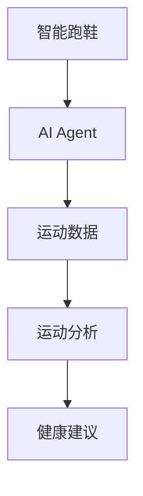
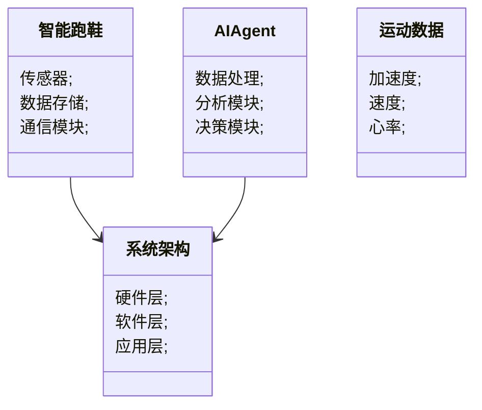
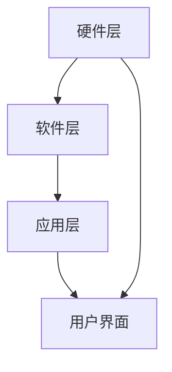
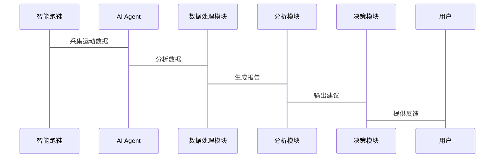
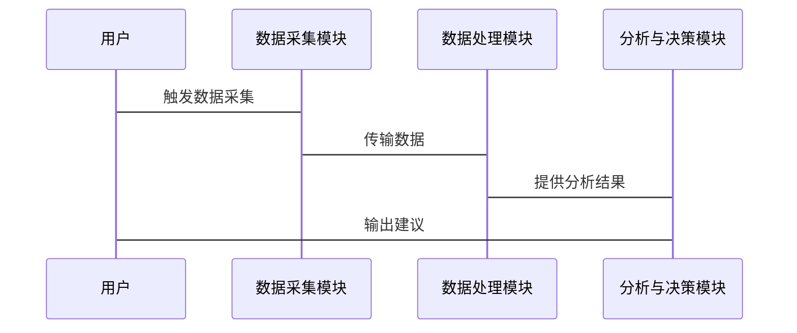
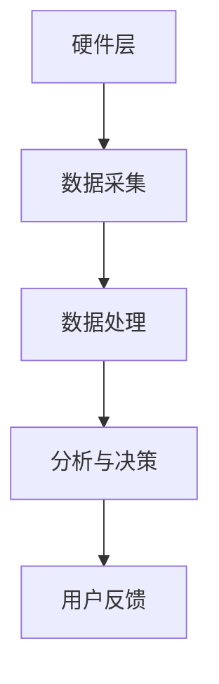
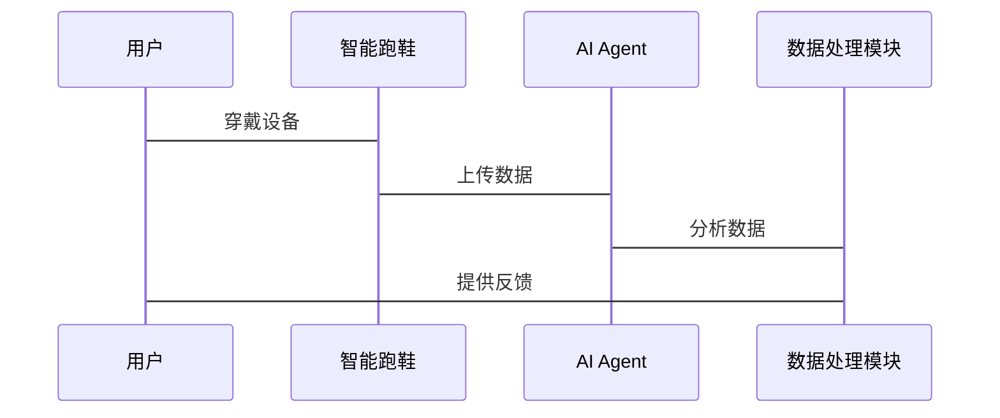

                 


# 智能跑鞋：AI Agent的运动数据收集

> 关键词：智能跑鞋，AI Agent，运动数据收集，传感器技术，数据融合，运动分析

> 摘要：本文深入探讨了智能跑鞋与AI Agent结合的运动数据收集技术，分析了其核心概念、算法原理、系统架构及实际应用，展示了如何通过AI技术提升运动数据分析的精度和效率。

---

# 第1章: 智能跑鞋与AI Agent的背景介绍

## 1.1 智能跑鞋的发展历程
### 1.1.1 传统跑鞋的功能与局限性
传统跑鞋主要关注舒适性、支撑性和耐用性，但缺乏数据采集和分析能力。随着科技的进步，跑鞋的功能逐步扩展到运动数据的收集与反馈。

### 1.1.2 智能化技术的引入
传感器技术、物联网（IoT）和人工智能（AI）的引入，使跑鞋能够实时采集运动数据，如步频、步幅、加速度、心率等。

### 1.1.3 当前智能跑鞋的市场现状
当前市场上的智能跑鞋种类繁多，功能各异。例如，某些跑鞋可以通过蓝牙连接手机App，记录跑步距离、速度、卡路里消耗等数据。

## 1.2 AI Agent的基本概念
### 1.2.1 人工智能代理的定义
AI Agent是指能够感知环境、自主决策并执行任务的智能体。它能够通过传感器获取数据，利用算法处理信息，并根据结果采取行动。

### 1.2.2 AI Agent的核心功能与特点
- **感知能力**：通过传感器获取环境数据。
- **决策能力**：基于数据进行分析和决策。
- **自主性**：能够在没有人工干预的情况下完成任务。
- **适应性**：能够根据环境变化调整行为。

### 1.2.3 AI Agent在运动数据收集中的作用
AI Agent可以实时分析运动数据，提供个性化建议，如最佳跑步姿势、训练计划优化等。

## 1.3 运动数据收集的重要性
### 1.3.1 运动数据的种类与价值
运动数据包括步频、步幅、加速度、心率、姿态等，这些数据能够帮助分析运动表现和健康状况。

### 1.3.2 数据收集对运动科学的意义
通过大量运动数据的收集与分析，可以发现运动规律，优化训练方法，预防运动损伤。

### 1.3.3 数据驱动的运动健康优化
通过AI Agent分析运动数据，可以为用户提供个性化的健康建议，帮助其提升运动表现和身体健康。

## 1.4 智能跑鞋与AI Agent的结合
### 1.4.1 智能跑鞋的硬件构成
智能跑鞋通常配备多种传感器，如加速度计、陀螺仪、心率传感器等。

### 1.4.2 AI Agent在运动数据处理中的应用
AI Agent可以实时处理运动数据，分析用户的跑步姿势、步频、步幅等，提供实时反馈和建议。

### 1.4.3 智能跑鞋与AI Agent的协同工作模式
智能跑鞋通过传感器采集数据，AI Agent对数据进行分析，提供个性化建议，形成闭环。

## 1.5 本章小结
本章介绍了智能跑鞋的发展历程、AI Agent的基本概念及其在运动数据收集中的作用，为后续章节奠定了基础。

---

# 第2章: 智能跑鞋与AI Agent的核心概念与联系

## 2.1 AI Agent的核心原理
### 2.1.1 AI Agent的感知与决策机制
AI Agent通过传感器感知环境，利用算法进行决策。例如，基于加速度数据判断跑步姿势是否正确。

### 2.1.2 数据驱动的AI Agent工作流程
1. 采集数据
2. 数据预处理
3. 数据分析与建模
4. 输出决策

### 2.1.3 AI Agent的自适应学习能力
AI Agent可以通过机器学习算法不断优化模型，提高数据分析的准确性。

## 2.2 运动数据的构成与特征
### 2.2.1 运动数据的采集方式
- 加速度计
- 陀螺仪
- 心率传感器
- GPS模块

### 2.2.2 数据特征的分析与分类
- 时间序列分析
- 特征提取（如均值、方差、最大值等）
- 数据分类（如正常跑步、异常姿势）

### 2.2.3 数据质量与处理方法
- 数据清洗
- 数据归一化
- 数据融合（多传感器数据融合）

## 2.3 智能跑鞋与AI Agent的实体关系图


## 2.4 领域模型与系统架构
### 2.4.1 系统功能设计


### 2.4.2 系统架构设计


### 2.4.3 系统交互流程


## 2.5 本章小结
本章通过实体关系图和系统架构图，详细阐述了智能跑鞋与AI Agent之间的关系及其工作原理。

---

# 第3章: 智能跑鞋运动数据收集的算法

## 3.1 数据融合算法
### 3.1.1 多传感器数据融合方法
- 卡尔曼滤波（Kalman Filter）
- 加速度计与陀螺仪数据融合

### 3.1.2 数据融合的数学模型
$$
\begin{aligned}
    \mathbf{x}_{k+1} &= \mathbf{A}\mathbf{x}_k + \mathbf{B}\mathbf{u}_k \\
    \mathbf{y}_k &= \mathbf{C}\mathbf{x}_k + \mathbf{D}\mathbf{u}_k
\end{aligned}
$$

## 3.2 运动数据分析算法
### 3.2.1 基于机器学习的运动识别
- K-近邻算法（K-Nearest Neighbor）
- 支持向量机（Support Vector Machine）

### 3.2.2 运动数据分类的实现
$$
P(y|x) = \frac{P(x|y)P(y)}{P(x)}
$$

## 3.3 AI Agent算法实现
### 3.3.1 基于强化学习的决策算法
- Q-Learning算法
- 策略梯度（Policy Gradient）

### 3.3.2 算法实现的Python代码示例
```python
import numpy as np
from sklearn.neighbors import KNeighborsClassifier

# 示例数据
X = np.array([[1, 2], [3, 4], [5, 6]])
y = np.array([0, 1, 0])

# 训练KNN模型
knn = KNeighborsClassifier(n_neighbors=3)
knn.fit(X, y)

# 预测新数据
new_data = np.array([[2, 3]])
print(knn.predict(new_data))
```

## 3.4 算法优化与性能分析
### 3.4.1 算法优化方法
- 参数调优
- 模型压缩

### 3.4.2 性能评估指标
- 准确率
- 召回率
- F1分数

## 3.5 本章小结
本章详细讲解了智能跑鞋运动数据收集中的算法实现，包括数据融合、运动数据分析和AI Agent的算法实现。

---

# 第4章: 智能跑鞋与AI Agent的系统分析与架构设计

## 4.1 系统功能设计
### 4.1.1 核心功能模块
- 数据采集模块
- 数据处理模块
- 分析与决策模块
- 用户反馈模块

### 4.1.2 功能模块的交互流程


## 4.2 系统架构设计
### 4.2.1 分层架构设计


### 4.2.2 架构优缺点分析
- 优点：模块化设计，易于扩展
- 缺点：数据传输延迟较高

## 4.3 系统接口设计
### 4.3.1 硬件接口
- 传感器接口（I2C、SPI）
- 通信接口（蓝牙、Wi-Fi）

### 4.3.2 软件接口
- API接口
- 数据格式（JSON、XML）

## 4.4 系统交互流程
### 4.4.1 交互序列图


## 4.5 本章小结
本章通过系统架构设计和交互流程图，详细分析了智能跑鞋与AI Agent系统的实现细节。

---

# 第5章: 智能跑鞋运动数据收集的项目实战

## 5.1 项目环境搭建
### 5.1.1 开发工具安装
- Python
- Sensor libraries（如Adafruit）

### 5.1.2 硬件设备准备
- 智能跑鞋传感器套件
- 开发板（如Raspberry Pi）

## 5.2 系统核心实现
### 5.2.1 数据采集模块实现
```python
import board
import adafruit_lsm3dhr

# 初始化传感器
sensor = adafruit_lsm3dhr.LSM3DHR(board.I2C())

# 采集数据
while True:
    accel = sensor.acceleration
    print("加速度:", accel)
```

### 5.2.2 数据处理与分析模块实现
```python
from sklearn.ensemble import RandomForestClassifier

# 示例数据
X = np.array([[1, 2], [3, 4], [5, 6]])
y = np.array([0, 1, 0])

# 训练随机森林模型
model = RandomForestClassifier()
model.fit(X, y)

# 预测新数据
new_data = np.array([[2, 3]])
print(model.predict(new_data))
```

## 5.3 项目测试与优化
### 5.3.1 功能测试
- 数据采集功能测试
- 数据分析功能测试

### 5.3.2 性能优化
- 算法优化
- 系统调优

## 5.4 项目小结
本章通过实际项目实战，详细讲解了智能跑鞋运动数据收集的实现过程。

---

# 第6章: 智能跑鞋运动数据收集的最佳实践

## 6.1 最佳实践
### 6.1.1 数据采集的准确性
- 传感器校准
- 数据预处理

### 6.1.2 数据分析的高效性
- 算法优化
- 并行计算

## 6.2 注意事项
### 6.2.1 数据隐私保护
- 数据加密
- 权限控制

### 6.2.2 系统稳定性
- 错误处理
- 容错设计

## 6.3 拓展阅读
### 6.3.1 推荐书籍
- 《人工智能：一种现代方法》
- 《传感器原理与应用》

### 6.3.2 推荐技术博客
- [AI in Sports](https://example.com)
- [Sensor Data Fusion](https://example.com)

## 6.4 本章小结
本章总结了智能跑鞋运动数据收集的最佳实践，提供了注意事项和拓展阅读方向。

---

# 第7章: 结语

## 7.1 全文总结
智能跑鞋与AI Agent的结合，为运动数据收集带来了新的可能性。通过传感器技术、数据融合和机器学习算法，可以实现精准的运动分析和个性化建议。

## 7.2 未来展望
随着技术的进步，智能跑鞋将更加智能化，AI Agent的能力也将不断提升，运动数据收集将更加精准和实时。

---

# 附录: 参考文献

1. Russell, S. J., & Norvig, P. (2010). *Artificial Intelligence: A Modern Approach*.
2. 刘洋, 等. (2020). 传感器原理与应用. 北京: 清华大学出版社.

---

通过以上目录结构，您可以逐步深入理解智能跑鞋与AI Agent结合的运动数据收集技术，从理论到实践，从系统设计到项目实现，全面掌握相关知识。

