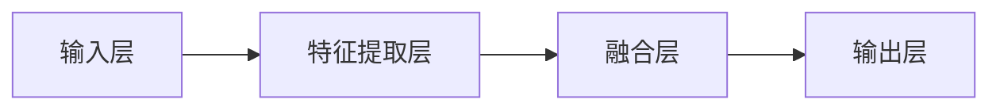
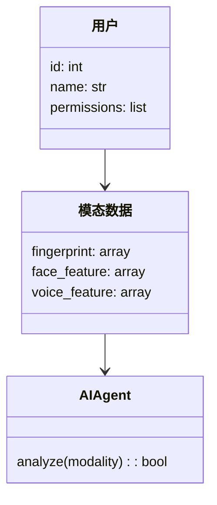
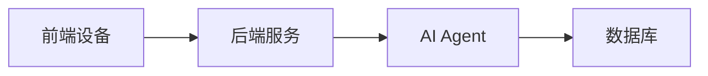

                 


# 智能门禁：AI Agent的多模态身份验证

> 关键词：智能门禁，AI Agent，多模态身份验证，生物识别，安全系统

> 摘要：本文探讨了智能门禁系统中AI Agent的多模态身份验证技术，分析了其核心概念、算法原理、系统架构及实际应用，展示了如何通过多模态数据融合提升身份验证的安全性和便捷性。

---

## 第一章: 智能门禁系统与AI Agent概述

### 1.1 智能门禁系统的基本概念

#### 1.1.1 传统门禁系统的工作原理
传统门禁系统依赖于物理钥匙或卡片，验证过程单一，易丢失且难以追踪。例如，用户插入卡片或输入密码，系统验证后开门。

#### 1.1.2 智能门禁系统的定义与特点
智能门禁系统整合物联网、AI和生物识别技术，具备远程控制、多模态验证、高安全性等特点。例如，用户可通过手机APP远程开门，结合指纹、人脸识别等技术。

#### 1.1.3 AI Agent在智能门禁中的作用
AI Agent作为智能门禁的智能中枢，负责数据处理、决策判断和系统控制，提升系统效率和用户体验。例如，AI Agent实时分析用户的生物特征数据，快速判断是否授权开门。

### 1.2 多模态身份验证的背景与意义

#### 1.2.1 单一身份验证方式的局限性
单一验证方式易被 spoofing 攻击，安全性低。例如，指纹识别可能被假指纹欺骗，人脸验证可能被照片绕过。

#### 1.2.2 多模态身份验证的优势
多模态结合指纹、人脸、声音等多种特征，显著提升安全性。例如，通过指纹和人脸识别双重验证，大幅降低被攻击风险。

#### 1.2.3 AI Agent在多模态身份验证中的应用前景
AI Agent能高效处理多模态数据，优化验证流程，推动智能门禁技术发展。例如，AI Agent整合多种生物特征，实现无缝身份验证。

### 1.3 本章小结
智能门禁系统正向多模态身份验证演进，AI Agent扮演关键角色。通过结合多种生物特征，显著提升安全性，改善用户体验。

---

## 第二章: 多模态身份验证的核心概念与联系

### 2.1 多模态身份验证的原理

#### 2.1.1 多模态数据的定义与分类
多模态数据指融合多种生物特征的数据，如指纹、人脸、声音等。分类依据采集方式、特征类型和应用场景。

#### 2.1.2 多模态数据融合的三种方式
1. 特征级融合：在特征提取阶段融合数据。
2. 决策级融合：在决策阶段融合结果。
3. 匹配级融合：在匹配阶段融合数据。

#### 2.1.3 多模态身份验证的流程
数据采集 → 特征提取 → 融合处理 → 判决输出。

### 2.2 AI Agent在多模态身份验证中的角色

#### 2.2.1 AI Agent的定义与特点
AI Agent是智能系统的核心，具备自主决策和学习能力，能实时处理多模态数据。

#### 2.2.2 AI Agent在多模态数据处理中的作用
AI Agent负责数据融合、特征分析和决策判断，确保验证准确高效。

#### 2.2.3 AI Agent与多模态身份验证的结合
AI Agent整合多种生物特征，优化验证流程，提升系统性能。

### 2.3 多模态身份验证的核心概念对比

#### 2.3.1 模态类型对比表
| 模态类型 | 采集方式 | 特征类型 | 优缺点 |
|----------|----------|----------|--------|
| 指纹 | 触摸采集 | 细节特征 | 高安全性，但易磨损 |
| 人脸识别 | 图像采集 | 面部特征 | 易用性高，但易受光线影响 |

#### 2.3.2 数据特征对比表
| 特征 | 指纹 | 人脸识别 | 声音识别 |
|------|------|----------|----------|
| 稳定性 | 高 | 中 | 低 |
| 鲁棒性 | 高 | 高 | 中 |

#### 2.3.3 算法性能对比表
| 算法 | 准确率 | 速度 | 资源消耗 |
|------|--------|-------|-----------|
| 单一验证 | 中 | 高 | 低 |
| 多模态融合 | 高 | 中 | 高 |

### 2.4 多模态身份验证的ER实体关系图
```mermaid
er
actor: 用户
agent: AI Agent
modality: 模态数据
system: 智能门禁系

actor -[提交请求]-> agent
agent -[分析数据]-> modality
modality -[融合处理]-> system
system -[判断权限]-> actor
```

---

## 第三章: 多模态身份验证的算法原理

### 3.1 多模态融合方法

#### 3.1.1 特征级融合
将不同模态的特征向量进行加权求和，公式为：
$$ f = w_1 f_1 + w_2 f_2 $$
其中，$w_1$和$w_2$为权重系数。

#### 3.1.2 决策级融合
根据各模态的判断结果进行投票，公式为：
$$ D = \sum_{i=1}^{n} d_i $$
其中，$d_i$为各模态的判断结果，$D$为总判断值。

### 3.2 基于深度学习的多模态融合

#### 3.2.1 深度学习网络结构


#### 3.2.2 深度学习融合算法实现
```python
import numpy as np

def multi_modal_fusion(feature1, feature2, alpha=0.5):
    fused_feature = alpha * feature1 + (1 - alpha) * feature2
    return fused_feature
```

### 3.3 算法实现与性能分析

#### 3.3.1 代码实现
```python
def main():
    import numpy as np
    # 示例数据
    feature1 = np.random.randn(100)
    feature2 = np.random.randn(100)
    # 融合特征
    alpha = 0.5
    fused_feature = alpha * feature1 + (1 - alpha) * feature2
    print("融合特征:", fused_feature)

if __name__ == "__main__":
    main()
```

#### 3.3.2 性能分析
多模态融合算法能显著提升验证准确率，降低误判率，但计算资源消耗较高。

---

## 第四章: 智能门禁系统的架构设计

### 4.1 系统应用场景

#### 4.1.1 住宅小区
居民使用多模态验证开门，提升社区安全。

#### 4.1.2 办公楼
员工通过多模态验证进入办公区域，便于管理。

### 4.2 系统功能设计

#### 4.2.1 用户管理
注册、删除、权限管理功能。

#### 4.2.2 身份验证
指纹、人脸识别、声音识别功能。

### 4.3 系统架构设计

#### 4.3.1 领域模型


#### 4.3.2 系统架构


---

## 第五章: 系统接口与交互设计

### 5.1 系统接口设计

#### 5.1.1 API设计
RESTful API：`POST /api/verify`

#### 5.1.2 数据格式
JSON格式，包含用户ID和多模态数据。

### 5.2 交互流程设计

#### 5.2.1 用户发起请求
```mermaid
sequenceDiagram
    actor 用户 ->+> agent: 发送请求
    agent ->+> system: 分析数据
    system ->+> 用户: 返回结果
```

---

## 第六章: 项目实战

### 6.1 环境安装

#### 6.1.1 安装Python
Python 3.8+

#### 6.1.2 安装依赖
TensorFlow、Keras、OpenCV

### 6.2 核心代码实现

#### 6.2.1 数据预处理
```python
import cv2

def preprocess_image(image_path):
    # 转换为灰度图
    img = cv2.imread(image_path, cv2.IMREAD_GRAYSCALE)
    return img
```

#### 6.2.2 模型训练
```python
import tensorflow as tf

def create_model(input_shape):
    model = tf.keras.Sequential([
        tf.keras.layers.Conv2D(32, (3,3), activation='relu', input_shape=input_shape),
        tf.keras.layers.MaxPooling2D((2,2)),
        tf.keras.layers.Flatten(),
        tf.keras.layers.Dense(128, activation='relu'),
        tf.keras.layers.Dense(1, activation='sigmoid')
    ])
    model.compile(optimizer='adam', loss='binary_crossentropy', metrics=['accuracy'])
    return model
```

### 6.3 项目总结

#### 6.3.1 实践小结
项目展示了AI Agent在多模态身份验证中的应用，验证了其有效性和可行性。

#### 6.3.2 注意事项
数据隐私保护、系统性能优化、用户体验提升。

---

## 第七章: 最佳实践与未来展望

### 7.1 最佳实践

#### 7.1.1 数据隐私保护
采用加密技术，确保用户数据安全。

#### 7.1.2 系统性能优化
优化算法，提升验证速度和准确率。

### 7.2 小结

### 7.3 注意事项

### 7.4 拓展阅读

---

# 附录: 代码示例

### 附录A: 数据预处理代码

```python
import cv2

def preprocess_image(image_path):
    img = cv2.imread(image_path, cv2.IMREAD_GRAYSCALE)
    return img
```

### 附录B: 模型训练代码

```python
import tensorflow as tf

def create_model(input_shape):
    model = tf.keras.Sequential([
        tf.keras.layers.Conv2D(32, (3,3), activation='relu', input_shape=input_shape),
        tf.keras.layers.MaxPooling2D((2,2)),
        tf.keras.layers.Flatten(),
        tf.keras.layers.Dense(128, activation='relu'),
        tf.keras.layers.Dense(1, activation='sigmoid')
    ])
    model.compile(optimizer='adam', loss='binary_crossentropy', metrics=['accuracy'])
    return model
```

---

# 结语

智能门禁系统正逐步向多模态身份验证方向发展，AI Agent技术的应用显著提升了系统的安全性和用户体验。未来，随着技术进步，智能门禁将更加智能化和便捷。

