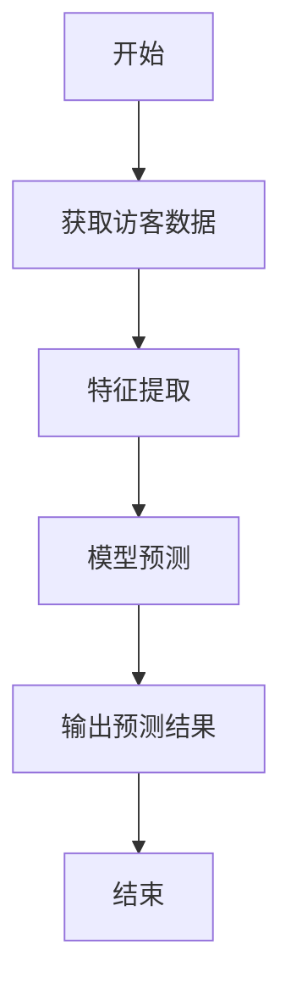
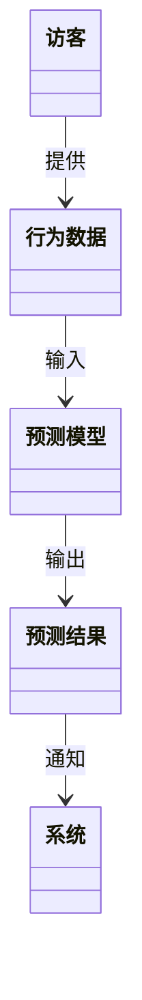

                 


# 智能门禁：AI Agent的访客意图预测

> 关键词：智能门禁，AI Agent，访客意图预测，机器学习，深度学习，系统架构

> 摘要：本文深入探讨了智能门禁系统中AI Agent的访客意图预测技术。通过分析访客行为数据，结合机器学习和深度学习算法，提出了一种高效的预测模型，并详细讲解了系统的架构设计和实际应用案例。

---

# 第1章: 智能门禁系统的发展与现状

## 1.1 传统门禁系统的工作原理

### 1.1.1 门禁系统的定义与组成

门禁系统（Access Control System, ACS）是一种通过身份验证控制出入口访问权限的系统。传统门禁系统通常由以下部分组成：
- **读卡器**：用于读取访客的身份证件或卡片信息。
- **控制器**：负责验证读卡器传来的数据，并控制门锁的开关。
- **管理软件**：用于配置权限、记录访问日志等。

### 1.1.2 传统门禁系统的功能特点

传统门禁系统的主要功能包括：
- **身份验证**：通过刷卡、指纹或密码验证访客身份。
- **权限管理**：根据用户权限设置访问区域。
- **日志记录**：记录访客的访问时间、地点等信息。

### 1.1.3 传统门禁系统的局限性

尽管传统门禁系统功能完善，但在访客管理方面存在以下问题：
- **被动性**：只能验证已知权限，无法主动预测访客行为。
- **效率低**：依赖人工或简单的规则判断，无法快速响应复杂场景。
- **安全性**：仅依赖身份验证，无法识别潜在的安全威胁。

## 1.2 AI时代智能门禁系统的演变

### 1.2.1 智能门禁系统的定义

智能门禁系统是一种结合AI技术的门禁系统，能够通过分析访客行为数据，主动预测其意图并采取相应措施。

### 1.2.2 AI技术在门禁系统中的应用

AI技术在智能门禁系统中的应用主要体现在以下几个方面：
- **行为分析**：通过摄像头、传感器等设备采集访客行为数据，分析其意图。
- **意图预测**：利用机器学习算法预测访客的下一步行为。
- **主动决策**：根据预测结果，自动调整门禁权限或发出警报。

### 1.2.3 智能门禁系统的市场现状

随着AI技术的快速发展，智能门禁系统在市场中的应用越来越广泛。根据市场调研，智能门禁系统的主要优势包括：
- 提高安全性：通过预测访客意图，降低潜在威胁。
- 提高效率：减少人工干预，提升访客体验。
- 降低成本：通过自动化管理减少运营成本。

## 1.3 本章小结

传统门禁系统在功能和性能上存在诸多限制，而AI技术的引入为门禁系统带来了新的发展机遇。智能门禁系统通过结合AI技术，能够实现访客意图预测，从而提升系统的安全性和效率。下一章将详细探讨访客意图预测的核心概念。

---

# 第2章: 访客意图预测的核心概念

## 2.1 访客意图预测的背景与问题描述

### 2.1.1 访客意图预测的定义

访客意图预测是指通过分析访客的行为数据，预测其下一步动作或目标。例如，访客可能在进入某个区域后寻找特定设备或人员。

### 2.1.2 问题背景与实际应用场景

在智能门禁系统中，访客意图预测的应用场景包括：
- **办公楼**：预测访客的访问区域和时间，优化权限管理。
- **酒店**：预测访客的需求，提供个性化服务。
- **公共场所**：预测访客的潜在威胁，提前采取措施。

### 2.1.3 问题解决的必要性与价值

访客意图预测能够帮助门禁系统实现主动管理，减少潜在风险，提高效率。例如，通过预测访客的行为，系统可以提前开放或关闭某些区域的访问权限。

## 2.2 访客意图预测的核心要素与概念结构

### 2.2.1 核心概念的组成与属性

访客意图预测的核心要素包括：
- **访客信息**：姓名、身份证号、访问时间等。
- **行为数据**：访客的移动轨迹、停留时间等。
- **预测结果**：访客的下一步行为或目标。

### 2.2.2 访客行为与意图的关系

访客行为是意图的外在表现，通过分析行为数据可以推断其意图。例如，访客在某个区域长时间停留可能表示其对某些设备感兴趣。

### 2.2.3 系统边界与外延

访客意图预测系统的核心边界包括：
- 输入：访客的行为数据。
- 输出：访客的意图预测结果。
- 系统内部：数据处理、模型训练、预测推理等。

## 2.3 访客意图预测的ER实体关系图

```mermaid
erDiagram
    访客 {
        姓名
        身份证号
        时间戳
    }
    行为数据 {
        传感器ID
        数据类型
        时间戳
    }
    预测结果 {
        访客ID
        意图描述
        时间戳
    }
    访客 -->> 行为数据 : 产生
    行为数据 --> 预测结果 : 驱动
    访客 --> 预测结果 : 关联
```

## 2.4 访客意图预测的流程图



## 2.5 本章小结

访客意图预测是智能门禁系统的核心功能之一，通过对访客行为数据的分析，可以预测其下一步行为并采取相应措施。下一章将详细讲解AI Agent的算法原理与数学模型。

---

# 第3章: AI Agent的算法原理与数学模型

## 3.1 AI Agent的定义与分类

### 3.1.1 AI Agent的基本概念

AI Agent（人工智能代理）是指能够感知环境并采取行动以实现目标的智能实体。在智能门禁系统中，AI Agent负责分析访客数据并预测其意图。

### 3.1.2 基于规则的AI Agent

基于规则的AI Agent通过预定义的规则进行推理和决策。例如，如果访客在某个区域停留超过5分钟，则标记为异常。

### 3.1.3 基于学习的AI Agent

基于学习的AI Agent通过机器学习算法从历史数据中学习规律，从而预测访客意图。这种方法更加灵活，但需要大量数据支持。

## 3.2 访客意图预测的算法选择

### 3.2.1 传统机器学习算法

常用的机器学习算法包括：
- **决策树**：适用于分类问题，能够清晰展示决策逻辑。
- **支持向量机（SVM）**：适用于高维数据分类。
- **随机森林**：适用于特征较多的场景。

### 3.2.2 深度学习算法

深度学习算法在处理复杂数据时表现优异，常用的模型包括：
- **卷积神经网络（CNN）**：适用于图像数据。
- **循环神经网络（RNN）**：适用于时间序列数据。
- **长短期记忆网络（LSTM）**：适用于处理序列数据中的长距离依赖。

### 3.2.3 混合算法的应用

在实际应用中，可以结合多种算法进行集成学习，以提高预测准确率。例如，使用决策树进行初步分类，再用深度学习模型进行细化预测。

## 3.3 基于深度学习的意图预测模型

### 3.3.1 模型结构

深度学习模型通常包括以下部分：
- **输入层**：接收访客的行为数据。
- **隐藏层**：进行特征提取和非线性变换。
- **输出层**：生成预测结果。

### 3.3.2 模型训练

模型训练过程包括以下步骤：
1. **数据预处理**：清洗数据，提取特征。
2. **模型构建**：定义网络结构。
3. **损失函数定义**：常用交叉熵损失函数。
4. **优化器选择**：常用Adam优化器。
5. **训练与验证**：通过训练数据优化模型，并通过验证数据评估性能。

### 3.3.3 模型评估

模型评估指标包括：
- **准确率**：预测正确的比例。
- **召回率**：实际为正类且被预测为正类的比例。
- **F1分数**：准确率和召回率的调和平均数。

## 3.4 算法实现代码

```python
import numpy as np
from sklearn.tree import DecisionTreeClassifier
from sklearn.metrics import accuracy_score

# 示例数据
X = np.array([[1, 2], [3, 4], [5, 6], [7, 8]])
y = np.array([0, 1, 0, 1])

# 模型训练
model = DecisionTreeClassifier()
model.fit(X, y)

# 预测
predictions = model.predict(X)
print("预测结果:", predictions)
print("准确率:", accuracy_score(y, predictions))
```

---

# 第4章: 智能门禁系统的架构设计

## 4.1 问题场景介绍

智能门禁系统需要实现访客意图预测功能，提升系统的安全性和效率。

## 4.2 系统功能设计

### 4.2.1 领域模型



### 4.2.2 系统架构


### 4.2.3 系统接口设计

- **输入接口**：接收访客的行为数据。
- **输出接口**：发送预测结果和控制指令。
- **数据接口**：与数据库交互，获取历史数据。

### 4.2.4 系统交互

```mermaid
sequenceDiagram
    访客 -> 门禁设备 : 请求访问
    门禁设备 -> 数据库 : 查询访客信息
    并发
    门禁设备 -> AI Agent : 分析行为数据
    AI Agent -> 门禁设备 : 返回预测结果
    门禁设备 -> 访客 : 开放权限
```

## 4.3 本章小结

智能门禁系统的架构设计需要考虑数据流、功能模块和系统交互。通过合理设计，可以实现高效的访客意图预测功能。

---

# 第5章: 项目实战

## 5.1 环境安装

### 5.1.1 安装Python

```bash
# 安装Python
sudo apt-get install python3 python3-pip
```

### 5.1.2 安装依赖库

```bash
pip install numpy scikit-learn
```

## 5.2 系统核心实现

### 5.2.1 训练模型

```python
from sklearn.ensemble import RandomForestClassifier
import pandas as pd

# 加载数据
data = pd.read_csv('visitor_data.csv')
X = data.drop('intent', axis=1)
y = data['intent']

# 模型训练
model = RandomForestClassifier()
model.fit(X, y)

# 保存模型
import joblib
joblib.dump(model, 'intent_model.pkl')
```

### 5.2.2 预测实现

```python
import joblib

# 加载模型
model = joblib.load('intent_model.pkl')

# 预测
new_visitor = pd.read_csv('new_visitor.csv')
predictions = model.predict(new_visitor.drop('intent', axis=1))
print("预测结果:", predictions)
```

## 5.3 案例分析

### 5.3.1 数据分析

```python
# 数据可视化
import matplotlib.pyplot as plt
data.hist(bins=10, figsize=(10, 6))
plt.show()
```

### 5.3.2 模型优化

```python
# 调参优化
from sklearn.model_selection import GridSearchCV

param_grid = {'n_estimators': [10, 20, 30]}
grid = GridSearchCV(RandomForestClassifier(), param_grid)
grid.fit(X, y)
print("最佳参数:", grid.best_params_)
```

## 5.4 项目总结

通过项目实战，我们可以看到访客意图预测的实际应用价值。模型的准确率和效率是关键指标，需要根据实际场景进行优化。

---

# 第6章: 小结与展望

## 6.1 小结

本文详细讲解了智能门禁系统中AI Agent的访客意图预测技术，从背景、算法、架构到项目实战，全面覆盖了相关知识。

## 6.2 最佳实践 Tips

- 数据预处理是关键，确保数据质量和完整性。
- 模型选择应根据实际场景和数据特点进行。
- 系统架构设计需要考虑可扩展性和可维护性。

## 6.3 注意事项

- 数据隐私问题需要高度重视。
- 模型的实时性和响应速度可能影响用户体验。
- 系统的安全性需要通过多层防护来保障。

## 6.4 拓展阅读

- 《机器学习实战》
- 《深度学习入门：基于Python》
- 《系统架构设计：复杂系统的构建与管理》

---

# 结语

智能门禁系统的访客意图预测技术是AI与物联网结合的典型应用。通过不断优化算法和系统架构，我们可以实现更智能、更安全的门禁管理，为未来的智慧建筑和智慧城市打下坚实基础。

--- 

**全文完**

