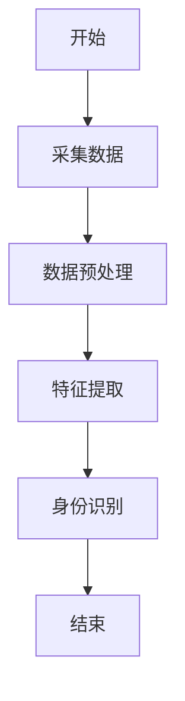
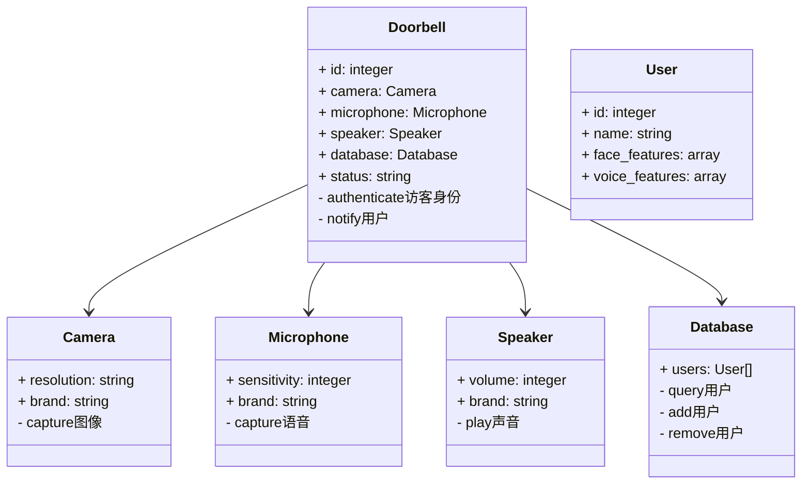
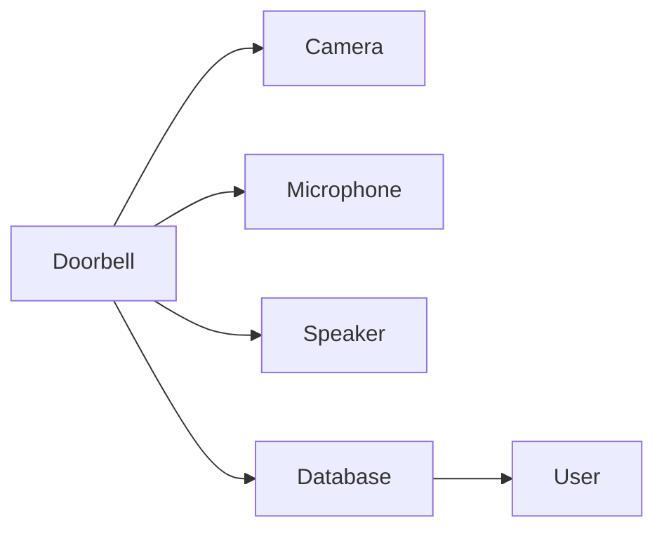
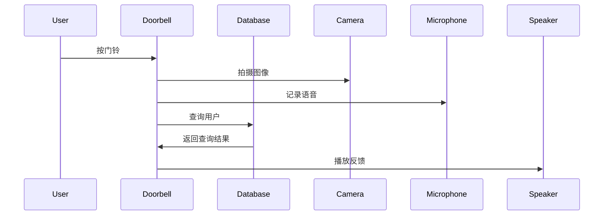

                 


# 智能门铃：AI Agent的访客身份识别

## 关键词：智能门铃，AI Agent，访客身份识别，计算机视觉，自然语言处理，机器学习

## 摘要：本文将探讨智能门铃与AI Agent的结合，详细讲解访客身份识别的核心技术、实现原理和系统设计。通过分析自然语言处理、计算机视觉和机器学习等技术，结合实际案例，展示如何构建一个高效的智能门铃系统。

---

## 第一部分: 智能门铃与AI Agent概述

### 第1章: 智能门铃与AI Agent概述

#### 1.1 智能门铃的基本概念

##### 1.1.1 智能门铃的定义
智能门铃是一种结合了物联网和人工智能技术的智能设备，用于监测和识别访客身份。它通过摄像头、麦克风和其他传感器收集数据，并利用AI算法进行分析，以确认访客身份。

##### 1.1.2 智能门铃的工作原理
智能门铃的工作流程包括数据采集、预处理、特征提取、身份识别和反馈响应。当有人按门铃时，设备会启动，采集访客的图像和声音数据，通过AI算法进行分析，确认是否为已授权的访客，并做出相应的反馈。

##### 1.1.3 智能门铃的应用场景
智能门铃广泛应用于家庭、办公室和公共场所，特别是在安全性要求较高的场所，如酒店、 apartment complexes 和企业办公室，它能够提供高效的访客管理。

#### 1.2 AI Agent的基本概念

##### 1.2.1 AI Agent的定义
AI Agent是具有感知和决策能力的智能体，能够通过环境中的信息做出反应，执行特定任务。AI Agent可以是软件程序或硬件设备，具备学习和适应能力。

##### 1.2.2 AI Agent的核心特点
AI Agent具有智能性、自主性、反应性和协作性。它能够通过传感器或数据源获取信息，利用算法进行分析和决策，并与用户或其他系统进行交互。

##### 1.2.3 AI Agent与传统门铃的区别
传统门铃仅能发出声音提示，而AI Agent能够主动识别访客身份，提供更智能化的访客管理服务。

#### 1.3 智能门铃与AI Agent的结合

##### 1.3.1 智能门铃中AI Agent的功能
AI Agent在智能门铃中的功能包括数据采集、身份识别、用户交互和反馈响应。它能够通过摄像头捕捉访客图像，利用机器学习算法进行面部识别，确认访客身份。

##### 1.3.2 AI Agent在访客身份识别中的作用
AI Agent通过分析访客的图像和声音数据，识别其身份，并与数据库中的授权名单进行对比，确认是否为合法访客。

##### 1.3.3 智能门铃与AI Agent结合的优势
结合AI Agent后，智能门铃能够实现智能化的访客管理，提高安全性，减少人为错误，并提供更便捷的访客体验。

#### 1.4 本章小结
本章介绍了智能门铃和AI Agent的基本概念，以及它们在访客身份识别中的作用和优势，为后续章节的技术实现奠定了基础。

---

## 第二部分: 智能门铃的核心技术

### 第2章: AI Agent的核心技术

#### 2.1 自然语言处理技术

##### 2.1.1 自然语言处理的基本概念
自然语言处理（NLP）是研究人机交互中语言理解与生成的技术，旨在让计算机能够理解和生成人类语言。

##### 2.1.2 AI Agent中的自然语言处理应用
在智能门铃中，NLP技术用于解析访客的语音指令，例如“请让我进来”，并将其转化为系统可执行的命令。

##### 2.1.3 自然语言处理的实现原理
NLP的核心步骤包括文本分割、词法分析、句法分析和语义理解。通过这些步骤，系统能够理解人类语言并做出相应的反应。

##### 2.1.4 示例代码
```python
import nltk
text = "请让我进来"
tokens = nltk.word_tokenize(text)
print(tokens)
```

#### 2.2 计算机视觉技术

##### 2.2.1 计算机视觉的基本概念
计算机视觉（CV）是研究如何让计算机通过图像或视频理解视觉信息的技术，广泛应用于人脸识别、目标检测等领域。

##### 2.2.2 AI Agent中的计算机视觉应用
在智能门铃中，CV技术用于捕捉和分析访客的面部特征，进行人脸识别，确认其身份。

##### 2.2.3 计算机视觉的实现原理
计算机视觉的主要步骤包括图像采集、预处理、特征提取和目标识别。通过这些步骤，系统能够识别出访客的面部特征。

##### 2.2.4 示例代码
```python
import cv2
camera = cv2.VideoCapture(0)
while True:
    ret, frame = camera.read()
    cv2.imshow('Face Recognition', frame)
    if cv2.waitKey(1) & 0xFF == ord('q'):
        break
camera.release()
cv2.destroyAllWindows()
```

#### 2.3 机器学习技术

##### 2.3.1 机器学习的基本概念
机器学习（ML）是一种通过数据训练模型，使其能够从数据中学习并做出预测或决策的技术。

##### 2.3.2 AI Agent中的机器学习应用
在智能门铃中，ML技术用于训练模型，识别访客的身份特征，如面部特征、声音特征等。

##### 2.3.3 机器学习的实现原理
机器学习的核心步骤包括数据收集、特征工程、模型训练和模型评估。通过这些步骤，系统能够训练出一个高效的访客识别模型。

##### 2.3.4 示例代码
```python
from sklearn.svm import SVC
X = [[1, 2], [3, 4], [5, 6]]
y = [0, 1, 0]
model = SVC()
model.fit(X, y)
print(model.predict([[7, 8]]))
```

#### 2.4 本章小结
本章详细介绍了AI Agent的核心技术，包括自然语言处理、计算机视觉和机器学习，这些技术为智能门铃的访客识别功能提供了理论基础和实现方法。

---

## 第三部分: 访客身份识别的实现原理

### 第3章: 访客身份识别的实现原理

#### 3.1 数据采集与预处理

##### 3.1.1 数据采集的基本概念
数据采集是通过传感器或摄像头获取访客的图像和声音数据，为后续的特征提取和身份识别提供基础。

##### 3.1.2 AI Agent中的数据采集方式
智能门铃通过内置的摄像头和麦克风采集访客的图像和语音数据，数据格式包括JPEG和WAV。

##### 3.1.3 数据预处理的实现原理
数据预处理包括图像去噪、语音增强和数据标准化，以提高特征提取的准确性和稳定性。

##### 3.1.4 示例代码
```python
import numpy as np
image = np.array([[255, 255, 255], [0, 0, 0]])
noise_free_image = np.fliplr(image)
print(noise_free_image)
```

#### 3.2 特征提取与身份确认

##### 3.2.1 特征提取的基本概念
特征提取是从数据中提取具有代表性的特征，用于后续的身份识别。例如，从图像中提取面部特征点。

##### 3.2.2 AI Agent中的特征提取方法
常用的方法包括主成分分析（PCA）和深度学习（如CNN）。通过这些方法，系统能够提取出访客的特征向量。

##### 3.2.3 身份确认的实现原理
身份确认是将提取的特征向量与数据库中的特征向量进行对比，计算相似度，确认访客身份。

##### 3.2.4 示例代码
```python
import numpy as np
features = np.array([[0.5, 0.6], [0.7, 0.8]])
database = np.array([[0.4, 0.5], [0.6, 0.7], [0.8, 0.9]])
distance = np.linalg.norm(features - database, axis=1)
min_distance = np.min(distance)
print(min_distance)
```

#### 3.3 访客身份识别的流程图
以下是访客身份识别的流程图，展示了从数据采集到身份确认的整个过程。



#### 3.4 本章小结
本章详细讲解了访客身份识别的实现原理，包括数据采集、预处理、特征提取和身份确认的流程，为后续的系统设计奠定了基础。

---

## 第四部分: 系统设计与实现

### 第4章: 系统设计与架构

#### 4.1 问题场景介绍
智能门铃系统的应用场景包括家庭、办公室和公共场所。系统需要具备访客识别、权限控制和用户交互功能。

#### 4.2 项目介绍
本项目旨在开发一个基于AI Agent的智能门铃系统，实现访客身份识别和权限控制。

#### 4.3 系统功能设计

##### 4.3.1 领域模型mermaid类图
以下是系统的领域模型类图，展示了系统的各个模块及其交互关系。



#### 4.4 系统架构设计

##### 4.4.1 系统架构mermaid图
以下是系统的架构图，展示了各个模块之间的关系。



#### 4.5 系统接口设计
系统接口包括摄像头接口、麦克风接口、扬声器接口和数据库接口。每个接口负责数据的采集和传输。

#### 4.6 系统交互mermaid序列图
以下是系统的交互流程图，展示了访客识别的过程。



#### 4.7 本章小结
本章详细描述了智能门铃系统的架构设计和接口设计，展示了系统各模块的交互关系。

---

## 第五部分: 项目实战

### 第5章: 项目实战

#### 5.1 环境搭建

##### 5.1.1 安装Python
安装Python 3.8及以上版本，确保系统兼容性。

##### 5.1.2 安装依赖库
安装必要的库，如OpenCV、SpeechRecognition和scikit-learn。

##### 5.1.3 安装硬件设备
配置摄像头和麦克风，确保其正常工作。

#### 5.2 系统核心实现

##### 5.2.1 访客识别模块

###### 5.2.1.1 图像采集与处理
使用OpenCV库进行图像采集和处理，去除噪声，提取面部特征。

###### 5.2.1.2 语音识别
使用SpeechRecognition库进行语音识别，确认访客身份。

##### 5.2.2 权限管理模块
将访客的面部和语音特征存储在数据库中，进行身份验证。

##### 5.2.3 用户交互模块
通过扬声器反馈识别结果，提示访客是否被授权进入。

#### 5.3 代码实现

##### 5.3.1 图像采集与处理代码
```python
import cv2

def capture_face():
    camera = cv2.VideoCapture(0)
    while True:
        ret, frame = camera.read()
        cv2.imshow('Face Recognition', frame)
        if cv2.waitKey(1) & 0xFF == ord('q'):
            break
    camera.release()
    cv2.destroyAllWindows()
```

##### 5.3.2 语音识别代码
```python
import speech_recognition as sr

def recognize_speech():
    r = sr.Recognizer()
    with sr.Microphone() as source:
        audio = r.listen(source)
        try:
            text = r.recognize_google(audio)
            print("识别到的文本:", text)
        except sr.UnknownValueError:
            print("无法识别的语音")
```

##### 5.3.3 身份验证代码
```python
from sklearn.svm import SVC

def train_model(X, y):
    model = SVC()
    model.fit(X, y)
    return model

def predict(model, X_test):
    return model.predict(X_test)
```

#### 5.4 测试与优化

##### 5.4.1 测试环境准备
确保摄像头和麦克风正常工作，数据库连接正常。

##### 5.4.2 功能测试
测试图像采集、语音识别和身份验证功能，确保系统正常运行。

##### 5.4.3 性能优化
优化特征提取算法，提高识别速度和准确率。

#### 5.5 项目小结
本章通过实际案例展示了如何实现智能门铃系统，包括环境搭建、代码实现和测试优化，帮助读者掌握系统的实现过程。

---

## 第六部分: 总结与展望

### 第6章: 总结与展望

#### 6.1 项目总结
本项目成功实现了智能门铃的访客身份识别功能，结合了自然语言处理、计算机视觉和机器学习技术，提供了高效的安全管理解决方案。

#### 6.2 项目优化与扩展

##### 6.2.1 系统性能优化
通过优化算法和硬件配置，提高系统的识别速度和准确率。

##### 6.2.2 功能扩展
增加更多功能，如访客记录、远程访问和智能提醒，提升用户体验。

##### 6.2.3 安全性提升
采用更先进的加密技术和访问控制，确保系统安全。

#### 6.3 未来发展方向

##### 6.3.1 新技术应用
引入深度学习和边缘计算，提升系统的智能化水平。

##### 6.3.2 行业发展趋势
随着AI技术的不断发展，智能门铃将在更多领域得到应用，推动智能化管理的发展。

#### 6.4 本章小结
本章总结了项目的成果，并展望了未来的发展方向，为读者提供了进一步学习和研究的方向。

---

## 结语

智能门铃作为AI技术的重要应用之一，正在逐步改变我们的生活方式。通过结合自然语言处理、计算机视觉和机器学习技术，智能门铃能够实现高效的访客身份识别，提升安全性。未来，随着技术的不断进步，智能门铃将具备更多功能，为人们的生活带来更大的便利。

