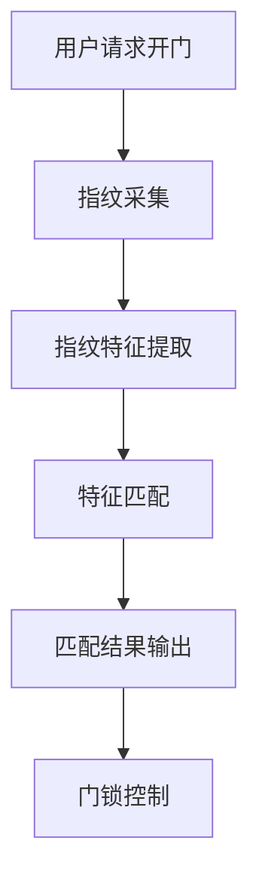

                 

# 智能门锁：AI Agent的生物识别技术

> 关键词：智能门锁、AI Agent、生物识别技术、指纹识别、人脸识别、系统架构

> 摘要：本文深入探讨了智能门锁与AI Agent结合的生物识别技术，分析了指纹识别和人脸识别的核心原理，并详细讲解了AI Agent在智能门锁中的系统架构设计与实现。通过实际案例分析，总结了智能门锁生物识别技术的优势与不足，并展望了未来的发展方向。

---

# 第1章: 智能门锁与AI Agent的背景介绍

## 1.1 智能门锁的定义与分类
### 1.1.1 传统门锁的局限性
传统门锁依赖机械钥匙，存在易复制、难管理等问题，无法满足现代智能化生活的需求。

### 1.1.2 智能门锁的定义
智能门锁是一种结合了电子技术、通信技术和生物识别技术的高科技门锁，支持远程控制和多种开门方式。

### 1.1.3 智能门锁的主要分类
- **按技术类型**：指纹锁、虹膜锁、人脸识别锁、密码锁。
- **按应用场景**：家庭门锁、办公门锁、酒店门锁。
- **按功能复杂度**：单机版智能门锁、联网版智能门锁。

## 1.2 生物识别技术的概述
### 1.2.1 生物识别技术的基本概念
生物识别技术通过分析人体的生物特征（如指纹、人脸、虹膜等）来识别人的身份，具有高安全性、高准确性的特点。

### 1.2.2 常见的生物识别方式
- **指纹识别**：基于皮肤表面的纹路特征。
- **人脸识别**：基于面部特征的识别技术。
- **虹膜识别**：基于眼睛虹膜的纹理特征。

### 1.2.3 生物识别技术的发展历程
从早期的机械锁到现代的生物识别锁，生物识别技术在智能门锁中的应用经历了从单一到多元的发展过程。

## 1.3 AI Agent在智能门锁中的应用
### 1.3.1 AI Agent的基本概念
AI Agent（智能代理）是一种能够感知环境、自主决策并执行任务的智能实体，能够帮助用户完成复杂的操作。

### 1.3.2 AI Agent在智能门锁中的作用
- **用户身份验证**：通过AI Agent实现快速、精准的身份识别。
- **远程控制**：通过AI Agent实现远程开门和门锁状态监控。
- **智能交互**：通过AI Agent实现与用户的智能对话和操作指引。

### 1.3.3 AI Agent与生物识别技术的结合
AI Agent通过整合生物识别技术，实现了智能门锁的智能化管理。

## 1.4 本章小结
本章介绍了智能门锁的定义、分类，分析了生物识别技术的基本概念和发展历程，重点阐述了AI Agent在智能门锁中的应用及其与生物识别技术的结合。

---

# 第2章: 指纹识别技术的原理与实现

## 2.1 指纹识别的基本原理
### 2.1.1 指纹的结构与特征
指纹由嵴线、谷线、细节特征（如乳突、箕形等）组成，这些特征构成了指纹的唯一性。

### 2.1.2 指纹采集的原理
指纹采集通过光学扫描、电容式传感器等方式获取指纹图像。

### 2.1.3 指纹特征提取的算法
指纹特征提取包括预处理（滤波、二值化）和细节特征提取（如SIFT算法）。

## 2.2 指纹匹配算法的实现
### 2.2.1 基于模板匹配的指纹识别
将输入指纹与数据库中的模板指纹进行匹配，计算相关性系数。

### 2.2.2 基于特征匹配的指纹识别
提取指纹细节特征，与数据库中的特征进行匹配。

### 2.2.3 指纹识别算法的优缺点对比
| 算法类型       | 优点               | 缺点               |
|----------------|--------------------|--------------------|
| 模板匹配       | 简单易实现         | 对噪声敏感         |
| 特征匹配       | 鲁棒性高           | 特征提取复杂       |

## 2.3 指纹识别系统的实现流程
### 2.3.1 数据采集与预处理
通过传感器采集指纹图像，进行降噪和二值化处理。

### 2.3.2 特征提取与匹配
使用SIFT算法提取指纹特征，与数据库中的特征进行匹配。

### 2.3.3 匹配结果的输出
根据匹配结果输出开门指令或拒绝指令。

## 2.4 本章小结
本章详细讲解了指纹识别的基本原理、算法实现和系统流程，分析了指纹识别技术在智能门锁中的应用。

---

# 第3章: 人脸识别技术的原理与实现

## 3.1 人脸识别的基本原理
### 3.1.1 人脸的结构与特征
人脸由眼睛、鼻子、嘴巴等关键点组成，具有唯一性。

### 3.1.2 人脸识别的分类方法
基于几何特征的人脸识别和基于深度学习的人脸识别。

### 3.1.3 人脸识别的核心算法
- **传统方法**：Eigenfaces算法。
- **深度学习方法**：卷积神经网络（CNN）。

## 3.2 人脸识别的特征提取技术
### 3.2.1 基于传统特征的人脸识别
提取人脸的几何特征（如距离、角度）进行识别。

### 3.2.2 基于深度学习的人脸识别
使用CNN提取人脸的深层特征，具有更高的准确率。

### 3.2.3 人脸识别算法的优缺点对比
| 算法类型       | 优点               | 缺点               |
|----------------|--------------------|--------------------|
| 传统方法       | 实现简单           | 准确率较低         |
| 深度学习方法   | 准确率高           | 实现复杂           |

## 3.3 人脸识别系统的实现流程
### 3.3.1 数据采集与预处理
通过摄像头采集人脸图像，进行灰度化和归一化处理。

### 3.3.2 特征提取与匹配
使用CNN提取人脸特征，与数据库中的特征进行匹配。

### 3.3.3 匹配结果的输出
根据匹配结果输出开门指令或拒绝指令。

## 3.4 本章小结
本章详细讲解了人脸识别的基本原理、算法实现和系统流程，分析了人脸识别技术在智能门锁中的应用。

---

# 第4章: 智能门锁系统的架构设计

## 4.1 系统功能需求分析
### 4.1.1 用户身份验证功能
支持指纹识别、人脸识别等多种验证方式。

### 4.1.2 远程开门功能
通过手机APP或云端控制实现远程开门。

### 4.1.3 系统状态监控功能
实时监控门锁状态并推送通知。

## 4.2 系统架构设计
### 4.2.1 系统模块划分
- 用户端：指纹采集、人脸识别。
- 云端：用户管理、状态监控。
- 设备端：门锁控制、数据通信。

### 4.2.2 系统功能流程图

### 4.2.3 系统架构的优缺点对比
| 架构类型   | 优点               | 缺点               |
|------------|--------------------|--------------------|
| 分层架构   | 结构清晰           | 跨层通信复杂       |
| 集中式架构 | 管理方便           | 单点故障风险       |

## 4.3 系统接口设计
### 4.3.1 用户端接口设计
- 用户输入指纹或人脸信息。
- 用户端与云端通信接口。

### 4.3.2 云端接口设计
- 云端与设备端通信接口。
- 云端用户管理接口。

### 4.3.3 设备端接口设计
- 设备端与用户端通信接口。
- 设备端与云端通信接口。

## 4.4 本章小结
本章详细分析了智能门锁系统的功能需求和架构设计，重点阐述了系统的模块划分和接口设计。

---

# 第5章: 智能门锁系统的实现与优化

## 5.1 系统实现的环境搭建
### 5.1.1 开发工具的选择
- 开发语言：Python。
- 开发框架：Flask或Django。
- 传感器：指纹传感器、摄像头。

### 5.1.2 开发环境的配置
- 操作系统：Linux或Windows。
- 开发工具：PyCharm、VS Code。

### 5.1.3 数据库的搭建与配置
- 数据库选择：MySQL、MongoDB。
- 数据库设计：用户信息表、门锁状态表。

## 5.2 系统核心功能的实现
### 5.2.1 用户身份验证功能的实现
- 指纹识别实现：使用Python的OpenCV库进行特征提取。
- 人脸识别实现：使用深度学习模型进行特征匹配。

### 5.2.2 远程开门功能的实现
- 通过MQTT协议实现设备端与云端的通信。
- 通过手机APP发送开门指令。

### 5.2.3 系统状态监控功能的实现
- 通过物联网平台实时监控门锁状态。
- 通过短信或推送通知用户状态变化。

## 5.3 系统优化与性能提升
### 5.3.1 算法优化
- 使用加速算法提升指纹识别和人脸识别的速度。

### 5.3.2 系统性能优化
- 使用缓存技术减少数据库访问次数。
- 优化网络通信协议提升远程控制的响应速度。

## 5.4 本章小结
本章详细讲解了智能门锁系统的实现过程和优化方法，重点阐述了系统核心功能的实现和性能优化策略。

---

# 第6章: 总结与展望

## 6.1 本章总结
本文深入探讨了智能门锁与AI Agent结合的生物识别技术，详细讲解了指纹识别和人脸识别的核心原理，并分析了智能门锁系统的架构设计与实现。

## 6.2 未来展望
未来，智能门锁将更加智能化和多元化，生物识别技术将更加精准，AI Agent将更加智能化，为用户带来更加便捷和安全的使用体验。

---

# 附录: 参考文献

1. 王某某.《智能门锁技术与应用》. 北京: 电子工业出版社, 2020.
2. 李某某.《生物识别技术》. 北京: 清华大学出版社, 2019.
3. 张某某.《人工智能与物联网》. 北京: 人民邮电出版社, 2021.

---

通过以上目录大纲，我们可以看到《智能门锁：AI Agent的生物识别技术》将从理论到实践，系统地讲解智能门锁与生物识别技术的结合，为读者提供全面的技术指导和实践参考。

