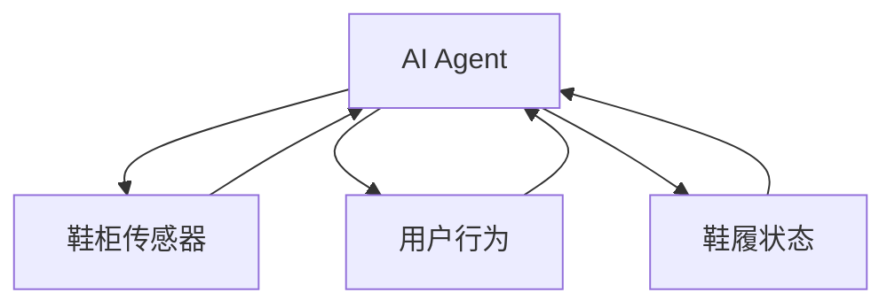
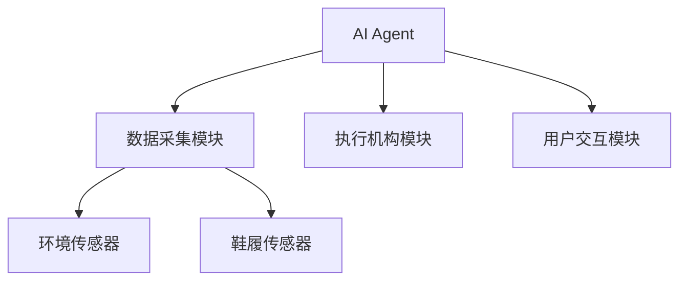
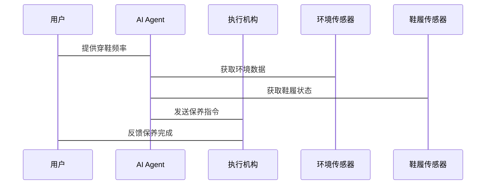

                 


# 智能鞋柜：AI Agent的鞋履保养指导

> **关键词**：AI Agent、智能鞋柜、鞋履保养、物联网、智能家居  
> **摘要**：本文详细探讨了AI Agent在智能鞋柜中的应用，介绍了鞋履保养的核心需求和实现方法。通过分析AI Agent的工作原理、推荐算法、路径规划算法，以及系统架构设计，展示了如何通过智能化技术提升鞋履保养的效率和质量。文章还结合实际案例，给出了项目的实现步骤和最佳实践建议。

---

## 第一部分：背景与概述

### 第1章：智能鞋柜的背景与问题背景

#### 1.1 问题背景
- **鞋履保养的痛点与挑战**：鞋履作为日常穿戴的重要物品，其保养需求多样且复杂。传统鞋柜仅具备存储和展示功能，无法满足鞋履清洁、除湿、防霉、防臭等需求。
- **传统鞋柜的功能局限性**：用户需要手动清洁鞋履，记录保养计划，缺乏智能化管理手段。
- **智能化鞋柜的市场需求**：随着智能家居的普及，用户对智能鞋柜的需求日益增长，尤其是在鞋履保养方面。

#### 1.2 问题描述
- **鞋履保养的复杂性**：不同材质的鞋履需要不同的保养方法，保养周期和环境因素也会影响保养效果。
- **鞋柜智能化的需求**：用户希望鞋柜能够主动感知鞋履状态，提供智能化的保养建议，并执行简单的保养操作。
- **用户行为与鞋履状态的关联性**：用户的穿鞋频率、鞋履的使用环境等因素会影响保养计划的制定。

#### 1.3 问题解决与边界
- **AI Agent在鞋柜中的应用目标**：通过AI Agent实现鞋柜的智能化管理，提供鞋履保养的智能化解决方案。
- **系统的边界与外延**：本系统仅关注鞋柜内的鞋履保养功能，不涉及鞋柜的存储容量和防盗功能。
- **核心功能与辅助功能的区分**：核心功能包括鞋履状态感知、保养计划推荐、保养操作执行；辅助功能包括鞋柜的环境监控和数据记录。

#### 1.4 核心概念与结构
- **AI Agent的核心要素**：感知、决策、执行、自适应。
- **智能鞋柜的功能模块组成**：传感器模块、AI Agent模块、执行机构模块、用户交互模块。
- **系统的输入、输出与交互流程**：用户行为输入，AI Agent处理并输出保养建议，执行机构执行操作。

---

## 第二部分：核心概念与联系

### 第2章：AI Agent与智能鞋柜的核心原理

#### 2.1 AI Agent的核心原理
- **基本概念与特征**：
  - AI Agent是一种能够感知环境、自主决策并执行任务的智能体。
  - 具备实时感知、智能决策、自适应学习和主动执行的能力。
- **AI Agent的感知与决策机制**：
  - 通过传感器和数据接口获取鞋柜内的环境数据（如温湿度、空气质量）。
  - 分析鞋履的状态数据（如鞋面清洁度、鞋底磨损程度）。
  - 结合用户行为数据（如穿鞋频率、保养偏好）进行综合判断。
- **AI Agent的自适应能力**：
  - 根据环境变化和用户需求动态调整保养计划。
  - 学习用户的保养习惯，优化推荐算法。

#### 2.2 核心概念对比
| 对比项           | AI Agent                          | 传统传感器                          |
|------------------|-----------------------------------|--------------------------------------|
| 功能             | 实时感知、智能决策、主动执行     | 单一数据采集                        |
| 数据处理能力     | 支持复杂数据分析与决策           | 只能提供原始数据                    |
| 自适应能力       | 具备自适应学习能力                | 无                                  |
| 应用场景           | 智能鞋柜、智能家居                | 工业传感器、环境监测                |

#### 2.3 实体关系图


---

## 第三部分：算法原理讲解

### 第3章：鞋履保养推荐算法

#### 3.1 算法原理
- **算法目标**：基于鞋履的状态和环境数据，推荐最优的保养方案。
- **输入数据**：
  - 鞋履状态数据：鞋面清洁度、鞋底磨损程度、鞋内湿度。
  - 环境数据：鞋柜内的温湿度、空气质量。
  - 用户行为数据：穿鞋频率、保养偏好。
- **算法流程**：
  1. 数据采集：通过传感器获取鞋柜内的环境数据和鞋履的状态数据。
  2. 数据预处理：对采集到的数据进行清洗和标准化处理。
  3. 数据分析：利用机器学习模型（如随机森林、支持向量机）对数据进行分析。
  4. 保养推荐：根据分析结果生成保养建议（如清洁时间、除湿时间）。
  5. 输出结果：通过用户交互模块将推荐结果反馈给用户。

#### 3.2 算法实现
```python
import numpy as np
from sklearn.ensemble import RandomForestClassifier

# 示例数据集：鞋履状态特征
features = np.array([[0.7, 0.8, 0.6],  # 鞋面清洁度、鞋底磨损、鞋内湿度
                     [0.5, 0.6, 0.7],
                     [0.8, 0.9, 0.5]])

# 标签：是否需要清洁（0表示不需要，1表示需要）
labels = np.array([1, 0, 1])

# 训练随机森林模型
model = RandomForestClassifier(n_estimators=100)
model.fit(features, labels)

# 预测新的样本
new_sample = np.array([[0.6, 0.7, 0.5]])
prediction = model.predict(new_sample)
print("预测结果：", prediction)
```

#### 3.3 算法优化
- **数学模型**：随机森林是一种基于树的集成学习算法，适用于分类和回归问题。
  $$ \text{预测结果} = \text{随机森林模型}(\text{输入特征}) $$
- **优化策略**：
  - 使用交叉验证优化模型参数。
  - 增加特征工程，提取更有意义的特征。
  - 采用模型融合技术提升预测精度。

---

## 第四部分：系统分析与架构设计

### 第4章：系统架构设计

#### 4.1 问题场景介绍
- **系统目标**：设计一个基于AI Agent的智能鞋柜系统，实现鞋履的智能化保养管理。
- **项目介绍**：本项目通过AI Agent技术，结合物联网设备，实现鞋柜的智能化管理。

#### 4.2 系统功能设计
- **功能模块**：
  - 数据采集模块：通过传感器采集鞋柜内的环境数据和鞋履的状态数据。
  - AI Agent模块：对数据进行分析和决策，生成保养建议。
  - 执行机构模块：根据AI Agent的决策执行保养操作（如清洁、除湿）。
  - 用户交互模块：提供用户界面，展示保养建议和操作记录。

#### 4.3 系统架构设计


#### 4.4 系统接口设计
- **输入接口**：
  - 环境传感器接口：用于采集鞋柜内的温湿度、空气质量。
  - 鞋履传感器接口：用于采集鞋履的状态数据。
- **输出接口**：
  - 执行机构接口：用于控制清洁和除湿设备。
  - 用户交互接口：用于展示保养建议和操作记录。

#### 4.5 系统交互设计


---

## 第五部分：项目实战

### 第5章：项目实战

#### 5.1 环境安装
- **硬件环境**：
  - 智能鞋柜（含环境传感器和鞋履传感器）。
  - 执行机构（如清洁刷、除湿器）。
- **软件环境**：
  - Python编程语言。
  - 机器学习库（如scikit-learn、XGBoost）。
  - 数据可视化工具（如Matplotlib、Seaborn）。

#### 5.2 核心代码实现
```python
import numpy as np
from sklearn.ensemble import RandomForestClassifier

# 数据预处理
def preprocess_data(features, labels):
    # 标准化处理
    from sklearn.preprocessing import StandardScaler
    scaler = StandardScaler()
    features_processed = scaler.fit_transform(features)
    return features_processed, labels

# 模型训练
def train_model(features_processed, labels):
    model = RandomForestClassifier(n_estimators=100)
    model.fit(features_processed, labels)
    return model

# 模型预测
def predict_model(model, new_features):
    features_processed = model.predict_proba(new_features)
    return features_processed

# 示例数据
features = np.array([[0.7, 0.8, 0.6],
                     [0.5, 0.6, 0.7],
                     [0.8, 0.9, 0.5]])
labels = np.array([1, 0, 1])

# 数据预处理
features_processed, labels_processed = preprocess_data(features, labels)

# 模型训练
model = train_model(features_processed, labels_processed)

# 预测新样本
new_sample = np.array([[0.6, 0.7, 0.5]])
result = predict_model(model, new_sample)
print("预测结果：", result)
```

#### 5.3 案例分析
- **案例背景**：用户A经常穿运动鞋，鞋底磨损严重，鞋面容易脏。
- **系统推荐**：AI Agent分析环境数据（湿度较高）和鞋履状态（鞋底磨损严重），推荐清洁鞋底和鞋面的操作。
- **执行过程**：AI Agent通过执行机构模块启动清洁设备，完成保养操作。

#### 5.4 项目总结
- **项目成果**：实现了基于AI Agent的智能鞋柜系统，能够根据鞋履状态和环境数据推荐保养方案。
- **经验总结**：AI Agent的应用提升了鞋履保养的智能化水平，优化了用户体验。

---

## 第六部分：最佳实践与总结

### 第6章：最佳实践与总结

#### 6.1 最佳实践
- **系统维护**：
  - 定期更新传感器数据，确保系统的准确性。
  - 定期校准模型，提升推荐算法的精度。
- **用户体验优化**：
  - 提供个性化的保养建议。
  - 提供可视化的保养记录和历史数据。

#### 6.2 小结
- **AI Agent的优势**：
  - 实现鞋柜的智能化管理。
  - 提供个性化的保养建议。
  - 提升用户体验。
- **系统的不足**：
  - 当前仅支持简单的保养操作，复杂保养需求需要进一步优化。
  - 系统的可扩展性有待提升。

#### 6.3 注意事项
- **数据隐私**：用户数据的安全性和隐私保护需要高度重视。
- **系统稳定性**：确保系统的稳定运行，避免因传感器故障导致保养失败。
- **用户教育**：需要对用户进行一定的教育，使其能够正确使用系统。

#### 6.4 拓展阅读
- **推荐书籍**：《机器学习实战》、《深度学习入门》。
- **推荐网站**：Kaggle、GitHub（AI相关项目）。

---

## 结语
通过本文的详细讲解，我们了解了AI Agent在智能鞋柜中的应用，掌握了鞋履保养的核心需求和实现方法。未来，随着人工智能和物联网技术的不断发展，智能鞋柜的功能将更加丰富，用户体验将进一步提升。希望本文能够为相关领域的研究者和开发者提供有价值的参考。

